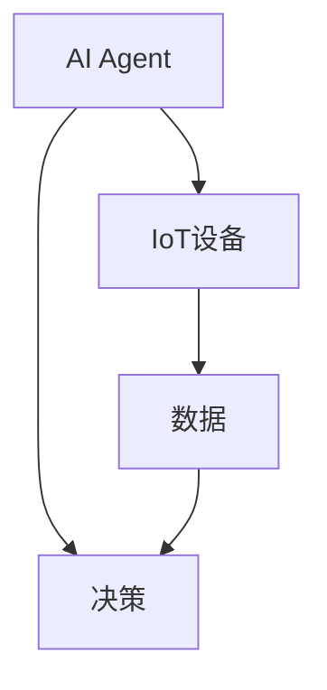
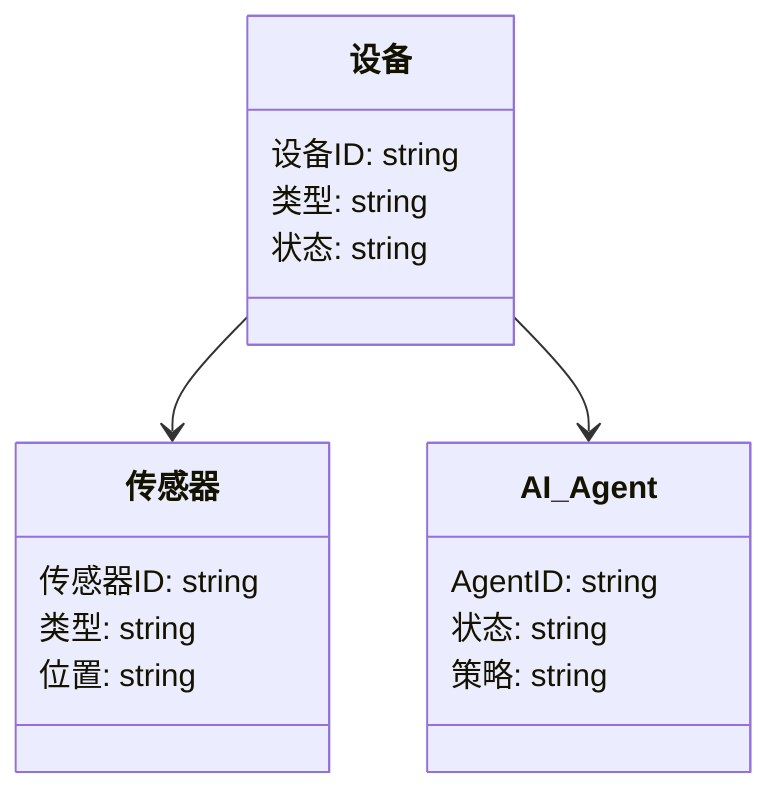
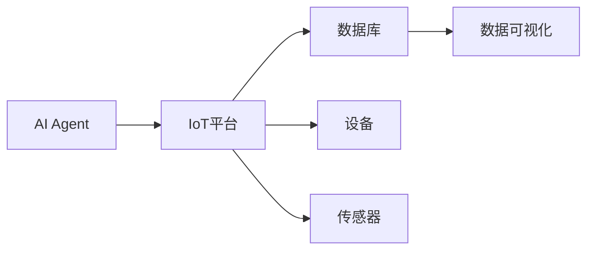
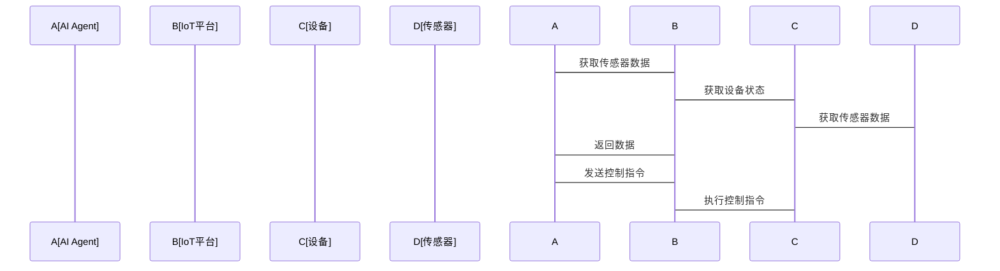

                 


# 《企业AI Agent的IoT集成策略》

---

## 关键词：企业AI Agent，IoT集成，人工智能，物联网，智能化转型，边缘计算

---

## 摘要：

本文探讨了企业AI Agent与物联网（IoT）集成的核心策略，分析了两者在智能化转型中的协同效应，重点阐述了AI Agent在IoT数据处理、智能决策和系统优化中的应用价值。文章从背景、概念、算法、系统架构到实战项目，全面解析了企业级AI Agent与IoT集成的关键路径，并提供了实践指导和未来展望。

---

# 第1章: 企业AI Agent与IoT概述

## 1.1 企业AI Agent的基本概念

### 1.1.1 AI Agent的定义与特点

**AI Agent**（人工智能代理）是指能够感知环境、自主决策并执行任务的智能实体。它具备以下特点：

1. **自主性**：能够独立运行，无需外部干预。
2. **反应性**：能实时感知环境变化并做出响应。
3. **目标导向性**：以实现特定目标为导向。
4. **学习能力**：通过数据和经验不断优化自身行为。

### 1.1.2 企业级AI Agent的核心功能

企业AI Agent的核心功能包括：

1. **数据采集与分析**：从多源数据中提取有用信息。
2. **智能决策**：基于数据进行预测和决策。
3. **任务执行**：通过API或自动化工具执行操作。
4. **反馈优化**：根据执行结果调整策略。

### 1.1.3 AI Agent在企业中的应用场景

- **流程自动化**：优化企业内部流程。
- **智能客服**：提供个性化的客户支持。
- **预测性维护**：预测设备故障，减少停机时间。

## 1.2 物联网(IoT)的基本概念

### 1.2.1 IoT的定义与组成

物联网是指通过各种信息传感器、射频识别技术、全球定位系统、红外感应器等装置，按照约定的协议，把任何物品与互联网连接起来，进行信息交换和通信，以实现智能化识别、定位、跟踪、监控和管理。

### 1.2.2 IoT在企业中的应用价值

1. **实时监控**：对企业设备和资源进行实时监控。
2. **数据驱动决策**：基于IoT数据优化业务流程。
3. **远程控制**：通过IoT平台远程管理设备。

### 1.2.3 IoT与AI的结合趋势

随着AI技术的发展，IoT设备产生的海量数据需要更智能的处理方式。AI Agent的引入可以提升IoT系统的智能决策能力。

## 1.3 AI Agent与IoT的集成背景

### 1.3.1 企业智能化转型的需求

企业希望通过智能化转型提高效率、降低成本，并增强竞争力。AI Agent与IoT的结合正是实现这一目标的关键。

### 1.3.2 IoT数据智能化处理的挑战

IoT系统产生的数据量大、类型多，传统的数据处理方式难以满足实时性和智能性要求。

### 1.3.3 AI Agent在IoT中的潜在价值

AI Agent可以通过智能化处理IoT数据，提升系统的决策能力和响应速度。

---

## 1.4 本章小结

本章介绍了企业AI Agent和IoT的基本概念、核心功能及其在企业中的应用场景，分析了AI Agent与IoT集成的背景和潜在价值。

---

# 第2章: 企业AI Agent与IoT的核心概念与联系

## 2.1 AI Agent与IoT的核心概念对比

### 2.1.1 AI Agent的核心要素分析

- **感知能力**：通过传感器、API等获取环境信息。
- **决策能力**：基于获取的信息做出决策。
- **执行能力**：通过执行机构或API完成任务。

### 2.1.2 IoT的核心要素分析

- **感知层**：通过传感器采集数据。
- **网络层**：通过通信网络传输数据。
- **应用层**：处理数据并提供服务。

### 2.1.3 两者概念属性特征对比表格

| 特性 | AI Agent | IoT |
|------|----------|-----|
| 核心功能 | 智能决策与执行 | 数据采集与传输 |
| 依赖性 | 高度依赖AI算法 | 依赖通信网络 |
| 应用场景 | 流程自动化、智能决策 | 设备监控、数据采集 |

### 2.1.4 AI Agent与IoT的关系图



---

## 2.2 AI Agent与IoT的实体关系分析

### 2.2.1 ER实体关系图架构

```mermaid
erd
    设备
    属性: 设备ID, 类型, 状态
    传感器
    属性: 传感器ID, 类型, 位置
    AI Agent
    属性: AgentID, 类型, 状态
    流程: AI Agent -> 设备 -> 传感器 -> 数据 -> IoT平台 -> 决策 -> 执行
```

### 2.2.2 实体间的关系与数据流

- **设备与传感器**：设备包含多个传感器，传感器采集数据并发送到设备。
- **设备与AI Agent**：AI Agent通过设备获取数据，并根据数据做出决策。
- **数据流**：传感器 -> 设备 -> AI Agent -> 决策 -> 执行。

---

## 2.3 AI Agent与IoT的交互流程

### 2.3.1 数据流的传递过程

1. **数据采集**：传感器采集数据并发送到设备。
2. **数据传输**：设备将数据传输到IoT平台。
3. **数据处理**：AI Agent从IoT平台获取数据并进行处理。
4. **决策执行**：AI Agent根据处理结果做出决策并执行。

### 2.3.2 事件驱动的处理机制

- **事件触发**：IoT平台检测到某个事件（如设备故障）。
- **事件通知**：AI Agent收到事件通知并启动处理流程。
- **事件处理**：AI Agent分析事件并制定解决方案。
- **反馈优化**：根据处理结果优化后续事件的处理流程。

### 2.3.3 任务分解与协同工作流程

- **任务分解**：AI Agent将复杂任务分解为多个子任务。
- **协同工作**：子任务由不同模块协同完成。
- **结果整合**：子任务结果整合后输出最终解决方案。

---

## 2.4 本章小结

本章通过对比AI Agent和IoT的核心概念，分析了它们的实体关系和交互流程，为企业AI Agent与IoT的集成提供了理论基础。

---

# 第3章: 企业AI Agent与IoT集成的算法原理

## 3.1 基于强化学习的AI Agent算法

### 3.1.1 强化学习的基本原理

强化学习是一种通过试错机制来优化决策的算法。其核心在于通过不断尝试和反馈，找到最优策略。

### 3.1.2 强化学习在AI Agent中的应用

- **状态空间**：表示环境的状态。
- **动作空间**：表示AI Agent可以执行的动作。
- **奖励函数**：表示对AI Agent行为的评价。

### 3.1.3 强化学习的数学模型

$$ R(s, a) = \max_{\pi} \mathbb{E}[R(s_t, a_t)] $$

其中，$R(s, a)$表示状态$s$下执行动作$a$得到的奖励。

### 3.1.4 强化学习算法实现

以下是一个简单的强化学习算法实现：

```python
import numpy as np

class AI_Agent:
    def __init__(self, state_space_size, action_space_size):
        self.state_space_size = state_space_size
        self.action_space_size = action_space_size
        self.Q_table = np.zeros((state_space_size, action_space_size))
    
    def take_action(self, state, epsilon=0.1):
        if np.random.random() < epsilon:
            return np.random.randint(self.action_space_size)
        return np.argmax(self.Q_table[state])
    
    def update_Q_table(self, state, action, reward, next_state, gamma=0.99):
        self.Q_table[state][action] = reward + gamma * np.max(self.Q_table[next_state])
```

---

## 3.2 基于知识图谱的AI Agent算法

### 3.2.1 知识图谱的基本概念

知识图谱是一种将结构化数据以图的形式表示的方法，用于表示实体之间的关系。

### 3.2.2 知识图谱在AI Agent中的应用

- **实体识别**：识别IoT系统中的实体。
- **关系建模**：建立实体之间的关系模型。
- **推理与决策**：基于知识图谱进行推理和决策。

### 3.2.3 知识图谱的构建过程

1. **数据采集**：从IoT系统中采集数据。
2. **数据清洗**：对数据进行预处理。
3. **知识抽取**：从数据中提取实体和关系。
4. **知识融合**：将多个数据源的知识进行融合。
5. **知识存储**：将知识图谱存储在数据库中。

---

## 3.3 算法实现与优化

### 3.3.1 算法实现

以下是一个基于强化学习的AI Agent实现：

```python
class Agent:
    def __init__(self, state_size, action_size):
        self.state_size = state_size
        self.action_size = action_size
        self.q_table = np.zeros((state_size, action_size))
    
    def act(self, state):
        return np.argmax(self.q_table[state])
    
    def update(self, state, action, reward, next_state, gamma=0.99):
        self.q_table[state][action] = reward + gamma * np.max(self.q_table[next_state])
```

### 3.3.2 算法优化

- **epsilon-greedy策略**：平衡探索与利用。
- **经验回放**：通过回放历史经验来优化Q表。
- **目标网络**：通过目标网络减少方差。

---

## 3.4 本章小结

本章介绍了基于强化学习和知识图谱的AI Agent算法，并通过代码示例展示了算法的实现过程。这些算法为企业AI Agent与IoT的集成提供了理论和技术支持。

---

# 第4章: 企业AI Agent与IoT的系统分析与架构设计

## 4.1 问题场景介绍

企业在智能化转型过程中，常常面临以下问题：

1. **数据孤岛**：各部门之间数据无法有效共享。
2. **决策延迟**：由于依赖人工决策，导致响应速度慢。
3. **系统复杂性**：系统复杂难以维护。

## 4.2 项目介绍

### 4.2.1 项目背景

某制造企业希望通过引入AI Agent与IoT集成，实现设备的预测性维护和生产流程的优化。

### 4.2.2 系统功能设计

- **数据采集**：通过传感器采集设备状态数据。
- **数据处理**：对采集到的数据进行清洗和预处理。
- **智能决策**：基于AI Agent进行预测性维护和优化决策。
- **系统执行**：根据决策结果执行相关操作。

### 4.2.3 领域模型



### 4.2.4 系统架构设计



### 4.2.5 系统接口设计

- **AI Agent接口**：提供API供其他系统调用。
- **IoT平台接口**：提供数据采集和设备控制接口。
- **数据库接口**：提供数据存储和查询接口。

### 4.2.6 系统交互流程



---

## 4.3 本章小结

本章通过问题场景介绍和系统架构设计，详细阐述了企业AI Agent与IoT集成的系统实现方案。

---

# 第5章: 企业AI Agent与IoT集成的项目实战

## 5.1 环境安装与配置

### 5.1.1 安装Python环境

安装Python 3.8及以上版本，并安装必要的库：

```bash
pip install numpy pandas scikit-learn matplotlib
```

### 5.1.2 安装IoT平台

选择一个IoT平台（如ThingsBoard），按照官方文档进行安装和配置。

### 5.1.3 安装AI Agent框架

选择一个AI框架（如TensorFlow），并安装相关库：

```bash
pip install tensorflow scikit-learn
```

## 5.2 系统核心实现

### 5.2.1 数据采集与处理

编写数据采集脚本：

```python
import pandas as pd

def collect_data(sensor_id):
    data = pd.DataFrame(columns=['time', 'value'])
    # 模拟数据采集
    data['time'] = pd.date_range(start='2023-01-01', periods=100, freq='T')
    data['value'] = np.random.randn(100) * 10
    return data
```

### 5.2.2 AI Agent实现

实现一个简单的AI Agent：

```python
class AI_Agent:
    def __init__(self):
        self.q_table = np.zeros((10, 2))  # 状态空间大小10，动作空间大小2
    
    def act(self, state):
        return np.argmax(self.q_table[state])
    
    def update(self, state, action, reward, next_state):
        self.q_table[state][action] = reward + 0.99 * np.max(self.q_table[next_state])
```

### 5.2.3 系统集成与测试

编写集成测试脚本：

```python
from agent import AI_Agent
from iot_platform import IoT_Platform

agent = AI_Agent()
iot = IoT_Platform(agent)

iot.run()
```

---

## 5.3 项目小结

通过本章的项目实战，读者可以掌握企业AI Agent与IoT集成的基本实现方法，为后续的深入学习打下基础。

---

# 第6章: 总结与展望

## 6.1 本章总结

本文详细探讨了企业AI Agent与IoT集成的核心策略，从理论到实践，全面解析了两者的协同效应和应用价值。

## 6.2 未来展望

随着AI和IoT技术的不断发展，企业AI Agent与IoT的集成将更加智能化和自动化。未来的研究方向包括：

1. **边缘计算**：在边缘设备上实现AI Agent的本地决策。
2. **多 Agent 协作**：研究多AI Agent协作的机制和算法。
3. **自适应优化**：研究AI Agent的自适应优化策略。

---

## 6.3 最佳实践Tips

1. **数据质量**：确保数据的准确性和完整性。
2. **系统安全性**：加强系统安全防护，防止数据泄露。
3. **可扩展性**：设计可扩展的系统架构，方便后续功能的扩展。

---

## 6.4 本章小结

本章总结了全文内容，并对未来的研究方向和实践应用进行了展望。

---

## 作者：AI天才研究院/AI Genius Institute & 禅与计算机程序设计艺术 /Zen And The Art of Computer Programming

---

**本文遵循CC BY-NC 4.0协议，转载请注明出处。**

