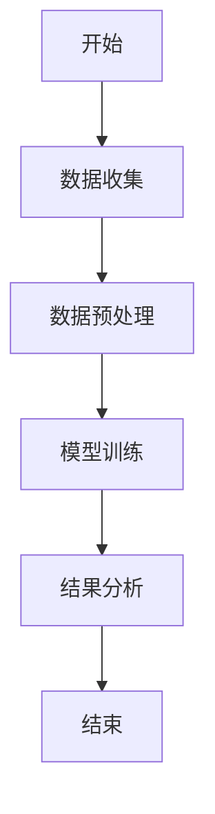
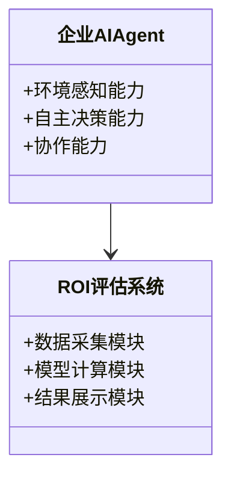
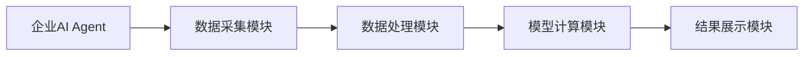
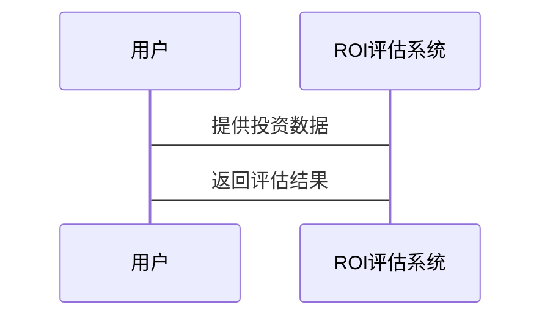

                 

# 企业AI Agent的ROI评估方法

## 关键词：
企业AI Agent，ROI评估，投资回报率，人工智能，收益与成本分析，智能代理系统

## 摘要：
本文详细探讨了企业AI Agent的ROI（投资回报率）评估方法。通过分析AI Agent的核心概念、计算模型、算法原理及实际应用案例，本文为企业提供了如何科学评估AI Agent投资价值的指导。文章内容涵盖从理论基础到实际操作的全过程，帮助企业在数字化转型中做出更明智的决策。

---

# 第1章：企业AI Agent与ROI评估概述

## 1.1 企业AI Agent的定义与特点
### 1.1.1 什么是企业AI Agent
企业AI Agent是能够感知环境、自主决策并执行任务的智能系统，旨在为企业提供自动化解决方案。它们通常具备以下特点：
- **自主性**：无需人工干预，自主完成任务。
- **反应性**：能够实时感知环境变化并做出响应。
- **协作性**：能够与人或其他系统协作完成复杂任务。

### 1.1.2 AI Agent的核心特点
1. **智能性**：基于AI算法，能够学习和优化。
2. **适应性**：能够根据环境变化调整行为。
3. **交互性**：支持与用户或其他系统的交互。

### 1.1.3 企业AI Agent的应用场景
- **客户服务**：智能客服、聊天机器人。
- **供应链管理**：优化库存、物流调度。
- **市场营销**：精准营销、客户画像。
- **内部管理**：自动化流程、决策支持。

## 1.2 ROI评估的基本概念
### 1.2.1 什么是ROI
ROI（Return on Investment）是衡量投资效益的重要指标，计算公式为：
$$ ROI = \frac{净收益}{投资成本} \times 100\% $$
其中，净收益等于收益减去成本。

### 1.2.2 ROI评估的重要性
- **决策依据**：帮助企业判断投资的经济可行性。
- **资源分配**：优化资金配置，优先支持高ROI项目。
- **风险控制**：通过评估预测潜在风险。

### 1.2.3 企业AI Agent ROI评估的边界与外延
- **边界**：仅评估直接收益和成本。
- **外延**：考虑间接影响，如品牌价值提升、客户忠诚度增加。

## 1.3 企业AI Agent与ROI评估的关系
### 1.3.1 AI Agent如何影响企业价值
AI Agent通过提高效率、降低成本和创造新价值，显著提升企业效益。

### 1.3.2 ROI评估在AI Agent应用中的作用
- **量化价值**：将AI Agent带来的收益与成本进行对比。
- **优化策略**：通过评估结果调整投资策略，最大化收益。

### 1.3.3 企业AI Agent ROI评估的复杂性
- **多因素影响**：技术、市场、管理等多重因素交织。
- **长期性**：收益可能在投资后较长时间内逐步显现。

## 1.4 本章小结
本章介绍了企业AI Agent的定义、特点及应用场景，阐述了ROI评估的基本概念及其在AI Agent应用中的重要性，分析了评估的复杂性。

---

# 第2章：企业AI Agent ROI评估的核心概念与联系

## 2.1 AI Agent的核心原理
### 2.1.1 AI Agent的决策机制
AI Agent通过收集数据、分析信息并基于预设策略做出决策。

### 2.1.2 多智能体协作原理
在复杂场景中，多个AI Agent协同工作，共同完成任务。

### 2.1.3 AI Agent的自适应能力
通过机器学习算法，AI Agent能够不断优化自身行为。

## 2.2 ROI评估的数学模型
### 2.2.1 ROI计算公式
$$ ROI = \frac{收益 - 成本}{成本} \times 100\% $$

### 2.2.2 投资回报率的数学表达
$$ NPV = \sum_{t=1}^{n} \frac{CF_t}{(1 + r)^t} $$
其中，$CF_t$是第t年的现金流，$r$是贴现率。

### 2.2.3 企业AI Agent ROI评估的指标体系
- **净现值（NPV）**：评估项目经济可行性。
- **内部收益率（IRR）**：衡量投资回报率。
- **投资回收期（Payback Period）**：计算投资回收所需时间。

## 2.3 企业AI Agent与ROI评估的实体关系图

## 2.4 本章小结
本章探讨了AI Agent的核心原理及其与ROI评估的关系，构建了数学模型并绘制了实体关系图。

---

# 第3章：企业AI Agent ROI评估的算法原理与实现

## 3.1 ROI评估的核心算法
### 3.1.1 投资收益计算算法
$$ 收益 = 投资额 \times (1 + r)^t $$
其中，$r$是投资回报率，$t$是投资时间。

### 3.1.2 投资风险评估算法
$$ 风险调整后收益 = 收益 \times (1 - 风险系数) $$

## 3.2 企业AI Agent ROI评估的算法流程

## 3.3 ROI评估的数学模型实现
### 3.3.1 净现值计算公式
$$ NPV = \sum_{t=1}^{n} \frac{CF_t}{(1 + r)^t} $$

### 3.3.2 内部收益率计算公式
$$ IRR = r \text{ 使得 } NPV = 0 $$

## 3.4 本章小结
本章详细介绍了ROI评估的核心算法及实现流程，展示了数学模型的应用。

---

# 第4章：企业AI Agent ROI评估的系统分析与架构设计

## 4.1 系统功能设计
### 4.1.1 领域模型

### 4.1.2 系统架构设计

## 4.2 系统接口设计
- **输入接口**：接收AI Agent的相关数据。
- **输出接口**：展示ROI评估结果。

## 4.3 系统交互设计

## 4.4 本章小结
本章通过系统分析与架构设计，展示了企业AI Agent ROI评估的实现方案。

---

# 第5章：企业AI Agent ROI评估的项目实战

## 5.1 实际案例分析
### 5.1.1 案例背景
某企业引入智能客服系统，投资成本为100万元，预计每年节省人力成本40万元，增加销售额20万元。

## 5.1.2 数据收集与处理
- **投资成本**：100万元。
- **年收益**：40万元 + 20万元 = 60万元。

## 5.1.3 ROI计算
$$ ROI = \frac{60 - 100}{100} \times 100\% = -40\% $$

## 5.1.4 结果分析
该案例中，ROI为-40%，说明该项目不具有经济可行性，企业应考虑放弃或优化方案。

## 5.2 本章小结
本章通过实际案例分析，展示了如何在企业AI Agent ROI评估中应用理论模型。

---

# 第6章：总结与最佳实践

## 6.1 总结
企业AI Agent ROI评估是企业决策的重要工具，通过科学的评估方法，帮助企业优化资源配置，提高投资回报。

## 6.2 最佳实践
1. **明确目标**：清晰定义AI Agent的应用目标和范围。
2. **数据驱动**：基于真实数据进行评估，避免主观判断。
3. **动态调整**：根据评估结果动态优化投资策略。
4. **风险控制**：在评估中充分考虑潜在风险，并制定应对措施。

## 6.3 注意事项
- ROI评估应与企业整体战略相结合。
- 评估结果需定期更新，以反映最新情况。

## 6.4 拓展阅读
- 推荐阅读《投资学基础》和《人工智能导论》。

---

# 作者：AI天才研究院/AI Genius Institute & 禅与计算机程序设计艺术 /Zen And The Art of Computer Programming

---

本文通过系统分析和实际案例，深入探讨了企业AI Agent的ROI评估方法。从理论基础到实际应用，为企业提供了全面的指导，帮助企业科学评估AI Agent的投资价值，从而做出更明智的决策。

