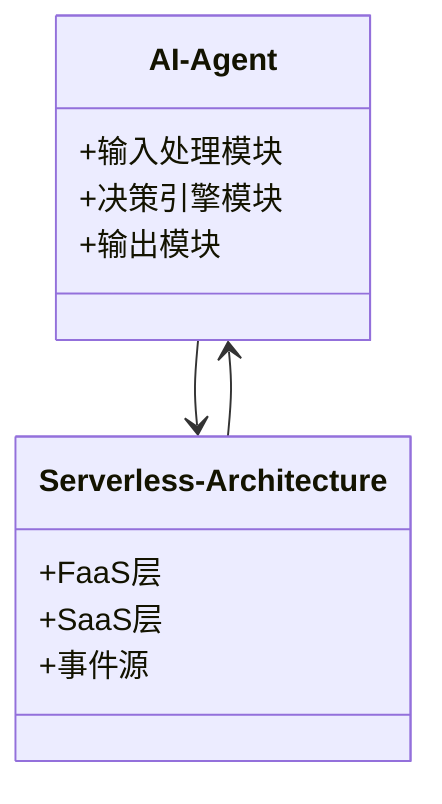
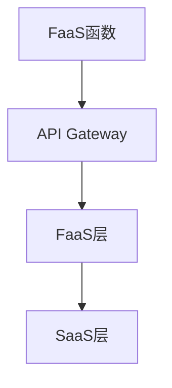
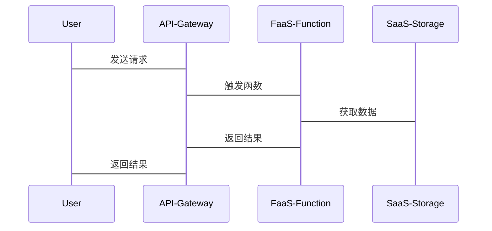

                 


# 企业AI Agent的serverless架构优化

## 关键词：AI Agent, serverless架构, 优化策略, 系统设计, 企业应用

## 摘要：本文深入探讨企业AI Agent在serverless架构中的优化策略，分析AI Agent与serverless架构的结合方式，详细讲解算法原理、系统设计、项目实战及优化建议，为企业AI Agent的高效应用提供指导。

---

## 第1章: 企业AI Agent与serverless架构概述

### 1.1 企业AI Agent的定义与背景

#### 1.1.1 企业AI Agent的定义

企业AI Agent是一种智能代理系统，能够理解并执行企业级任务，通过机器学习和自然语言处理技术与用户交互，提供自动化解决方案。

#### 1.1.2 AI Agent的核心功能与特点

- **核心功能**：问题解决、信息检索、任务执行、用户交互。
- **特点**：智能化、自动化、实时响应、可扩展性。

#### 1.1.3 企业级AI Agent的应用场景

- 智能客服：通过自然语言处理解决客户问题。
- 自动化运维：监控系统状态，自动修复问题。
- 智能助手：为企业用户提供信息检索和决策支持。

### 1.2 serverless架构的核心概念

#### 1.2.1 serverless架构的定义

serverless架构是一种按需计算模型，由第三方服务提供计算资源，开发者无需管理服务器。

#### 1.2.2 serverless架构的优势与劣势

- **优势**：按需付费、快速部署、自动扩展。
- **劣势**：冷启动延迟、资源限制、依赖第三方服务。

#### 1.2.3 serverless在企业应用中的适用性

适用于短期任务、事件驱动的应用，如API触发、文件处理、图像识别等。

### 1.3 AI Agent与serverless架构的结合

#### 1.3.1 AI Agent对serverless架构的需求

- 弹性扩展：应对高并发请求。
- 事件驱动：处理异步任务。
- 成本优化：按需使用资源。

#### 1.3.2 serverless架构对AI Agent的支持

- 提供函数即服务（FaaS）：通过云函数快速部署AI Agent。
- 事件驱动：支持API Gateway触发AI处理流程。
- 存储即服务（SaaS）：存储和管理AI数据。

#### 1.3.3 企业AI Agent serverless架构的典型应用场景

- 智能客服：通过API Gateway触发云函数处理用户请求。
- 自动化运维：使用SaaS存储系统状态，通过云函数监控和修复问题。

---

## 第2章: AI Agent与serverless架构的核心概念

### 2.1 AI Agent的核心概念

#### 2.1.1 AI Agent的组成与功能模块

- **输入处理**：接收用户请求并解析。
- **决策引擎**：通过机器学习模型生成响应。
- **输出模块**：返回结果或执行任务。

#### 2.1.2 AI Agent的交互流程

1. 接收用户请求。
2. 解析请求并生成响应。
3. 执行任务或返回结果。

### 2.2 serverless架构的核心概念

#### 2.2.1 serverless架构的组成部分

- **函数即服务（FaaS）**：提供计算资源。
- **事件源**：触发函数执行的事件源。
- **存储即服务（SaaS）**：提供数据存储服务。

#### 2.2.2 serverless架构的运行机制

1. 事件触发函数执行。
2. 函数处理请求并返回结果。
3. 资源按需扩展。

### 2.3 AI Agent与serverless架构的关系

#### 2.3.1 AI Agent对serverless架构的需求分析

- **弹性扩展**：应对高并发请求。
- **按需资源**：根据负载动态分配资源。
- **事件驱动**：支持异步任务处理。

#### 2.3.2 serverless架构对AI Agent的支持分析

- **快速部署**：通过FaaS快速部署AI Agent。
- **自动扩展**：根据负载自动调整资源。
- **成本优化**：按需付费，减少资源浪费。

---

## 第3章: AI Agent的算法原理

### 3.1 AI Agent的核心算法

#### 3.1.1 基于强化学习的AI Agent算法

- **策略网络**：通过强化学习优化策略。
- **价值网络**：评估当前状态的价值。

#### 3.1.2 基于监督学习的AI Agent算法

- **监督学习模型**：通过大量标注数据训练模型。

### 3.2 serverless架构下的算法优化

#### 3.2.1 serverless架构对算法性能的影响

- **资源限制**：计算资源受限影响算法性能。
- **事件驱动**：支持异步任务处理。

#### 3.2.2 serverless架构下的算法优化策略

- **模型轻量化**：减少模型体积，提升处理速度。
- **分布式计算**：利用分布式计算提升处理能力。

### 3.3 算法原理的数学模型与公式

#### 3.3.1 强化学习算法的数学模型

$$ V(s) = \max_{a} [r + V(s') ] $$

其中：
- \( V(s) \)：状态 \( s \) 的价值。
- \( r \)：奖励。
- \( V(s') \)：下一个状态 \( s' \) 的价值。

#### 3.3.2 监督学习算法的数学模型

$$ y = f(x; \theta) $$

其中：
- \( y \)：预测值。
- \( x \)：输入数据。
- \( \theta \)：模型参数。

---

## 第4章: 系统分析与架构设计

### 4.1 项目场景介绍

企业希望通过AI Agent提供智能客服服务，使用serverless架构优化系统性能和成本。

### 4.2 系统功能设计

- **用户交互**：接收用户请求并返回结果。
- **任务处理**：解析请求并调用相应服务。
- **数据存储**：存储用户请求和处理结果。

#### 4.2.1 领域模型类图



### 4.3 系统架构设计

#### 4.3.1 系统架构图



### 4.4 接口设计与交互流程图

#### 4.4.1 API接口设计

- **输入接口**：接收用户请求。
- **输出接口**：返回处理结果。

#### 4.4.2 交互流程图



---

## 第5章: 项目实战

### 5.1 环境安装

安装AWS SAM和本地开发环境。

### 5.2 系统核心实现

实现AI Agent的函数和接口。

#### 5.2.1 核心代码示例

```python
def handle_request(event, context):
    # 解析请求
    input = event['input']
    # 调用决策引擎
    response = decision_engine.process(input)
    # 返回结果
    return {
        'output': response
    }
```

### 5.3 代码解读与分析

- **输入处理**：解析用户请求。
- **决策引擎**：调用机器学习模型生成响应。
- **输出模块**：返回处理结果。

#### 5.3.1 案例分析

用户发送一个问题，AI Agent通过解析请求，调用决策引擎生成响应，并返回结果。

### 5.4 项目小结

实现了一个简单的AI Agent系统，展示了serverless架构的优势。

---

## 第6章: 总结与展望

### 6.1 总结

本文详细探讨了企业AI Agent在serverless架构中的优化策略，分析了AI Agent与serverless架构的结合方式，详细讲解了算法原理、系统设计、项目实战及优化建议。

### 6.2 展望

未来，随着技术的发展，企业AI Agent的serverless架构优化将在更多领域得到应用，进一步提升系统的性能和效率。

---

## 作者：AI天才研究院/AI Genius Institute & 禅与计算机程序设计艺术 /Zen And The Art of Computer Programming

