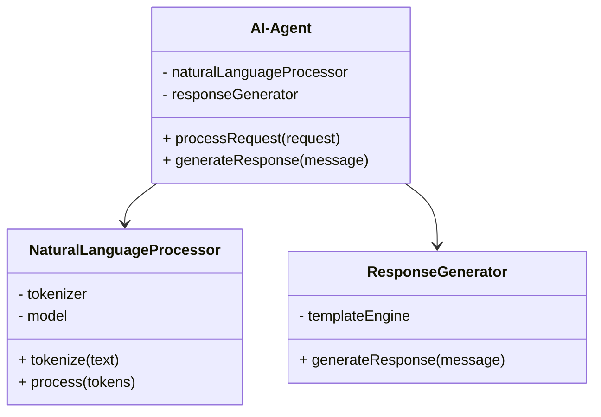
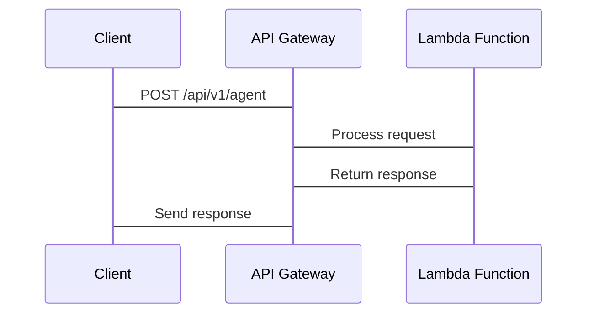

                 


---

# 《企业AI Agent的serverless架构设计》

> **关键词**：企业AI Agent、Serverless架构、无服务器计算、自然语言处理、函数计算、系统架构设计  
> **摘要**：本文详细探讨了企业AI Agent与Serverless架构的结合，从核心概念到算法原理，再到系统架构设计和项目实战，深入分析了如何在企业环境中高效设计和实现AI Agent的Serverless架构。通过具体案例和最佳实践，为读者提供了实用的设计思路和解决方案。

---

# 第一部分: 企业AI Agent与Serverless架构的背景介绍

## 第1章: 企业AI Agent的背景与现状

### 1.1 AI Agent的基本概念

#### 1.1.1 AI Agent的定义与特点
- **定义**：AI Agent是一种智能体，能够感知环境、自主决策并执行任务。
- **特点**：
  - 智能性：基于AI算法进行复杂决策。
  - 自主性：无需人工干预，自主完成任务。
  - 反应性：实时感知环境变化并调整行为。

#### 1.1.2 企业级AI Agent的应用场景
- 企业内部自动化：流程自动化、数据处理。
- 客户服务：智能客服、用户支持。
- 供应链管理：智能采购、库存监控。
- 数据分析：实时数据分析、预测性维护。

#### 1.1.3 当前AI Agent技术的发展现状
- 技术成熟度：自然语言处理（NLP）、机器学习（ML）的发展推动AI Agent的进步。
- 应用普及：广泛应用于金融、医疗、制造等行业。

### 1.2 Serverless架构的基本概念

#### 1.2.1 Serverless架构的定义
- **定义**：Serverless是一种基于云的计算模式，后端服务完全由云供应商管理，开发者只需编写代码。

#### 1.2.2 Serverless架构的核心优势
- **按需扩展**：自动扩展资源，按需付费。
- **减轻运维负担**：无需管理服务器，专注于代码开发。
- **全球可用性**：通过边缘计算实现低延迟响应。

#### 1.2.3 Serverless架构的适用场景与局限性
- **适用场景**：
  - 异步任务处理：文件处理、数据转换。
  - 触发器驱动：API网关触发、定时任务。
- **局限性**：
  - 冷启动问题：首次请求响应时间较长。
  - 成本控制：长期运行任务可能成本较高。

### 1.3 企业AI Agent与Serverless架构的结合

#### 1.3.1 企业AI Agent对Serverless架构的需求
- **弹性计算**：处理波动较大的请求量。
- **快速部署**：简化开发流程，快速上线。
- **全球覆盖**：支持多地部署，实现低延迟响应。

#### 1.3.2 Serverless架构对企业AI Agent的优势
- **资源效率**：按需分配资源，降低运营成本。
- **开发效率**：通过无服务器函数快速实现AI Agent功能。
- **高可用性**：自动负载均衡和容错机制。

#### 1.3.3 当前市场中的应用案例分析
- 智能客服：通过Serverless函数实现自然语言处理，提供实时支持。
- 供应链优化：利用Serverless架构处理实时数据流，优化库存管理。

### 1.4 本章小结

---

# 第二部分: 企业AI Agent与Serverless架构的核心概念与联系

## 第2章: AI Agent的核心原理

### 2.1 AI Agent的核心原理

#### 2.1.1 AI Agent的感知与决策机制
- **感知**：通过传感器、API接口获取环境信息。
- **决策**：基于感知信息，利用AI算法做出决策。

#### 2.1.2 基于自然语言处理的交互方式
- **自然语言理解（NLU）**：解析用户意图。
- **自然语言生成（NLG）**：生成自然语言回复。

#### 2.1.3 AI Agent的自主学习能力
- **监督学习**：基于标记数据进行训练。
- **无监督学习**：从无标记数据中提取规律。
- **强化学习**：通过奖励机制优化行为策略。

### 2.2 Serverless架构的核心原理

#### 2.2.1 无服务器计算的基本原理
- **事件驱动**：函数由触发事件启动。
- **资源隔离**：每个函数运行于独立容器中。
- **按需扩展**：根据请求量自动扩展资源。

#### 2.2.2 Serverless架构中的事件驱动机制
- **触发器类型**：HTTP请求、定时任务、消息队列触发。
- **函数执行**：函数接收事件，处理后返回响应。

#### 2.2.3 函数式编程在Serverless中的应用
- **函数式编程特点**：不可变数据、纯函数、避免副作用。
- **Lambda函数**：通过函数式编程实现无服务器计算。

### 2.3 AI Agent与Serverless架构的协同作用

#### 2.3.1 AI Agent的功能模块
- **感知模块**：负责环境数据的采集与解析。
- **决策模块**：基于感知数据进行推理和决策。
- **执行模块**：根据决策结果执行操作。

#### 2.3.2 Serverless架构对AI Agent的支持
- **计算资源动态分配**：根据请求量自动扩展计算资源。
- **全球分布式部署**：实现低延迟响应。
- **高可用性保证**：通过自动负载均衡和容错机制保证系统可用性。

---

# 第三部分: 算法原理讲解

## 第3章: 自然语言处理算法原理

### 3.1 自然语言处理（NLP）算法

#### 3.1.1 NLP的核心算法
- **词袋模型（Bag of Words）**
- **TF-IDF（Term Frequency-Inverse Document Frequency）**
- **词嵌入（Word Embedding）**
- **循环神经网络（RNN）**
- **Transformer架构**

#### 3.1.2 基于Transformer的NLP模型
- **模型结构**：
  - 编码器-解码器架构。
  - 自注意力机制（Self-Attention）。
- **数学公式**：
  $$ \text{Self-Attention}(Q, K, V) = \text{softmax}(\frac{QK^T}{\sqrt{d}})V $$
  其中，$Q$ 是查询向量，$K$ 是键向量，$V$ 是值向量，$d$ 是维度。

#### 3.1.3 Transformer模型的实现
- **编码器层**：包含多头自注意力机制和前馈神经网络。
- **解码器层**：包含自注意力机制和交叉注意力机制。

#### 3.1.4 使用Python实现简单的NLP算法
```python
def tokenize(text):
    return text.split()

def compute_tf(tf_dict, text):
    words = tokenize(text)
    for word in words:
        tf_dict[word] = tf_dict.get(word, 0) + 1
    return tf_dict

def compute_idf(tf_dict, documents):
    idf_dict = {}
    total Documents = len(documents)
    for word in tf_dict:
        count = 0
        for doc in documents:
            if word in tokenize(doc):
                count += 1
        idf_dict[word] = math.log(total_documents / count)
    return idf_dict

def compute_tf_idf(tf_dict, idf_dict):
    tfidf_dict = {}
    for word in tf_dict:
        tfidf_dict[word] = tf_dict[word] * idf_dict[word]
    return tfidf_dict
```

---

## 第4章: 事件驱动的函数计算算法

### 4.1 函数计算的核心算法

#### 4.1.1 事件驱动机制
- **触发器类型**：
  - HTTP请求。
  - 消息队列。
  - 定时任务。

#### 4.1.2 函数计算模型
- **函数定义**：`def handler(event, context):`
- **上下文对象**：提供函数运行环境信息。
- **事件处理**：根据事件类型调用不同的处理函数。

#### 4.1.3 事件驱动的实现
```python
def handler(event, context):
    if event['type'] == 'http':
        return http_handler(event)
    elif event['type'] == 'queue':
        return queue_handler(event)
    elif event['type'] == 'timer':
        return timer_handler(event)
```

---

# 第四部分: 系统分析与架构设计

## 第5章: 企业AI Agent的系统分析与设计

### 5.1 项目介绍

#### 5.1.1 项目背景
- 某企业希望实现一个智能客服AI Agent，提供24/7的客户支持。

### 5.1.2 项目目标
- 提供自然语言处理功能，理解客户问题并生成回复。
- 实现事件驱动的函数计算，处理客户请求。

### 5.2 系统功能设计

#### 5.2.1 系统功能模型
- **核心功能**：
  - 客户请求接收与解析。
  - 自然语言理解与生成。
  - 生成回复并返回给客户。

#### 5.2.2 系统功能模型的Mermaid类图


### 5.3 系统架构设计

#### 5.3.1 系统架构设计的Mermaid架构图


#### 5.3.2 系统模块设计
- **API Gateway**：接收客户请求，触发Lambda函数。
- **Lambda函数**：处理请求，调用NLP模型和知识库。
- **NLP模型**：解析请求并生成回复。
- **知识库**：存储产品信息和常见问题。
- **监控与日志**：记录请求和响应，便于调试和优化。

### 5.4 系统接口设计

#### 5.4.1 API接口设计
- **输入接口**：
  - POST /api/v1/agent
    ```json
    {
        "text": "What is your service?"
    }
    ```
- **输出接口**：
    ```json
    {
        "response": "Our service provides 24/7 customer support.",
        "status": "success"
    }
    ```

#### 5.4.2 接口交互流程的Mermaid序列图


---

# 第五部分: 项目实战

## 第6章: 企业AI Agent的Serverless架构实战

### 6.1 环境安装

#### 6.1.1 安装AWS CLI
- 下载并安装AWS CLI：https://aws.amazon.com/cli/
- 配置AWS CLI：
  ```bash
  aws configure
  ```

#### 6.1.2 安装Python和必要的库
- 安装Python 3.8+：
  ```bash
  python --version
  ```
- 安装必要的库：
  ```bash
  pip install boto3 json
  ```

### 6.2 系统核心实现

#### 6.2.1 实现自然语言处理功能
```python
import boto3
import json

def tokenize(text):
    return text.split()

def compute_tf(tf_dict, text):
    words = tokenize(text)
    for word in words:
        tf_dict[word] = tf_dict.get(word, 0) + 1
    return tf_dict

def compute_idf(tf_dict, documents):
    idf_dict = {}
    total_documents = len(documents)
    for word in tf_dict:
        count = 0
        for doc in documents:
            if word in tokenize(doc):
                count += 1
        idf_dict[word] = math.log(total_documents / count)
    return idf_dict

def compute_tf_idf(tf_dict, idf_dict):
    tfidf_dict = {}
    for word in tf_dict:
        tfidf_dict[word] = tf_dict[word] * idf_dict[word]
    return tfidf_dict
```

#### 6.2.2 实现事件驱动的函数计算
```python
import boto3
import json

def handler(event, context):
    if event['type'] == 'http':
        return http_handler(event)
    elif event['type'] == 'queue':
        return queue_handler(event)
    elif event['type'] == 'timer':
        return timer_handler(event)

def http_handler(event):
    text = event['text']
    # 实现自然语言处理逻辑
    response = {"response": "Hello, world!", "status": "success"}
    return response
```

### 6.3 代码应用解读与分析

#### 6.3.1 自然语言处理模块解读
- **tokenizer**：将输入文本分割成单词或短语。
- **tf计算**：计算每个单词在文本中的频率。
- **idf计算**：计算每个单词在所有文档中的逆文档频率。
- **tf-idf计算**：计算每个单词的tf-idf值，用于关键词提取。

#### 6.3.2 事件驱动模块解读
- **handler函数**：根据事件类型调用不同的处理函数。
- **http_handler**：处理HTTP请求，调用自然语言处理模块，生成回复。
- **queue_handler**：处理消息队列中的请求。
- **timer_handler**：处理定时任务，执行定期维护。

### 6.4 实际案例分析

#### 6.4.1 案例：智能客服系统
- **场景**：客户发送问题，AI Agent自动解析并生成回复。
- **流程**：
  1. 客户发送请求到API Gateway。
  2. API Gateway触发Lambda函数。
  3. Lambda函数调用自然语言处理模块解析请求。
  4. 自然语言处理模块生成回复。
  5. Lambda函数返回回复到API Gateway。
  6. API Gateway返回回复给客户。

### 6.5 项目小结

---

# 第六部分: 最佳实践

## 第7章: 最佳实践与注意事项

### 7.1 小结
- **核心概念**：企业AI Agent与Serverless架构的结合，实现了高效、弹性的AI服务。
- **关键点**：理解AI Agent的核心原理，掌握Serverless架构的设计方法，合理使用事件驱动机制。

### 7.2 注意事项
- **资源优化**：合理配置计算资源，避免浪费。
- **冷启动优化**：使用Keepwarm机制或设置预加载函数。
- **错误处理**：实现全面的错误捕捉和日志监控。
- **安全策略**：制定严格的安全策略，防止数据泄露。

### 7.3 拓展阅读
- **书籍推荐**：
  - 《Serverless应用开发：从0到1》
  - 《自然语言处理实战：基于Python的机器学习和深度学习》
- **在线资源**：
  - AWS官方文档：https://aws.amazon.com/serverless/
  - TensorFlow官方文档：https://www.tensorflow.org/

### 7.4 作者观点
- **作者**：AI天才研究院/AI Genius Institute & 禅与计算机程序设计艺术/Zen And The Art of Computer Programming
- **联系方式**：通过官方网站或社交媒体获取更多信息。

---

**感谢您的阅读！希望本文对您理解企业AI Agent的Serverless架构设计有所帮助。**

