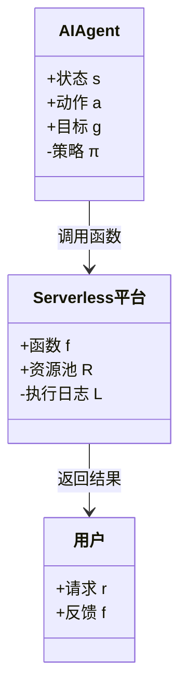
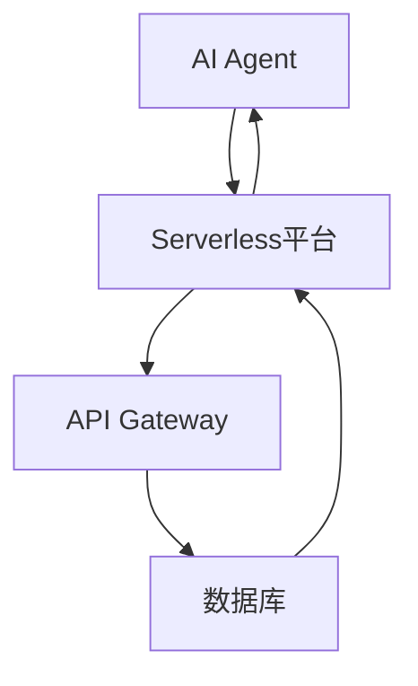
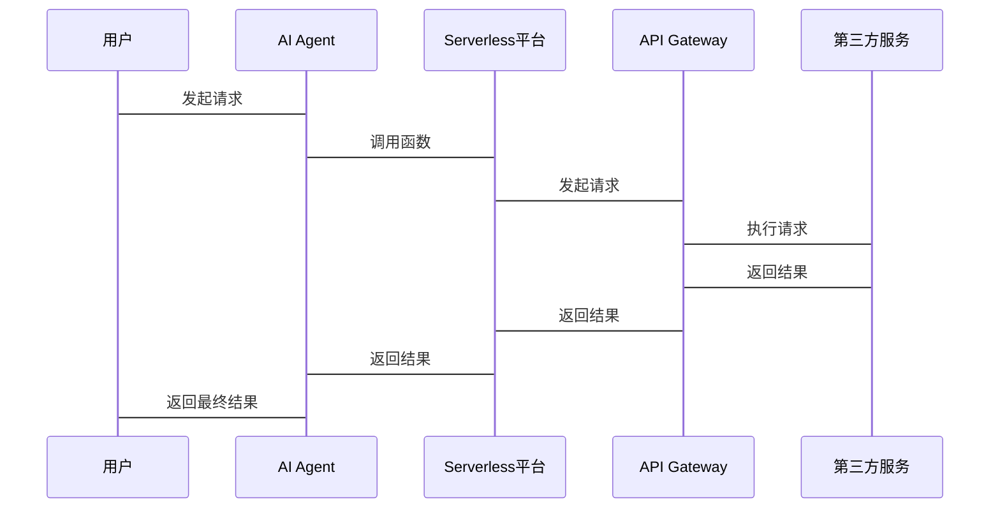

                 


# 企业AI Agent的serverless计算架构

## 关键词：企业AI Agent，serverless架构，AI算法，无服务器计算，系统设计

## 摘要：  
企业AI Agent在serverless计算架构中的应用正在改变企业智能化转型的方式。本文深入探讨了企业AI Agent与serverless架构的结合，分析了其核心概念、算法原理、系统设计及实际应用，为企业技术决策者和开发者提供了理论与实践相结合的指导。

---

## 第1章：企业AI Agent的背景与概念

### 1.1 AI Agent的基本概念

#### 1.1.1 AI Agent的定义与特点
AI Agent（人工智能代理）是一种能够感知环境、自主决策并执行任务的智能实体。其特点包括：
- **自主性**：能够在无外部干预的情况下运行。
- **反应性**：能够实时感知环境并做出反应。
- **目标导向**：以实现特定目标为导向。
- **学习能力**：能够通过数据和经验优化自身行为。

#### 1.1.2 AI Agent的核心功能与应用场景
AI Agent的核心功能包括：
- **感知**：通过传感器或数据源获取环境信息。
- **推理**：基于感知信息进行逻辑推理。
- **决策**：根据推理结果制定行动计划。
- **执行**：通过执行机构或接口完成任务。

应用场景包括智能客服、自动化交易、智能制造等。

#### 1.1.3 企业级AI Agent的特殊需求
企业级AI Agent需要满足以下需求：
- **高可用性**：确保在复杂环境中的稳定运行。
- **可扩展性**：支持业务规模的快速扩展。
- **安全性**：保护企业数据和系统的安全。
- **高效性**：在有限资源下高效完成任务。

### 1.2 Serverless计算的定义与特点

#### 1.2.1 Serverless计算的定义
Serverless计算是一种按需提供计算资源的模式，开发者无需管理服务器，只需编写代码即可运行应用。

#### 1.2.2 Serverless计算的优势与挑战
优势：
- **按需扩展**：自动分配资源，应对负载波动。
- **成本优化**：仅按使用付费，减少资源浪费。
- **易于开发**：开发者专注于业务逻辑，无需关注底层架构。

挑战：
- **冷启动问题**：首次请求时可能存在延迟。
- **资源限制**：计算资源可能存在限制，影响性能。
- ** vendor lock-in**：依赖特定云平台，迁移成本高。

#### 1.2.3 Serverless计算与传统计算架构的对比
| 对比维度       | Serverless架构                  | 传统计算架构                |
|----------------|---------------------------------|----------------------------|
| 资源管理       | 无需管理，按需分配              | 需自行管理，资源预分配      |
| 成本           | 按需付费，无闲置资源浪费         | 固定成本，可能存在资源浪费   |
| 开发效率       | 开发者只需关注业务逻辑         | 开发者需关注系统部署与维护   |

### 1.3 企业AI Agent与Serverless计算的结合

#### 1.3.1 企业AI Agent对计算架构的需求
企业AI Agent需要一个灵活、高效、可扩展的计算架构来支持其复杂任务。

#### 1.3.2 Serverless计算如何满足AI Agent的需求
Serverless架构提供了弹性扩展、按需资源分配和高效的开发模式，非常适合AI Agent的需求。

#### 1.3.3 企业AI Agent在Serverless架构中的应用前景
随着云计算和AI技术的发展，企业AI Agent在Serverless架构中的应用将更加广泛，推动企业智能化转型。

---

## 第2章：企业AI Agent的serverless架构核心概念

### 2.1 AI Agent与Serverless架构的核心要素

#### 2.1.1 AI Agent的组成与功能模块
AI Agent的组成包括：
- **感知模块**：接收外部输入并解析。
- **推理模块**：分析信息并生成决策。
- **执行模块**：将决策转化为具体行动。
- **学习模块**：优化自身行为。

#### 2.1.2 Serverless架构的关键组件
Serverless架构的关键组件包括：
- **函数即服务（FaaS）**：提供无服务器函数执行环境。
- **事件触发机制**：通过事件驱动函数调用。
- **资源管理**：自动分配和回收计算资源。

#### 2.1.3 AI Agent与Serverless架构的交互关系
AI Agent通过事件触发调用Serverless函数，函数执行任务后返回结果，AI Agent根据结果调整后续行动。

### 2.2 核心概念对比分析

#### 2.2.1 AI Agent与传统AI的区别
AI Agent具有自主性和目标导向性，而传统AI系统通常不具有这些特性。

#### 2.2.2 Serverless架构与传统架构的区别
Serverless架构通过按需分配资源，避免了传统架构的资源浪费问题。

#### 2.2.3 AI Agent在Serverless架构中的角色与作用
AI Agent作为服务消费者，通过调用Serverless函数实现任务执行。

### 2.3 实体关系图与流程图

```mermaid
erDiagram
    actor 用户
    participant AI Agent
    participant Serverless平台
    participant 第三方服务

    用户 --> AI Agent: 发起请求
    AI Agent --> Serverless平台: 调用函数
    Serverless平台 --> 第三方服务: 调用API
    第三方服务 --> Serverless平台: 返回结果
    Serverless平台 --> AI Agent: 返回执行结果
    AI Agent --> 用户: 返回最终结果
```

---

## 第3章：企业AI Agent的serverless架构算法原理

### 3.1 AI Agent的核心算法

#### 3.1.1 基于强化学习的AI Agent算法
强化学习是一种通过试错机制优化决策的算法。AI Agent通过与环境交互，逐步优化自身的策略。

$$ Q(s, a) = r + \gamma \max_{a'} Q(s', a') $$

其中：
- $s$ 表示当前状态
- $a$ 表示当前动作
- $r$ 表示奖励
- $\gamma$ 表示折扣因子
- $s'$ 表示下一状态

#### 3.1.2 基于监督学习的AI Agent算法
监督学习通过标注数据训练AI Agent，使其能够根据输入做出正确决策。

$$ y = f(x) $$

其中：
- $x$ 表示输入
- $y$ 表示输出
- $f$ 表示训练好的模型

#### 3.1.3 基于无监督学习的AI Agent算法
无监督学习通过分析数据结构，发现数据中的潜在规律。

$$ p(x) = \prod_{i=1}^n p(x_i) $$

其中：
- $p(x)$ 表示数据分布
- $x_i$ 表示数据点

### 3.2 Serverless架构中的计算模型

#### 3.2.1 函数即服务（FaaS）模型
FaaS模型通过API Gateway触发函数执行，函数执行完毕后自动返回结果。

#### 3.2.2 无服务容器模型
无服务容器模型通过容器化技术，实现函数的快速部署和扩展。

#### 3.2.3 事件驱动的计算模型
事件驱动的计算模型通过事件触发函数调用，实现按需计算。

### 3.3 算法原理的数学模型与公式

#### 3.3.1 AI Agent决策过程的数学模型
AI Agent通过感知环境、推理决策、执行操作，最终实现目标。

$$ \text{决策} = \arg\max_{a} Q(s, a) $$

#### 3.3.2 Serverless计算资源分配的数学模型
资源分配模型根据请求负载动态分配资源。

$$ R = \sum_{i=1}^n r_i $$

其中：
- $R$ 表示总资源
- $r_i$ 表示第$i$个请求的资源需求

---

## 第4章：企业AI Agent的serverless架构系统分析与设计

### 4.1 系统功能设计

#### 4.1.1 领域模型
领域模型描述了系统的核心业务流程和实体关系。



#### 4.1.2 系统架构设计
系统架构设计包括功能层、数据层和接口层。

### 4.2 系统架构设计

#### 4.2.1 系统架构图
系统架构图展示了系统的整体结构和各部分之间的关系。



#### 4.2.2 系统接口设计
系统接口设计包括API接口和事件触发接口。

#### 4.2.3 系统交互设计
系统交互设计描述了用户、AI Agent和Serverless平台之间的交互流程。



---

## 第5章：企业AI Agent的serverless架构项目实战

### 5.1 环境安装

#### 5.1.1 安装必要的工具
需要安装以下工具：
- **云平台账号**：如AWS、阿里云等。
- **开发环境**：如VS Code、PyCharm等。
- **命令行工具**：如aws cli、serverless CLI。

#### 5.1.2 配置开发环境
配置云平台账号的访问权限和环境变量。

### 5.2 核心代码实现

#### 5.2.1 AI Agent的核心代码

```python
class AIAgent:
    def __init__(self, config):
        self.config = config
        self.state = None
        self.action = None
        self.reward = None
        self.policy = None

    def perceive(self, environment):
        # 从环境中获取状态
        self.state = environment.get_state()
        return self.state

    def decide(self):
        # 根据当前状态选择动作
        self.action = self.policy.act(self.state)
        return self.action

    def execute(self, environment):
        # 执行动作并获取反馈
        next_state, reward, done = environment.execute(self.action)
        self.reward = reward
        return next_state, reward, done

    def learn(self):
        # 更新策略
        self.policy.update(self.state, self.action, self.reward)
```

#### 5.2.2 Serverless函数实现

```python
def handler(event, context):
    # 解析事件
    request = event.get('request', {})
    # 初始化AI Agent
    agent = AIAgent(config)
    # 调用AI Agent
    response = agent.act(request)
    return {
        'response': response
    }
```

### 5.3 案例分析与详细解读

#### 5.3.1 案例分析
以智能客服为例，AI Agent通过感知用户需求，调用Serverless函数，完成对话生成和任务执行。

#### 5.3.2 实际应用中的挑战与解决方案
- **挑战**：冷启动问题可能导致响应延迟。
- **解决方案**：通过预热机制和优化函数初始化时间。

---

## 第6章：企业AI Agent的serverless架构总结与最佳实践

### 6.1 总结

企业AI Agent在Serverless架构中的应用前景广阔，Serverless架构的弹性扩展和按需资源分配特点，非常适合AI Agent的需求。

### 6.2 最佳实践

#### 6.2.1 设计原则
- **模块化设计**：将系统拆分为可复用的模块。
- **事件驱动**：利用事件触发机制实现高效的系统交互。
- **容错设计**：设计容错机制，确保系统在故障时仍能正常运行。

#### 6.2.2 开发注意事项
- **性能优化**：优化函数调用和资源使用效率。
- **日志管理**：配置完善的日志系统，便于问题排查。
- **安全加固**：确保系统安全，防止潜在攻击。

#### 6.2.3 拓展阅读
推荐阅读以下书籍和文章：
- 《Serverless Computing: Concepts, Challenges and Future Directions》
- 《Deep Learning》

---

## 作者：AI天才研究院 & 禅与计算机程序设计艺术

作者简介：  
AI天才研究院（AI Genius Institute）专注于人工智能与计算机科学的研究与实践，致力于为企业提供智能化转型的技术支持与咨询服务。禅与计算机程序设计艺术（Zen And The Art of Computer Programming）则聚焦于代码艺术、系统设计和算法优化，追求技术与艺术的完美结合。

