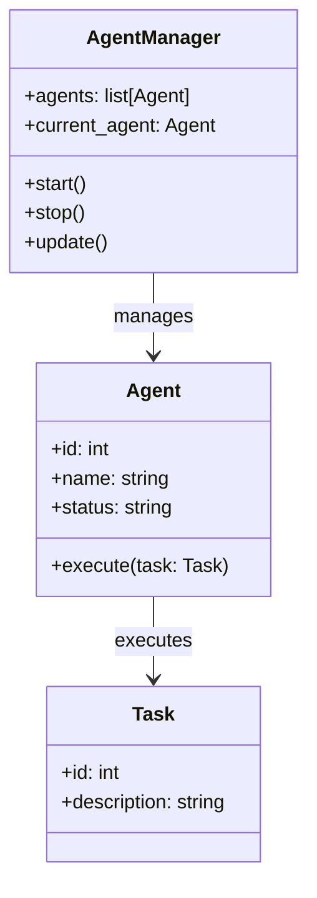
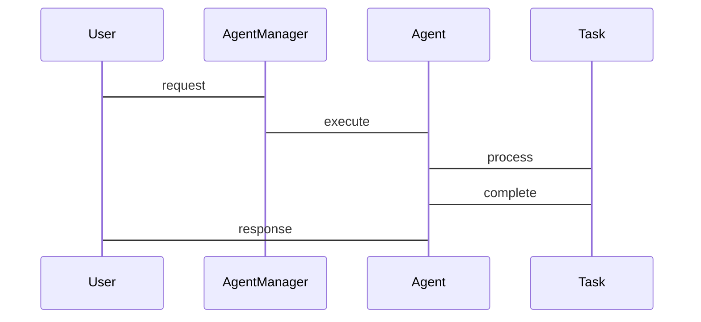

                 


# 《企业AI Agent的云端部署与管理》

> **关键词**：企业AI Agent、云端部署、人工智能、系统架构设计、DevOps、AI算法、微服务

> **摘要**：本文深入探讨了企业AI Agent的云端部署与管理，从核心概念、算法原理到系统架构设计，再到项目实战和最佳实践，全面解析了AI Agent在企业中的应用。通过详细的技术分析和实例，帮助读者理解如何高效地部署和管理AI Agent，提升企业的智能化水平。

---

## 第一部分：企业AI Agent的背景与基础

### 第1章：AI Agent的基本概念与背景

#### 1.1 AI Agent的定义与核心概念

AI Agent（人工智能代理）是指能够感知环境、自主决策并执行任务的智能实体。与传统AI不同，AI Agent具备更强的自主性和适应性，能够根据实时环境变化调整行为。其核心特征包括智能性、任务驱动性、自适应性和高可用性。AI Agent在企业中的应用广泛，涵盖自动化操作、智能客服、数据分析等领域。

#### 1.2 企业AI Agent的应用背景

随着企业数字化转型的深入推进，AI Agent的应用需求日益增长。企业通过部署AI Agent，可以实现业务流程自动化、提高效率、降低成本，并增强客户体验。然而，AI Agent的云端部署面临诸多挑战，如资源分配、安全性、可扩展性等。本文将探讨如何有效解决这些问题。

#### 1.3 问题背景与问题描述

企业在部署AI Agent时，面临的主要问题包括：

1. **资源分配**：如何高效利用云资源，确保AI Agent的性能。
2. **安全性**：数据在云端的安全存储与传输。
3. **可扩展性**：随着业务增长，如何弹性扩展AI Agent的部署。
4. **管理与优化**：如何监控和优化AI Agent的运行状态。

#### 1.4 问题解决与边界定义

通过采用分布式架构、容器化部署和自动化管理工具，可以有效解决上述问题。AI Agent的边界定义为：基于云端的智能化代理系统，具备感知、决策和执行能力，能够与企业现有系统无缝集成。其核心要素包括感知模块、决策模块和执行模块。

---

## 第二部分：企业AI Agent的核心概念与联系

### 第2章：AI Agent的核心原理与属性

#### 2.1 AI Agent的核心原理

AI Agent通过感知环境、分析数据、制定决策并执行操作来实现任务。感知模块负责收集环境数据，决策模块基于数据进行推理和选择最优策略，执行模块则将决策转化为具体行动。这种模块化的设计使得AI Agent具备高度的灵活性和可扩展性。

#### 2.2 AI Agent的属性特征对比

以下是AI Agent与其他AI系统的属性对比：

| **属性**       | **AI Agent**         | **传统AI系统**       |
|----------------|----------------------|----------------------|
| **自主性**      | 高                   | 低                   |
| **任务驱动性**  | 高                   | 低                   |
| **自适应性**    | 高                   | 中                   |
| **交互能力**    | 强                   | 弱                   |

#### 2.3 ER实体关系图

以下是AI Agent的核心实体关系图：

```mermaid
er
    entity User {
        id: int
        name: string
    }
    entity Agent {
        id: int
        name: string
        status: string
    }
    entity Task {
        id: int
        description: string
        priority: int
    }
    User --> Agent: 控制
    Agent --> Task: 执行
```

---

## 第三部分：AI Agent的算法原理与数学模型

### 第3章：AI Agent的算法原理

#### 3.1 AI Agent的核心算法

AI Agent的决策过程通常基于强化学习（Reinforcement Learning）或监督学习（Supervised Learning）。以下是一个强化学习的简单流程：

1. **状态感知**：AI Agent感知当前环境状态。
2. **动作选择**：基于当前状态，选择一个动作。
3. **奖励评估**：根据动作的结果，获得奖励或惩罚。
4. **策略优化**：根据奖励调整策略。

#### 3.2 算法原理的数学模型

以下是一个简单的强化学习模型：

$$
Q(s, a) = Q(s, a) + \alpha (r + \gamma \max Q(s', a') - Q(s, a))
$$

其中：
- \( Q(s, a) \)：状态-动作值函数。
- \( \alpha \)：学习率。
- \( r \)：奖励。
- \( \gamma \)：折扣因子。
- \( s' \)：下一状态。

#### 3.3 算法实现示例

以下是一个简单的强化学习算法实现：

```python
class Agent:
    def __init__(self, state_space, action_space):
        self.state_space = state_space
        self.action_space = action_space
        self.Q = np.zeros((state_space, action_space))

    def act(self, state):
        if np.random.random() < 0.9:
            return np.argmax(self.Q[state])
        else:
            return np.random.randint(self.action_space)

    def learn(self, state, action, reward, next_state):
        target = reward + gamma * np.max(self.Q[next_state])
        self.Q[state, action] = self.Q[state, action] + alpha * (target - self.Q[state, action])
```

---

## 第四部分：系统分析与架构设计

### 第4章：AI Agent的系统架构设计

#### 4.1 系统功能设计

以下是AI Agent的系统功能模块图：



#### 4.2 系统架构设计

以下是AI Agent的系统架构图：


#### 4.3 系统接口设计

以下是AI Agent的系统接口设计：



---

## 第五部分：项目实战

### 第5章：AI Agent的项目实战

#### 5.1 环境安装

以下是项目环境安装步骤：

```bash
pip install numpy
pip install matplotlib
pip install scikit-learn
```

#### 5.2 核心代码实现

以下是AI Agent的核心代码实现：

```python
import numpy as np

class AI_Agent:
    def __init__(self, state_size, action_size):
        self.state_size = state_size
        self.action_size = action_size
        self.q_table = np.zeros((state_size, action_size))

    def act(self, state):
        return np.argmax(self.q_table[state])

    def learn(self, state, action, reward, next_state):
        self.q_table[state][action] += alpha * (reward + gamma * np.max(self.q_table[next_state]) - self.q_table[state][action])
```

#### 5.3 案例分析

以下是一个简单的案例分析：

假设AI Agent需要在两个状态下选择动作，动作分别为0和1。初始Q表为全零：

$$
Q = \begin{bmatrix}
0 & 0
\end{bmatrix}
$$

经过一次学习后，假设状态为0，动作选择为1，奖励为1，下一状态为0：

$$
Q = \begin{bmatrix}
0 & 1
\end{bmatrix}
$$

---

## 第六部分：最佳实践与总结

### 第6章：最佳实践

- **选择合适的云服务提供商**：根据需求选择AWS、Azure或GCP等云平台。
- **使用容器化技术**：采用Docker和Kubernetes实现容器化部署。
- **监控与日志管理**：使用Prometheus和Grafana进行监控，使用ELK进行日志管理。
- **安全与合规**：确保数据加密、访问控制和合规性。

### 第7章：总结与展望

企业AI Agent的云端部署与管理是一项复杂的任务，涉及多方面的技术和管理挑战。通过合理的设计和最佳实践，可以有效提升AI Agent的性能和稳定性。未来，随着AI技术的不断发展，AI Agent在企业中的应用将更加广泛和深入。

---

## 作者信息

**作者：AI天才研究院/AI Genius Institute & 禅与计算机程序设计艺术 /Zen And The Art of Computer Programming**

---

**附录：**

- **参考资料**：[此处列出参考文献或资料]
- **术语表**：[此处列出文章中涉及的关键术语及其定义]

---

通过以上结构，您可以根据需要进一步扩展每一部分的内容，以完成一篇完整的10000字左右的技术博客文章。

