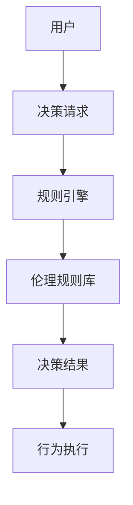

                 


```markdown
# 企业AI Agent的伦理决策框架

> 关键词：企业AI Agent，伦理决策，人工智能，系统架构，伦理框架，决策算法

> 摘要：本文探讨了在企业环境中，AI Agent如何进行伦理决策，分析了其核心概念、算法原理、系统架构，并通过实际案例展示了如何构建和应用伦理决策框架。

---

# 第一部分: 企业AI Agent的背景与概念

## 第1章: 企业AI Agent的基本概念

### 1.1 AI Agent的核心特征
- 自主性
- 反应性
- 社会性

### 1.2 伦理决策的重要性
- 保障决策的合规性
- 避免社会责任风险
- 提升用户信任度

### 1.3 企业AI Agent的伦理挑战
- 数据隐私问题
- 决策透明性
- 算法偏见

---

# 第二部分: 伦理决策框架的核心概念与联系

## 第2章: 伦理决策框架的原理与属性

### 2.1 伦理决策的基本原理
- 伦理规则的制定
- 决策过程的透明化
- 结果的可解释性

### 2.2 核心概念的属性对比
| 属性 | 描述 |
|------|------|
| 自主性 | AI Agent的独立决策能力 |
| 透明性 | 决策过程的可解释性 |
| 可控性 | 人类对决策过程的干预能力 |

### 2.3 系统架构的ER实体关系图
```mermaid
er
    actor: 用户
    agent: AI Agent
    rule_set: 伦理规则库
    decision: 决策结果
    action: 行为
    constraint: 约束条件
    relation: 关联
    actor --> agent: 请求决策
    agent --> rule_set: 查询规则
    agent --> decision: 生成结果
    decision --> action: 执行行为
    constraint --> rule_set: 定义约束
```

---

# 第三部分: 伦理决策框架的算法原理

## 第3章: 伦理决策算法的数学模型

### 3.1 基于规则的伦理决策算法
```latex
$$ \text{如果} \, (条件) \, \text{满足} \, (规则) \, \text{则} \, (行动) $$
```
代码实现：
```python
def ethical_decision(rules, conditions):
    for rule in rules:
        if evaluate_condition(rule, conditions):
            return rule.action
    return default_action
```

### 3.2 基于学习的伦理决策算法
```latex
$$ P(\text{行动}|x) = \frac{e^{xw + b}}{\sum e^{xw + b}} $$
```
代码实现：
```python
import tensorflow as tf
model = tf.keras.Model(inputs, outputs)
model.compile(optimizer='adam', loss='categorical_crossentropy')
```

### 3.3 算法对比分析
- 基于规则的优势：透明性高，易于解释
- 基于学习的优势：适应性强，可处理复杂情况

---

# 第四部分: 系统分析与架构设计

## 第4章: 伦理决策系统的架构设计

### 4.1 问题场景介绍
- 医疗诊断中的伦理决策
- 金融投资中的风险控制

### 4.2 系统功能设计
- 伦理规则库管理
- 决策请求处理
- 决策结果反馈

### 4.3 系统架构图


### 4.4 接口设计
- 输入接口：用户请求
- 输出接口：决策结果

---

# 第五部分: 项目实战

## 第5章: 伦理决策框架的实现案例

### 5.1 环境安装
- 安装必要的库：TensorFlow, PyTorch

### 5.2 核心代码实现
```python
def ethical_framework(rules, inputs):
    for rule in rules:
        if rule.matches(inputs):
            return rule.apply(inputs)
    return default_output
```

### 5.3 案例分析
- 医疗诊断案例
- 金融投资案例

---

# 第六部分: 最佳实践

## 第6章: 实践中的注意事项

### 6.1 小结
- 伦理决策框架的重要性
- 算法选择的影响

### 6.2 注意事项
- 确保数据的隐私和安全
- 定期更新伦理规则

### 6.3 拓展阅读
- 推荐书籍：《AI Ethics: The Key Concepts》

---

# 作者：AI天才研究院 & 禅与计算机程序设计艺术
```

