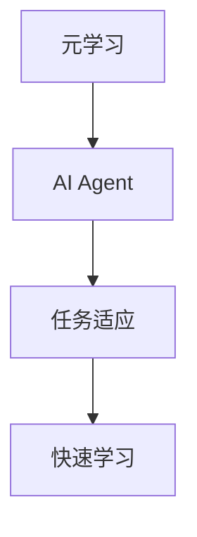
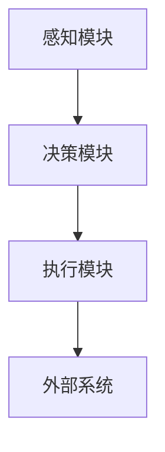
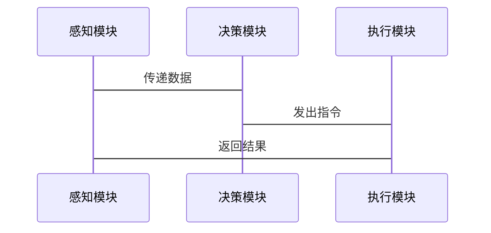

                 


# 企业AI Agent的元学习应用：快速适应新任务

> 关键词：企业AI Agent，元学习，快速适应新任务，MAML算法，AI系统设计，系统架构

> 摘要：本文探讨了企业AI Agent在元学习中的应用，重点分析了如何通过元学习算法实现快速适应新任务。文章从问题背景出发，详细讲解了元学习的核心概念、算法原理、系统架构设计以及项目实战，最后总结了最佳实践和未来展望。

---

# 第1章: 企业AI Agent的元学习应用背景

## 1.1 问题背景与描述

### 1.1.1 传统AI模型的局限性
传统AI模型（如支持向量机、随机森林）在处理特定任务时表现出色，但面对新任务时需要重新训练整个模型，耗时且效率低下。

### 1.1.2 企业AI Agent的核心需求
企业在复杂环境中需要AI Agent快速适应新任务，如客服对话、风险管理等，传统模型难以满足实时性和高效性要求。

### 1.1.3 元学习的提出与目标
元学习通过优化模型的优化过程，使AI Agent能够快速适应新任务，降低训练时间和计算成本。

## 1.2 问题解决与边界

### 1.2.1 元学习如何解决快速适应新任务
元学习通过在多个任务上预训练模型，使其具备快速学习新任务的能力。

### 1.2.2 企业AI Agent的边界与外延
AI Agent仅负责处理特定任务，不涉及企业的其他业务系统。

### 1.2.3 核心概念与要素组成
AI Agent由感知、决策和执行模块组成，元学习负责优化决策模块。

## 1.3 本章小结

- 元学习解决了传统AI模型适应新任务的低效问题。
- 企业AI Agent需要快速适应新任务，元学习是关键。

---

# 第2章: 元学习与AI Agent的核心概念

## 2.1 元学习原理与特点

### 2.1.1 元学习的基本原理
元学习通过在多个任务上训练模型，使其能够快速适应新任务。

### 2.1.2 元学习的核心特点
- **任务多样性**：在多个任务上预训练。
- **快速适应**：少量数据即可调整模型。

### 2.1.3 元学习与传统机器学习的对比
| 特性 | 元学习 | 传统机器学习 |
|------|--------|--------------|
| 数据需求 | 少量数据 | 需大量数据 |
| 适应速度 | 快速 | 缓慢 |

## 2.2 AI Agent的定义与功能

### 2.2.1 AI Agent的基本定义
AI Agent是具有感知、决策和执行能力的智能体。

### 2.2.2 AI Agent的核心功能
- **感知环境**：收集数据。
- **决策判断**：基于数据做出决策。
- **执行操作**：执行决策任务。

## 2.3 元学习与AI Agent的关系

### 2.3.1 元学习在AI Agent中的作用
优化决策模块，使其快速适应新任务。

### 2.3.2 AI Agent如何利用元学习快速适应新任务
通过元学习预训练，AI Agent能够快速调整策略。

## 2.4 核心概念对比表
| 概念 | 元学习 | AI Agent |
|------|--------|----------|
| 核心目标 | 快速适应新任务 | 执行复杂任务 |
| 依赖技术 | 深度学习、强化学习 | 知识图谱、NLP |

## 2.5 实体关系图



## 2.6 本章小结

- 元学习和AI Agent的结合使快速适应新任务成为可能。
- 元学习优化了AI Agent的决策模块。

---

# 第3章: 元学习算法原理与实现

## 3.1 元学习算法概述

### 3.1.1 元学习算法的基本分类
- **基于梯度的元学习**：MAML。
- **基于模型的元学习**：NAML。

## 3.2 基于梯度的元学习算法

### 3.2.1 Meta-LSTM算法
通过元学习优化LSTM模型。

### 3.2.2 MAML算法
MAML通过在多个任务上优化梯度，使模型能够快速适应新任务。

## 3.3 MAML算法详细讲解

### 3.3.1 MAML算法的基本思想
在多个任务上预训练模型，计算梯度更新，使模型能够快速适应新任务。

### 3.3.2 MAML算法的数学模型
$$ \text{损失函数} = \sum_{i=1}^{n} \mathcal{L}(f_\theta(x_i), y_i) $$

### 3.3.3 MAML算法的优化步骤
1. 在支持集上计算梯度。
2. 在查询集上更新模型。

### 3.3.4 MAML算法的代码实现示例

```python
def meta_learning_step(model, optimizer, support, query):
    # 支持集梯度
    support_loss = compute_loss(model, support)
    torch.zero_grad()
    support_loss.backward()
    optimizer.step()

    # 查询集优化
    query_loss = compute_loss(model, query)
    optimizer.zero_grad()
    query_loss.backward()
    optimizer.step()
```

## 3.4 元学习算法的优缺点分析

### 3.4.1 基于梯度的元学习算法优缺点
- 优点：计算效率高。
- 缺点：对任务相似性要求较高。

### 3.4.2 基于模型的元学习算法优缺点
- 优点：适应性强。
- 缺点：计算复杂度高。

## 3.5 本章小结

- 元学习算法为AI Agent提供了快速适应新任务的方法。
- MAML算法是基于梯度的元学习算法的典型代表。

---

# 第4章: 企业AI Agent的系统分析与架构设计

## 4.1 问题场景介绍

### 4.1.1 企业AI Agent的应用场景
- **客服对话**：处理客户咨询。
- **风险管理**：识别潜在风险。

## 4.2 系统功能设计

### 4.2.1 系统功能模块
- **感知模块**：数据采集。
- **决策模块**：任务处理。
- **执行模块**：操作执行。

## 4.3 系统架构设计

### 4.3.1 系统架构图



## 4.4 系统接口设计

### 4.4.1 API接口
- `/api/predict`：接收输入，返回结果。

## 4.5 系统交互设计

### 4.5.1 序列图



## 4.6 本章小结

- 企业AI Agent的系统架构清晰。
- 系统各模块协同工作，实现快速适应新任务。

---

# 第5章: 企业AI Agent的项目实战

## 5.1 环境安装

### 5.1.1 安装Python
- 版本：3.8以上。

### 5.1.2 安装依赖
- `pip install torch>=1.5`

## 5.2 核心实现

### 5.2.1 元学习模型实现

```python
import torch

class MetaLSTM(torch.nn.Module):
    def __init__(self, input_size, hidden_size):
        super(MetaLSTM, self).__init__()
        self.lstm = torch.nn.LSTM(input_size, hidden_size)
        self.fc = torch.nn.Linear(hidden_size, 1)
    
    def forward(self, x):
        out, _ = self.lstm(x)
        out = self.fc(out[-1])
        return out
```

### 5.2.2 训练代码

```python
def train(model, optimizer, criterion, support, query):
    for batch in support:
        outputs = model(batch)
        loss = criterion(outputs, batch_labels)
        optimizer.zero_grad()
        loss.backward()
        optimizer.step()
    
    for batch in query:
        outputs = model(batch)
        loss = criterion(outputs, batch_labels)
        optimizer.zero_grad()
        loss.backward()
        optimizer.step()
```

## 5.3 案例分析

### 5.3.1 案例介绍
- 任务：客服对话系统。

### 5.3.2 案例实现
通过MAML算法，客服系统快速适应新问题。

## 5.4 项目总结

### 5.4.1 实现总结
- 元学习模型成功应用于企业AI Agent。

### 5.4.2 成功经验
- 系统设计合理，算法选择恰当。

---

# 第6章: 结论与展望

## 6.1 结论

- 企业AI Agent通过元学习实现了快速适应新任务。
- MAML算法是实现这一目标的有效方法。

## 6.2 未来展望

- **算法优化**：探索更高效的元学习算法。
- **应用场景扩展**：将元学习应用于更多领域。

---

# 作者

**作者：AI天才研究院/AI Genius Institute & 禅与计算机程序设计艺术 /Zen And The Art of Computer Programming**

---

这篇文章系统地介绍了企业AI Agent的元学习应用，从理论到实践，为读者提供了全面的知识。通过详细讲解MAML算法和系统架构设计，文章展示了如何将元学习应用于企业AI Agent，实现快速适应新任务的目标。

