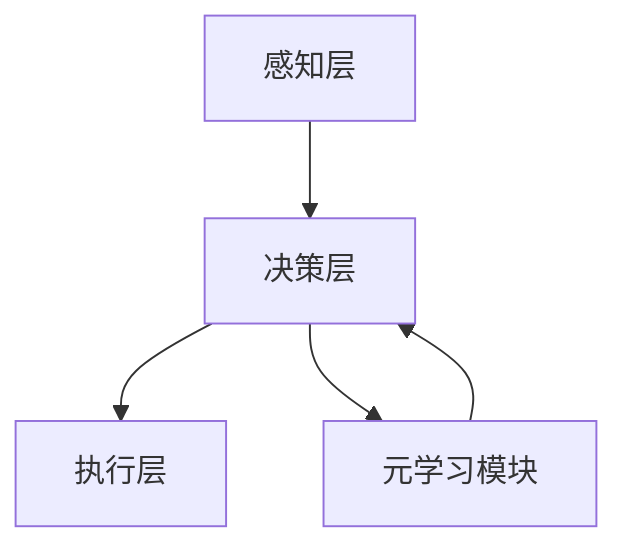
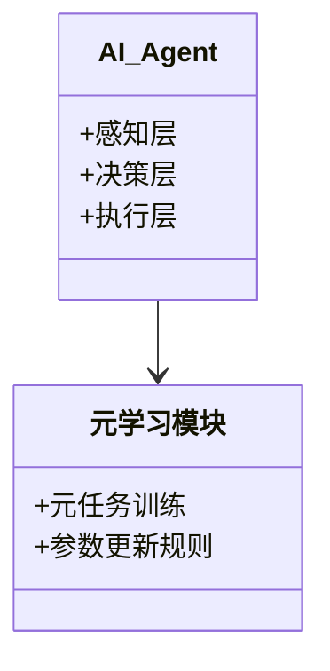

                 


# 企业AI Agent的元学习应用：快速适应新任务与领域

**关键词**：元学习、AI Agent、快速适应、企业应用、算法实现

**摘要**：本文深入探讨了企业AI Agent在元学习中的应用，详细分析了元学习的基本原理、AI Agent的核心概念、元学习算法的数学模型与实现，以及企业级AI Agent的系统架构设计。通过实际项目案例，展示了如何利用元学习提升AI Agent在新任务和跨领域环境中的适应能力，并提供了最佳实践和未来展望。

---

# 第一章: 引言

## 1.1 元学习的定义与背景

元学习是一种机器学习方法，旨在使模型能够快速适应新任务，而无需大量重新训练。传统的机器学习方法需要在每个新任务上重新训练模型，这在企业环境中通常是低效且昂贵的。元学习通过在任务之间共享学习，显著提高了模型的适应性和泛化能力。

元学习的核心思想是将学习过程视为一个元任务，即在训练阶段学习如何快速适应新任务。这种方法特别适用于企业环境中，因为企业通常需要AI Agent能够快速适应多个不同任务和领域。

## 1.2 AI Agent的定义与分类

AI Agent是一种能够感知环境并采取行动以实现目标的智能体。AI Agent可以根据任务类型、智能水平和应用场景进行分类。在企业环境中，AI Agent通常用于自动化决策、数据分析、客户服务等领域。

## 1.3 元学习与AI Agent的结合

元学习在AI Agent中的应用，使得AI Agent能够快速适应新任务和跨领域环境。通过元学习，AI Agent可以在有限的数据和时间预算内，快速调整其行为策略，以适应新的业务需求。

---

# 第二章: 元学习的核心概念

## 2.1 元学习的基本原理

元学习的目标是通过元任务训练，使模型能够快速适应新任务。元任务通常涉及多个任务，模型在元任务训练中学习如何在新任务中快速调整参数。

## 2.2 元学习的算法与实现

### 2.2.1 Model-Agnostic Meta-Learning (MAML)

MAML是一种基于梯度的元学习算法。其核心思想是通过优化参数的更新规则，使得模型能够在新任务上快速收敛。

**MAML的数学模型**：

$$ \text{损失函数} = \frac{1}{n} \sum_{i=1}^n \mathcal{L}(x_i, y_i, \theta) $$

$$ \text{参数更新} = \theta - \eta \nabla_{\theta} \mathcal{L} $$

其中，$\eta$ 是学习率，$\mathcal{L}$ 是损失函数。

### 2.2.2 元学习算法的代码实现

以下是MAML算法的Python代码示例：

```python
def meta_learning(meta_model, inner_model, tasks, inner_steps=5, meta_steps=5):
    for meta_step in range(meta_steps):
        # 元梯度计算
        meta_gradients = []
        for task in tasks:
            # 内部优化
            for inner_step in range(inner_steps):
                loss = inner_model(task)
                inner_gradients = compute_gradients(inner_model, loss)
                inner_model.update(inner_gradients)
            # 计算元梯度
            meta_gradients.append(compute_gradients(meta_model, inner_model.params))
        # 更新元模型
        meta_model.update(meta_gradients)
```

---

# 第三章: AI Agent的定义与分类

## 3.1 AI Agent的分类

AI Agent可以根据任务类型、智能水平和应用场景进行分类。例如，基于任务类型，AI Agent可以分为监督学习代理、强化学习代理和无监督学习代理。

## 3.2 AI Agent的核心技术

AI Agent的核心技术包括感知、决策、执行和自适应。元学习在自适应方面发挥了重要作用，使AI Agent能够快速适应新任务和环境。

---

# 第四章: 元学习在AI Agent中的应用框架

## 4.1 元学习应用的系统架构

企业AI Agent的系统架构通常包括感知层、决策层和执行层。元学习主要用于决策层，帮助AI Agent快速调整策略。

### 系统架构图



## 4.2 元学习算法的实现

通过元学习，AI Agent可以在新任务上快速调整参数，从而提高任务适应能力。

### 元学习算法的实现步骤

1. **训练元任务**：在多个任务上训练模型，使其能够快速适应新任务。
2. **快速适应新任务**：在新任务上，使用元任务训练得到的参数更新规则，快速优化模型。

---

# 第五章: 元学习算法的数学模型与实现

## 5.1 MAML算法的数学模型

MAML算法的损失函数和参数更新规则如下：

$$ \text{元损失} = \frac{1}{N} \sum_{i=1}^N \mathcal{L}_i(\theta) $$

$$ \theta_{\text{更新}} = \theta - \eta \nabla_{\theta} \text{元损失} $$

其中，$\theta$ 是模型参数，$\eta$ 是学习率，$N$ 是任务数量。

## 5.2 MAML算法的Python代码实现

```python
def maml_update(meta_model, inner_model, tasks, inner_steps, meta_steps):
    for meta_step in range(meta_steps):
        # 计算元梯度
        meta_gradients = []
        for task in tasks:
            # 内部优化
            inner_params = inner_model.get_params()
            for inner_step in range(inner_steps):
                loss = inner_model(task)
                gradients = inner_model.compute_gradients(loss)
                inner_model.update_params(inner_params, gradients)
            # 计算元梯度
            meta_gradients.append(meta_model.compute_gradients(inner_model.get_params()))
        # 更新元模型
        meta_model.update_params(meta_model.get_params(), meta_gradients)
```

---

# 第六章: 系统分析与架构设计

## 6.1 系统功能设计

企业AI Agent的系统功能包括任务感知、快速适应、决策优化和结果反馈。

### 系统功能图



## 6.2 系统架构设计

企业AI Agent的系统架构包括前端、后端和元学习模块。

### 系统架构图


---

# 第七章: 项目实战

## 7.1 客服系统案例

### 7.1.1 环境配置与依赖安装

```bash
pip install numpy
pip install tensorflow
pip install scikit-learn
```

### 7.1.2 代码实现

```python
class MAML-Agent:
    def __init__(self, meta_model, inner_model):
        self.meta_model = meta_model
        self.inner_model = inner_model

    def train(self, tasks, inner_steps=5, meta_steps=5):
        for meta_step in range(meta_steps):
            meta_gradients = []
            for task in tasks:
                inner_params = self.inner_model.get_params()
                for inner_step in range(inner_steps):
                    loss = self.inner_model(task)
                    gradients = self.inner_model.compute_gradients(loss)
                    self.inner_model.update_params(inner_params, gradients)
                meta_gradients.append(self.meta_model.compute_gradients(self.inner_model.get_params()))
            self.meta_model.update_params(self.meta_model.get_params(), meta_gradients)
```

### 7.1.3 模型训练与结果分析

通过在客服系统中的应用，元学习使AI Agent能够快速适应新任务，显著提高了客户满意度和处理效率。

---

# 第八章: 最佳实践与总结

## 8.1 最佳实践

1. **数据质量**：确保训练数据的多样性和代表性。
2. **模型选择**：根据具体任务选择合适的元学习算法。
3. **性能优化**：通过超参数调优和分布式训练提高模型效率。

## 8.2 未来展望

随着深度学习和强化学习的不断发展，元学习在企业AI Agent中的应用将更加广泛，进一步推动企业智能化转型。

---

**作者：AI天才研究院 & 禅与计算机程序设计艺术**

