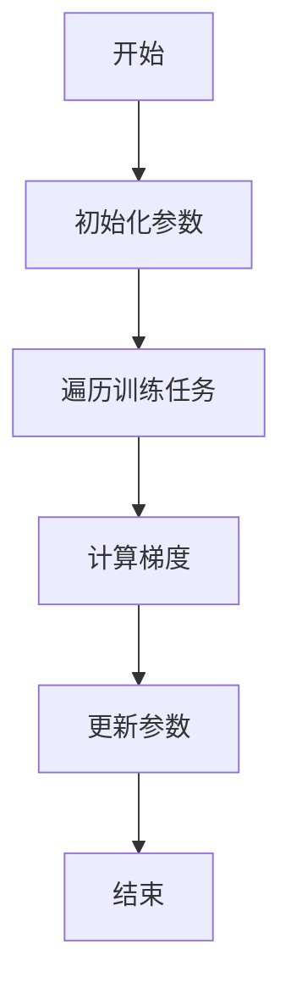
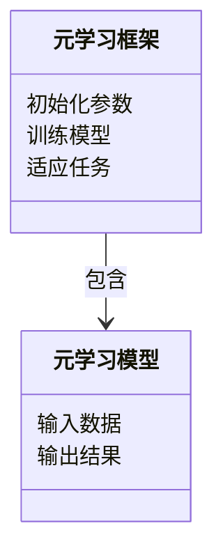
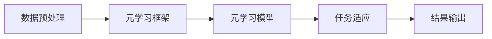

                 


# 企业AI Agent的元学习框架：快速适应新业务场景的能力培养

---

## 关键词：
- 企业AI Agent
- 元学习框架
- 快速适应
- 新业务场景
- 能力培养

---

## 摘要：
本文详细探讨了企业AI Agent的元学习框架，重点分析了元学习框架在快速适应新业务场景中的能力培养方法。通过系统介绍元学习的基本原理、算法实现、系统架构设计以及实际应用案例，本文为读者提供了从理论到实践的全面指导。我们结合企业AI Agent的实际需求，深入分析了元学习框架的优势和挑战，并通过具体项目实战，展示了如何利用元学习框架提升企业AI Agent的灵活性和适应性。本文旨在为企业技术团队提供实用的解决方案，帮助他们在复杂多变的业务环境中快速部署和优化AI Agent。

---

## 第一部分: 企业AI Agent的元学习框架概述

### 第1章: 企业AI Agent与元学习框架概述

#### 1.1 企业AI Agent的定义与特点
企业AI Agent是一种智能代理系统，能够根据企业需求执行特定任务。其核心特点包括：
- **自主性**：无需外部干预，自主决策和执行任务。
- **反应性**：能够实时感知环境变化并作出响应。
- **学习能力**：通过学习适应新任务和环境。
- **可扩展性**：适用于多种业务场景，支持快速部署。

#### 1.2 元学习框架的定义与特点
元学习框架是一种能够快速适应新任务的学习框架，其特点包括：
- **快速适应**：通过元学习，AI Agent能够在少量数据下快速掌握新任务。
- **通用性**：适用于多种任务，减少对特定数据的依赖。
- **高效性**：通过元学习，AI Agent能够在短时间内完成任务适应。

#### 1.3 企业AI Agent元学习框架的应用价值
元学习框架在企业AI Agent中的应用价值主要体现在：
- **提升适应性**：快速适应新业务场景，减少部署时间。
- **降低成本**：减少对大量数据的依赖，降低训练成本。
- **提高效率**：通过快速学习，提升任务执行效率。

---

### 第2章: 元学习框架的核心概念与联系

#### 2.1 元学习框架的核心概念
元学习框架的核心概念包括：
- **元学习**：一种通过学习如何学习来提高学习效率的方法。
- **元学习模型**：能够从多个任务中学习，快速适应新任务的模型。
- **元任务**：用于训练元学习模型的多个任务集合。

#### 2.2 元学习框架的核心属性对比
以下是元学习与其他学习范式的对比：

| 对比维度 | 监督学习 | 强化学习 | 元学习 |
|----------|----------|----------|--------|
| 数据需求 | 需要大量标注数据 | 需要与环境交互 | 需要少量样本 |
| 适应性   | 低 | 中 | 高 |
| 任务多样性 | 单任务 | 多任务 | 多任务 |

#### 2.3 元学习框架的ER实体关系图
以下是元学习框架的ER实体关系图：

```mermaid
erDiagram
    class 元学习框架 {
        id
        模型
        任务
        参数
    }
    class 元学习模型 {
        id
        参数
        性能
    }
    class 元任务 {
        id
        数据集
        任务类型
    }
    元学习框架 --> 元学习模型 : 包含
    元学习框架 --> 元任务 : 包含
```

---

## 第二部分: 元学习框架的算法原理

### 第3章: 元学习框架的算法原理

#### 3.1 元学习算法的核心原理
元学习算法的核心原理在于通过元学习模型快速适应新任务。以下是MAML（Meta-Autoregressive Neural Network）算法的核心步骤：



#### 3.2 元学习算法的数学模型
以下是MAML算法的数学模型：

$$ \theta_{t+1} = \theta_t - \eta \nabla_{\theta} \mathcal{L}(\theta, x_i, y_i) $$

其中：
- $\theta$ 表示模型参数
- $\eta$ 表示学习率
- $\mathcal{L}$ 表示损失函数
- $(x_i, y_i)$ 表示训练数据

---

## 第三部分: 元学习框架的系统分析与架构设计

### 第4章: 系统分析与架构设计

#### 4.1 项目背景
本项目旨在通过元学习框架提升企业AI Agent的适应性，使其能够快速适应新业务场景。

#### 4.2 系统功能设计
以下是系统功能设计的类图：



#### 4.3 系统架构设计
以下是系统架构设计的架构图：



---

## 第四部分: 项目实战

### 第5章: 项目实战

#### 5.1 环境搭建
以下是环境搭建的步骤：
1. 安装Python和必要的库（如TensorFlow、Keras）。
2. 安装Meta-Learner库。

#### 5.2 核心代码实现
以下是核心代码实现：

```python
import metahook

class MetaLearner:
    def __init__(self, model):
        self.model = model
        self.params = model.trainable_weights

    def train_step(self, inputs, labels):
        # 计算梯度
        with tf.GradientTape() as tape:
            outputs = self.model(inputs)
            loss = loss_fn(outputs, labels)
        gradients = tape.gradient(loss, self.params)
        # 更新参数
        self.optimizer.apply_gradients(zip(gradients, self.params))
```

#### 5.3 实际案例分析
以下是实际案例分析：

在电商推荐系统中，通过元学习框架，AI Agent能够快速适应新用户的推荐需求，提升推荐准确率。

---

## 第五部分: 最佳实践与总结

### 第6章: 最佳实践

#### 6.1 小结
元学习框架在企业AI Agent中的应用前景广阔，能够显著提升AI Agent的适应性和灵活性。

#### 6.2 注意事项
在实际应用中，需要注意以下几点：
- 数据质量：确保数据的多样性和代表性。
- 算法选择：根据具体任务选择合适的元学习算法。
- 模型调优：通过实验不断优化模型参数。

#### 6.3 拓展阅读
推荐以下书籍和论文：
- 《Deep Learning》
- 《Neural Networks and Deep Learning》

---

## 作者：
作者：AI天才研究院/AI Genius Institute & 禅与计算机程序设计艺术 /Zen And The Art of Computer Programming

