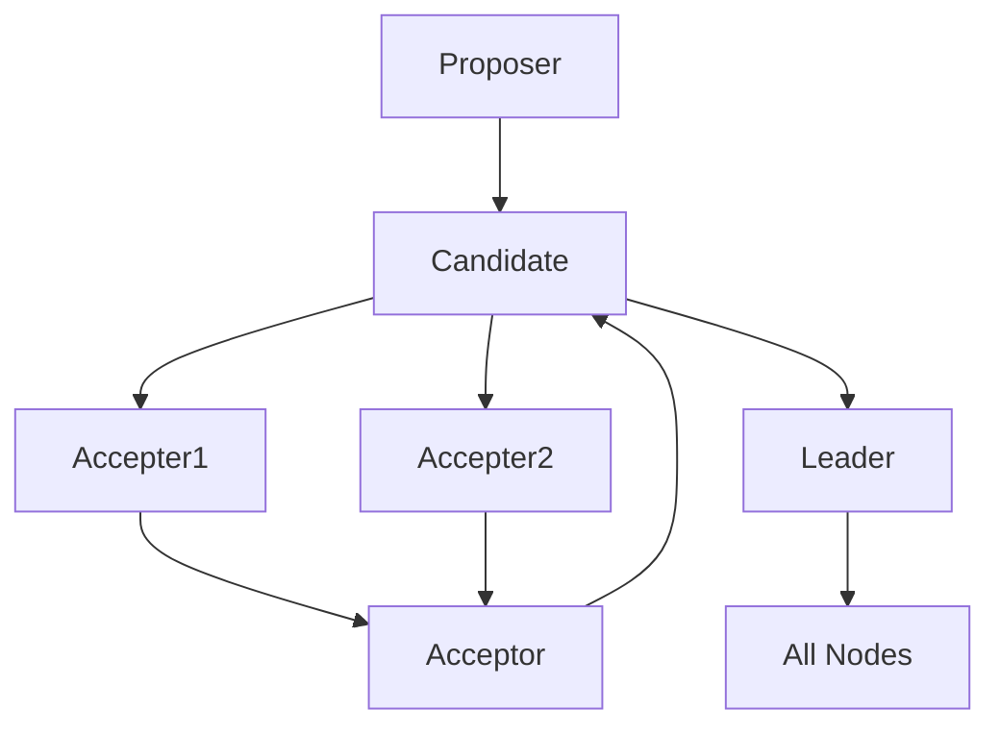
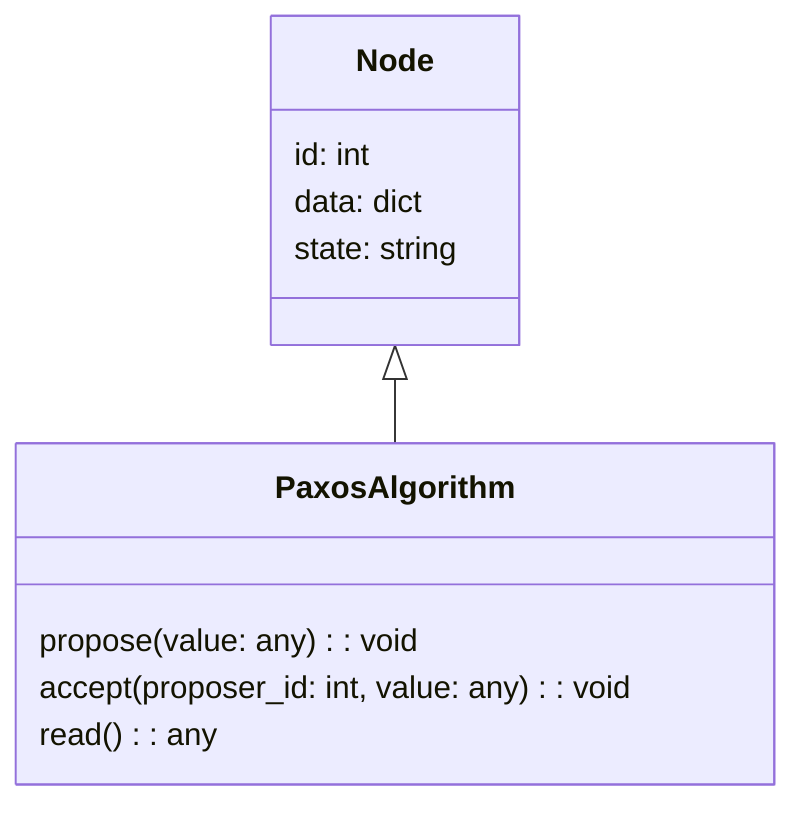
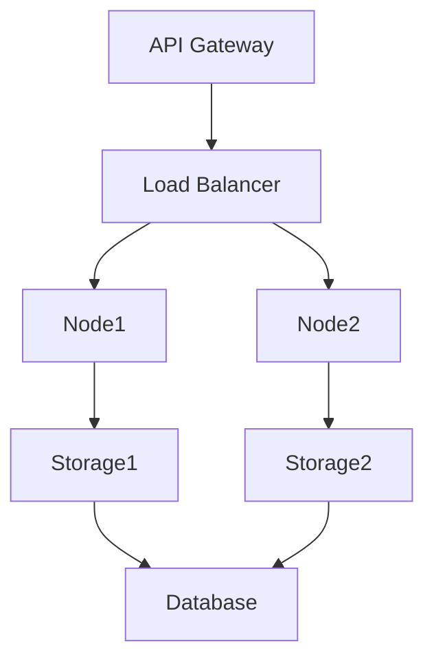

                 


# 《企业AI Agent的分布式存储系统设计》

> 关键词：分布式存储、AI Agent、企业应用、系统设计、算法实现

> 摘要：本文详细探讨了企业AI Agent的分布式存储系统设计，从背景介绍、核心概念到算法实现，再到系统架构和项目实战，结合实际案例和最佳实践，为企业AI Agent的分布式存储系统提供全面的设计指导。

---

# 1. 背景介绍

## 1.1 问题背景

随着企业智能化转型的推进，AI Agent（人工智能代理）在企业中的应用日益广泛。AI Agent通过自动化处理任务、优化决策流程，为企业带来显著的效率提升。然而，AI Agent的高效运行离不开强大的数据存储和管理能力。在企业环境中，数据量庞大且分布广泛，传统的集中式存储系统已难以满足需求，分布式存储系统因此成为必然选择。

---

## 1.2 核心概念

AI Agent的分布式存储系统设计涉及多个核心概念，包括分布式存储架构、数据一致性、可扩展性、容错性等。本文将从这些方面展开，详细探讨如何在企业环境中实现高效的分布式存储。

---

# 2. 核心概念与联系

## 2.1 分布式存储系统

分布式存储系统通过将数据分布在多个节点上，提供高可用性、高扩展性和数据冗余能力。这种架构能够有效应对企业级应用中的数据量和访问量挑战。

## 2.2 AI Agent与分布式存储的结合

AI Agent需要实时处理大量数据，分布式存储系统为其提供了数据高效存储和快速访问的能力。通过分布式存储，AI Agent能够更好地支持实时决策、数据挖掘和复杂任务处理。

---

# 3. 算法原理

## 3.1 分布式一致性算法

分布式一致性是确保系统在多个节点之间数据一致性的关键。常用的算法包括Paxos、Raft等。以下是Paxos算法的流程图：



## 3.2 分布式存储算法实现

以下是基于Paxos算法的Python实现示例：

```python
class Paxos:
    def __init__(self, proposer_id, acceptors):
        self.proposer_id = proposer_id
        self.acceptors = acceptors
        self.value = None

    def propose(self, value):
        self.value = value
        for acceptor in self.acceptors:
            acceptor.receive_proposal(self.proposer_id, self.value)

    def accept(self, proposer_id, value):
        self.value = value
        self.proposer_id = proposer_id

    def read(self):
        return self.value
```

---

## 3.3 数学模型与公式

分布式存储系统中，数据一致性可以通过以下公式表示：

$$ \text{一致性} = \frac{\text{一致的节点数}}{\text{总节点数}} \times 100\% $$

---

# 4. 系统分析与架构设计

## 4.1 系统功能设计

### 4.1.1 领域模型

以下是领域模型的Mermaid图：



---

## 4.2 系统架构设计

以下是系统架构的Mermaid图：



---

# 5. 项目实战

## 5.1 环境安装

### 5.1.1 安装Python和相关库

```bash
python -m pip install paxos
```

---

## 5.2 核心代码实现

以下是核心代码示例：

```python
from paxos import Paxos

# 初始化节点
acceptors = [1, 2, 3]
paxos = Paxos(1, acceptors)

# 提出提案
paxos.propose(123)

# 接受提案
paxos.accept(2, 123)

# 读取值
print(paxos.read())
```

---

## 5.3 实际案例分析

通过上述代码实现，我们可以看到分布式存储系统在处理数据一致性方面的高效性。实际应用中，企业AI Agent可以通过调用这些接口实现数据的高效存储和管理。

---

# 6. 最佳实践

## 6.1 小结

本文详细探讨了企业AI Agent的分布式存储系统设计，从背景介绍到算法实现，再到系统架构和项目实战，为企业AI Agent的高效运行提供了全面的设计指导。

## 6.2 注意事项

在实际应用中，需注意数据一致性、节点容错性和系统可扩展性，确保系统的高可用性和高性能。

## 6.3 扩展阅读

推荐阅读《分布式系统：概念与设计》和《Paxos算法详解》以进一步深入理解分布式存储系统设计。

---

# 7. 结论

企业AI Agent的分布式存储系统设计是一个复杂而重要的课题。通过合理的架构设计和高效的算法实现，可以显著提升AI Agent的性能和可靠性。未来，随着技术的发展，分布式存储系统在企业AI Agent中的应用将更加广泛和深入。

---

# 作者

作者：AI天才研究院/AI Genius Institute & 禅与计算机程序设计艺术 /Zen And The Art of Computer Programming

