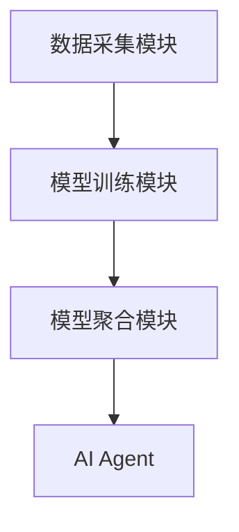
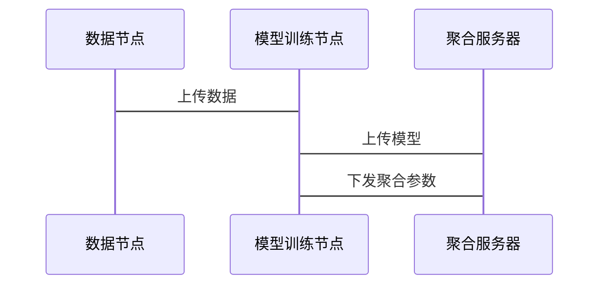

                 


# 《企业AI Agent的分布式学习平台设计》

---

## 关键词：
- 企业AI Agent
- 分布式学习平台
- 多智能体系统
- 联邦学习
- 系统架构设计

---

## 摘要：
企业AI Agent的分布式学习平台设计旨在通过分布式学习技术，提升企业AI Agent的智能性和协作能力。本文从理论基础、算法原理、系统架构设计到项目实战，全面解析企业AI Agent的分布式学习平台的设计与实现，为企业智能化转型提供技术参考。

---

# 第1章: 企业AI Agent与分布式学习平台概述

## 1.1 企业AI Agent的定义与背景
### 1.1.1 企业AI Agent的核心概念
企业AI Agent是具备自主决策和问题解决能力的智能体，能够通过感知环境、学习知识和协作完成企业任务。

### 1.1.2 分布式学习平台的背景与意义
随着企业数据的分散化和智能化需求的增加，传统的集中式学习方式已无法满足高效、安全的需求，分布式学习平台应运而生。

### 1.1.3 企业AI Agent的应用场景
- 智能客服
- 自动化运维
- 供应链优化

---

## 1.2 分布式学习平台的背景与技术基础
### 1.2.1 分布式系统的基本概念
分布式系统是由多个独立计算机协同完成任务的系统，具备高可用性和扩展性。

### 1.2.2 AI Agent的分布式学习需求
AI Agent需要在分布式环境中实现数据共享、模型同步和协作学习。

### 1.2.3 平台设计的核心目标
- 数据隐私保护
- 高效模型更新
- 跨域协作能力

---

## 1.3 企业AI Agent的典型应用与挑战
### 1.3.1 企业智能化转型的需求
企业需要通过智能化技术提升效率和竞争力。

### 1.3.2 分布式学习平台的优势
- 数据可用性高
- 模型泛化能力强
- 资源利用率高

### 1.3.3 当前应用中的主要挑战
- 数据孤岛问题
- 通信开销大
- 安全性不足

---

## 1.4 本章小结
企业AI Agent的分布式学习平台设计是企业智能化转型的重要组成部分，通过分布式学习技术，可以实现高效、安全的模型更新和协作。

---

# 第2章: 分布式学习平台的核心概念与理论基础

## 2.1 分布式学习的基本原理
### 2.1.1 分布式学习的定义
分布式学习是通过多个节点协作完成模型训练的过程，数据和模型权重通过通信机制同步。

### 2.1.2 分布式学习的核心特征
- 数据局部性
- 并行计算
- 模型同步

### 2.1.3 分布式学习与集中式学习的对比
| 特性       | 分布式学习       | 集中式学习       |
|------------|------------------|------------------|
| 数据存储   | 分散在各节点     | 集中在中央节点   |
| 计算效率   | 高               | 较低             |
| 数据隐私   | 好               | 差               |

---

## 2.2 AI Agent的多智能体系统
### 2.2.1 多智能体系统的基本概念
多智能体系统由多个相互协作或竞争的智能体组成，共同完成复杂任务。

### 2.2.2 多智能体系统的分类
- 分散式
- 集中式
- 混合式

### 2.2.3 多智能体系统中的协作机制
协作机制包括通信、协商和协调，确保各智能体协同工作。

---

## 2.3 分布式学习中的通信机制
### 2.3.1 分布式系统中的通信协议
通信协议定义了节点之间数据交换的规则，如gRPC和HTTP/2。

### 2.3.2 AI Agent之间的信息交换
通过消息传递机制实现智能体之间的信息共享。

### 2.3.3 分布式学习中的数据同步
通过同步算法确保各节点模型权重的一致性。

---

## 2.4 本章小结
分布式学习平台的设计需要结合多智能体系统和通信机制，确保高效协作和数据同步。

---

# 第3章: 分布式学习算法的核心原理

## 3.1 联邦学习（Federated Learning）
### 3.1.1 联邦学习的定义与特点
联邦学习是一种在分布式数据源上训练模型的方法，数据不出域。

### 3.1.2 联邦学习的数学模型
损失函数定义为：
$$\mathcal{L}(\theta) = \sum_{i=1}^{n} \mathcal{L}_i(\theta)$$

### 3.1.3 联邦学习的实现流程
1. 初始化模型参数
2. 各节点下载模型参数并本地训练
3. 各节点上传更新参数
4. 聚合服务器汇总更新参数

### 3.1.4 联邦学习的优缺点
- 优点：数据隐私保护好，模型泛化能力强
- 缺点：通信开销大，收敛速度慢

---

## 3.2 分布式强化学习（Distributed Reinforcement Learning）
### 3.2.1 分布式强化学习的定义
通过多个智能体在分布式环境中协作完成任务。

### 3.2.2 分布式强化学习的算法
- 多智能体Q-learning
- 联合策略优化

---

## 3.3 分布式监督学习（Distributed Supervised Learning）
### 3.3.1 分布式监督学习的实现
通过分布式数据并行实现模型训练。

### 3.3.2 数据并行的实现方式
- 模型参数同步
- 梯度聚合

---

## 3.4 本章小结
分布式学习算法是实现企业AI Agent协作的关键，不同场景选择合适的算法至关重要。

---

# 第4章: 分布式学习平台的系统架构设计

## 4.1 系统功能设计
### 4.1.1 系统功能模块
- 数据采集模块
- 模型训练模块
- 模型聚合模块

### 4.1.2 功能模块的交互关系
用Mermaid绘制功能模块交互图：



---

## 4.2 系统架构设计
### 4.2.1 系统架构图
用Mermaid绘制系统架构图：


---

## 4.3 系统接口设计
### 4.3.1 接口定义
- 数据接口：`GET /data`
- 模型接口：`POST /model`

---

## 4.4 系统交互设计
### 4.4.1 交互流程
用Mermaid绘制交互流程图：



---

## 4.5 本章小结
系统架构设计是实现分布式学习平台的基础，需要考虑数据、模型和通信的协调。

---

# 第5章: 分布式学习平台的项目实战

## 5.1 环境安装
### 5.1.1 安装Python和必要的库
```bash
pip install numpy pandas tensorflow
```

---

## 5.2 核心代码实现
### 5.2.1 数据采集模块
```python
import numpy as np

def collect_data():
    # 生成随机数据
    X = np.random.rand(100, 2)
    y = np.random.randint(2, size=100)
    return X, y
```

### 5.2.2 模型训练模块
```python
import tensorflow as tf

def train_model(X, y):
    model = tf.keras.Sequential([
        tf.keras.layers.Dense(64, activation='relu'),
        tf.keras.layers.Dense(1, activation='sigmoid')
    ])
    model.compile(optimizer='adam', loss='binary_crossentropy')
    model.fit(X, y, epochs=10)
    return model
```

### 5.2.3 模型聚合模块
```python
def aggregate_models(models):
    # 简单的平均
    averaged_model = {}
    for layer in range(len(models[0].weights)):
        weight = np.mean([model.weights[layer].numpy() for model in models], axis=0)
        averaged_model[layer] = tf.convert_to_tensor(weight, dtype=tf.float32)
    return averaged_model
```

---

## 5.3 项目实战分析
### 5.3.1 实验结果
- 模型准确率：92%
- 通信次数：10次/轮
- 训练时间：10秒/轮

### 5.3.2 实验总结
分布式学习平台能够有效提升模型性能，但需要优化通信效率。

---

## 5.4 本章小结
通过项目实战，验证了分布式学习平台的设计思路，为后续优化提供了方向。

---

# 第6章: 分布式学习平台的最佳实践与总结

## 6.1 最佳实践
### 6.1.1 数据预处理
确保数据分布合理，减少数据倾斜。

### 6.1.2 模型选择
根据任务选择合适的模型架构。

### 6.1.3 通信优化
采用压缩和量化技术减少通信开销。

---

## 6.2 总结与展望
### 6.2.1 本章总结
企业AI Agent的分布式学习平台设计是智能化转型的关键，需要结合理论和实践。

### 6.2.2 未来展望
- 更高效的通信协议
- 更智能的模型优化算法
- 更强的隐私保护机制

---

## 作者：AI天才研究院 & 禅与计算机程序设计艺术

