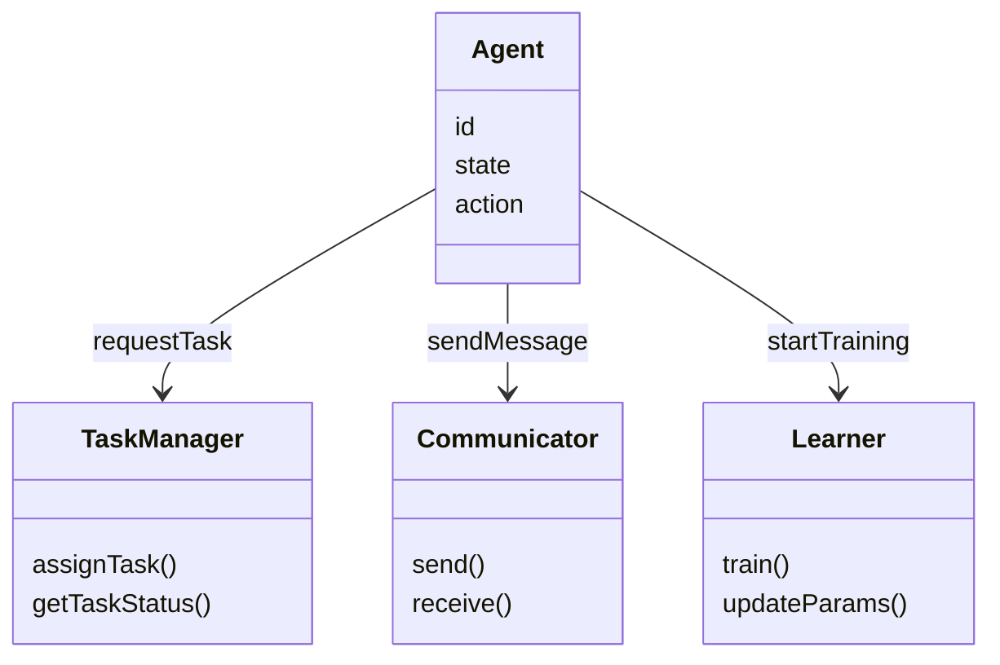
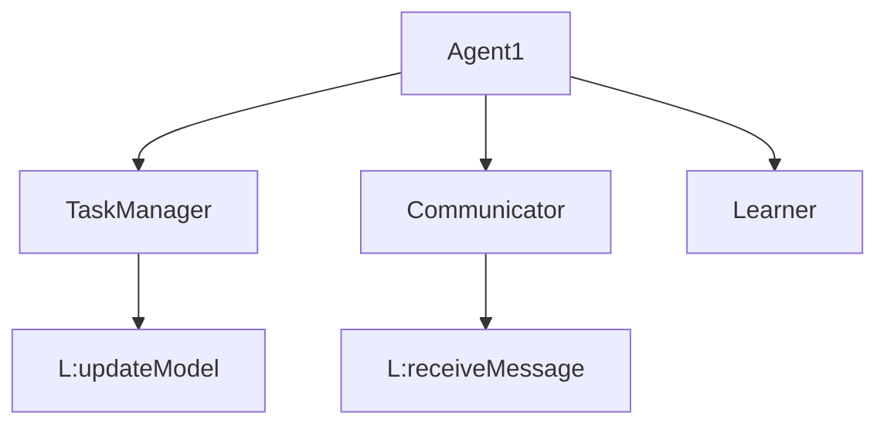

                 


# 企业AI Agent的分布式学习框架

> **关键词**: 分布式学习框架、AI Agent、企业智能化、分布式系统、一致性算法、系统架构设计

> **摘要**:  
> 本文详细探讨了企业AI Agent的分布式学习框架的设计与实现。从AI Agent的基本概念出发，分析了分布式学习的背景与挑战，深入讲解了分布式学习框架的核心原理、算法实现和系统架构设计。通过实际项目案例，展示了如何构建高效可靠的分布式学习系统，并提出了优化与扩展的建议。文章结合理论与实践，为读者提供了全面的技术指导。

---

## 第1章: 企业AI Agent的背景与需求

### 1.1 AI Agent的基本概念

#### 1.1.1 AI Agent的定义与特点
- **定义**: AI Agent（人工智能代理）是指能够感知环境、自主决策并执行任务的智能体。它能够根据输入的信息做出决策，并通过执行动作与环境交互。
- **特点**:
  - **自主性**: 能够自主决策，无需外部干预。
  - **反应性**: 能够实时感知环境并做出响应。
  - **学习能力**: 能够通过经验优化自身行为。
  - **协作性**: 能够与其他Agent或系统协同工作。

#### 1.1.2 企业级AI Agent的核心需求
- **高效性**: 在企业环境中，AI Agent需要快速响应和处理大量数据。
- **可靠性**: 在关键业务场景中，AI Agent必须保证决策的准确性和可靠性。
- **可扩展性**: 面对业务增长，AI Agent需要能够轻松扩展。

#### 1.1.3 分布式学习框架的必要性
- 在企业环境中，数据通常分布在不同的节点上，AI Agent需要能够在分布式环境中学习和协作。
- 分布式学习框架能够有效管理跨节点的通信、数据同步和任务分配，确保AI Agent的高效运作。

---

### 1.2 分布式学习的背景与挑战

#### 1.2.1 分布式学习的定义与特点
- **定义**: 分布式学习是指在多个节点上进行模型训练的过程，每个节点负责一部分数据的处理和优化。
- **特点**:
  - **并行性**: 多个节点同时处理数据，提高计算效率。
  - **数据局部性**: 数据分布在不同节点上，减少数据传输的开销。
  - **容错性**: 单个节点故障不会导致整个学习过程失败。

#### 1.2.2 企业AI Agent的分布式学习场景
- **多任务协同**: 企业中的多个AI Agent需要协同完成复杂的任务。
- **数据隐私**: 数据分布在不同部门或系统中，需要保证数据的安全性和隐私性。
- **动态环境**: 企业环境动态变化，AI Agent需要能够快速适应新场景。

#### 1.2.3 分布式学习的主要挑战
- **通信开销**: 节点之间的通信可能会带来额外的开销，影响整体性能。
- **数据一致性**: 不同节点上的数据可能不一致，导致模型训练出现问题。
- **负载均衡**: 如何在分布式环境中实现负载均衡，确保所有节点的计算压力均匀分布。

---

## 第2章: 分布式学习框架的核心概念

### 2.1 分布式学习框架的组成与结构

#### 2.1.1 框架的核心组成要素
- **通信层**: 负责节点之间的通信和数据传输。
- **数据层**: 负责数据的存储、管理与同步。
- **算法层**: 负责分布式学习算法的实现与优化。
- **任务层**: 负责任务的分配与调度。

#### 2.1.2 分布式学习框架的逻辑架构
- **节点角色**: 包括主节点（负责任务分配和协调）和从节点（负责数据处理和计算）。
- **通信协议**: 包括 RPC（远程过程调用）和 gRPC 等。

#### 2.1.3 框架的扩展性与可维护性
- **模块化设计**: 每个模块独立开发，便于维护和扩展。
- **插件机制**: 支持多种算法和通信协议的动态加载。

---

### 2.2 分布式学习中的通信机制

#### 2.2.1 Agent之间的通信协议
- **定义**: 通信协议规定了节点之间如何进行数据交换和任务协调。
- **实现方式**: 常见的通信方式包括 RPC、WebSocket 和消息队列（如 Kafka）。

#### 2.2.2 分布式网络的通信模型
- **客户-服务器模型**: 一个主节点负责接收请求并分发任务。
- **对等网络模型**: 节点之间对等通信，无主节点。

#### 2.2.3 通信机制对学习效率的影响
- **低延迟**: 快速响应减少通信开销。
- **带宽优化**: 减少不必要的数据传输，提高网络利用率。

---

### 2.3 分布式学习中的数据同步与一致性

#### 2.3.1 数据同步的定义与实现方式
- **数据同步**: 确保所有节点上的数据一致。
- **实现方式**: 包括全同步和增量同步。

#### 2.3.2 分布式一致性算法的原理
- **Paxos一致性算法**: 用于在分布式系统中达成一致的协议。
- **Raft一致性算法**: 一种更易理解的一致性算法，适用于分布式系统中的领导者选举和日志同步。

#### 2.3.3 数据一致性对模型性能的影响
- **一致性的代价**: 一致性算法可能会带来额外的通信开销和延迟。
- **一致性与性能的权衡**: 在分布式学习中，需要在一致性要求和性能之间找到平衡点。

---

## 第3章: 分布式学习框架的算法原理

### 3.1 分布式学习算法概述

#### 3.1.1 分布式学习算法的分类
- **同步算法**: 所有节点同时进行更新，如分布式梯度下降。
- **异步算法**: 节点可以异步更新，如参数服务器架构。

#### 3.1.2 各类算法的优缺点对比
| 算法类型 | 优点 | 缺点 |
|----------|------|------|
| 同步算法 | 高一致性 | 高通信开销 |
| 异步算法 | 低延迟 | 可能一致性不足 |

#### 3.1.3 选择合适算法的策略
- 根据场景选择算法：高一致性场景选择同步算法，实时性要求高的场景选择异步算法。

---

### 3.2 分布式学习的核心算法实现

#### 3.2.1 分布式梯度下降算法
- **算法原理**: 每个节点计算本地梯度，然后将梯度汇总到主节点，主节点更新全局模型参数。
- **实现步骤**:
  1. 每个节点计算梯度 $\nabla f_i$。
  2. 主节点收集所有 $\nabla f_i$ 并计算总梯度 $\nabla F = \sum \nabla f_i$。
  3. 更新全局参数 $\theta = \theta - \eta \nabla F$。

- **数学模型**:
  $$
  \theta_{new} = \theta_{old} - \eta \sum_{i=1}^{n} \nabla f_i
  $$

#### 3.2.2 分布式参数同步机制
- **参数服务器架构**: 主节点负责接收所有节点的梯度更新请求，并更新全局参数。
- **实现流程**:
  1. 工作节点计算梯度 $\nabla f_i$。
  2. 工作节点向参数服务器发送 $\nabla f_i$。
  3. 参数服务器汇总所有梯度，更新全局参数。
  4. 全局参数广播给所有工作节点。

---

## 第4章: 分布式学习框架的系统架构设计

### 4.1 系统功能设计

#### 4.1.1 问题场景介绍
- **场景描述**: 企业中的多个AI Agent需要协同完成模型训练任务。
- **核心问题**: 如何高效地进行分布式训练，保证模型准确性和一致性。

#### 4.1.2 领域模型设计
- **领域模型**: 使用 Mermaid 绘制领域模型图，展示各个模块之间的关系。



---

### 4.2 系统架构设计

#### 4.2.1 系统架构图
- **架构图**: 使用 Mermaid 绘制系统架构图，展示各个组件之间的关系。



---

### 4.3 系统接口设计

#### 4.3.1 接口定义
- **接口1**: Agent 请求任务。
- **接口2**: Agent 发送消息。
- **接口3**: 任务管理器分配任务。

#### 4.3.2 接口实现
- 使用 RPC 实现接口通信，定义服务接口和实现类。

---

## 第5章: 分布式学习框架的项目实战

### 5.1 环境搭建

#### 5.1.1 环境要求
- **操作系统**: Linux 或 macOS。
- **编程语言**: Python 3.8+。
- **依赖库**: TensorFlow、gRPC、Flask。

#### 5.1.2 安装依赖
```bash
pip install tensorflow grpcio grpcio-tools flask
```

---

### 5.2 核心代码实现

#### 5.2.1 服务端实现
```python
import grpc
from concurrent import futures

class AgentService:
    def __init__(self):
        self.learners = {}

    def train(self, request, context):
        # 分配任务并启动训练
        pass

    def update_params(self, request, context):
        # 更新全局参数
        pass

def serve():
    server = grpc.server(futures.ThreadPoolExecutor(max_workers=10))
    add_AgentServiceServicerMethods(server, AgentService())
    server.add_insecure_port('[::]:50051')
    server.start()
    server.wait_for_termination()

if __name__ == '__main__':
    serve()
```

#### 5.2.2 客户端实现
```python
import grpc

def run():
    with grpc.insecure_channel('localhost:50051') as channel:
        stub = AgentServiceStub(channel)
        # 请求任务
        response = stub.train(request)
        print(response)

if __name__ == '__main__':
    run()
```

---

### 5.3 代码解读与分析

#### 5.3.1 服务端代码解读
- **服务端实现**: AgentService 类实现了 RPC 服务接口，负责处理客户端的请求。
- **启动服务**: serve 函数启动 gRPC 服务，并绑定端口。

#### 5.3.2 客户端代码解读
- **客户端实现**: 通过 gRPC 客户端连接服务端，发送请求并接收响应。

---

## 第6章: 优化与扩展

### 6.1 性能优化

#### 6.1.1 并行计算优化
- 使用多线程或异步编程提高计算效率。

#### 6.1.2 数据压缩与序列化优化
- 使用更高效的序列化方式（如 Protocol Buffers）减少数据传输开销。

---

### 6.2 系统扩展

#### 6.2.1 支持更多算法
- 扩展框架支持更多分布式学习算法，如 Federated Learning。

#### 6.2.2 支持更大规模的分布式系统
- 优化通信机制，提高大规模分布式系统中的性能。

---

## 第7章: 总结与展望

### 7.1 总结
- 本文详细探讨了企业AI Agent的分布式学习框架的设计与实现，从理论到实践，全面分析了框架的核心概念、算法原理和系统架构设计。
- 通过实际项目案例，展示了如何构建高效可靠的分布式学习系统。

### 7.2 展望
- 未来，随着 AI 技术的不断发展，分布式学习框架将更加智能化和自动化。
- 在企业环境中，AI Agent 的应用将更加广泛，分布式学习框架将发挥越来越重要的作用。

---

## 作者

**作者**: AI天才研究院/AI Genius Institute & 禅与计算机程序设计艺术 /Zen And The Art of Computer Programming

