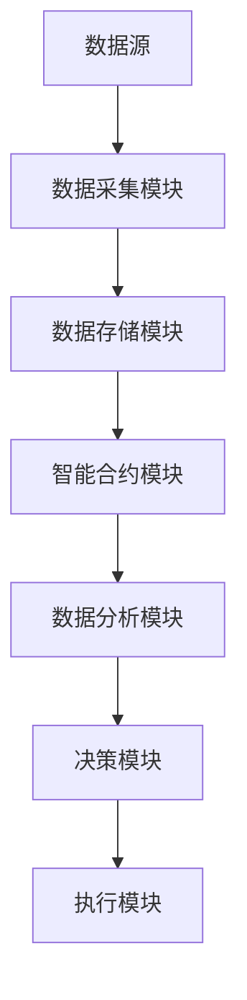
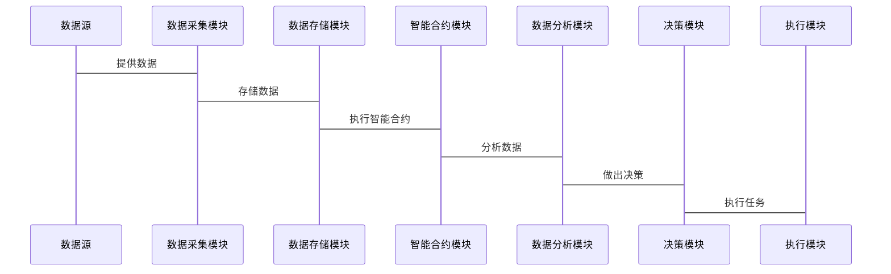

                 

# 企业AI Agent的区块链数据共享与隐私保护

> 关键词：企业AI Agent，区块链数据共享，隐私保护，分布式账本，智能合约，零知识证明

> 摘要：随着人工智能技术的快速发展，企业AI Agent在数据共享与隐私保护方面面临新的挑战。本文将从企业AI Agent的定义与背景出发，探讨区块链技术如何在数据共享中实现隐私保护，分析其技术原理、系统架构设计、项目实战案例，并展望未来的发展趋势。

---

# 第一部分：企业AI Agent的背景与概述

## 第1章：企业AI Agent的定义与背景

### 1.1 什么是企业AI Agent
企业AI Agent是一种能够自主执行任务、优化决策并与其他系统或用户交互的智能实体。它结合了人工智能、机器学习和自动化技术，旨在提高企业的运营效率和决策能力。

#### 1.1.1 AI Agent的基本概念
- AI Agent是具有感知环境、自主决策和执行任务能力的智能体。
- 企业AI Agent专注于企业级应用，如数据分析、流程自动化和客户服务。

#### 1.1.2 企业AI Agent的定义与特点
- **定义**：企业AI Agent是一种基于人工智能的自动化系统，用于企业内部或外部的数据处理和决策支持。
- **特点**：
  - 自主性：能够独立执行任务。
  - 智能性：基于数据和模型进行决策。
  - 可扩展性：能够适应不同规模和复杂度的企业需求。

#### 1.1.3 企业AI Agent的应用场景
- 数据分析与决策：通过AI Agent分析市场数据，优化企业战略。
- 流程自动化：自动化处理企业内部流程，提高效率。
- 客户服务：通过AI Agent提供个性化的客户支持。

### 1.2 区块链技术的概述
区块链是一种分布式账本技术，通过去中心化和加密技术确保数据的安全性和不可篡改性。

#### 1.2.1 区块链的基本概念
- 区块链是一种由多个区块组成的链式数据结构，每个区块包含交易记录和时间戳。
- 区块链通过共识机制（如PoW、PoS）确保数据的一致性。

#### 1.2.2 区块链在企业中的应用
- **数据共享**：区块链提供了一个安全、透明的数据共享平台。
- **信任机制**：通过去中心化技术建立信任，减少中间环节。
- **智能合约**：区块链上的智能合约可以自动执行合同条款，确保交易的透明性和可追溯性。

### 1.3 数据共享与隐私保护的重要性
数据共享是企业AI Agent的核心功能之一，但隐私保护是其面临的最大挑战。

#### 1.3.1 数据共享的必要性
- 数据共享能够提高企业的决策效率和数据利用率。
- 通过数据共享，企业可以更好地洞察市场趋势和客户需求。

#### 1.3.2 隐私保护的挑战
- 数据共享可能导致敏感信息泄露，引发隐私问题。
- 企业需要在数据共享和隐私保护之间找到平衡点。

#### 1.3.3 企业AI Agent与数据共享的关系
- 企业AI Agent通过区块链技术实现数据共享，同时确保数据隐私。
- 区块链的分布式账本和加密技术为数据共享提供了安全和隐私保护的双重保障。

---

# 第二部分：企业AI Agent的区块链数据共享技术原理

## 第3章：AI Agent与区块链的结合原理

### 3.1 AI Agent的工作机制
AI Agent通过感知环境、分析数据和执行任务来实现目标。

#### 3.1.1 AI Agent的核心功能
- 数据感知：通过传感器、API等方式获取数据。
- 数据分析：利用机器学习算法对数据进行分析和预测。
- 自主决策：基于分析结果做出决策并执行任务。

#### 3.1.2 AI Agent的决策过程
- 数据获取：从区块链或其他数据源获取数据。
- 数据分析：利用AI算法对数据进行处理和分析。
- 决策执行：根据分析结果执行相应的操作。

#### 3.1.3 AI Agent的交互方式
- **人机交互**：与用户进行对话或通过界面交互。
- **机机交互**：与其他系统或AI Agent进行数据交换和任务协作。

### 3.2 区块链技术在AI Agent中的应用
区块链技术为AI Agent提供了数据共享的安全性和隐私保护。

#### 3.2.1 区块链作为数据共享的底层架构
- 区块链的分布式特性确保数据的安全性和一致性。
- 通过区块链技术，AI Agent可以在多个节点之间共享数据，同时确保数据的不可篡改性。

#### 3.2.2 区块链的去中心化特性与AI Agent的结合
- 去中心化架构减少了单点故障的风险。
- 区块链的去中心化特性与AI Agent的自主性相辅相成，提高了系统的可靠性和安全性。

#### 3.2.3 区块链的智能合约与AI Agent的交互
- 智能合约是区块链上的自动执行脚本，可以用于数据共享的授权和访问控制。
- AI Agent可以通过智能合约与区块链进行交互，实现数据的自动共享和隐私保护。

---

## 第4章：区块链数据共享的隐私保护技术

### 4.1 数据加密技术
数据加密是区块链数据共享中常用的隐私保护技术。

#### 4.1.1 加密算法的基本原理
- 对称加密：如AES算法，加密和解密使用相同的密钥。
- 非对称加密：如RSA算法，加密和解密使用不同的密钥。

#### 4.1.2 加密在数据共享中的应用
- 数据在传输过程中进行加密，防止数据被截获。
- 数据存储时进行加密，确保只有授权用户能够访问。

#### 4.1.3 解密与隐私保护的平衡
- 需要确保加密强度与计算资源之间的平衡。
- 通过零知识证明等技术进一步增强隐私保护。

### 4.2 零知识证明
零知识证明是一种证明数据存在性而不泄露数据本身的技术。

#### 4.2.1 零知识证明的基本原理
- 零知识证明允许一方证明某项声明的真实性，而不透露任何额外信息。
- 通过零知识证明，可以在不泄露数据的情况下验证数据的正确性。

#### 4.2.2 零知识证明在数据共享中的应用
- 数据所有者可以通过零知识证明证明数据的存在性，而不透露数据内容。
- 在区块链中，零知识证明可以用于隐私保护，如隐藏交易金额。

#### 4.2.3 零知识证明的实现挑战
- 计算复杂性较高，需要优化算法以提高效率。
- 零知识证明的安全性依赖于数学模型的正确性。

---

# 第三部分：企业AI Agent的区块链数据共享系统架构设计

## 第5章：系统功能设计

### 5.1 系统功能模块
- 数据采集模块：从区块链或其他数据源采集数据。
- 数据分析模块：利用机器学习算法对数据进行分析和预测。
- 智能合约模块：用于数据共享的授权和访问控制。
- 数据存储模块：存储加密后的数据和区块链交易记录。

### 5.2 系统架构设计
- 分布式架构：基于区块链的分布式账本技术。
- 智能合约：用于数据共享的自动执行。

#### 5.2.1 系统架构图

### 5.3 系统接口设计
- 数据采集接口：用于从区块链或其他数据源获取数据。
- 数据存储接口：用于存储加密后的数据和区块链交易记录。
- 智能合约接口：用于与区块链进行交互，执行智能合约。

### 5.4 系统交互流程

---

# 第四部分：企业AI Agent的区块链数据共享项目实战

## 第6章：项目实战

### 6.1 环境安装
- 安装区块链框架（如Ethereum、Hyperledger）。
- 安装机器学习框架（如TensorFlow、PyTorch）。

### 6.2 核心实现
#### 6.2.1 数据采集与加密
- 使用Python编写数据采集脚本。
- 使用加密库（如cryptography）对数据进行加密。

#### 6.2.2 智能合约实现
- 使用Solidity编写智能合约。
- 部署智能合约到区块链网络。

#### 6.2.3 数据分析与决策
- 使用机器学习算法对加密数据进行分析和预测。
- 基于分析结果做出决策并执行任务。

### 6.3 案例分析
#### 6.3.1 医疗数据共享案例
- 数据源：医院的患者数据。
- 数据采集：通过区块链采集患者的医疗数据。
- 数据存储：加密后的数据存储在区块链上。
- 数据分析：利用AI Agent分析数据，提供诊断建议。

#### 6.3.2 供应链管理案例
- 数据源：供应链中的物流和库存数据。
- 数据采集：通过物联网设备采集数据。
- 数据存储：区块链存储物流和库存信息。
- 数据分析：AI Agent分析供应链数据，优化库存管理和物流调度。

---

# 第五部分：企业AI Agent的区块链数据共享法律与伦理

## 第7章：法律与伦理

### 7.1 数据共享的法律问题
- 数据隐私保护：GDPR等法规对企业数据共享的要求。
- 数据跨境传输：不同国家的法律法规对数据跨境传输的限制。

### 7.2 隐私保护的伦理挑战
- 数据共享可能引发的隐私泄露问题。
- 如何在数据共享和隐私保护之间找到平衡点。

### 7.3 技术与法律的平衡
- 技术手段（如零知识证明）如何辅助法律合规。
- 如何通过技术手段实现数据隐私保护的法律要求。

---

# 第六部分：企业AI Agent的区块链数据共享未来趋势

## 第8章：未来趋势

### 8.1 联邦学习
联邦学习是一种在分布式数据源上进行模型训练的技术。

#### 8.1.1 联邦学习的基本原理
- 数据不离开本地，通过加密通信进行模型训练。
- 联邦学习可以用于保护数据隐私。

#### 8.1.2 联邦学习在企业AI Agent中的应用
- 联邦学习可以用于多企业之间的数据共享和模型训练。
- 通过联邦学习，企业可以在不共享原始数据的情况下进行合作。

### 8.2 零知识证明的未来发展
- 零知识证明技术的优化和应用扩展。
- 零知识证明在数据共享和隐私保护中的更多场景应用。

### 8.3 数据共享的智能化
- 数据共享的智能化：通过AI Agent实现更智能的数据共享和隐私保护。
- 数据共享的自动化：通过智能合约实现数据共享的自动化管理。

---

# 附录：参考文献

1. 区块链技术入门与实践（书籍）。
2. 智能合约开发指南（书籍）。
3. 企业AI Agent的设计与实现（论文）。
4. 数据隐私保护的法律与伦理（论文）。

---

# 作者：AI天才研究院 & 禅与计算机程序设计艺术

---

以上内容为《企业AI Agent的区块链数据共享与隐私保护》的完整目录大纲及部分章节内容。希望对您有所帮助！

