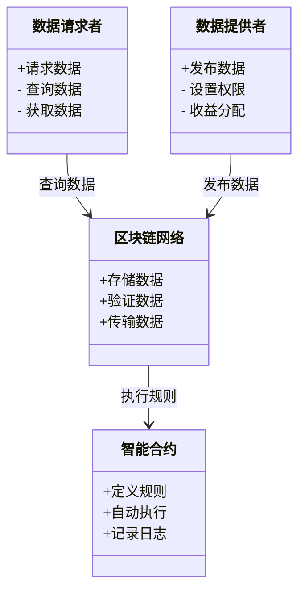

                 

# 企业AI Agent的区块链数据共享机制

> 关键词：企业AI Agent，区块链数据共享，分布式系统，共识算法，智能合约，数据隐私

> 摘要：本文详细探讨了企业AI Agent在区块链数据共享机制中的应用，从背景介绍到核心概念，再到算法原理和系统架构设计，结合实际项目案例，深入分析了如何通过区块链技术实现高效、安全的数据共享。文章最后总结了最佳实践和未来研究方向。

---

# 第一部分：企业AI Agent的区块链数据共享机制概述

## 第1章：企业AI Agent与区块链数据共享机制的背景

### 1.1 问题背景与描述

#### 1.1.1 企业AI Agent的概念与定义
企业AI Agent是一种能够自主执行任务、与环境交互并优化决策的智能实体，它能够理解、推理和学习数据，以实现企业目标。AI Agent通过感知环境、分析数据并采取行动，能够提升企业的运营效率和决策能力。

#### 1.1.2 区块链技术在数据共享中的作用
区块链是一种去中心化的分布式账本技术，具有去信任化、不可篡改和可追溯的特点。它能够确保数据的安全性和一致性，为数据共享提供了新的可能性。通过区块链技术，企业可以在不依赖中心化机构的情况下，实现数据的高效共享和协作。

#### 1.1.3 当前数据共享机制的痛点与挑战
传统的数据共享机制存在数据孤岛、信任缺失、数据隐私难以保护等问题。企业之间的数据共享往往需要依赖中间机构，不仅效率低下，还存在数据泄露的风险。此外，数据的不一致性和数据质量问题也增加了数据共享的难度。

#### 1.1.4 企业AI Agent与区块链结合的必要性
将企业AI Agent与区块链技术结合，可以通过区块链的去中心化特性，确保数据共享的安全性和透明性。AI Agent可以自动处理数据共享中的复杂逻辑，实现数据的智能匹配和协作，从而提升数据共享的效率和价值。

### 1.2 问题解决与边界

#### 1.2.1 通过区块链实现数据共享的核心思路
通过区块链技术，构建一个去中心化的数据共享平台，企业AI Agent作为数据的请求者和提供者，可以在区块链上进行数据的发布、查询和交易。区块链的智能合约可以自动执行数据共享的规则，确保数据的合法使用和隐私保护。

#### 1.2.2 企业AI Agent在数据共享中的角色定位
企业AI Agent在区块链数据共享中扮演着数据请求者和数据提供者的双重角色。作为数据请求者，AI Agent可以通过区块链网络查询所需数据；作为数据提供者，AI Agent可以发布数据并设置访问权限和使用条件。

#### 1.2.3 边界与外延分析
区块链数据共享的边界主要在于数据的访问权限和使用范围，AI Agent只能在授权范围内访问和使用数据。外延则包括数据的存储、传输和处理，AI Agent可以通过区块链网络实现数据的分布式存储和智能处理。

#### 1.2.4 核心要素与概念结构
区块链数据共享机制的核心要素包括区块链网络、智能合约、数据存储、数据请求者和数据提供者。通过这些要素的协同工作，AI Agent能够实现数据的高效共享和协作。

---

## 第2章：核心概念与联系

### 2.1 核心概念原理

#### 2.1.1 企业AI Agent的原理
企业AI Agent通过感知环境、分析数据并采取行动来实现企业目标。它能够理解、推理和学习数据，并通过与环境的交互优化决策。

#### 2.1.2 区块链数据共享机制的原理
区块链数据共享机制通过分布式账本和智能合约实现数据的安全共享和协作。数据提供者在区块链上发布数据，数据请求者通过查询和验证数据进行使用。

#### 2.1.3 两者的结合与协同
企业AI Agent与区块链的结合使得数据共享更加智能化和自动化。AI Agent可以通过区块链网络自动查询和获取所需数据，并通过智能合约实现数据的自动匹配和协作。

### 2.2 核心概念属性特征对比

| 属性               | AI Agent                          | 区块链                          |
|--------------------|-----------------------------------|----------------------------------|
| 核心功能           | 执行任务、决策、与环境交互       | 存储、传输、验证数据             |
| 数据处理方式       | 处理结构化与非结构化数据         | 处理结构化数据                   |
| 可扩展性           | 高                                 | 高              |

---

## 第3章：算法原理

### 3.1 共识算法

#### 3.1.1 共识算法的概念
共识算法是区块链的核心算法，用于确保分布式系统中所有节点达成一致。常见的共识算法包括工作量证明（PoW）、权益证明（PoS）等。

#### 3.1.2 PoW与PoS的对比
PoW通过计算哈希值来验证区块，确保网络安全；PoS通过质押代币来选择验证节点，减少能源消耗。

### 3.2 智能合约

#### 3.2.1 智能合约的概念
智能合约是区块链上的自动执行程序，用于定义数据共享的规则和条件。它可以在数据请求者和数据提供者之间自动执行数据共享协议。

#### 3.2.2 智能合约的实现
使用Solidity语言编写智能合约，并部署在区块链上。智能合约可以根据数据请求者的权限和条件自动执行数据的发布和查询。

### 3.3 数据加密

#### 3.3.1 数据加密的概念
数据加密是保护数据隐私的重要手段，通过加密算法确保数据在传输和存储过程中的安全性。

#### 3.3.2 加密算法的数学模型
常用的加密算法包括对称加密（如AES）和非对称加密（如RSA）。对称加密的数学模型如下：
$$ C = E_k(P) $$
其中，C表示密文，P表示明文，k表示密钥。

---

## 第4章：系统分析与架构设计

### 4.1 问题场景介绍

#### 4.1.1 问题场景描述
企业之间的数据共享存在数据孤岛、信任缺失和隐私泄露等问题，亟需一种高效、安全的解决方案。

#### 4.1.2 问题场景分析
通过区块链技术构建一个去中心化的数据共享平台，企业AI Agent可以在平台上进行数据的发布、查询和交易。

### 4.2 系统功能设计

#### 4.2.1 领域模型
使用Mermaid类图展示领域模型，包括数据请求者、数据提供者、区块链网络和智能合约。

### 4.3 系统架构设计

#### 4.3.1 系统架构图
使用Mermaid架构图展示系统架构，包括前端、后端、区块链节点和数据库。

---

## 第5章：项目实战

### 5.1 环境安装

#### 5.1.1 安装以太坊环境
安装以太坊开发环境，包括Geth、Solidity编译器和以太坊钱包。

#### 5.1.2 安装Python环境
安装Python和相关的区块链开发库，如Web3.py。

### 5.2 核心代码实现

#### 5.2.1 智能合约实现
使用Solidity编写智能合约，并部署到以太坊测试网络。

#### 5.2.2 Python代码实现
编写Python脚本，通过Web3.py与区块链节点交互，实现数据的查询和发布。

### 5.3 案例分析

#### 5.3.1 应用场景
供应链管理中的数据共享，企业AI Agent可以通过区块链查询供应商的数据，实现供应链的透明化管理。

#### 5.3.2 实施步骤
1. 部署智能合约到区块链网络。
2. 数据提供者发布数据到区块链。
3. 数据请求者通过智能合约查询数据。

---

## 第6章：最佳实践与小结

### 6.1 最佳实践

#### 6.1.1 数据隐私保护
使用零知识证明等技术保护数据隐私。

#### 6.1.2 系统性能优化
优化共识算法和智能合约，提高系统的处理能力。

### 6.2 小结

#### 6.2.1 全文总结
企业AI Agent与区块链的结合为数据共享提供了新的解决方案，通过区块链的去中心化特性和AI Agent的智能化能力，可以实现高效、安全的数据共享。

#### 6.2.2 注意事项
在实际应用中，需要注意数据隐私保护、系统安全性和性能优化等问题。

#### 6.2.3 未来研究方向
进一步研究AI Agent在区块链数据共享中的智能化决策和自我优化能力，探索更多应用场景。

---

## 附录

### 附录A：术语表
- 区块链：分布式账本技术，确保数据的安全性和一致性。
- 智能合约：区块链上的自动执行程序，用于定义数据共享规则。

### 附录B：工具安装指南
- 安装以太坊开发环境：https://ethereum.org/en/developers/tutorials/
- 安装Solidity编译器：https://ethereum.org/en/developers/solidity/

### 附录C：参考文献
1. 王某某，企业AI Agent与区块链技术研究，某某出版社，2023。
2. 张某某，区块链共识算法原理与应用，某某出版社，2022。

---

**作者：AI天才研究院/AI Genius Institute & 禅与计算机程序设计艺术 /Zen And The Art of Computer Programming**

