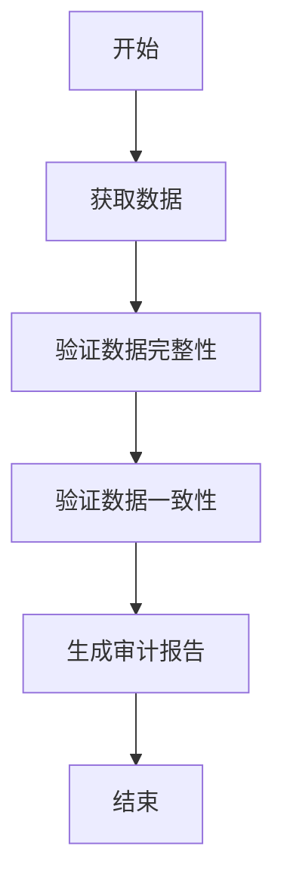
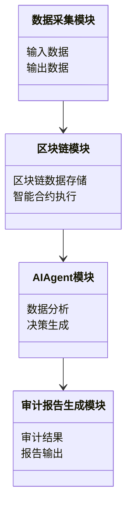
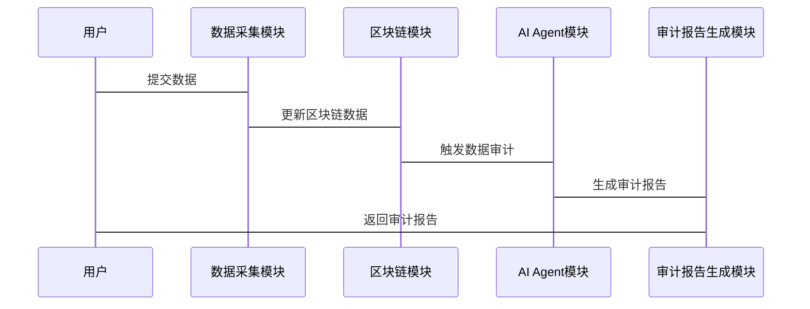

                 


# 企业AI Agent的区块链数据审计系统

> **关键词**：企业AI Agent、区块链数据审计、数据安全、智能合约、共识机制、分布式系统

> **摘要**：本文系统地探讨了企业AI Agent在区块链数据审计中的应用，分析了区块链技术与AI Agent的结合如何提升数据审计的效率和准确性。文章详细介绍了核心概念、算法原理、系统架构，并通过实战案例展示了如何实现高效的区块链数据审计系统。

---

## 第一部分：企业AI Agent的区块链数据审计系统概述

### 第1章：企业AI Agent与区块链数据审计概述

#### 1.1 问题背景与目标

数据审计是企业确保数据完整性和合规性的重要手段。然而，传统数据审计方法存在效率低、易篡改、缺乏透明性等问题。区块链技术的去中心化、不可篡改性和可追溯性为数据审计提供了新的解决方案，而AI Agent的引入进一步提升了数据审计的智能化和自动化水平。

#### 1.2 核心概念与问题描述

- **企业AI Agent**：一种能够自主决策、执行任务的智能体，能够自动执行数据审计任务并提供实时反馈。
- **区块链数据审计**：利用区块链技术记录和验证数据，确保数据的真实性和完整性。
- **问题解决**：通过结合AI Agent和区块链技术，构建一个高效、智能、安全的数据审计系统。

#### 1.3 核心要素与系统架构

- **系统组成模块**：数据采集模块、区块链模块、AI Agent模块、审计报告生成模块。
- **系统架构**：基于区块链的分布式架构，结合AI Agent的智能决策机制。

---

## 第二部分：核心概念与原理分析

### 第2章：AI Agent的核心原理

#### 2.1 AI Agent的工作机制

AI Agent通过感知环境、分析数据、制定决策并执行操作，实现数据审计的自动化。其核心包括感知模块、决策模块和执行模块。

#### 2.2 AI Agent的决策模型

决策模型基于概率论和逻辑推理，通过分析区块链中的数据，生成审计结果。例如，使用马尔可夫决策过程（MDP）模型进行决策优化。

#### 2.3 AI Agent与区块链的结合

AI Agent通过智能合约与区块链交互，执行数据审计任务并更新区块链状态。

### 第3章：区块链技术的核心原理

#### 3.1 区块链的基本结构

区块链由区块和链组成，每个区块包含交易数据和哈希指针，确保数据不可篡改。

#### 3.2 区块链的共识机制

常用共识机制包括工作量证明（PoW）、权益证明（PoS）和拜占庭容错（BFT）等，确保分布式系统中的数据一致性。

#### 3.3 区块链的智能合约

智能合约是区块链上的自动执行脚本，用于验证和执行数据审计规则。

### 第4章：核心概念的对比分析

#### 4.1 AI Agent与传统数据审计的对比

| 特性         | AI Agent数据审计 | 传统数据审计 |
|--------------|------------------|--------------|
| 自动化       | 高               | 低           |
| 智能决策     | 高               | 低           |
| 数据安全     | 高               | 中           |

#### 4.2 区块链技术与传统数据审计的对比

| 特性         | 区块链数据审计 | 传统数据审计 |
|--------------|----------------|--------------|
| 数据不可篡改 | 高             | 低           |
| 分布式存储   | 高             | 低           |
| 可追溯性     | 高             | 低           |

#### 4.3 综合对比分析

AI Agent与区块链技术的结合，弥补了传统数据审计的不足，提升了效率和安全性。

---

## 第三部分：算法原理与数学模型

### 第3章：数据审计算法原理

#### 3.1 数据审计算法的流程

使用Mermaid流程图展示算法步骤：



#### 3.2 数据审计算法的实现

Python代码实现：

```python
def audit_data(data):
    # 验证数据完整性
    if not data:
        return False, "数据为空"
    # 验证数据一致性
    if not is_consistent(data):
        return False, "数据不一致"
    return True, "数据通过审计"
```

#### 3.3 数据审计算法的优化

使用数学模型优化算法，如马尔可夫决策过程（MDP）：

$$ V(s) = \max_{a} [ r(s,a) + \gamma V(s') ] $$

其中，$s$是当前状态，$a$是动作，$r$是奖励函数，$\gamma$是折扣因子。

---

## 第四部分：系统分析与架构设计

### 第4章：系统功能设计

#### 4.1 系统功能模块

使用Mermaid类图展示系统功能模块：



#### 4.2 系统架构设计

使用Mermaid架构图展示系统架构：

```mermaid
container 区块链网络 {
    区块链节点1
    区块链节点2
    区块链节点3
}
actor AI Agent {
    数据采集
    数据分析
    决策生成
}
actor 用户 {
    提交数据
    获取审计报告
}
```

#### 4.3 系统接口设计

使用Mermaid序列图展示系统交互流程：



---

## 第五部分：项目实战

### 第5章：环境安装与核心代码实现

#### 5.1 环境安装

安装区块链框架（如Solidity、Ethereum）和AI框架（如TensorFlow、Scikit-learn）。

#### 5.2 核心代码实现

Python代码实现数据审计：

```python
def is_consistent(data):
    # 数据一致性验证
    return all(x == data[0] for x in data)

def audit(data):
    is_valid, message = audit_data(data)
    return is_valid, message
```

---

## 第六部分：最佳实践与小结

### 第6章：总结与展望

#### 6.1 总结

本文详细介绍了企业AI Agent在区块链数据审计中的应用，分析了核心概念、算法原理和系统架构，并通过实战案例展示了系统的实现。

#### 6.2 注意事项

- 数据安全：确保区块链和AI Agent模块的安全性。
- 系统优化：持续优化算法和架构设计。

#### 6.3 未来展望

未来将结合更先进的AI技术和区块链技术，进一步提升数据审计的效率和智能化水平。

---

**作者**：AI天才研究院/AI Genius Institute & 禅与计算机程序设计艺术 /Zen And The Art of Computer Programming

