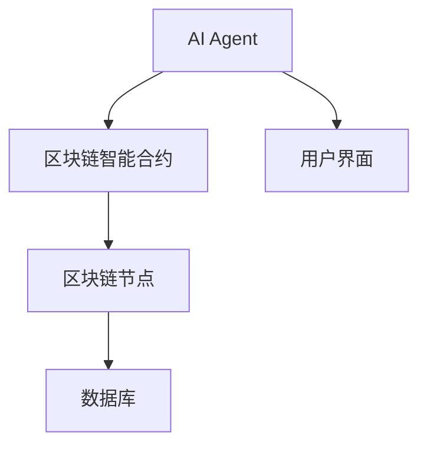

                 


# 企业AI Agent的区块链智能合约应用

> 关键词：AI Agent, 区块链, 智能合约, 企业应用, 去中心化, 智能合约安全, 人工智能

> 摘要：本文深入探讨了企业AI Agent与区块链智能合约的结合，分析了AI Agent在区块链环境中的应用优势，详细讲解了区块链智能合约的设计原理和实现方法。通过实际案例分析，展示了AI Agent如何利用区块链智能合约实现高效、安全的企业级应用，并提出了未来的发展方向和优化建议。

---

# 第1章: 企业AI Agent与区块链智能合约概述

## 1.1 企业AI Agent的定义与特点

### 1.1.1 AI Agent的基本概念

AI Agent（人工智能代理）是指能够感知环境、自主决策并执行任务的智能实体。它具备以下特点：
- **自主性**：能够独立决策和行动。
- **反应性**：能够实时感知环境并做出反应。
- **主动性**：主动采取行动以实现目标。
- **学习能力**：通过数据和经验不断优化自身行为。

### 1.1.2 企业AI Agent的核心特点

在企业环境中，AI Agent通常具备以下特点：
- **智能化**：通过机器学习和自然语言处理技术，实现复杂决策。
- **协作性**：能够与其他AI Agent或人类进行协作。
- **可扩展性**：能够处理大规模的企业级任务。
- **安全性**：具备数据保护和隐私维护能力。

### 1.1.3 企业AI Agent与传统AI的区别

传统AI通常是指静态的算法或工具，而企业AI Agent是一种动态的、自主的智能实体，能够适应环境变化并执行复杂任务。企业AI Agent的特点在于其自主性、协作性和实时性。

---

## 1.2 区块链智能合约的定义与特点

### 1.2.1 区块链的基本概念

区块链是一种去中心化的分布式账本技术，通过密码学和共识机制确保数据的安全性和不可篡改性。区块链的核心特点包括：
- **去中心化**：没有单点控制，数据分布存储。
- **不可篡改**：数据一旦写入区块链，无法被修改。
- **透明性**：所有交易记录对参与者公开可见。

### 1.2.2 智能合约的核心原理

智能合约是区块链上的可执行代码，用于自动执行合同条款。它运行在区块链节点上，通过预设的条件触发执行，确保合约的自动履行。智能合约的特点包括：
- **自动化**：无需人工干预即可执行。
- **安全性**：通过区块链的安全机制保障合约的安全性。
- **不可篡改性**：智能合约一旦部署，无法被修改。

### 1.2.3 区块链智能合约的特点

在企业应用中，区块链智能合约具备以下特点：
- **信任机制**：通过区块链技术建立信任，减少中间环节。
- **高效性**：智能合约能够快速执行，降低交易成本。
- **灵活性**：可以根据企业需求定制合约逻辑。

---

## 1.3 企业AI Agent与区块链智能合约的结合

### 1.3.1 结合的背景与意义

随着企业智能化转型的推进，AI Agent在企业中的应用越来越广泛。然而，传统的AI Agent依赖中心化的服务器，存在单点故障和数据安全风险。区块链技术的去中心化特性为企业AI Agent提供了更安全、更可靠的运行环境。

### 1.3.2 企业AI Agent在区块链中的应用场景

企业AI Agent可以应用于多个领域，例如：
- **供应链管理**：通过区块链智能合约实现供应链的自动化管理。
- **金融交易**：利用智能合约实现自动化的金融交易和结算。
- **智能合约的安全性与合规性**：确保智能合约的执行符合相关法律法规。

### 1.3.3 区块链智能合约对企业AI Agent的支持

区块链智能合约为企业AI Agent提供了以下支持：
- **去中心化的运行环境**：确保AI Agent的安全运行。
- **自动化的执行机制**：支持AI Agent的智能决策和行动。
- **信任与透明性**：增强企业对AI Agent的信任。

---

## 1.4 企业AI Agent与区块链智能合约的结合模型

### 1.4.1 结合模型的结构与功能

企业AI Agent与区块链智能合约的结合模型通常包括以下部分：
- **AI Agent**：负责感知环境、决策和行动。
- **区块链智能合约**：负责执行AI Agent的决策，并确保执行的可靠性和安全性。
- **交互接口**：AI Agent与智能合约之间的通信接口。

### 1.4.2 模型中的关键组件与交互

关键组件包括：
- **AI Agent**：具备感知、决策和执行功能。
- **智能合约**：部署在区块链上，负责执行AI Agent的决策。
- **区块链网络**：提供去中心化的存储和计算环境。

交互流程如下：
1. AI Agent感知环境并做出决策。
2. AI Agent通过交互接口向智能合约发送指令。
3. 智能合约在区块链上执行指令，确保执行的正确性和安全性。
4. 执行结果反馈给AI Agent，形成闭环。

### 1.4.3 模型的扩展性与灵活性

结合模型具备良好的扩展性和灵活性，可以通过增加新的智能合约或AI Agent来扩展功能。同时，区块链的可编程性使得模型能够适应不同的企业需求。

---

## 1.5 小结

本章介绍了企业AI Agent和区块链智能合约的基本概念，分析了它们的结合背景和意义，并提出了结合模型。通过这种结合，企业AI Agent可以在区块链的支持下实现更高效、更安全的应用。

---

## 1.6 最佳实践与注意事项

- **安全性**：在设计智能合约时，必须确保其逻辑的正确性和安全性，防止漏洞攻击。
- **合规性**：企业AI Agent的应用必须符合相关法律法规，确保合规性。
- **可扩展性**：在设计结合模型时，应考虑系统的可扩展性和灵活性，以便未来功能的扩展。

---

## 1.7 拓展阅读

- 推荐阅读《区块链技术及应用》和《人工智能：一种现代的方法》以深入理解区块链和AI Agent的核心技术。

---

# 第2章: 企业AI Agent的背景与问题分析

## 2.1 企业AI Agent的应用背景

### 2.1.1 当前企业智能化转型的趋势

随着人工智能技术的快速发展，企业智能化转型已成为必然趋势。企业通过引入AI Agent，可以提高运营效率、降低成本，并增强客户体验。

### 2.1.2 AI Agent在企业中的潜在价值

AI Agent可以在企业中应用于多个领域，例如：
- **客户服务**：通过智能客服系统提供24/7的客户服务。
- **供应链管理**：优化供应链流程，提高效率。
- **风险管理**：通过智能监控系统预防和应对风险。

---

## 2.2 区块链技术对企业AI Agent的支持

### 2.2.1 区块链技术的核心优势

区块链技术为企业AI Agent提供了以下优势：
- **去中心化**：消除单点故障，提高系统的安全性。
- **透明性**：所有交易记录公开透明，增强信任。
- **自动化**：智能合约可以自动执行，减少人工干预。

### 2.2.2 区块链在企业AI Agent中的应用优势

区块链在企业AI Agent中的应用优势包括：
- **数据安全**：区块链的不可篡改性确保数据的安全。
- **信任机制**：通过区块链建立信任，减少中间环节。
- **高效性**：智能合约的自动化执行提高效率。

---

## 2.3 企业AI Agent与区块链智能合约结合的必要性

### 2.3.1 传统AI Agent的局限性

传统AI Agent通常依赖中心化的服务器，存在以下问题：
- **单点故障**：服务器故障可能导致整个系统瘫痪。
- **数据安全风险**：数据集中存储容易被攻击。

### 2.3.2 区块链智能合约对企业AI Agent的支持作用

通过结合区块链智能合约，企业AI Agent可以克服传统模式的局限性：
- **去中心化**：消除单点故障，提高系统的安全性。
- **自动化**：智能合约自动执行，提高效率。
- **信任与透明性**：区块链的特性增强企业的信任和透明度。

---

## 2.4 小结

本章分析了企业AI Agent的应用背景和区块链技术的支持作用，探讨了结合区块链智能合约的必要性。通过这种结合，企业可以实现更高效、更安全的智能化转型。

---

## 2.5 最佳实践与注意事项

- **数据安全**：在设计区块链智能合约时，必须确保数据的安全性和隐私性。
- **合规性**：企业AI Agent的应用必须符合相关法律法规，确保合规性。
- **系统设计**：在设计结合模型时，应考虑系统的可扩展性和灵活性。

---

## 2.6 拓展阅读

- 推荐阅读《区块链技术及应用》和《人工智能：一种现代的方法》以深入理解区块链和AI Agent的核心技术。

---

# 第3章: 企业AI Agent与区块链智能合约的核心概念

## 3.1 AI Agent的核心概念

### 3.1.1 AI Agent的组成与功能

AI Agent通常由以下部分组成：
- **感知层**：通过传感器或其他数据源感知环境。
- **决策层**：基于感知数据进行分析和决策。
- **执行层**：根据决策结果执行具体操作。

### 3.1.2 AI Agent的决策机制

AI Agent的决策机制通常包括：
- **规则引擎**：基于预设的规则进行决策。
- **机器学习模型**：通过训练模型进行预测和决策。
- **强化学习**：通过与环境的交互不断优化决策策略。

### 3.1.3 AI Agent的通信与协作

AI Agent可以通过以下方式实现通信与协作：
- **消息传递**：通过消息队列实现通信。
- **服务调用**：通过API实现服务调用。
- **事件驱动**：通过事件监听实现协作。

---

## 3.2 区块链智能合约的核心概念

### 3.2.1 智能合约的执行流程

智能合约的执行流程通常包括：
1. **触发条件**：当满足预设条件时，智能合约开始执行。
2. **状态检查**：检查当前系统状态，确保合约的正确执行。
3. **执行操作**：根据合约逻辑执行具体操作。
4. **结果记录**：将执行结果记录在区块链上。

### 3.2.2 智能合约的编程模型

智能合约的编程模型通常包括：
- **状态变量**：用于存储合约的状态。
- **函数**：用于实现合约的逻辑。
- **事件**：用于触发外部操作。

### 3.2.3 智能合约的安全性与可靠性

智能合约的安全性与可靠性是区块链应用的关键。为了确保智能合约的安全性，需要：
- **代码审计**：通过代码审计发现潜在漏洞。
- **形式化验证**：通过形式化验证确保合约逻辑的正确性。
- **漏洞修复**：及时修复已知漏洞。

---

## 3.3 企业AI Agent与区块链智能合约的结合模型

### 3.3.1 结合模型的结构与功能

结合模型通常包括以下部分：
- **AI Agent**：负责感知环境、决策和行动。
- **智能合约**：负责执行AI Agent的决策，并确保执行的可靠性和安全性。
- **交互接口**：AI Agent与智能合约之间的通信接口。

### 3.3.2 模型中的关键组件与交互

关键组件包括：
- **AI Agent**：具备感知、决策和执行功能。
- **智能合约**：部署在区块链上，负责执行AI Agent的决策。
- **区块链网络**：提供去中心化的存储和计算环境。

交互流程如下：
1. AI Agent感知环境并做出决策。
2. AI Agent通过交互接口向智能合约发送指令。
3. 智能合约在区块链上执行指令，确保执行的正确性和安全性。
4. 执行结果反馈给AI Agent，形成闭环。

---

## 3.4 小结

本章详细介绍了企业AI Agent和区块链智能合约的核心概念，并提出了结合模型。通过这种结合，企业AI Agent可以在区块链的支持下实现更高效、更安全的应用。

---

## 3.5 最佳实践与注意事项

- **安全性**：在设计智能合约时，必须确保其逻辑的正确性和安全性，防止漏洞攻击。
- **合规性**：企业AI Agent的应用必须符合相关法律法规，确保合规性。
- **可扩展性**：在设计结合模型时，应考虑系统的可扩展性和灵活性，以便未来功能的扩展。

---

## 3.6 拓展阅读

- 推荐阅读《区块链技术及应用》和《人工智能：一种现代的方法》以深入理解区块链和AI Agent的核心技术。

---

# 第4章: 企业AI Agent与区块链智能合约的核心原理

## 4.1 AI Agent的核心算法原理

### 4.1.1 基于强化学习的决策算法

强化学习是一种通过试错优化决策策略的方法。AI Agent通过与环境的交互，不断优化自身的决策策略。强化学习的核心算法包括Q-learning和Deep Q-Network（DQN）。

### 4.1.2 基于图神经网络的知识表示

图神经网络是一种处理图结构数据的深度学习模型。AI Agent可以通过图神经网络构建知识图谱，实现知识的表示和推理。

### 4.1.3 基于多智能体的协作机制

多智能体协作机制是指多个AI Agent协同工作，共同完成复杂任务。常见的协作机制包括基于分布式计算的协作和基于博弈论的协作。

---

## 4.2 区块链智能合约的核心算法原理

### 4.2.1 智能合约的执行环境

智能合约的执行环境通常包括：
- **虚拟机**：用于执行智能合约代码。
- **区块链网络**：提供分布式存储和计算环境。

### 4.2.2 智能合约的状态管理

智能合约的状态管理通常包括：
- **状态变量**：用于存储合约的状态。
- **状态更新**：根据合约逻辑更新状态变量。
- **状态查询**：允许其他节点查询合约的状态。

### 4.2.3 智能合约的事务处理

智能合约的事务处理包括：
- **事务发起**：用户或AI Agent发起事务请求。
- **事务验证**：区块链节点验证事务的合法性。
- **事务执行**：智能合约执行事务逻辑。
- **事务记录**：将事务记录在区块链上。

---

## 4.3 企业AI Agent与区块链智能合约的结合原理

### 4.3.1 AI Agent的感知与决策

AI Agent通过感知环境并做出决策，然后通过交互接口向智能合约发送指令。智能合约在区块链上执行指令，确保执行的正确性和安全性。

### 4.3.2 智能合约的安全性与可靠性

智能合约的安全性与可靠性是结合模型的关键。通过代码审计、形式化验证和漏洞修复等手段，确保智能合约的逻辑正确性和安全性。

---

## 4.4 小结

本章详细讲解了企业AI Agent和区块链智能合约的核心算法原理，并分析了它们的结合原理。通过这种结合，企业AI Agent可以在区块链的支持下实现更高效、更安全的应用。

---

## 4.5 最佳实践与注意事项

- **算法优化**：在设计AI Agent的算法时，应考虑算法的效率和可扩展性。
- **安全性**：在设计智能合约时，必须确保其逻辑的正确性和安全性，防止漏洞攻击。
- **系统设计**：在设计结合模型时，应考虑系统的可扩展性和灵活性，以便未来功能的扩展。

---

## 4.6 拓展阅读

- 推荐阅读《区块链技术及应用》和《人工智能：一种现代的方法》以深入理解区块链和AI Agent的核心技术。

---

# 第5章: 企业AI Agent与区块链智能合约的安全性与合规性

## 5.1 安全性分析

### 5.1.1 智能合约的安全性挑战

智能合约的安全性挑战包括：
- **代码漏洞**：智能合约代码可能存在逻辑漏洞或安全漏洞。
- **恶意攻击**：攻击者可能通过漏洞攻击智能合约。
- **数据泄露**：智能合约的数据可能被非法获取或篡改。

### 5.1.2 企业AI Agent的安全性保障

企业AI Agent的安全性保障措施包括：
- **数据加密**：对敏感数据进行加密处理。
- **身份认证**：通过身份认证确保只有授权用户可以访问系统。
- **访问控制**：通过访问控制策略限制用户的权限。

---

## 5.2 合规性分析

### 5.2.1 智能合约的合规性挑战

智能合约的合规性挑战包括：
- **法律法规**：智能合约的执行必须符合相关法律法规。
- **监管要求**：企业需要遵守监管机构的要求。
- **隐私保护**：智能合约的执行必须保护用户隐私。

### 5.2.2 企业AI Agent的合规性保障

企业AI Agent的合规性保障措施包括：
- **合规性审查**：在设计智能合约时，进行合规性审查。
- **合规性监控**：通过监控系统确保智能合约的合规性。
- **合规性报告**：定期生成合规性报告，供监管机构审查。

---

## 5.3 小结

本章分析了企业AI Agent与区块链智能合约的安全性与合规性，提出了保障措施。通过这些措施，可以确保结合模型的安全性和合规性。

---

## 5.4 最佳实践与注意事项

- **安全性保障**：在设计智能合约时，必须确保其逻辑的正确性和安全性，防止漏洞攻击。
- **合规性保障**：企业AI Agent的应用必须符合相关法律法规，确保合规性。
- **系统设计**：在设计结合模型时，应考虑系统的可扩展性和灵活性，以便未来功能的扩展。

---

## 5.5 拓展阅读

- 推荐阅读《区块链技术及应用》和《人工智能：一种现代的方法》以深入理解区块链和AI Agent的核心技术。

---

# 第6章: 企业AI Agent与区块链智能合约的项目实战

## 6.1 项目背景与目标

### 6.1.1 项目背景

本项目旨在通过结合企业AI Agent和区块链智能合约，实现一个高效的供应链管理系统。系统将利用AI Agent进行供应链优化，通过区块链智能合约实现自动化的订单处理和支付结算。

### 6.1.2 项目目标

项目目标包括：
- **实现供应链优化**：通过AI Agent优化供应链流程，提高效率。
- **实现智能订单处理**：通过区块链智能合约实现订单的自动处理和支付结算。
- **实现数据安全与透明**：通过区块链技术确保数据的安全与透明。

---

## 6.2 项目环境与工具

### 6.2.1 开发环境

开发环境包括：
- **操作系统**：Linux/Windows/MacOS。
- **编程语言**：Solidity（智能合约）、Python（AI Agent）。
- **区块链平台**：以太坊、Hyperledger Fabric。

### 6.2.2 工具与库

工具与库包括：
- **智能合约开发工具**：Solidity编译器、 Remix。
- **区块链节点管理工具**：Geth、Hyperledger Composer。
- **AI Agent开发库**：TensorFlow、Keras。

---

## 6.3 系统功能设计

### 6.3.1 领域模型设计

领域模型设计包括：
- **供应商**：供应商信息管理。
- **客户**：客户信息管理。
- **订单**：订单信息管理。
- **物流**：物流信息管理。

### 6.3.2 系统功能模块

系统功能模块包括：
- **订单管理模块**：处理订单的创建、修改和取消。
- **支付结算模块**：处理订单的支付和结算。
- **物流管理模块**：监控物流状态，优化物流路径。
- **数据分析模块**：分析供应链数据，优化供应链流程。

---

## 6.4 系统架构设计

### 6.4.1 系统架构图

系统架构图如下：



### 6.4.2 关键接口设计

关键接口设计包括：
- **AI Agent接口**：AI Agent与智能合约之间的通信接口。
- **智能合约接口**：智能合约与区块链节点之间的通信接口。
- **用户界面接口**：用户与系统之间的交互接口。

---

## 6.5 项目实现与代码解读

### 6.5.1 智能合约实现

智能合约实现代码如下（Solidity）：

```solidity
// SPDX-License-Identifier: MIT
pragma solidity ^0.8.0;

contract SupplyChain {
    address payable public supplier;
    address payable public customer;
    
    function setSupplier(address payable _supplier) public {
        supplier = _supplier;
    }
    
    function setCustomer(address payable _customer) public {
        customer = _customer;
    }
    
    function processOrder(uint amount) public {
        require(msg.sender == supplier || msg.sender == customer);
        if (msg.sender == supplier) {
            supplier.transfer(amount);
        } else {
            customer.transfer(amount);
        }
    }
}
```

### 6.5.2 AI Agent实现

AI Agent实现代码如下（Python）：

```python
class AI-Agent:
    def __init__(self):
        self.supplier = None
        self.customer = None
        self.order_amount = 0
    
    def感知环境(self):
        # 感知环境，获取订单信息
        pass
    
    def做决策(self):
        # 根据订单信息做出决策
        pass
    
    def执行操作(self):
        # 根据决策结果执行操作
        pass
}
```

---

## 6.6 项目小结

本章通过实际案例分析，展示了企业AI Agent与区块链智能合约的结合应用。通过项目实战，读者可以更好地理解结合模型的设计与实现。

---

## 6.7 最佳实践与注意事项

- **代码规范**：在编写智能合约和AI Agent代码时，必须遵循代码规范，确保代码的可读性和可维护性。
- **测试与调试**：在开发过程中，必须进行充分的测试与调试，确保系统的正确性和稳定性。
- **系统优化**：在系统上线后，应定期进行系统优化，提高系统的性能和效率。

---

## 6.8 拓展阅读

- 推荐阅读《区块链技术及应用》和《人工智能：一种现代的方法》以深入理解区块链和AI Agent的核心技术。

---

# 第7章: 企业AI Agent与区块链智能合约的未来展望

## 7.1 技术发展趋势

### 7.1.1 AI Agent的技术发展趋势

AI Agent的技术发展趋势包括：
- **强化学习**：通过强化学习优化AI Agent的决策策略。
- **多智能体协作**：通过多智能体协作实现更复杂的任务。
- **边缘计算**：通过边缘计算提高AI Agent的实时性和响应速度。

### 7.1.2 区块链技术的发展趋势

区块链技术的发展趋势包括：
- **可扩展性**：通过技术创新提高区块链的可扩展性。
- **隐私保护**：通过隐私保护技术确保数据的安全性。
- **智能合约优化**：通过优化智能合约的执行效率和安全性。

---

## 7.2 结合模型的未来优化方向

### 7.2.1 系统性能优化

系统性能优化方向包括：
- **算法优化**：通过优化AI Agent和智能合约的算法提高系统的性能。
- **并行计算**：通过并行计算提高系统的处理能力。
- **分布式架构**：通过分布式架构提高系统的可扩展性。

### 7.2.2 安全性与合规性优化

安全性与合规性优化方向包括：
- **漏洞修复**：通过定期漏洞扫描和修复确保智能合约的安全性。
- **合规性审查**：通过定期合规性审查确保系统的合规性。
- **隐私保护**：通过隐私保护技术确保数据的安全性和隐私性。

---

## 7.3 小结

本章展望了企业AI Agent与区块链智能合约的未来发展趋势，并提出了系统的优化方向。通过技术创新和优化，结合模型将具备更高的性能和安全性。

---

## 7.4 最佳实践与注意事项

- **技术创新**：在设计结合模型时，应关注技术发展趋势，引入新技术提高系统的性能和安全性。
- **合规性保障**：在系统设计和实现过程中，必须确保系统的合规性，避免法律风险。
- **系统优化**：在系统上线后，应定期进行系统优化，提高系统的性能和效率。

---

## 7.5 拓展阅读

- 推荐阅读《区块链技术及应用》和《人工智能：一种现代的方法》以深入理解区块链和AI Agent的核心技术。

---

# 作者：AI天才研究院/AI Genius Institute & 禅与计算机程序设计艺术 /Zen And The Art of Computer Programming

