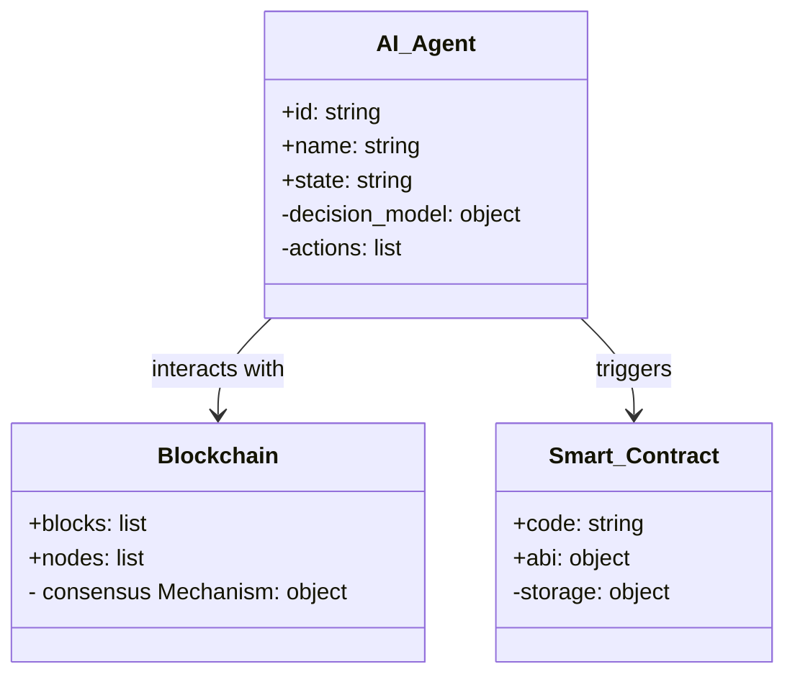
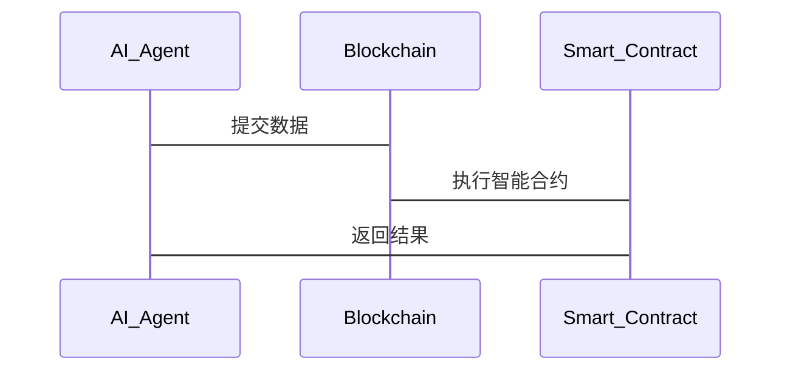

                 


# 企业AI Agent的区块链集成：提升数据可信度

> 关键词：企业AI Agent，区块链，数据可信度，智能合约，共识机制

> 摘要：本文探讨了企业AI Agent与区块链技术的集成，重点分析了如何通过区块链技术提升AI Agent的数据可信度。文章从基本概念、技术原理、系统架构到实际应用进行了全面阐述，旨在为企业技术决策者和开发者提供理论支持和实践指导。

---

# 第1章: 企业AI Agent与区块链概述

## 1.1 企业AI Agent的基本概念

### 1.1.1 AI Agent的定义与特点
AI Agent（人工智能代理）是指能够感知环境、自主决策并执行任务的智能实体。与传统软件不同，AI Agent具备以下特点：
- **自主性**：能够在没有外部干预的情况下运行。
- **反应性**：能够实时感知环境并做出响应。
- **学习能力**：通过数据和经验不断优化自身的决策模型。

### 1.1.2 企业级AI Agent的应用场景
企业AI Agent广泛应用于多个领域，例如：
- **供应链管理**：优化物流路径，实时监控货物状态。
- **智能客服**：提供24/7的客户支持，解决客户问题。
- **风险管理**：实时监控市场变化，预测潜在风险。

### 1.1.3 区块链技术的核心概念
区块链是一种分布式账本技术，具备以下特点：
- **去中心化**：数据存储在多个节点上，不存在单点故障。
- **不可篡改**：通过加密算法确保数据无法被篡改。
- **透明性**：所有交易记录对参与者公开，确保数据透明。

### 1.1.4 数据可信度的重要性
在企业AI Agent的应用中，数据的可信度直接关系到系统的决策能力和运行效率。区块链技术通过去中心化和不可篡改的特性，为数据的可信度提供了强有力的支持。

## 1.2 企业AI Agent与区块链结合的意义

### 1.2.1 提升数据可信度的挑战
AI Agent的决策依赖于数据的准确性，但在实际应用中，数据可能面临以下挑战：
- **数据篡改**：恶意攻击可能导致数据被篡改。
- **数据孤岛**：不同系统之间的数据难以共享，导致信息不完整。

### 1.2.2 区块链在数据可信度中的作用
区块链技术通过以下方式提升数据可信度：
- **数据完整性**：区块链的分布式账本确保数据的一致性和完整性。
- **数据透明性**：所有交易记录可追溯，确保数据来源的透明性。

### 1.2.3 企业AI Agent与区块链的协同效应
通过将AI Agent与区块链结合，企业可以实现以下目标：
- **提高决策效率**：通过区块链提供的可信数据，AI Agent能够更快地做出决策。
- **增强系统安全性**：区块链的去中心化特性降低了数据被篡改的风险。

## 1.3 本书内容与目标

### 1.3.1 本书的核心目标
本书旨在探讨企业AI Agent与区块链的集成，重点分析如何通过区块链技术提升AI Agent的数据可信度。

### 1.3.2 本书的章节安排
本书共分为七章，内容涵盖AI Agent与区块链的基本概念、技术原理、系统架构以及实际应用案例。

### 1.3.3 本书的适用读者
本书适合以下读者阅读：
- 企业IT架构师
- 人工智能工程师
- 区块链开发人员
- 对企业智能化转型感兴趣的读者

---

# 第2章: 区块链技术原理

## 2.1 区块链的基本原理

### 2.1.1 区块链的定义与特点
区块链是一种分布式账本技术，通过去中心化的方式记录数据，确保数据的安全性和不可篡改性。

### 2.1.2 区块链的核心组件
区块链的核心组件包括：
- **节点**：网络中的计算节点，负责存储和验证数据。
- **区块**：数据的存储单位，每个区块包含一定数量的交易记录。
- **链式结构**：区块通过哈希指针连接成链式结构，确保数据的不可篡改性。

### 2.1.3 共识机制的原理与类型
共识机制是区块链的核心技术之一，用于确保所有节点达成一致。常见的共识机制包括：
- **工作量证明（PoW）**：比特币采用的共识机制，通过计算哈希值来验证交易。
- **权益证明（PoS）**：通过持有代币的数量来决定节点的权重。

## 2.2 智能合约的原理与应用

### 2.2.1 智能合约的定义与特点
智能合约是区块链上的自动化程序，能够自动执行预设的规则。其特点包括：
- **自动化**：无需人工干预，自动执行合同条款。
- **不可篡改**：智能合约的代码一旦部署，无法被修改。

### 2.2.2 智能合约的执行流程
智能合约的执行流程包括以下步骤：
1. **触发条件**：当满足预设条件时，智能合约自动执行。
2. **代码执行**：智能合约代码开始执行，完成预设的任务。
3. **结果记录**：执行结果记录在区块链上，确保数据的透明性和不可篡改性。

### 2.2.3 智能合约在企业中的应用
智能合约在企业中可以应用于多个领域，例如：
- **供应链管理**：自动执行合同条款，确保供应链的高效运作。
- **金融交易**：自动执行金融合约，降低交易成本。

## 2.3 区块链的安全性与隐私保护

### 2.3.1 区块链的安全性挑战
区块链面临的主要安全性挑战包括：
- **恶意攻击**：攻击者可能尝试通过51%攻击等方式篡改数据。
- **数据隐私**：区块链上的数据对所有参与者公开，可能导致隐私泄露。

### 2.3.2 隐私保护技术在区块链中的应用
为了解决数据隐私问题，区块链采用了多种隐私保护技术，例如：
- **零知识证明**：通过零知识证明技术，在不泄露数据的前提下验证数据的真实性。
- **同态加密**：对数据进行加密后进行计算，确保数据的隐私性。

### 2.3.3 数据可信度的提升方法
通过区块链技术，数据的可信度可以得到显著提升。以下是几种提升数据可信度的方法：
1. **数据完整性验证**：通过区块链的分布式账本确保数据的完整性。
2. **数据透明性**：所有交易记录公开可查，确保数据的透明性。
3. **数据不可篡改性**：通过区块链的链式结构确保数据不可篡改。

---

# 第3章: AI Agent的核心原理

## 3.1 AI Agent的定义与功能

### 3.1.1 AI Agent的定义与分类
AI Agent是一种能够感知环境、自主决策并执行任务的智能实体。根据功能的不同，AI Agent可以分为以下几类：
- **反应式AI Agent**：根据当前环境信息做出反应。
- **基于模型的AI Agent**：基于内部模型做出决策。
- **实用优化AI Agent**：基于效用函数进行决策。

### 3.1.2 AI Agent的核心功能
AI Agent的核心功能包括：
- **感知环境**：通过传感器或API获取环境信息。
- **决策制定**：基于感知的信息做出决策。
- **执行动作**：根据决策结果执行相应的动作。

### 3.1.3 AI Agent与传统软件的区别
与传统软件相比，AI Agent具备以下特点：
- **自主性**：能够自主决策，无需人工干预。
- **学习能力**：能够通过数据和经验不断优化自身模型。

## 3.2 AI Agent的决策机制

### 3.2.1 基于数据的决策过程
AI Agent的决策过程通常包括以下几个步骤：
1. **数据采集**：通过传感器或API获取环境数据。
2. **数据处理**：对采集到的数据进行清洗和预处理。
3. **模型训练**：基于处理后的数据训练决策模型。
4. **决策制定**：根据训练好的模型做出决策。

### 3.2.2 AI Agent的自主学习能力
AI Agent具备自主学习能力，能够通过强化学习、监督学习等方式优化自身的决策模型。

### 3.2.3 数据可信度对决策的影响
数据的可信度直接影响AI Agent的决策能力。通过区块链技术，可以有效提升数据的可信度，从而提高AI Agent的决策准确率。

## 3.3 AI Agent的通信与协作

### 3.3.1 AI Agent之间的通信机制
AI Agent之间的通信机制包括：
- **点对点通信**：AI Agent之间直接进行数据交换。
- **通过中间件通信**：通过中间件进行数据交换，确保通信的安全性和可靠性。

### 3.3.2 多AI Agent协作的场景
多AI Agent协作的场景包括：
- **分布式计算**：多个AI Agent协同完成复杂的计算任务。
- **任务分配**：根据任务需求动态分配AI Agent的角色和任务。

### 3.3.3 通信与协作中的数据可信问题
在AI Agent的通信与协作中，数据的可信度是关键问题。通过区块链技术，可以确保数据的可信度，从而提高协作效率。

---

# 第4章: 区块链与AI Agent的集成原理

## 4.1 区块链与AI Agent的结合方式

### 4.1.1 数据存储的区块链化
通过将AI Agent的数据存储在区块链上，可以确保数据的不可篡改性和透明性。

### 4.1.2 智能合约驱动的AI Agent行为
通过智能合约，可以实现AI Agent的行为自动化。例如，当满足预设条件时，智能合约自动触发AI Agent的执行动作。

### 4.1.3 区块链作为可信数据源
区块链可以作为AI Agent的可信数据源，确保数据的准确性和完整性。

## 4.2 区块链与AI Agent的协同机制

### 4.2.1 数据可信度的保障机制
通过区块链技术，可以实现数据的可信度保障。例如，通过智能合约确保数据的真实性和完整性。

### 4.2.2 AI Agent对区块链的扩展能力
AI Agent可以通过区块链的扩展性，实现数据的分布式存储和共享。例如，通过侧链或联盟链实现数据的快速流转。

### 4.2.3 区块链对AI Agent的增强能力
区块链技术可以增强AI Agent的能力，例如通过智能合约实现自动化的决策和执行。

## 4.3 集成中的关键问题与解决方案

### 4.3.1 数据隐私保护
在区块链与AI Agent的集成中，数据隐私保护是一个重要的问题。通过零知识证明等技术，可以在不泄露数据的前提下验证数据的真实性。

### 4.3.2 系统性能优化
区块链的高延迟和低吞吐量可能影响AI Agent的实时性。通过优化共识机制和采用分片技术，可以提高系统的性能。

### 4.3.3 安全性保障
在集成过程中，需要确保系统的安全性。通过多重签名和权限控制等技术，可以提高系统的安全性。

---

# 第5章: 系统架构设计

## 5.1 问题场景介绍
在企业AI Agent与区块链的集成中，需要解决以下问题：
- **数据可信度**：如何确保数据的准确性和完整性。
- **系统性能**：如何提高系统的实时性和响应速度。
- **安全性**：如何保障系统的安全性。

## 5.2 项目介绍
本项目旨在设计一个基于区块链的企业AI Agent系统，通过区块链技术提升数据的可信度。

## 5.3 系统功能设计

### 5.3.1 领域模型
以下是系统的领域模型：


### 5.3.2 系统架构
以下是系统的架构设计：
```mermaid
client --> AI_Agent: interacts with
AI_Agent --> Blockchain: interacts with
Blockchain --> Smart_Contract: executes
Smart_Contract --> AI_Agent: triggers
```

### 5.3.3 接口设计
系统的主要接口包括：
- **AI Agent接口**：用于与外部系统交互。
- **区块链接口**：用于与区块链网络交互。
- **智能合约接口**：用于与智能合约交互。

### 5.3.4 交互流程
以下是系统的交互流程：


---

# 第6章: 项目实战

## 6.1 环境安装
以下是项目实战所需的环境安装步骤：
1. **安装区块链平台**：选择一个合适的区块链平台，例如以太坊。
2. **安装智能合约开发工具**：安装Solidity编译器和 Remix IDE。
3. **安装AI Agent开发框架**：选择一个合适的AI Agent开发框架，例如OpenAI。

## 6.2 系统核心实现

### 6.2.1 区块链节点部署
以下是区块链节点的部署步骤：
1. **下载区块链源码**：从官方仓库下载区块链源码。
2. **配置节点参数**：根据需求配置节点参数。
3. **启动节点服务**：运行节点服务，开始监听网络。

### 6.2.2 智能合约开发
以下是智能合约的开发步骤：
1. **编写智能合约代码**：使用Solidity语言编写智能合约代码。
2. **编译智能合约**：使用Solidity编译器将智能合约编译为字节码。
3. **部署智能合约**：将智能合约部署到区块链网络。

### 6.2.3 AI Agent与区块链的集成
以下是AI Agent与区块链的集成步骤：
1. **配置AI Agent参数**：配置AI Agent的参数，例如决策模型和执行动作。
2. **与区块链网络交互**：通过区块链接口与区块链网络交互。
3. **触发智能合约**：通过智能合约接口触发智能合约的执行。

## 6.3 代码实现与解读

### 6.3.1 区块链节点代码
以下是区块链节点的代码示例：
```python
class Blockchain:
    def __init__(self):
        self.blocks = []
        self.nodes = []
    
    def add_block(self, block):
        self.blocks.append(block)
    
    def add_node(self, node):
        self.nodes.append(node)
```

### 6.3.2 智能合约代码
以下是智能合约的代码示例：
```solidity
contract SmartContract {
    function execute(bytes memory input) {
        // 智能合约的执行逻辑
    }
}
```

### 6.3.3 AI Agent代码
以下是AI Agent的代码示例：
```python
class AI_Agent:
    def __init__(self):
        self.id = ""
        self.name = ""
        self.state = ""
        self.decision_model = None
        self.actions = []
    
    def make_decision(self, data):
        # 基于数据做出决策
        pass
```

## 6.4 实际案例分析与详细解读

### 6.4.1 案例介绍
本案例以智能供应链管理为例，展示企业AI Agent与区块链的集成应用。

### 6.4.2 案例实现
以下是智能供应链管理的实现步骤：
1. **数据采集**：通过传感器采集货物的状态信息。
2. **数据处理**：对采集到的数据进行清洗和预处理。
3. **智能合约部署**：将智能合约部署到区块链网络。
4. **AI Agent决策**：AI Agent根据区块链上的数据做出决策，例如调整物流路径。
5. **执行动作**：AI Agent触发智能合约，执行预设的动作，例如通知物流公司调整货物运输路线。

### 6.4.3 案例分析
通过本案例，我们可以看到企业AI Agent与区块链的集成能够显著提升供应链管理的效率和准确性。

---

# 第7章: 总结与展望

## 7.1 本书总结
本书系统地探讨了企业AI Agent与区块链的集成，重点分析了如何通过区块链技术提升数据的可信度。

## 7.2 未来展望
随着区块链和人工智能技术的不断发展，企业AI Agent与区块链的集成将更加广泛和深入。未来的研究方向包括：
- **数据隐私保护**：进一步研究数据隐私保护技术，例如零知识证明。
- **系统性能优化**：通过优化共识机制和采用分片技术，提高系统的性能。
- **跨链技术**：研究跨链技术，实现不同区块链网络之间的互联互通。

## 7.3 最佳实践 tips
- 在集成过程中，应注重数据隐私保护，采用合适的技术手段确保数据的安全性。
- 系统设计时，应充分考虑系统的扩展性和可维护性，避免因技术选型不当导致系统性能瓶颈。
- 在实际应用中，应结合具体业务需求，灵活调整系统设计，确保系统的实用性和可操作性。

## 7.4 小结
企业AI Agent与区块链的集成是一项具有广阔前景的技术，通过本书的学习，读者可以掌握相关的核心技术，为企业智能化转型提供有力支持。

---

作者：AI天才研究院/AI Genius Institute & 禅与计算机程序设计艺术 /Zen And The Art of Computer Programming

---

* 以上为完整的技术博客文章内容，涵盖从基础概念到实际应用的完整体系，通过详细的理论分析和实际案例，为企业技术决策者和开发者提供系统性的知识和实践指导。

