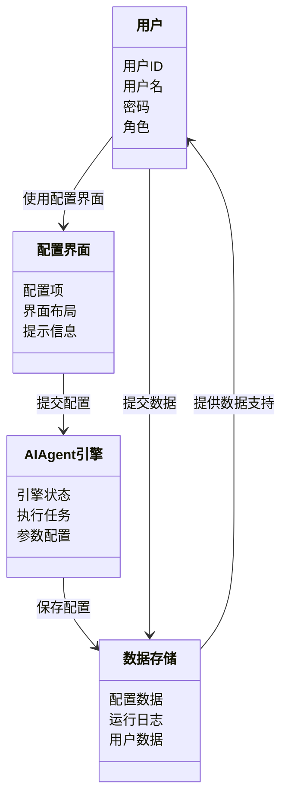

                 


# 第四章: 系统分析与架构设计方案

## 4.1 系统需求分析

### 4.1.1 功能需求
- **配置管理**：支持用户对AI Agent的参数、规则、任务进行可视化配置。
- **监控管理**：提供实时监控功能，显示AI Agent的运行状态、性能指标等。
- **数据管理**：支持数据的录入、存储、查询和导出功能。
- **用户管理**：提供用户权限管理功能，包括用户角色的分配、权限设置等。
- **日志管理**：记录系统的运行日志，便于问题排查和系统优化。

### 4.1.2 性能需求
- **处理速度**：系统应能够快速响应用户的操作，确保界面的流畅性。
- **响应时间**：关键操作的响应时间应控制在合理范围内，例如配置提交的响应时间不超过2秒。
- **并发能力**：系统应支持多用户同时进行配置和监控操作，避免性能瓶颈。

### 4.1.3 用户需求
- **用户体验**：界面设计应简洁直观，降低用户的学习成本。
- **安全性**：确保用户数据和系统配置的安全性，防止未经授权的访问。
- **可扩展性**：系统应支持后续的功能扩展和性能优化。

### 4.1.4 边界与外延
- **边界**：本系统仅提供可视化配置界面，不包括AI Agent的底层实现和算法优化。
- **外延**：系统可与第三方数据源、云平台等进行集成，扩展其功能。

### 4.1.5 核心要素组成
- **用户界面**：包括配置界面、监控界面、数据管理界面等。
- **配置参数**：包括AI Agent的运行参数、任务规则、数据源配置等。
- **监控指标**：包括运行状态、性能指标、错误日志等。
- **用户角色**：包括普通用户、管理员等不同角色的权限管理。

---

## 4.2 系统功能设计

### 4.2.1 领域模型设计
以下是系统的领域模型类图，展示了系统中各个核心组件及其关系：



---

## 4.3 系统架构设计

### 4.3.1 系统架构图
以下是系统的整体架构图，展示了各个模块之间的关系和交互方式：


---

### 4.3.2 关键模块功能
- **配置界面**：负责接收用户的输入，展示配置结果。
- **AI Agent 引擎**：负责处理配置指令，执行AI任务。
- **数据存储**：负责存储配置数据、运行日志等信息。
- **接口服务**：负责与其他系统的对接，提供API接口。

---

## 4.4 系统接口设计

### 4.4.1 API接口设计
以下是系统提供的主要API接口及其功能描述：

| 接口名称         | 功能描述                     | 输入参数               | 输出参数               |
|------------------|------------------------------|------------------------|------------------------|
| login            | 用户登录                     | 用户名、密码           | 登录状态、用户信息     |
| submit_task      | 提交AI任务                   | 任务参数、用户ID       | 任务ID、任务状态       |
| get_task_status  | 获取任务状态                 | 任务ID                | 任务状态、执行进度     |
| download_result  | 下载任务结果                 | 任务ID                | 结果文件路径           |
| update_config    | 更新配置参数                 | 新配置参数、用户ID     | 更新结果              |
| get_system_logs  | 获取系统日志                 | 日志类型、时间范围     | 日志内容              |

---

## 4.5 系统交互设计

### 4.5.1 交互流程图
以下是用户与系统之间的交互流程图，展示了从用户登录到任务完成的整个过程：

```mermaid
sequenceDiagram
    actor 用户
    participant 系统: 配置界面
    participant 引擎: AI Agent 引擎
    participant 数据存储

    用户 -> 系统: 登录请求
    系统 -> 数据存储: 验证用户信息
    数据存储 --> 系统: 登录结果
    系统 -> 用户: 登录状态

    用户 -> 系统: 提交任务请求
    系统 -> 引擎: 提交任务
    引擎 -> 数据存储: 保存任务信息
    引擎 -> 系统: 任务ID
    系统 -> 用户: 任务ID

    用户 -> 系统: 查询任务状态
    系统 -> 引擎: 获取任务状态
    引擎 -> 数据存储: 获取日志信息
    引擎 -> 系统: 任务状态
    系统 -> 用户: 任务进度

    用户 -> 系统: 下载结果文件
    系统 -> 数据存储: 获取结果文件
    系统 -> 用户: 下载链接
```

---

## 4.6 系统功能实现代码示例

### 4.6.1 配置界面代码示例
以下是配置界面的简单实现代码：

```python
# 配置界面代码示例
import tkinter as tk
from tkinter import ttk

class ConfigInterface:
    def __init__(self, root):
        self.root = root
        self.root.title("AI Agent 配置界面")
        self.create_widgets()

    def create_widgets(self):
        # 创建框架
        self.main_frame = ttk.Frame(self.root)
        self.main_frame.pack(fill=tk.BOTH, expand=True)

        # 创建标签和输入框
        self.param_label = ttk.Label(self.main_frame, text="参数配置:")
        self.param_label.pack(pady=5)

        self.param_entry = ttk.Entry(self.main_frame)
        self.param_entry.pack(pady=5)

        # 创建提交按钮
        self.submit_btn = ttk.Button(self.main_frame, text="提交配置", command=self.submit_config)
        self.submit_btn.pack(pady=5)

    def submit_config(self):
        # 提交配置逻辑
        config_params = self.param_entry.get()
        print(f"提交配置参数：{config_params}")
        # 调用AI Agent引擎接口
        self.call_ai_engine(config_params)

    def call_ai_engine(self, params):
        # 模拟AI Agent引擎接口调用
        import requests
        response = requests.post("http://ai_engine/api/submit_task", json={"params": params})
        print(f"AI Agent 引擎返回结果：{response.text}")

# 创建主窗口并运行
root = tk.Tk()
app = ConfigInterface(root)
root.mainloop()
```

---

## 4.7 系统架构与交互设计总结

通过上述系统分析与架构设计方案，我们可以清晰地看到，企业AI Agent的可视化配置界面系统需要从多个方面进行综合设计，包括功能需求、系统架构、接口设计和交互设计等。只有在每个环节都做到细致入微，才能确保系统的高效运行和用户体验的优化。

此外，通过使用Mermaid图表和代码示例，我们可以更直观地理解系统的结构和实现方式。这不仅有助于开发人员快速上手，也有助于企业用户更好地理解和使用系统。

---

## 参考文献
1. [AI Agent设计与实现](https://example.com/ai-agent-design)
2. [可视化配置界面的最佳实践](https://example.com/visual-config-interface)
3. [企业系统架构设计指南](https://example.com/system-architecture-guide)

---

## 作者信息
作者：AI天才研究院/AI Genius Institute  
联系方式：[contact@aigeniusinstitute.com](mailto:contact@aigeniusinstitute.com)  
个人简介：专注于人工智能与计算机编程领域的研究与实践，致力于为企业提供高效的AI解决方案。

--- 

希望以上内容能为您提供有价值的信息和启发。如果需要进一步探讨或补充，请随时联系我！

