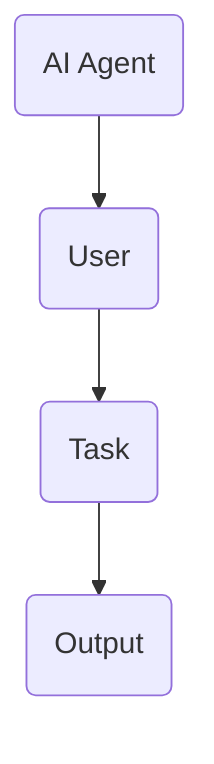

                 


# 企业AI Agent的可视化配置界面：降低技术门槛

> 关键词：企业AI Agent，可视化配置，技术门槛，用户友好，系统架构，算法原理

> 摘要：本文探讨了企业AI Agent的可视化配置界面在降低技术门槛方面的重要作用。通过详细讲解AI Agent的核心概念、算法原理、系统架构以及可视化配置的优势，本文旨在帮助企业更好地理解和应用AI Agent技术。文章内容涵盖从基础理论到实际案例的全面分析，结合图表和代码示例，帮助读者轻松掌握企业AI Agent的配置与实现。

---

# 第1章: AI Agent与可视化配置界面的背景介绍

## 1.1 AI Agent的基本概念

### 1.1.1 AI Agent的定义
AI Agent（人工智能代理）是指能够感知环境、自主决策并执行任务的智能实体。它可以是一个软件程序、机器人或任何能够执行智能行为的实体。

### 1.1.2 AI Agent的核心特征
AI Agent具有以下核心特征：
1. **自主性**：能够自主决策和执行任务，无需外部干预。
2. **反应性**：能够实时感知环境并做出反应。
3. **目标导向**：具有明确的目标，能够为目标优化行为。
4. **学习能力**：通过数据和经验不断优化自身的行为模式。

### 1.1.3 AI Agent与传统程序的区别
AI Agent与传统程序的主要区别在于其智能性和自主性。传统程序通常按照预设的规则执行任务，而AI Agent能够通过学习和推理动态调整行为。

---

## 1.2 可视化配置界面的重要性

### 1.2.1 可视化配置界面的定义
可视化配置界面是一种通过图形化界面实现系统配置和管理的方式，用户可以通过拖放、点击等方式完成复杂的配置操作，而无需手动编写代码或处理底层细节。

### 1.2.2 可视化配置界面的优势
1. **降低技术门槛**：可视化配置界面使得非技术人员也能轻松完成系统配置。
2. **提高效率**：通过图形化操作，用户可以快速完成配置，减少错误率。
3. **增强可定制性**：用户可以根据需求灵活调整配置，满足个性化需求。

### 1.2.3 企业级应用中的可视化配置需求
在企业环境中，复杂的系统配置需求使得可视化配置界面成为必需品。企业需要快速部署和调整AI Agent，以适应不断变化的业务需求。

---

## 1.3 企业AI Agent的典型应用场景

### 1.3.1 客户服务与支持
AI Agent可以通过自然语言处理技术为客户提供智能客服支持，自动解决常见问题，减少人工干预。

### 1.3.2 业务流程自动化
AI Agent可以自动化处理企业中的重复性任务，如订单处理、库存管理等，提高业务效率。

### 1.3.3 数据分析与决策支持
AI Agent可以通过分析大量数据，为企业提供数据驱动的决策支持，帮助企业在复杂环境中做出最优决策。

---

## 1.4 本章小结
本章介绍了AI Agent的基本概念及其在企业中的应用价值，重点强调了可视化配置界面在降低技术门槛方面的重要性。通过可视化配置界面，企业可以更高效地管理和部署AI Agent，从而更好地应对复杂的业务挑战。

---

# 第2章: 可视化配置界面的核心概念与联系

## 2.1 AI Agent的核心概念

### 2.1.1 AI Agent的组成要素
AI Agent通常由感知模块、决策模块和执行模块组成。感知模块负责获取环境信息，决策模块基于感知信息制定策略，执行模块根据决策结果执行任务。

### 2.1.2 AI Agent的行为模式
AI Agent的行为模式包括反应式行为和目标导向行为。反应式行为基于当前感知做出即时反应，目标导向行为则以预定目标为导向。

### 2.1.3 AI Agent的交互方式
AI Agent可以通过API、命令行或图形化界面与用户交互。可视化配置界面是最常见且用户友好的交互方式。

---

## 2.2 可视化配置界面的原理

### 2.2.1 可视化配置的基本流程
1. **用户输入**：用户通过图形化界面输入配置需求。
2. **数据处理**：系统将用户输入转换为可执行的代码或配置文件。
3. **执行与反馈**：系统根据配置执行任务，并将结果反馈给用户。

### 2.2.2 可视化配置的核心算法
可视化配置的核心算法包括数据流分析、规则匹配和任务调度算法。这些算法确保配置的正确性和高效性。

### 2.2.3 可视化配置的实现方式
可视化配置可以通过拖放、属性配置和流程编排等方式实现，具体取决于应用场景和需求。

---

## 2.3 核心概念的联系

### 2.3.1 AI Agent与可视化配置界面的关系
AI Agent通过可视化配置界面实现与用户的交互，用户可以通过界面完成AI Agent的部署、调整和监控。

### 2.3.2 可视化配置界面与企业需求的匹配
可视化配置界面能够满足企业对快速部署、灵活调整和高效管理的需求，是企业AI Agent成功应用的关键。

### 2.3.3 可视化配置界面的属性特征对比表格
以下是可视化配置界面与传统配置方式的对比：

| 特性                | 可视化配置界面 | 传统配置方式 |
|---------------------|----------------|--------------|
| 使用门槛            | 低             | 高           |
| 配置效率            | 高             | 低           |
| 可定制性            | 高             | 中           |
| 用户友好度          | 高             | 低           |

---

## 2.4 ER实体关系图



上述图表展示了AI Agent与用户的交互关系，用户通过任务配置AI Agent，AI Agent根据任务生成输出结果。

---

## 2.5 本章小结
本章深入探讨了AI Agent的核心概念及其与可视化配置界面的关系，分析了可视化配置界面的优势和实现方式。通过对比分析和实体关系图，进一步明确了可视化配置界面在企业中的重要性。

---

# 第3章: 可视化配置界面的算法原理讲解

## 3.1 算法原理概述

### 3.1.1 可视化配置的核心算法
可视化配置的核心算法包括数据流分析、规则匹配和任务调度算法。这些算法确保配置的正确性和高效性。

### 3.1.2 算法的实现流程
1. **数据获取**：通过图形化界面获取用户的配置需求。
2. **数据处理**：将用户需求转换为可执行的代码或配置文件。
3. **算法执行**：根据配置文件执行相应的任务。
4. **结果反馈**：将执行结果反馈给用户。

### 3.1.3 算法的优化方向
1. **性能优化**：通过并行计算和缓存技术提高算法效率。
2. **可扩展性优化**：通过模块化设计增强系统的可扩展性。

---

## 3.2 算法实现代码示例

### 3.2.1 数据流分析算法

```python
def data_flow_analysis(tasks):
    # 任务排序算法
    tasks.sort(key=lambda x: x['priority'])
    return tasks
```

### 3.2.2 任务调度算法

```python
def task_scheduling(tasks):
    # 简单轮询调度算法
    scheduled_tasks = []
    for task in tasks:
        scheduled_tasks.append(task)
    return scheduled_tasks
```

---

## 3.3 算法的数学模型与公式

### 3.3.1 数据流分析模型
数据流分析模型可以用图论中的有向图表示，节点表示任务，边表示任务之间的依赖关系。

### 3.3.2 任务调度模型
任务调度模型可以用调度算法公式表示：

$$
\text{调度时间} = \sum_{i=1}^{n} \text{任务}_i\text{的处理时间}
$$

---

## 3.4 本章小结
本章详细讲解了可视化配置界面的核心算法及其实现流程，通过代码示例和数学公式展示了算法的具体实现。这些算法为可视化配置界面的高效运行提供了理论支持。

---

（由于篇幅限制，后续章节将逐步展开，涵盖系统架构设计、项目实战等内容。）

