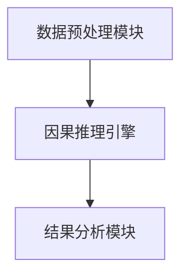

                 

# 企业AI Agent的因果推理在A/B测试分析中的应用

## 关键词：
- 企业AI Agent
- 因果推理
- A/B测试
- 机器学习
- 数据分析

## 摘要：
本文将探讨企业AI Agent如何利用因果推理技术提升A/B测试的分析能力。通过详细分析因果推理的理论基础、算法原理及其在企业中的应用，本文将展示如何通过构建基于因果推理的A/B测试系统，实现更精准的决策支持和优化。结合实际案例，本文将深入探讨系统架构设计、算法实现及项目实战，为企业在AI驱动的决策优化中提供有价值的参考。

---

# 第1章: 企业AI Agent与因果推理基础

## 1.1 企业AI Agent的概述

### 1.1.1 AI Agent的基本概念
AI Agent（人工智能代理）是指能够感知环境、自主决策并采取行动的智能实体。在企业场景中，AI Agent通常被设计为能够处理复杂任务、优化业务流程、提高决策效率的智能化系统。

### 1.1.2 企业AI Agent的核心特点
- **自主性**：能够独立感知环境并做出决策。
- **反应性**：能够实时响应环境变化。
- **目标导向性**：通过设定目标来驱动行为。
- **学习能力**：能够通过数据学习和优化。

### 1.1.3 企业AI Agent的应用场景
- **客户行为预测**：通过分析用户行为数据，预测客户的需求和行为。
- **业务流程优化**：通过自动化决策优化业务流程。
- **市场策略制定**：基于数据驱动的决策支持市场策略。

## 1.2 因果推理的基本概念

### 1.2.1 因果关系的定义
因果关系是指两个变量之间存在一种关系，其中一个变量（原因）会导致另一个变量（结果）的发生。例如，广告投放（原因）导致用户点击率提升（结果）。

### 1.2.2 因果推理与相关性的区别
- **相关性**：变量之间存在统计上的关联，但并不一定存在因果关系。
- **因果关系**：变量之间存在直接的因果关系。

### 1.2.3 因果推理在企业中的重要性
- **决策优化**：通过因果推理，企业可以更准确地识别因果关系，从而做出更有效的决策。
- **实验设计**：因果推理可以帮助企业设计更有效的实验，以验证策略的效果。

## 1.3 A/B测试的基本原理

### 1.3.1 A/B测试的定义
A/B测试是一种通过将用户随机分配到不同的组（A组和B组）中，分别接受不同的处理（例如不同的网页设计、不同的价格策略），然后比较两组的实验结果，以确定哪种处理更优的实验方法。

### 1.3.2 A/B测试的核心步骤
1. **用户分组**：将用户随机分配到A组或B组。
2. **实验处理**：对A组和B组施加不同的处理。
3. **数据收集**：收集两组用户的行为数据。
4. **结果分析**：比较两组的实验结果，确定哪种处理效果更好。

### 1.3.3 A/B测试的优缺点
- **优点**：可以快速验证策略的效果，降低决策风险。
- **缺点**：需要大量的数据支持，且可能存在样本偏差。

---

# 第2章: 因果推理的理论基础

## 2.1 因果关系模型

### 2.1.1 结构方程模型
结构方程模型是一种用于描述变量之间因果关系的数学模型。它通过方程的形式表示变量之间的因果关系，例如：
$$ Y = aX + bZ + \epsilon $$
其中，$Y$ 是结果变量，$X$ 是原因变量，$Z$ 是其他变量，$\epsilon$ 是误差项。

### 2.1.2 图模型
图模型是一种通过有向图表示变量之间因果关系的模型。例如，变量 $X$ 对变量 $Y$ 有直接影响，可以用有向边 $X \rightarrow Y$ 表示。

### 2.1.3 因果链与因果路径
因果链是指从原因到结果的一系列因果关系。例如，广告投放（$A$）导致点击率提升（$B$），进而提升销售额（$C$）。因果路径可以用 $A \rightarrow B \rightarrow C$ 表示。

## 2.2 潜在结果框架

### 2.2.1 潜在结果的定义
潜在结果是指在给定某些条件下，变量的可能取值。例如，用户是否点击广告（$Y_i^a$），其中 $a$ 表示广告是否被展示。

### 2.2.2 平均处理效应
平均处理效应（ATE）是指在所有用户中，处理变量（例如广告投放）对结果变量（例如点击率）的平均影响：
$$ ATE = E[Y_i^a - Y_i^b] $$

### 2.2.3 潜在结果与观测数据的关系
潜在结果无法直接观测，但可以通过观测数据进行估计。例如，通过观测数据估计 $ATE$。

## 2.3 倾向评分与匹配

### 2.3.1 倾向评分的定义
倾向评分（Propensity Score）是指在给定条件下，用户接受某种处理（例如广告投放）的概率：
$$ P(A=1|X) $$

### 2.3.2 倾向评分的估计方法
倾向评分可以通过机器学习模型（例如逻辑回归、随机森林）进行估计。

### 2.3.3 匹配方法与实现
匹配方法是指将处理组和非处理组按照倾向评分进行匹配，以减少样本偏差。

---

# 第3章: 企业AI Agent中的因果推理应用

## 3.1 企业AI Agent与因果推理的结合

### 3.1.1 AI Agent如何利用因果推理
AI Agent可以通过因果推理技术，识别因果关系，从而做出更智能的决策。

### 3.1.2 因果推理在AI Agent决策中的作用
因果推理可以帮助AI Agent理解变量之间的因果关系，从而做出更准确的预测和决策。

### 3.1.3 企业AI Agent中的因果推理框架
1. **因果关系建模**：构建变量之间的因果关系模型。
2. **倾向评分估计**：估计处理组和非处理组的倾向评分。
3. **因果效应估计**：估计处理对结果的因果效应。

## 3.2 因果推理在A/B测试中的应用

### 3.2.1

---

# 第4章: 系统架构与实现

## 4.1 系统架构设计

### 4.1.1 系统功能模块
1. **数据预处理模块**：对数据进行清洗和转换。
2. **因果推理引擎**：实现因果推理算法。
3. **结果分析模块**：分析实验结果并输出报告。

### 4.1.2 系统架构图

### 4.1.3 系统交互流程
1. 数据预处理模块接收原始数据，进行清洗和转换。
2. 因果推理引擎对数据进行因果推理，生成结果。
3. 结果分析模块对结果进行分析，输出报告。

---

# 第5章: 项目实战

## 5.1 环境配置

### 5.1.1 环境要求
- Python 3.8+
- Pandas、Scikit-learn、因果推理库（如DoWhy）

### 5.1.2 数据准备
假设我们有一个电商网站，想要测试两种不同的优惠券策略对销售额的影响。

---

# 总结

本文详细探讨了企业AI Agent如何利用因果推理技术提升A/B测试的分析能力。通过理论分析、系统设计和项目实战，展示了如何构建一个基于因果推理的A/B测试系统。未来，随着AI技术的不断发展，因果推理在企业决策中的应用将更加广泛和深入。

作者：AI天才研究院/AI Genius Institute & 禅与计算机程序设计艺术 /Zen And The Art of Computer Programming

