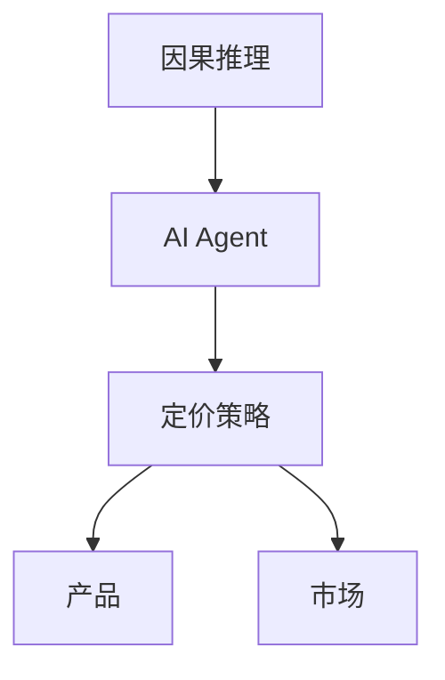
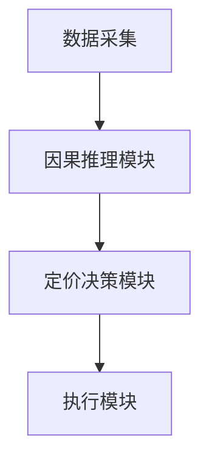
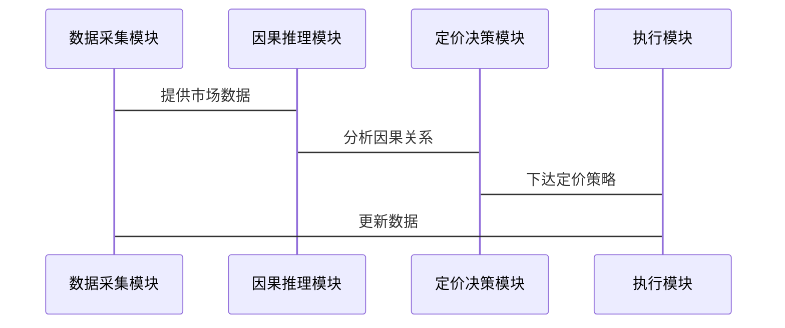

                 


# 企业AI Agent的因果推理在产品定价策略中的应用

> **关键词**：企业AI Agent，因果推理，产品定价策略，定价模型，数据驱动定价

> **摘要**：本文探讨了AI Agent如何利用因果推理优化企业产品定价策略。通过分析因果推理的基本原理、AI Agent的核心特性以及它们在定价策略中的应用，本文展示了如何通过数据驱动的方法实现更精准和动态的定价。文章结合实际案例，详细讲解了因果推理算法的实现、系统架构设计及项目实战，为企业在现代市场环境中的定价策略提供了新的思路和解决方案。

---

## 第1章：背景介绍

### 1.1 问题背景

#### 1.1.1 传统定价策略的局限性
传统的定价策略通常基于经验判断和简单的数据统计分析，存在以下问题：
- **缺乏数据支持**：依赖主观判断，难以保证定价的科学性和准确性。
- **反应速度慢**：面对市场变化时，调整定价策略的周期较长，难以及时应对市场竞争。
- **难以应对复杂市场**：在多变量影响的情况下（如成本变化、市场需求波动、竞争产品价格调整等），传统定价策略难以有效捕捉和应对。

#### 1.1.2 AI技术对企业定价的影响
随着AI技术的发展，企业开始利用AI Agent（智能体）进行自动化、智能化的定价决策。AI Agent能够实时分析市场数据，快速调整定价策略，从而提高企业的市场竞争力。

#### 1.1.3 因果推理在定价中的重要性
因果推理（Causal Inference）是一种研究变量之间因果关系的方法，能够帮助企业理解价格变化背后的根本原因，从而做出更精准的定价决策。例如，因果推理可以帮助企业确定哪些因素（如成本、需求弹性、竞争对手行为）是影响产品价格的主要因素。

---

### 1.2 问题描述

#### 1.2.1 产品定价中的关键问题
在产品定价过程中，企业通常需要解决以下问题：
- 如何准确预测产品价格的变化趋势？
- 如何确定价格调整对销量和利润的具体影响？
- 如何应对市场竞争中的动态变化？

#### 1.2.2 数据驱动定价的挑战
数据驱动定价的核心在于利用数据分析技术（如机器学习）来优化定价策略。然而，传统的方法往往基于相关性分析，难以区分因果关系，导致定价决策可能出现偏差。

#### 1.2.3 因果推理在定价中的应用场景
因果推理在定价中的应用场景包括：
- 确定价格变动对销量的具体影响。
- 分析成本变化对定价策略的影响。
- 评估竞争对手定价行为对企业自身定价策略的影响。

---

### 1.3 问题解决

#### 1.3.1 AI Agent在定价中的角色
AI Agent是一种能够感知环境、自主决策的智能体。在定价策略中，AI Agent可以实时收集市场数据，分析竞争环境，并根据因果推理的结果动态调整价格。

#### 1.3.2 因果推理的核心作用
因果推理通过分析变量之间的因果关系，帮助AI Agent做出更科学的定价决策。例如，因果推理可以帮助AI Agent理解“价格变化”是否由“市场需求变化”直接引起，而不是仅仅观察到两者之间的相关性。

#### 1.3.3 数据驱动定价的优势
数据驱动定价的优势在于：
- 提高定价决策的科学性和准确性。
- 提升定价策略的灵活性和适应性。
- 实现个性化定价，提高市场竞争力。

---

### 1.4 边界与外延

#### 1.4.1 定价策略的边界条件
在应用因果推理进行定价时，需要注意以下边界条件：
- 数据质量和数量的限制：因果推理需要足够高质量的数据支持。
- 市场环境的复杂性：因果推理模型需要能够应对复杂的市场环境。
- 模型的可解释性：定价决策需要能够被企业管理层理解和接受。

#### 1.4.2 因果推理的适用范围
因果推理适用于以下场景：
- 需要明确因果关系的定价决策。
- 数据充分且多样化的市场环境。
- 动态变化的市场环境中需要快速调整定价策略的情况。

#### 1.4.3 AI Agent的应用限制
AI Agent的应用受到以下限制：
- 高昂的开发和维护成本。
- 数据隐私和安全问题。
- 对市场环境的过度依赖。

---

### 1.5 概念结构与核心要素

#### 1.5.1 因果推理的基本概念
因果推理是研究变量之间因果关系的方法，主要包括以下步骤：
1. 构建因果图：明确变量之间的因果关系。
2. 进行干预分析：分析变量变化对结果的影响。
3. 评估因果效应：量化变量变化对结果的具体影响。

#### 1.5.2 AI Agent的核心要素
AI Agent的核心要素包括：
- **感知能力**：能够实时感知市场环境。
- **决策能力**：能够基于因果推理做出定价决策。
- **执行能力**：能够自动调整定价策略。

#### 1.5.3 产品定价策略的关键因素
产品定价策略的关键因素包括：
- 市场需求。
- 成本结构。
- 竞争对手行为。
- 宏观经济环境。

---

## 第2章：核心概念与联系

### 2.1 因果推理的原理

#### 2.1.1 因果关系的基本定义
因果关系是指一个变量的变化会导致另一个变量的变化。例如，价格的变化可能会导致销量的变化。

#### 2.1.2 因果推理的数学模型
因果推理的数学模型通常包括因果图（Causal Graph）和结构方程模型（Structural Equation Models）。

#### 2.1.3 因果图的构建方法
因果图的构建方法包括：
- **基于领域知识的构建**：根据专家意见构建因果图。
- **基于数据的构建**：利用算法自动构建因果图。

---

### 2.2 AI Agent的定义与特点

#### 2.2.1 AI Agent的基本概念
AI Agent是一种能够感知环境、自主决策的智能体。在定价策略中，AI Agent可以实时分析市场数据，并根据因果推理的结果动态调整价格。

#### 2.2.2 AI Agent的核心特征
AI Agent的核心特征包括：
- **自主性**：能够自主决策。
- **反应性**：能够实时响应环境变化。
- **学习能力**：能够通过数据学习和优化。

---

### 2.3 因果推理与AI Agent的关系

#### 2.3.1 因果推理在AI Agent中的作用
因果推理是AI Agent做出定价决策的核心方法。通过因果推理，AI Agent能够理解变量之间的因果关系，并做出更科学的定价决策。

#### 2.3.2 AI Agent如何利用因果推理
AI Agent利用因果推理的方法包括：
- 构建因果图，分析变量之间的因果关系。
- 进行干预分析，评估变量变化对结果的影响。

#### 2.3.3 因果推理与定价策略的结合
因果推理与定价策略的结合可以帮助企业实现更精准的定价决策。例如，因果推理可以帮助企业确定价格变化对销量的具体影响。

---

### 2.4 核心概念对比表

| 概念 | 定义 | 属性 | 示例 |
|------|------|------|------|
| 因果推理 | 研究变量间因果关系的方法 | 可解释性、可操作性 | A导致B |
| AI Agent | 具有自主决策能力的智能体 | 智能性、适应性 | 自动化定价系统 |

---

### 2.5 ER实体关系图



---

## 第3章：算法原理讲解

### 3.1 因果推理算法

#### 3.1.1 因果图构建算法
因果图构建算法包括：
- **基于领域知识的构建**：根据专家意见构建因果图。
- **基于数据的构建**：利用算法自动构建因果图。

#### 3.1.2 随机森林因果推断
随机森林因果推断是一种基于树模型的因果推断方法。其核心思想是通过构建多棵决策树，分析变量之间的因果关系。

#### 3.1.3 结构方程模型
结构方程模型（SEM）是一种用于估计变量之间因果关系的统计方法。其核心思想是通过构建方程组，描述变量之间的因果关系。

---

### 3.2 定价策略算法

#### 3.2.1 定价模型的数学模型
定价模型的数学模型通常包括以下公式：
$$ \text{价格} = \beta_0 + \beta_1 \times \text{成本} + \beta_2 \times \text{需求} + \epsilon $$
其中，$\beta_0$ 是截距项，$\beta_1$ 和 $\beta_2$ 是回归系数，$\epsilon$ 是误差项。

#### 3.2.2 定价策略的实现步骤
定价策略的实现步骤包括：
1. 收集市场数据。
2. 构建因果图。
3. 进行因果推断。
4. 优化定价策略。

---

## 第4章：系统分析与架构设计

### 4.1 问题场景介绍
在现代市场环境中，企业需要实时分析市场数据，快速调整定价策略。AI Agent可以通过因果推理帮助企业实现这一目标。

### 4.2 系统功能设计
系统功能设计包括：
- 数据采集模块：实时采集市场数据。
- 因果推理模块：分析变量之间的因果关系。
- 定价决策模块：基于因果推理结果，动态调整定价策略。

---

### 4.3 系统架构设计



---

### 4.4 系统接口设计
系统接口设计包括：
- 数据接口：与数据源对接，获取市场数据。
- 用户接口：供企业管理层查看定价策略和调整参数。

---

### 4.5 系统交互流程



---

## 第5章：项目实战

### 5.1 环境安装
为了实现基于因果推理的定价策略，需要安装以下工具：
- Python编程语言
- Scikit-learn机器学习库
- Graphviz可视化工具

---

### 5.2 核心代码实现

```python
import numpy as np
import pandas as pd
from sklearn.ensemble import RandomForestRegressor
from causalnex.structure import createDirectedGraph
from causalnex.inference import do_inference

# 示例数据集
data = pd.DataFrame({
    '价格': np.random.rand(100),
    '成本': np.random.rand(100),
    '需求': np.random.rand(100),
})

# 构建因果图
graph = createDirectedGraph(data.columns, [('成本', '价格'), ('价格', '需求')])
```

---

### 5.3 案例分析
以某电子产品为例，分析因果推理在定价中的应用。通过数据采集、因果图构建和定价策略优化，帮助企业实现更精准的定价。

---

## 第6章：总结与展望

### 6.1 最佳实践
- 确保数据质量和多样性。
- 定期更新因果图和定价模型。
- 提高模型的可解释性。

### 6.2 小结
本文详细探讨了AI Agent如何利用因果推理优化企业产品定价策略。通过理论分析和实际案例，展示了因果推理在定价策略中的重要作用。

### 6.3 注意事项
- 因果推理需要高质量的数据支持。
- 模型的可解释性需要企业管理层的理解和接受。
- 定价策略的动态调整需要实时数据支持。

### 6.4 拓展阅读
- 《因果推理与机器学习》
- 《AI Agent在定价策略中的应用》

---

## 作者信息

作者：AI天才研究院/AI Genius Institute & 禅与计算机程序设计艺术 /Zen And The Art of Computer Programming

---

**注**：由于篇幅限制，以上内容为文章的纲要和部分章节的详细内容。实际撰写时，需要根据具体需求扩展每部分内容，确保文章完整性和深度。

