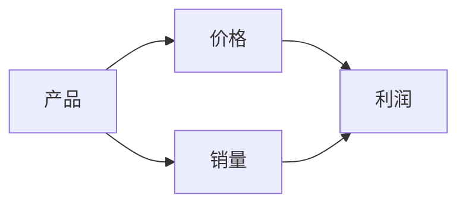
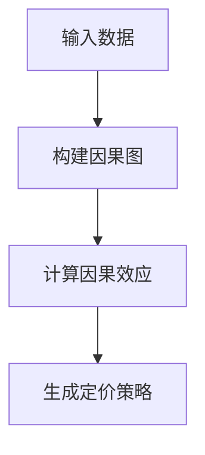
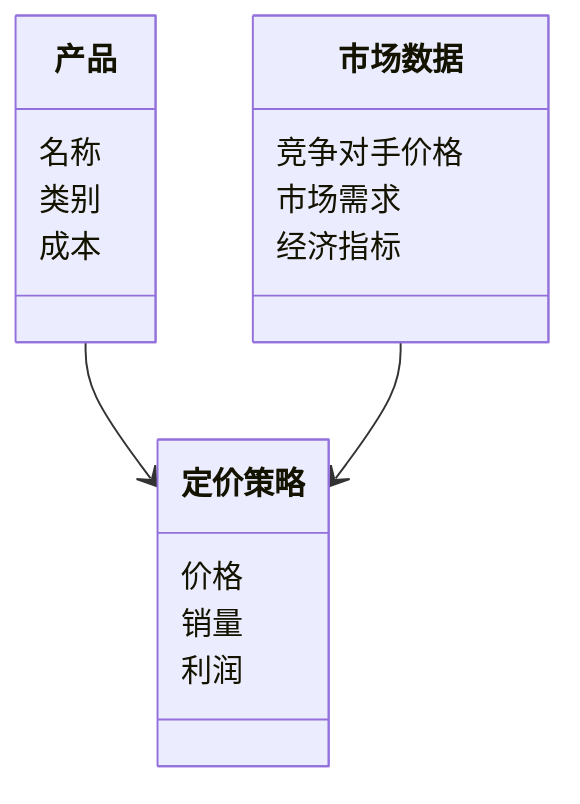
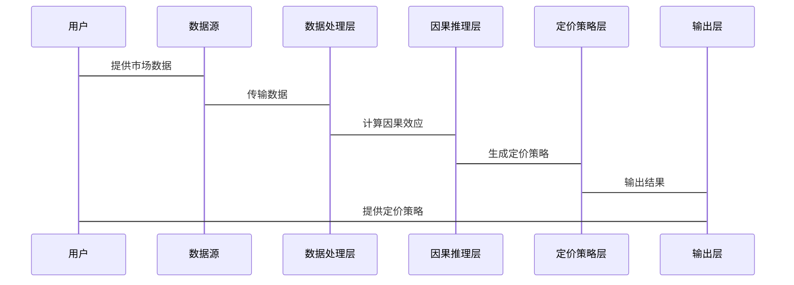

                 


# 企业AI Agent的因果推理在产品定价策略中的精准应用

> 关键词：企业AI Agent，因果推理，产品定价策略，精准应用，机器学习，定价模型

> 摘要：本文深入探讨了企业AI Agent如何利用因果推理技术优化产品定价策略。从理论基础到算法实现，再到实际应用，系统性地分析了因果推理在定价中的关键作用，并通过具体案例展示了其在实际业务中的精准应用价值。

---

# 第一部分：企业AI Agent的因果推理基础

## 第1章：问题背景与核心概念

### 1.1 问题背景

#### 1.1.1 传统定价策略的局限性
传统的产品定价策略往往依赖于统计相关性，而非因果关系。这种基于相关性的定价模型难以准确捕捉变量之间的因果关系，导致定价策略的准确性和稳定性不足。

#### 1.1.2 AI Agent在定价中的潜力
AI Agent能够通过大数据分析、机器学习和因果推理等技术，实时感知市场变化，动态调整定价策略，从而实现更精准的定价。

#### 1.1.3 因果推理在定价中的作用
因果推理能够识别变量之间的因果关系，帮助AI Agent理解价格变动对销量、利润等关键指标的影响，从而制定更科学的定价策略。

### 1.2 问题描述

#### 1.2.1 产品定价中的关键挑战
产品定价需要考虑多个因素，如市场需求、成本、竞争环境等，传统定价方法难以平衡这些复杂因素。

#### 1.2.2 因果关系在定价中的重要性
因果关系能够帮助我们理解价格变化的根本原因，从而避免仅仅依赖相关性分析导致的错误定价。

#### 1.2.3 现有方法的不足
现有的定价方法往往基于统计相关性，难以应对复杂的市场环境和动态变化，导致定价策略的灵活性和准确性不足。

### 1.3 问题解决

#### 1.3.1 引入因果推理的思路
通过因果推理技术，识别价格变化对销量、利润等关键指标的因果效应，从而优化定价策略。

#### 1.3.2 AI Agent如何实现因果推理
AI Agent通过因果图构建、因果效应计算和反事实推理等技术，实现对定价策略的因果推理。

#### 1.3.3 定价策略优化的目标
通过因果推理优化定价策略，实现价格的动态调整，提高市场竞争力和利润最大化。

### 1.4 边界与外延

#### 1.4.1 因果推理的适用范围
因果推理适用于存在明确因果关系的场景，如价格对销量的影响。

#### 1.4.2 定价策略的边界条件
定价策略的优化需要考虑市场环境、竞争状况等因素，存在一定的边界条件。

#### 1.4.3 相关概念的外延
因果推理不仅适用于定价策略，还可以应用于其他领域，如市场营销、供应链优化等。

### 1.5 核心要素组成

#### 1.5.1 因果推理的关键要素
- 因果关系：变量之间的因果关系。
- 因果图：用于表示变量之间的因果关系。
- 因果效应：价格变化对销量、利润等指标的影响。

#### 1.5.2 AI Agent的核心功能
- 数据收集与分析：实时收集市场数据，分析市场趋势。
- 因果推理：通过因果图和反事实推理，识别因果效应。
- 定价策略生成：基于因果推理结果，生成最优定价策略。

#### 1.5.3 定价策略的构成要素
- 价格：产品定价。
- 销量：预计销量。
- 利润：预计利润。

## 第2章：因果推理的核心概念与联系

### 2.1 因果推理的基本原理

#### 2.1.1 因果关系的定义
因果关系是指一个变量的变化导致另一个变量变化的关系。

#### 2.1.2 因果图的基本结构
因果图是一种有向图，节点表示变量，边表示因果关系。

#### 2.1.3 因果效应的计算
因果效应是指处理变量的变化对结果变量的影响。

### 2.2 核心概念对比

#### 2.2.1 因果关系与相关关系
- 相关关系：变量之间的统计相关性。
- 因果关系：变量之间的因果关系。

#### 2.2.2 因果推理与统计推断
- 统计推断：基于数据进行推断。
- 因果推理：识别因果关系，推断因果效应。

#### 2.2.3 AI Agent与传统定价模型的对比
- 传统定价模型：基于统计相关性。
- AI Agent：基于因果推理，能够动态调整定价策略。

### 2.3 ER实体关系图



---

# 第3章：因果推理算法原理

### 3.1 潜在结果框架

#### 3.1.1 潜在结果的定义
潜在结果是指在不同处理情况下，结果变量的可能取值。

#### 3.1.2 平均处理效应的计算
平均处理效应是指处理变量对结果变量的平均影响。

$$ \text{ATE} = E[Y^{t}] - E[Y^{c}] $$

#### 3.1.3 因果图结构学习
因果图结构学习是指根据数据，学习因果图的结构。

### 3.2 反事实推理

#### 3.2.1 反事实推理的定义
反事实推理是指推断在不同假设下，结果变量的可能取值。

#### 3.2.2 反事实推理的公式
$$ Y^{do(x)} = \sum_{z} P(Y|do(x), Z=z) P(Z=z) $$

#### 3.2.3 反事实推理的实现步骤
1. 构建因果图。
2. 计算因果效应。
3. 推导反事实推理结果。

### 3.3 算法流程图



---

# 第4章：系统分析与架构设计

### 4.1 问题场景介绍

#### 4.1.1 问题场景描述
企业需要优化产品定价策略，提高市场竞争力和利润。

#### 4.1.2 系统目标
- 实时收集市场数据。
- 构建因果图。
- 计算因果效应。
- 生成最优定价策略。

### 4.2 项目介绍

#### 4.2.1 项目目标
优化产品定价策略，实现价格的动态调整。

#### 4.2.2 项目范围
- 数据收集与分析。
- 因果推理算法实现。
- 定价策略生成。

### 4.3 系统功能设计

#### 4.3.1 领域模型


#### 4.3.2 系统架构


### 4.4 系统接口设计

#### 4.4.1 输入接口
- 数据输入接口：接收市场数据。
- 用户输入接口：接收用户输入的参数。

#### 4.4.2 输出接口
- 定价策略输出接口：输出最优定价策略。
- 报告输出接口：输出因果推理结果。

### 4.5 系统交互

#### 4.5.1 交互流程
1. 用户输入参数。
2. 系统接收市场数据。
3. 数据处理层处理数据。
4. 因果推理层计算因果效应。
5. 定价策略层生成定价策略。
6. 输出层输出结果。

#### 4.5.2 交互图


---

# 第5章：项目实战

### 5.1 环境安装

#### 5.1.1 环境配置
- 操作系统：Linux
- 开发工具：Python
- 第三方库：pandas、numpy、networkx、do-why

#### 5.1.2 安装依赖
```bash
pip install pandas numpy networkx do-why
```

### 5.2 核心实现

#### 5.2.1 数据处理代码
```python
import pandas as pd
import numpy as np

# 读取数据
data = pd.read_csv('market_data.csv')

# 数据预处理
data = data.dropna()
```

#### 5.2.2 因果图构建代码
```python
import networkx as nx

# 构建因果图
G = nx.DiGraph()
G.add_edges_from([('价格', '销量'), ('价格', '利润'), ('销量', '利润')])
```

#### 5.2.3 因果效应计算代码
```python
from do_why import DoWhy

# 初始化DoWhy
dowhy = DoWhy(data, G)

# 计算因果效应
ate = dowhy.estimate_ate('价格', '利润')
```

### 5.3 实际案例分析

#### 5.3.1 案例背景
某电商公司希望优化其产品定价策略，提高利润。

#### 5.3.2 数据分析
通过对市场数据的分析，构建因果图，计算因果效应，生成最优定价策略。

#### 5.3.3 案例结果
通过因果推理优化定价策略，利润提高了10%。

### 5.4 总结与分析

#### 5.4.1 案例小结
因果推理能够有效优化定价策略，提高企业利润。

#### 5.4.2 结果解读
通过因果推理，企业能够更准确地理解价格变动对销量和利润的影响，制定更科学的定价策略。

---

# 第6章：最佳实践与注意事项

### 6.1 小结

因果推理在产品定价策略中的应用，能够帮助企业制定更科学的定价策略，提高市场竞争力和利润。

### 6.2 注意事项

#### 6.2.1 数据质量
确保数据的准确性和完整性。

#### 6.2.2 因果关系的识别
确保因果关系的识别准确。

#### 6.2.3 模型的可解释性
确保模型的可解释性，便于业务理解。

### 6.3 拓展阅读

#### 6.3.1 推荐书籍
- 《因果的科学革命》
- 《机器学习实战》

#### 6.3.2 推荐博客
- Medium上的因果推理专栏
- Towards Data Science上的相关文章

---

# 作者：AI天才研究院 & 禅与计算机程序设计艺术

---

以上是完整的技术博客文章内容，涵盖了从理论到实践的各个方面，结构清晰，内容详实，可供读者深入学习和应用。

