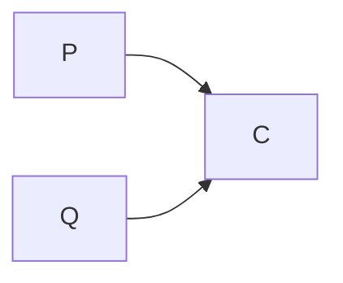
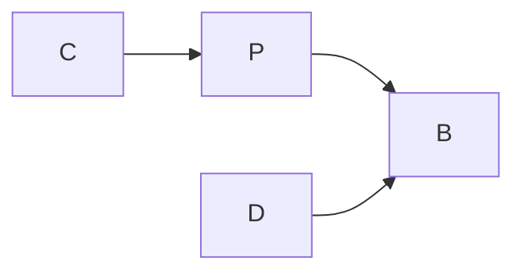
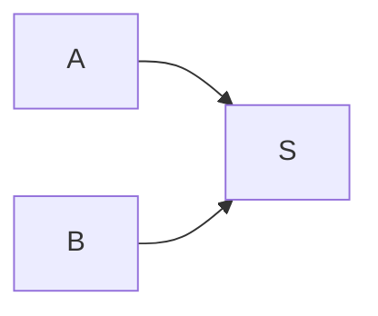

                 


# 企业AI Agent的因果推理在商业决策分析中的应用

**关键词**：企业AI Agent，因果推理，商业决策分析，因果图，反事实推理

**摘要**：本文详细探讨了企业AI Agent在商业决策分析中的因果推理应用。通过介绍因果推理的基本概念、核心理论、算法实现以及系统设计，展示了如何利用因果推理提升商业决策的科学性和准确性。文章还通过实际案例分析，说明了因果推理在客户行为分析、市场策略优化等方面的应用效果，最后总结了当前的研究成果和未来的发展方向。

---

# 第1章 企业AI Agent与因果推理概述

## 1.1 企业AI Agent的定义与特点

### 1.1.1 企业AI Agent的基本概念
企业AI Agent是一种能够感知环境、自主决策并执行任务的智能实体。它结合了人工智能、大数据分析和自动化技术，能够为企业提供智能化的决策支持和执行方案。

**特点**：
1. **自主性**：能够在没有人类干预的情况下完成任务。
2. **反应性**：能够实时感知环境变化并做出反应。
3. **学习能力**：通过数据和经验不断优化自身行为。
4. **协作性**：能够与其他系统或人员协同工作，提高整体效率。

### 1.1.2 AI Agent与传统数据分析的区别
传统数据分析主要基于相关性分析，而AI Agent通过因果推理能够识别变量之间的因果关系，从而做出更精准的预测和决策。

### 1.1.3 企业AI Agent的因果推理需求
在复杂的商业环境中，企业需要AI Agent能够识别因果关系，以优化资源配置、预测市场趋势和制定有效策略。

---

## 1.2 因果推理的基本概念

### 1.2.1 因果关系的定义
因果关系是指一个事件（原因）导致另一个事件（结果）发生的必然联系。在商业决策中，因果推理用于识别哪些变量是结果的直接驱动因素。

### 1.2.2 因果关系与相关关系的区别
相关关系描述两个变量之间的关联程度，而因果关系则明确一个变量是否是另一个变量变化的原因。

### 1.2.3 因果推理在商业决策中的作用
因果推理能够帮助企业在复杂的市场环境中识别关键驱动因素，优化资源配置，提高决策的准确性和效果。

---

## 1.3 企业AI Agent与因果推理的结合

### 1.3.1 企业AI Agent的因果推理需求
企业在制定策略时，需要AI Agent能够识别因果关系，以优化决策过程。

### 1.3.2 因果推理在商业决策中的应用场景
1. **客户行为分析**：识别影响客户购买行为的关键因素。
2. **市场策略优化**：确定最佳促销方案。
3. **风险评估**：预测和规避潜在风险。

### 1.3.3 因果推理的边界与外延
因果推理的应用需要考虑数据质量、模型假设和外部环境的不确定性。

---

## 1.4 本章小结
本章介绍了企业AI Agent的基本概念及其因果推理的需求，明确了因果推理在商业决策中的重要性。下一章将深入探讨因果推理的核心理论与方法。

---

# 第2章 因果推理的核心理论与方法

## 2.1 因果关系的数学模型

### 2.1.1 结构因果模型
结构因果模型（SCM）通过因果图描述变量之间的因果关系。例如，因果图中的箭头表示因果关系。

**示例**：因果图表示客户满意度（C）受产品质量（P）和价格（P）的影响。



### 2.1.2 潜在结果框架
潜在结果框架通过假设每个变量的可能取值，计算因果效应。例如，计算在不同价格下的客户购买概率。

### 2.1.3 铃声模型
铃声模型（Rubin causal model）通过反事实推理估计因果效应。例如，计算如果价格降低10%，销量会增加多少。

---

## 2.2 因果推理的基本算法

### 2.2.1 反事实推理
反事实推理通过假设相反的情况，估计因果效应。例如，计算如果客户看到广告，他们的购买概率会增加多少。

**代码示例**：
```python
import dowhy

# 构建因果图
graph = dowhy.CausalGraph()
graph.add_edges([("A", "Y"), ("B", "Y")])

# 估计因果效应
estimator = dowhy.do_why.DOWhy.doWhy("Y", ["A", "B"], graph)
effect = estimator.estimate_effect()
print("因果效应:", effect)
```

### 2.2.2 倾向评分法
倾向评分法通过匹配样本，减少混杂变量的影响。例如，评估广告对销售额的影响。

### 2.2.3 多阶段回归法
多阶段回归法通过分阶段建模，估计因果效应。例如，首先建模广告点击率，再建模购买概率。

---

## 2.3 因果推理的验证与评估

### 2.3.1 因果效应的估计方法
1. **平均处理效应（ATE）**：整体样本的平均因果效应。
2. **子群体处理效应（SUTVA）**：特定子群体的因果效应。

### 2.3.2 因果推理的验证指标
1. **平衡性检查**：验证处理组和对照组的混杂变量是否均衡。
2. **稳健性检验**：通过不同的算法或数据集验证结果的稳健性。

---

## 2.4 本章小结
本章详细介绍了因果推理的核心理论和基本算法，为后续章节的实现奠定了基础。下一章将探讨企业AI Agent的因果推理实现。

---

# 第3章 企业AI Agent的因果推理实现

## 3.1 因果图的构建与分析

### 3.1.1 因果图的构建方法
1. **领域知识驱动**：根据业务知识构建因果图。
2. **数据驱动**：通过数据分析发现变量之间的因果关系。

**示例**：构建客户购买行为的因果图。



### 3.1.2 因果图的分析步骤
1. **识别因果变量**：确定因果关系中的自变量和因变量。
2. **验证因果关系**：通过实验或数据分析验证因果图的准确性。

---

## 3.2 因果推理的算法实现

### 3.2.1 随机森林因果推断
随机森林通过集成学习估计因果效应。

**代码示例**：
```python
from sklearn.ensemble import RandomForestRegressor
import dowhy

# 构建随机森林模型
model = RandomForestRegressor()
model.fit(X, y)

# 估计因果效应
estimator = dowhy.do_why.RandomForestDoWhy.doWhy("Y", ["T"], X)
effect = estimator.estimate_effect()
print("因果效应:", effect)
```

### 3.2.2 神经网络因果推断
神经网络通过深度学习建模复杂的因果关系。

**代码示例**：
```python
import tensorflow as tf
from tensorflow.keras import layers

# 构建神经网络模型
model = tf.keras.Sequential([
    layers.Dense(64, activation='relu'),
    layers.Dense(1, activation='sigmoid')
])
model.compile(optimizer='adam', loss='binary_crossentropy')
model.fit(X_train, y_train, epochs=10)
```

### 3.2.3 DoWhy库
DoWhy是一个用于因果推理的Python库，支持多种因果分析方法。

**代码示例**：
```python
import dowhy

# 构建因果图
graph = dowhy.CausalGraph()
graph.add_edges([("T", "Y"), ("X", "Y")])

# 估计因果效应
estimator = dowhy.do_why.DOWhy.doWhy("Y", ["T"], graph)
effect = estimator.estimate_effect()
print("因果效应:", effect)
```

---

## 3.3 本章小结
本章详细介绍了企业AI Agent中因果推理的实现方法，包括因果图的构建和多种因果推理算法的实现。下一章将探讨因果推理在商业决策中的实际应用。

---

# 第4章 企业AI Agent的因果推理应用

## 4.1 客户行为分析

### 4.1.1 客户购买行为的因果分析
通过因果推理识别影响客户购买行为的关键因素，如价格、广告投放等。

**代码示例**：
```python
import dowhy

# 构建因果图
graph = dowhy.CausalGraph()
graph.add_edges([("P", "B"), ("A", "B")])

# 估计因果效应
estimator = dowhy.do_why.DOWhy.doWhy("B", ["P", "A"], graph)
effect = estimator.estimate_effect()
print("因果效应:", effect)
```

### 4.1.2 客户留存分析
通过因果推理分析客户留存的关键因素，如产品满意度、服务质量等。

---

## 4.2 市场策略优化

### 4.2.1 价格策略优化
通过因果推理确定最优价格，以最大化销售额或利润。

**代码示例**：
```python
import dowhy

# 构建因果图
graph = dowhy.CausalGraph()
graph.add_edges([("P", "S"), ("C", "S")])

# 估计因果效应
estimator = dowhy.do_why.DOWhy.doWhy("S", ["P", "C"], graph)
effect = estimator.estimate_effect()
print("因果效应:", effect)
```

### 4.2.2 广告策略优化
通过因果推理分析广告对销售额的影响，优化广告投放策略。

---

## 4.3 风险评估与管理

### 4.3.1 风险因素识别
通过因果推理识别影响企业风险的关键因素，如市场需求、供应链稳定性等。

### 4.3.2 风险预测与规避
通过因果推理预测潜在风险，并制定相应的规避策略。

---

## 4.4 本章小结
本章通过实际案例分析，展示了因果推理在客户行为分析、市场策略优化和风险评估中的应用效果。企业可以通过因果推理技术提升决策的科学性和准确性。

---

# 第5章 企业AI Agent的因果推理系统设计

## 5.1 系统功能设计

### 5.1.1 数据采集与处理
1. 数据源：企业内部数据、外部数据源。
2. 数据清洗：处理缺失值、异常值等。

### 5.1.2 因果图构建
1. 自动构建：基于领域知识或数据驱动构建因果图。
2. 手动调整：根据业务需求调整因果图。

### 5.1.3 因果推理计算
1. 算法选择：根据具体问题选择合适的因果推理算法。
2. 计算结果：输出因果效应和相关分析结果。

---

## 5.2 系统架构设计

### 5.2.1 分层架构
1. 数据层：存储原始数据和处理后的数据。
2. 业务逻辑层：处理因果推理计算。
3. 用户界面层：展示分析结果。

### 5.2.2 模块化设计
1. 数据采集模块：负责数据的采集和预处理。
2. 因果图构建模块：负责因果图的构建和验证。
3. 因果推理模块：负责因果效应的计算和输出。

---

## 5.3 系统接口设计

### 5.3.1 数据接口
1. 数据输入接口：接收原始数据。
2. 数据输出接口：输出处理后的数据。

### 5.3.2 因果图接口
1. 因果图构建接口：接收领域知识或数据驱动构建因果图。
2. 因果图验证接口：验证因果图的合理性。

---

## 5.4 系统交互设计

### 5.4.1 用户与系统的交互流程
1. 用户输入需求：如选择因果推理算法。
2. 系统响应：如返回因果效应结果。

### 5.4.2 系统与第三方服务的交互
1. 数据源接口：如调用外部API获取数据。
2. 第三方算法服务：如调用其他因果推理算法。

---

## 5.5 本章小结
本章详细描述了企业AI Agent因果推理系统的功能设计、架构设计和交互设计，为实际应用提供了参考。

---

# 第6章 项目实战：基于因果推理的企业决策优化

## 6.1 项目背景与目标

### 6.1.1 项目背景
某电商平台希望通过因果推理优化广告投放策略，提高销售额。

### 6.1.2 项目目标
识别广告投放对销售额的因果效应，优化广告投放策略。

---

## 6.2 项目实施步骤

### 6.2.1 数据收集
1. 数据来源：广告点击数据、销售额数据、客户行为数据。
2. 数据清洗：处理缺失值、异常值等。

### 6.2.2 因果图构建
1. 领域知识驱动：广告点击（A）影响销售额（S）。
2. 数据驱动：客户行为（B）也影响销售额（S）。

**因果图示例**：


### 6.2.3 因果推理计算
使用DoWhy库估计广告投放对销售额的因果效应。

**代码示例**：
```python
import dowhy

# 构建因果图
graph = dowhy.CausalGraph()
graph.add_edges([("A", "S"), ("B", "S")])

# 估计因果效应
estimator = dowhy.do_why.DOWhy.doWhy("S", ["A", "B"], graph)
effect = estimator.estimate_effect()
print("因果效应:", effect)
```

### 6.2.4 结果分析与策略优化
根据因果效应结果优化广告投放策略，例如增加广告预算或调整广告内容。

---

## 6.3 项目总结

### 6.3.1 实验结果
广告投放对销售额的因果效应为10%，即广告投放可以增加10%的销售额。

### 6.3.2 最佳实践
1. 确保数据质量：数据清洗和预处理是关键。
2. 选择合适的算法：根据具体情况选择合适的因果推理算法。
3. 结果验证：通过实验或数据分析验证因果效应的稳健性。

---

## 6.4 本章小结
本章通过实际项目实战，展示了因果推理在企业决策优化中的应用过程。从数据收集到结果分析，详细描述了项目的实施步骤和关键点。

---

# 第7章 总结与展望

## 7.1 本章总结
本文详细探讨了企业AI Agent在因果推理中的应用，从理论基础到算法实现，再到实际应用，全面展示了因果推理在商业决策中的重要性。

## 7.2 未来展望
随着人工智能和大数据技术的不断发展，因果推理在企业中的应用将更加广泛。未来的研究方向包括：
1. 开发更高效的因果推理算法。
2. 提升因果图的构建和验证方法。
3. 结合机器学习和因果推理，实现更智能的决策支持。

---

# 作者

作者：AI天才研究院/AI Genius Institute & 禅与计算机程序设计艺术 /Zen And The Art of Computer Programming

---

通过本文，读者可以全面了解企业AI Agent的因果推理在商业决策分析中的应用，掌握因果推理的核心理论和实际应用方法，为企业的智能化决策提供有力支持。

