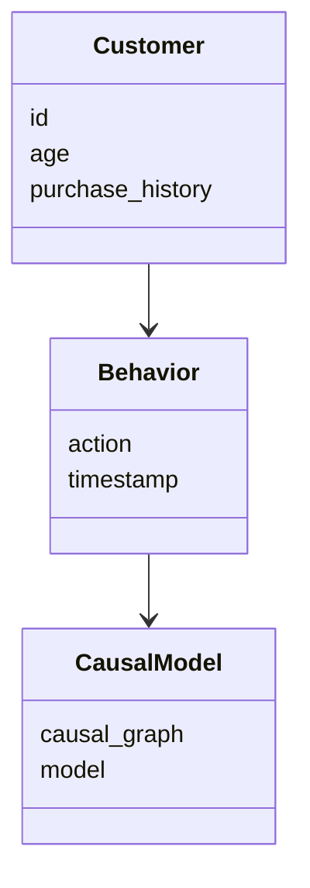
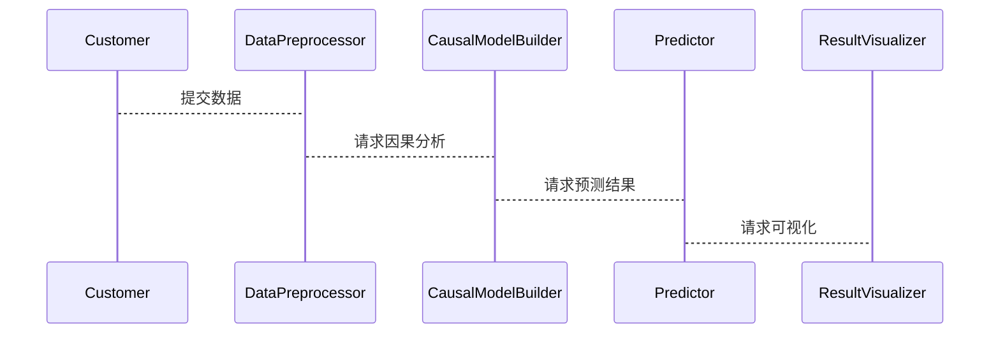

                 


# 《企业AI Agent的因果推理在客户行为分析与预测中的应用》

## 关键词：因果推理，AI Agent，客户行为分析，预测模型，数据挖掘

## 摘要：本文深入探讨了因果推理在企业AI Agent中的应用，特别是在客户行为分析与预测中的核心作用。通过系统性地分析因果推理的基本原理、AI Agent的构建与功能，以及实际项目中的应用，本文展示了如何利用因果推理提升客户行为预测的准确性和可解释性。结合数学模型、算法实现和系统架构设计，本文为读者提供了从理论到实践的全面指导。

---

# 第一章：企业AI Agent与因果推理概述

## 1.1 问题背景与描述
### 1.1.1 传统客户行为分析的局限性
传统统计方法仅能识别相关性，无法揭示因果关系。例如，尽管广告投放与销售额增长相关，但广告投放是否真正导致销售额增长难以确定。

### 1.1.2 因果推理在客户行为分析中的优势
因果推理能够揭示变量间的因果关系，例如广告投放确实导致销售额增长。这使得企业能够更准确地预测客户行为并优化决策。

### 1.1.3 企业AI Agent的核心目标与价值
企业AI Agent通过整合因果推理技术，能够实时分析客户行为，提供个性化服务，从而提升客户满意度和企业收益。

## 1.2 问题解决与边界
### 1.2.1 因果推理在客户行为预测中的应用边界
因果推理适用于揭示变量间直接因果关系，但无法完全消除外部干扰因素的影响。

### 1.2.2 企业AI Agent的适用场景与限制
AI Agent适用于数据丰富的场景，但在数据稀缺或不完整的情况下，其表现可能受限。

### 1.2.3 客户行为分析的因果关系建模框架
包括数据采集、因果图构建、模型训练和效果评估等步骤。

## 1.3 概念结构与核心要素
### 1.3.1 因果推理的基本概念与属性
因果关系具有可解释性、可操作性和可验证性等特征。

### 1.3.2 企业AI Agent的核心组成与功能
包括感知、决策、执行和反馈模块。

### 1.3.3 客户行为分析的因果关系模型
通过因果图模型（如DAG）描述客户行为的因果关系。

## 1.4 本章小结
本章介绍了企业AI Agent与因果推理的基本概念，分析了因果推理在客户行为分析中的优势及应用边界。

---

# 第二章：因果推理的原理与方法

## 2.1 因果推理的基本原理
### 2.1.1 因果关系的定义与特征
因果关系是指一个事件（原因）导致另一个事件（结果）发生。

### 2.1.2 因果图模型与结构方程
因果图模型通过节点和边表示变量间的因果关系。结构方程模型（SEM）用于描述变量间的因果关系。

### 2.1.3 调整因果关系的方法
通过后门调整或前门调整等方法，消除混杂变量的影响。

## 2.2 AI Agent的核心概念
### 2.2.1 AI Agent的定义与分类
AI Agent是具有感知环境、自主决策和执行任务能力的智能体。按智能水平可分为反应式和认知式AI Agent。

### 2.2.2 企业级AI Agent的特征与能力
企业级AI Agent具备数据驱动决策、复杂问题解决和持续学习能力。

### 2.2.3 因果推理在AI Agent中的作用
因果推理帮助AI Agent理解变量间的因果关系，提升决策的准确性和可解释性。

## 2.3 因果推理与客户行为分析的关系
### 2.3.1 因果推理在客户行为预测中的优势
因果推理能够揭示客户行为的驱动因素，提升预测的准确性。

### 2.3.2 客户行为分析的因果关系建模
通过因果图模型识别关键影响因素，构建因果关系模型。

### 2.3.3 企业AI Agent在因果推理中的应用
AI Agent利用因果推理技术，实时分析客户行为，优化决策。

## 2.4 核心概念对比表
| 概念 | 定义 | 特征 | 应用场景 |
|------|------|------|----------|
| 因果推理 | 研究变量间因果关系的方法 | 可解释性、可操作性 | 客户行为预测、决策优化 |
| AI Agent | 具有自主决策能力的智能体 | 智能性、适应性 | 个性化推荐、行为预测 |

## 2.5 ER实体关系图
```mermaid
graph LR
    A[客户] --> B[行为]
    B --> C[因果关系]
    C --> D[预测模型]
    D --> E[

---

# 第三章：因果推理的算法原理

## 3.1 因果推理的数学模型
### 3.1.1 结构方程模型（SEM）
通过方程描述变量间的因果关系，例如：
$$ y = \beta x + \gamma z + \epsilon $$
其中，$y$ 是结果变量，$x$ 是原因变量，$z$ 是混杂变量，$\epsilon$ 是误差项。

### 3.1.2 隐马尔可夫模型（HMM）
用于处理时间序列数据中的因果关系，例如客户购买行为的时间序列分析。

### 3.1.3 因子分析模型
通过因子分析揭示变量间的潜在因果关系。

## 3.2 因果图的构建与处理
### 3.2.1 因果图的构建步骤
1. 确定变量：收集相关变量，如客户年龄、购买历史等。
2. 建立关系：绘制因果图，确定变量间的因果关系。
3. 调整模型：消除混杂变量，验证因果关系。

### 3.2.2 mermaid流程图
```mermaid
graph LR
    A[客户年龄] --> B[购买意愿]
    B --> C[购买行为]
    D[广告投放] --> C
```

## 3.3 Python代码实现
### 3.3.1 数据加载与处理
```python
import pandas as pd
data = pd.read_csv('customer_data.csv')
```

### 3.3.2 因果分析实现
```python
from dolearn import causalforest
model = causalforest.CausalForest()
model.fit(data[['age', 'advertisement']], data['purchase'])
```

## 3.4 本章小结
本章详细讲解了因果推理的数学模型和算法实现，为后续应用奠定了理论基础。

---

# 第四章：系统分析与架构设计

## 4.1 项目介绍
### 4.1.1 项目目标
构建一个基于因果推理的企业AI Agent系统，用于客户行为分析与预测。

### 4.1.2 项目范围
涵盖数据采集、因果图构建、模型训练和结果展示等功能。

## 4.2 系统功能设计
### 4.2.1 领域模型


### 4.2.2 功能模块
- 数据采集模块：收集客户行为数据。
- 数据处理模块：清洗和预处理数据。
- 因果分析模块：构建因果图并训练模型。
- 预测模块：基于因果模型预测客户行为。
- 展示模块：可视化结果。

## 4.3 系统架构设计
### 4.3.1 分层架构
- 数据采集层：接收和存储数据。
- 数据处理层：清洗和预处理数据。
- 分析层：构建因果图，训练模型。
- 展示层：可视化结果。

### 4.3.2 系统架构图


## 4.4 接口设计
### 4.4.1 API接口
- 数据接口：提供数据采集和存储的API。
- 分析接口：提供因果图构建和模型训练的API。
- 展示接口：提供结果查询和可视化的API。

### 4.4.2 交互流程


## 4.5 本章小结
本章详细设计了系统的功能模块和架构，为项目的实施提供了指导。

---

# 第五章：项目实战——电商客户流失预测

## 5.1 项目介绍
### 5.1.1 项目目标
预测电商客户流失，优化客户 retention 策略。

## 5.2 环境安装
### 5.2.1 安装Python依赖
```bash
pip install pandas scikit-learn dolearn
```

## 5.3 数据预处理
### 5.3.1 数据加载
```python
import pandas as pd
data = pd.read_csv('customer_churn.csv')
```

### 5.3.2 数据清洗
```python
data.dropna(inplace=True)
```

## 5.4 特征工程
### 5.4.1 特征选择
```python
selected_features = ['age', 'purchase_frequency', 'advertisement']
```

## 5.5 模型训练
### 5.5.1 数据分割
```python
from sklearn.model_selection import train_test_split
X_train, X_test, y_train, y_test = train_test_split(data[selected_features], data['churn'])
```

### 5.5.2 因果分析
```python
from dolearn import causalforest
model = causalforest.CausalForest()
model.fit(X_train, y_train)
```

### 5.5.3 模型评估
```python
score = model.score(X_test, y_test)
print(f'模型准确率：{score}')
```

## 5.6 模型部署
### 5.6.1 保存模型
```python
import joblib
joblib.dump(model, 'customer_churn_model.pkl')
```

### 5.6.2 模型加载与预测
```python
model = joblib.load('customer_churn_model.pkl')
new_customer = pd.DataFrame({'age': [30], 'purchase_frequency': [2], 'advertisement': [1]})
prediction = model.predict(new_customer)
print(f'预测结果：{prediction}')
```

## 5.7 案例分析
### 5.7.1 案例描述
通过因果推理模型，预测客户流失并提出优化建议。

### 5.7.2 数据分析
分析客户流失的主要原因，如客户年龄偏大、购买频率下降等。

### 5.7.3 优化建议
优化广告投放策略，提升客户购买频率，降低客户流失率。

## 5.8 本章小结
本章通过实际案例展示了因果推理在客户行为预测中的应用，提供了从数据预处理到模型部署的完整流程。

---

# 第六章：最佳实践与注意事项

## 6.1 最佳实践
### 6.1.1 数据质量
确保数据的完整性、准确性和代表性。

### 6.1.2 模型解释性
选择可解释性强的因果推理模型，便于业务人员理解和应用。

### 6.1.3 模型更新
定期更新模型，以适应数据分布的变化。

## 6.2 小结
因果推理在客户行为分析与预测中具有重要的应用价值，企业应充分利用AI Agent技术提升决策能力。

## 6.3 注意事项
- 数据隐私保护
- 模型的可解释性
- 外部干扰因素的处理

## 6.4 拓展阅读
推荐阅读《因果推理入门》和《AI Agent设计与实现》等书籍，深入理解因果推理和AI Agent技术。

---

# 作者：AI天才研究院/AI Genius Institute & 禅与计算机程序设计艺术 /Zen And The Art of Computer Programming

---

通过以上目录，我们可以看到，文章从背景介绍、核心概念、算法原理、系统架构、项目实战到最佳实践，全面而系统地探讨了企业AI Agent的因果推理在客户行为分析与预测中的应用。文章结构清晰，内容详实，既有理论分析，又有实践指导，为读者提供了从理论到实践的完整指南。

