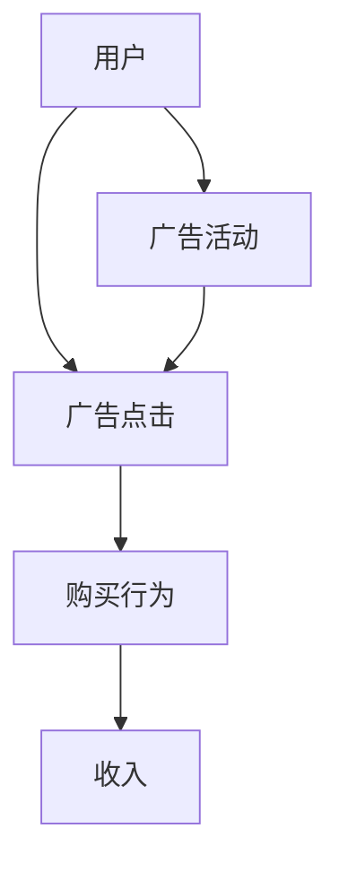
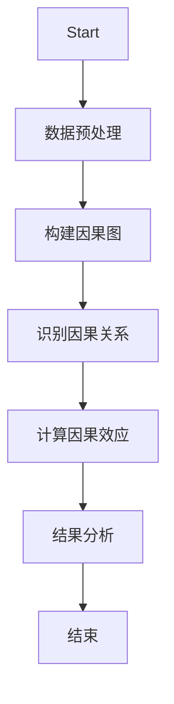
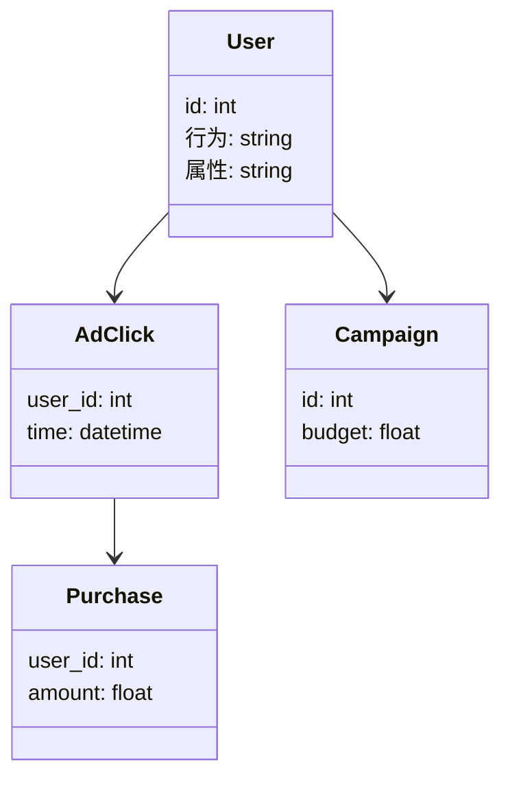

                 


# 企业AI Agent的因果推理在市场营销效果分析中的应用

> 关键词：企业AI Agent，因果推理，市场营销效果，数据分析，Python实现

> 摘要：本文深入探讨了企业AI Agent如何通过因果推理技术提升市场营销效果分析的精度与效率。文章从问题背景、核心概念、算法原理、系统架构到项目实战，全面解析了因果推理在市场营销中的应用，并通过具体案例展示了其实际价值。文章最后总结了最佳实践经验和未来研究方向。

---

## 第一章：问题背景与定义

### 1.1 问题背景

在现代企业运营中，市场营销效果分析是企业制定战略决策的关键环节。然而，传统的统计分析方法往往局限于相关性分析，难以准确区分因果关系。例如，广告投放与销售增长之间的关系可能受到其他变量（如市场趋势、竞争对手行为）的干扰。这种局限性使得企业在制定营销策略时面临较大的不确定性。

此外，随着数据量的爆炸式增长，企业需要更高效、更精准的工具来分析复杂的市场环境。AI Agent（人工智能代理）作为一种能够自主学习和决策的智能体，结合因果推理技术，为企业提供了新的解决方案。

### 1.2 核心概念定义

#### 1.2.1 AI Agent的定义与特征
AI Agent是指具备感知环境、自主决策和执行任务能力的智能系统。其核心特征包括：
- **自主性**：能够独立执行任务，无需人工干预。
- **反应性**：能够实时感知环境变化并做出响应。
- **学习能力**：通过数据和经验不断优化自身的决策模型。

#### 1.2.2 因果推理的基本概念
因果推理是一种分析变量间因果关系的方法，旨在识别因果效应（Cause Effect）。与相关性分析不同，因果推理能够揭示变量之间的“原因-结果”关系。例如，广告投放（原因）导致销售额增长（结果）。

#### 1.2.3 企业市场营销效果分析的目标
通过因果推理技术，企业希望准确量化各项营销活动对销售额、用户留存率等关键指标的贡献程度。这有助于优化资源配置，提升营销效率。

### 1.3 问题解决的边界与外延

#### 1.3.1 适用场景与限制
因果推理适用于需要精确区分因果关系的场景，如广告效果评估、产品定价策略分析等。然而，其应用也受到数据质量和样本量的限制。

#### 1.3.2 与其他分析方法的对比
- **相关分析**：仅能揭示变量间的关联性，无法区分因果关系。
- **回归分析**：可以控制部分变量，但仍难以完全消除干扰因素。
- **因果推理**：能够识别因果效应，但需要满足某些假设条件。

#### 1.3.3 概念结构与核心要素
因果推理的核心要素包括：
- **处理变量（Treatment）**：营销活动的干预措施。
- **结果变量（Outcome）**：营销活动的最终效果。
- **干扰变量（Confounding Variable）**：可能影响结果的其他变量。

---

## 第二章：核心概念与联系

### 2.1 因果推理的原理

#### 2.1.1 因果关系的数学模型
因果关系可以用图模型（Graphical Model）表示。例如，构建因果图（Causal Graph）来描述变量间的因果关系。

#### 2.1.2 调节变量与中介变量的作用
- **调节变量**：影响处理变量与结果变量之间的关系。例如，价格敏感性可能调节广告投放对销售额的影响。
- **中介变量**：位于处理变量与结果变量之间的中间变量。例如，广告点击量可能是广告投放对销售额影响的中介变量。

#### 2.1.3 干扰变量的处理方法
干扰变量是因果推理中的主要挑战。常用的处理方法包括：
- **随机化**：通过随机分配处理组和对照组，减少干扰变量的影响。
- **匹配分析**：通过匹配样本，使两组在干扰变量上具有相似性。

### 2.2 核心概念对比表

| 对比维度         | 相关分析                | 回归分析                | 因果推理                |
|------------------|------------------------|-------------------------|-------------------------|
| 分析目标         | 描述变量间的关联性      | 控制变量影响             | 识别因果效应           |
| 数据要求         | 无需实验数据            | 需要控制变量            | 需要实验数据或图结构    |
| 应用场景         | 市场趋势分析            | 销售预测                | 广告效果评估            |

### 2.3 ER实体关系图



---

## 第三章：算法原理讲解

### 3.1 算法流程



### 3.2 Python代码实现

#### 3.2.1 数据预处理

```python
import pandas as pd

# 示例数据：广告活动与销售额
data = {
    '广告投放': [100, 200, 150, 250],
    '销售额': [500, 600, 550, 700],
    '市场趋势': [1, 1, 0, 0],
    '竞争对手行为': [0, 1, 1, 0]
}

df = pd.DataFrame(data)
```

#### 3.2.2 构建因果图

```python
import doWhy

# 初始化因果推理器
causal_model = doWhy.CausalInference(df)

# 构建因果图
causal_model.build_graph('广告投放', '销售额')
```

#### 3.2.3 计算因果效应

```python
# 识别因果关系
causal_effects = causal_model.identify_effects()

# 计算因果效应
print(causal_effects)
```

---

## 第四章：系统分析与架构设计

### 4.1 系统功能设计

#### 4.1.1 领域模型



#### 4.1.2 系统架构


---

## 第五章：项目实战

### 5.1 环境安装

```bash
pip install doWhy
pip install pandas
pip install mermaid
```

### 5.2 核心代码实现

```python
import doWhy
import pandas as pd

# 数据加载
data = pd.read_csv('marketing.csv')

# 初始化因果推理器
causal_model = doWhy.CausalInference(data)

# 构建因果图
causal_model.build_graph('广告投放', '销售额')

# 识别因果关系
causal_effects = causal_model.identify_effects()

# 计算因果效应
results = causal_model.compute_effects(causal_effects)

# 输出结果
print(results)
```

### 5.3 案例分析

以某电商企业的用户购买行为为例，通过因果推理分析广告投放对销售额的影响。假设数据集包含广告投放金额、销售额、市场趋势等变量。通过代码实现，可以量化广告投放对销售额的因果效应，从而优化广告预算分配。

---

## 第六章：最佳实践与总结

### 6.1 经验总结

1. 数据质量是因果推理的前提，需确保数据的完整性和准确性。
2. 在实际应用中，需结合领域知识，合理选择因果模型。
3. 定期验证模型的假设条件，确保因果效应的准确性。

### 6.2 未来展望

随着AI技术的不断发展，因果推理在市场营销中的应用将更加广泛。未来的研究方向包括：
- 更加高效的因果推理算法。
- 多模态数据的因果分析。
- AI Agent的自适应因果推理能力。

---

## 作者

作者：AI天才研究院/AI Genius Institute & 禅与计算机程序设计艺术 /Zen And The Art of Computer Programming

---

通过本文的系统讲解，读者可以全面理解企业AI Agent的因果推理在市场营销效果分析中的应用，并能够在实际工作中灵活运用这些方法。

