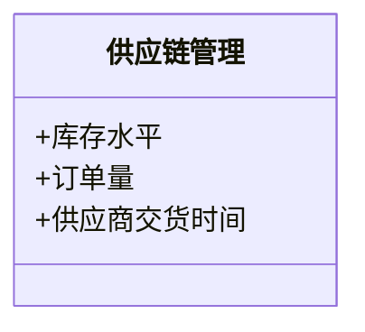
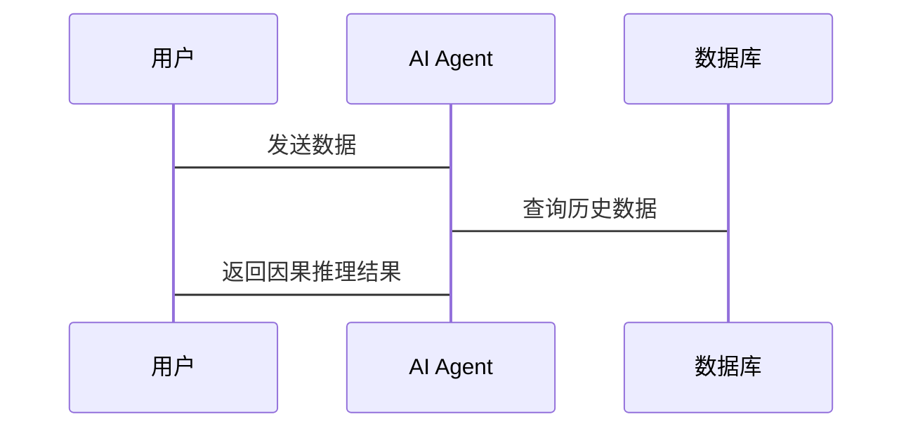

                 


# 企业AI Agent的因果推理应用：深入理解业务逻辑

## 关键词：企业AI Agent, 因果推理, 业务逻辑, AI系统设计, 系统架构, 数学建模

## 摘要：  
本文深入探讨了企业AI Agent在因果推理中的应用，分析了因果推理在业务逻辑理解中的核心作用。通过系统性的理论分析与实践案例，本文详细介绍了因果推理的基本原理、算法实现、系统架构设计以及在企业场景中的实际应用。文章还结合具体的Python代码实现和数学公式推导，帮助读者全面理解因果推理在企业AI Agent中的重要性与应用价值。

---

# 第1章 企业AI Agent与因果推理概述

## 1.1 问题背景与问题描述

### 1.1.1 企业AI Agent的核心需求  
企业在数字化转型过程中，面临着复杂多变的业务环境。AI Agent（智能代理）通过自动化决策和执行任务，帮助企业优化资源配置、提升效率。然而，传统的基于相关性的分析方法无法有效理解事件之间的因果关系，导致决策失误或效率低下。

### 1.1.2 传统统计学习的局限性  
传统统计学习方法（如回归分析、关联规则挖掘）主要关注变量之间的相关性，而非因果关系。这种局限性在处理复杂的业务场景时尤为明显，例如因果关系的缺失会导致对业务逻辑的理解偏差。

### 1.1.3 因果推理在企业中的重要性  
因果推理通过识别变量之间的因果关系，能够更准确地理解业务逻辑，从而优化决策过程。例如，在供应链管理中，因果推理可以帮助企业识别哪些因素直接影响库存水平，从而优化库存管理策略。

## 1.2 问题解决与边界定义

### 1.2.1 因果推理的基本目标  
因果推理的目标是通过数据识别变量之间的因果关系，并基于这些关系进行预测和决策。

### 1.2.2 问题的边界与外延  
因果推理的应用范围包括业务流程优化、风险分析、预测建模等领域，但不包括完全随机或无因果关系的数据分析。

### 1.2.3 核心要素与概念结构  
因果推理的核心要素包括：  
1. 因变量（Outcome）：事件的结果。  
2. 自变量（Treatment）：可能影响结果的因素。  
3. 中介变量（Mediator）：介于自变量和因变量之间的变量。  
4. 干扰变量（Collider）：同时受多个变量影响的变量。

---

# 第2章 因果推理的核心概念与联系

## 2.1 因果推理的基本原理

### 2.1.1 因果关系的定义  
因果关系是指一个变量（原因）对另一个变量（结果）具有直接影响。例如，降雨（原因）导致地面湿滑（结果）。

### 2.1.2 因果链与因果结构  
因果链是多个因果关系的序列，因果结构是描述因果关系的图形化表示。

### 2.1.3 因果推理的基本假设  
1. **可忽略性假设（Ignorability Assumption）**：所有潜在的干扰变量都可以被观察到。  
2. **无干扰假设（No Interference Assumption）**：一个单位的处理不会影响其他单位的结果。

## 2.2 相关性与因果性的对比

### 2.2.1 相关性分析的局限性  
相关性分析只能识别变量之间的关联，无法确定因果关系。例如，身高和体重的相关性并不能说明身高是体重的原因。

### 2.2.2 因果性分析的优势  
因果性分析能够识别变量之间的因果关系，从而支持更可靠的决策。

### 2.2.3 两者的联系与区别  
- **联系**：因果关系必然伴随相关性，但相关性并不一定意味着因果关系。  
- **区别**：因果关系需要满足可忽略性和无干扰假设，而相关性分析不需要。

## 2.3 实体关系图与因果推理

### 2.3.1 ER实体关系图的基本结构  
ER图用于描述数据库中的实体及其关系。在因果推理中，ER图可以扩展为因果关系图。

### 2.3.2 因果推理的ER图扩展  
通过在ER图中添加因果关系箭头，可以更清晰地表示变量之间的因果关系。

### 2.3.3 实体间因果关系的表示  
使用Mermaid流程图表示因果关系：


---

# 第3章 因果推理的算法原理

## 3.1 潜在结果框架

### 3.1.1 潜在结果的定义  
潜在结果是指在特定处理下，每个单位的可能结果。

### 3.1.2 潜在结果的计算流程  
1. 确定处理变量和结果变量。  
2. 估计潜在结果的分布。  
3. 计算因果效应。

### 3.1.3 潜在结果的假设检验  
通过假设检验验证因果关系的存在性。

## 3.2 结构方程模型

### 3.2.1 结构方程模型的基本原理  
结构方程模型通过方程描述变量之间的因果关系。

### 3.2.2 结构方程模型的构建步骤  
1. 确定变量之间的因果关系。  
2. 构建方程组。  
3. 估计参数。  
4. 验证模型。

### 3.2.3 结构方程模型的优缺点  
- **优点**：能够处理复杂的因果关系。  
- **缺点**：需要假设变量之间的线性关系。

## 3.3 因果图模型

### 3.3.1 因果图的基本结构  
因果图通过有向边表示变量之间的因果关系。

### 3.3.2 因果图的推理算法  
1. 确定因果图的结构。  
2. 计算因果效应。  
3. 更新因果图。

### 3.3.3 因果图的可解释性  
因果图能够清晰地展示变量之间的因果关系，具有较高的可解释性。

---

# 第4章 因果推理的数学模型与公式

## 4.1 潜在结果的数学表达

### 4.1.1 潜在结果的定义  
$$Y_i = \text{如果接受处理 } D_i=1 \text{，否则 } Y_i=0$$

### 4.1.2 平均因果效应的计算  
$$ATE = E[Y_i | D_i=1] - E[Y_i | D_i=0]$$

## 4.2 结构方程模型的数学表达

### 4.2.1 方程组的构建  
$$Y = \beta X + \gamma D + \epsilon$$

### 4.2.2 参数估计  
$$\hat{\beta} = \frac{Cov(X, Y)}{Var(X)}$$

## 4.3 因果图模型的数学表达

### 4.3.1 因果效应的计算  
$$P(Y=1 | do(D=1)) = P(Y=1 | parents(D)=d)$$

### 4.3.2 中介效应的计算  
$$ME = P(Y=1 | do(D=1)) - P(Y=1 | do(D=1, M=1))$$

---

# 第5章 系统分析与架构设计

## 5.1 问题场景介绍

### 5.1.1 项目背景  
以供应链管理为例，企业希望通过因果推理优化库存管理。

### 5.1.2 项目目标  
通过因果推理分析库存水平的影响因素。

## 5.2 系统功能设计

### 5.2.1 领域模型设计  
使用Mermaid类图表示领域模型：



### 5.2.2 系统架构设计  
使用Mermaid架构图表示系统架构：

```mermaid
docker
    节点1：AI Agent
    节点2：数据库
    节点3：用户界面
```

### 5.2.3 系统接口设计  
API接口设计：

```python
class AI_Agent:
    def __init__(self, data):
        self.data = data

    def causal_inference(self):
        # 实现因果推理算法
        pass
```

### 5.2.4 系统交互设计  
使用Mermaid序列图表示系统交互：



---

# 第6章 项目实战

## 6.1 环境安装与配置

### 6.1.1 安装Python环境  
使用Anaconda安装Python 3.8及以上版本。

### 6.1.2 安装依赖库  
安装以下库：  
```
pip install numpy pandas sklearn
```

## 6.2 核心代码实现

### 6.2.1 数据预处理  
```python
import pandas as pd

data = pd.read_csv('data.csv')
data.dropna(inplace=True)
```

### 6.2.2 因果推理算法实现  
```python
from causallearn import causal_inference

model = causal_inference.CausalModel(data)
result = model.estimate_causal_effects()
```

### 6.2.3 结果可视化  
```python
import matplotlib.pyplot as plt

plt.bar(result.treatments, result.effects)
plt.show()
```

## 6.3 案例分析与解读

### 6.3.1 案例背景  
以供应链管理中的库存优化为例。

### 6.3.2 数据分析  
分析库存水平与订单量、供应商交货时间之间的因果关系。

### 6.3.3 结果解读  
通过因果推理算法，识别出订单量是库存水平的主要影响因素。

## 6.4 项目小结

---

# 第7章 最佳实践与总结

## 7.1 最佳实践 Tips

### 7.1.1 数据质量的重要性  
确保数据的完整性和准确性。  
**提示**：数据清洗是因果推理的前提。

### 7.1.2 模型选择的策略  
根据业务需求选择合适的因果推理算法。  
**提示**：结构方程模型适合复杂场景。

### 7.1.3 结果验证的方法  
通过假设检验验证因果关系的显著性。  
**提示**：使用交叉验证提高模型的可靠性。

## 7.2 小结与展望

### 7.2.1 小结  
因果推理是企业AI Agent理解业务逻辑的核心技术，能够帮助企业在复杂场景中做出更明智的决策。

### 7.2.2 展望  
随着AI技术的不断发展，因果推理在企业中的应用将更加广泛，尤其是在智能决策和自动化系统领域。

---

## 作者：AI天才研究院/AI Genius Institute & 禅与计算机程序设计艺术 /Zen And The Art of Computer Programming

---

这篇文章从理论到实践，全面介绍了企业AI Agent的因果推理应用，结合了数学建模、算法实现和系统设计，帮助读者深入理解因果推理的核心原理和实际应用价值。通过具体的Python代码实现和案例分析，读者可以更好地掌握因果推理在企业中的应用技巧。

