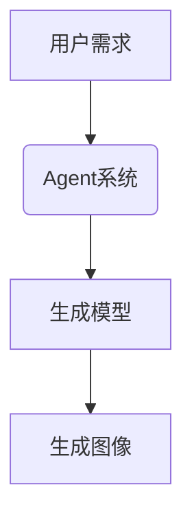
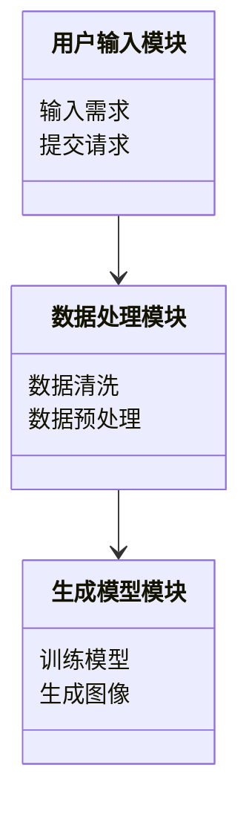
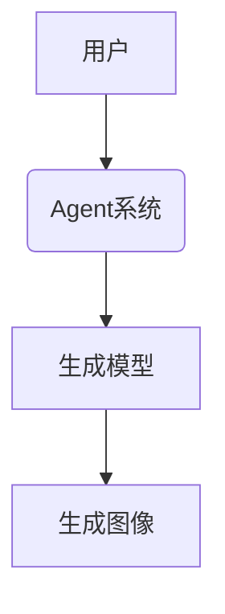
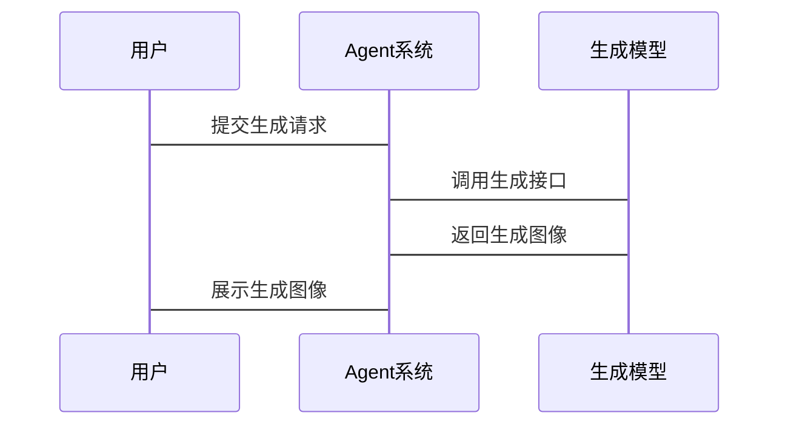

                 


# 企业AI Agent的图像生成技术：产品设计与营销创意

> 关键词：AI Agent，图像生成，生成对抗网络，变分自编码器，营销创意，企业应用

> 摘要：本文深入探讨了企业AI Agent在图像生成技术中的应用，结合产品设计与营销创意的双重需求，分析了图像生成技术的核心算法原理、系统架构设计以及实际应用场景。通过详细的技术解析和案例分析，为企业的数字化转型提供了新的思路和解决方案。

---

## 第一部分：企业AI Agent的图像生成技术概述

### 第1章：AI Agent与图像生成技术的背景介绍

#### 1.1 问题背景与问题描述

**1.1.1 企业AI Agent的定义与核心概念**

AI Agent（人工智能代理）是一种能够感知环境、执行任务并做出决策的智能系统。在企业环境中，AI Agent通常用于自动化操作、数据分析、用户交互和内容生成等场景。图像生成技术作为AI Agent的核心能力之一，能够通过算法生成高质量的图像、图形和视觉内容。

**1.1.2 图像生成技术的现状与挑战**

图像生成技术经历了从早期的手工绘制到现在的智能化生成的演变。随着深度学习技术的发展，生成对抗网络（GAN）和变分自编码器（VAE）等算法的出现，使得图像生成技术取得了显著进步。然而，企业在实际应用中仍然面临以下挑战：

1. **生成质量**：生成的图像是否符合企业品牌风格和视觉要求。
2. **生成效率**：在大规模数据处理和实时生成场景中的性能问题。
3. **可控制性**：如何通过输入参数精准控制生成图像的风格、颜色和内容。

**1.1.3 企业AI Agent在图像生成中的应用场景**

AI Agent在图像生成中的应用场景广泛，包括但不限于：

- **产品设计**：生成产品原型、设计草图和视觉方案。
- **营销创意**：生成广告素材、社交媒体内容和品牌视觉。
- **数据可视化**：将复杂的数据转化为直观的图表和图像。

#### 1.2 问题解决与边界定义

**1.2.1 AI Agent在图像生成中的问题解决框架**

AI Agent通过以下步骤解决图像生成问题：

1. **需求分析**：理解用户的需求，提取关键参数。
2. **数据准备**：收集和预处理相关数据。
3. **模型训练**：训练生成模型，优化生成效果。
4. **生成与优化**：生成图像并进行质量评估和优化。

**1.2.2 图像生成技术的边界与外延**

- **边界**：图像生成技术专注于生成高质量的视觉内容，不涉及图像识别和分类。
- **外延**：结合自然语言处理（NLP）技术，生成与图像相关的文案和描述。

**1.2.3 企业AI Agent图像生成的实现路径**

实现路径包括以下步骤：

1. **需求分析与系统设计**：明确需求，设计系统架构。
2. **数据收集与预处理**：收集相关数据并进行清洗。
3. **模型训练与优化**：选择合适的算法，训练模型并优化性能。
4. **系统集成与测试**：将模型集成到AI Agent中，进行功能测试和性能调优。

---

## 第二部分：AI Agent与图像生成技术的核心概念与联系

### 第2章：核心概念与联系

#### 2.1 核心概念原理

**2.1.1 AI Agent的基本原理**

AI Agent通过感知环境、理解需求、生成内容和反馈优化，实现图像生成任务。其核心在于将用户需求转化为可执行的指令，并通过算法生成满足要求的图像。

**2.1.2 图像生成技术的原理与分类**

图像生成技术主要分为两类：

1. **生成对抗网络（GAN）**：通过生成器和判别器的对抗训练生成高质量图像。
2. **变分自编码器（VAE）**：通过编码器和解码器实现图像的生成。

**2.1.3 企业AI Agent图像生成的系统架构**

系统架构包括以下模块：

1. **用户输入模块**：接收用户的生成需求。
2. **数据处理模块**：对输入数据进行预处理。
3. **生成模型模块**：训练和生成图像。
4. **输出与反馈模块**：输出生成图像并收集反馈。

#### 2.2 核心概念属性对比表

| **技术**       | **核心原理**                       | **优缺点**                       |
|----------------|------------------------------------|----------------------------------|
| GAN            | 生成器和判别器对抗训练             | 生成质量高，但训练不稳定         |
| VAE            | 编码器和解码器协同工作             | 训练稳定，但生成质量较低         |

#### 2.3 ER实体关系图



---

## 第三部分：AI Agent图像生成的算法原理

### 第3章：算法原理讲解

#### 3.1 算法原理讲解

**3.1.1 基于生成对抗网络（GAN）的图像生成**

生成对抗网络由生成器和判别器组成。生成器通过对抗判别器生成逼真的图像，而判别器则试图区分生成图像和真实图像。

**3.1.2 变分自编码器（VAE）的图像生成**

变分自编码器通过编码器将输入数据映射到潜在空间，再通过解码器将潜在空间的数据解码为生成图像。

#### 3.2 数学模型与公式

**生成对抗网络的损失函数**

$$ \mathcal{L} = \mathbb{E}_{x,y}[\log(D(x))] + \mathbb{E}_{z}[ \log(1 - D(G(z)))] $$

**变分自编码器的损失函数**

$$ \mathcal{L} = \mathbb{E}_{x}[ \log p(x|z)] + \mathbb{E}_{z}[ \log p(z)] - \mathbb{E}_{z}[ \log q(z|x)] $$

---

## 第四部分：系统分析与架构设计方案

### 第4章：系统架构设计

#### 4.1 项目介绍

本项目旨在设计一个基于AI Agent的图像生成系统，用于企业的产品设计和营销创意。

#### 4.2 系统功能设计

**4.2.1 领域模型**



**4.2.2 系统架构**



**4.2.3 系统接口设计**

- **输入接口**：接收用户的生成需求。
- **输出接口**：输出生成的图像。

**4.2.4 系统交互**



---

## 第五部分：项目实战

### 第5章：项目实战

#### 5.1 环境安装

安装必要的库和工具：

```bash
pip install numpy
pip install tensorflow
pip install matplotlib
```

#### 5.2 核心实现

```python
import numpy as np
import tensorflow as tf

# 定义生成器
def generator():
    model = tf.keras.Sequential([
        tf.keras.layers.Dense(256, activation='relu'),
        tf.keras.layers.Dense(128, activation='relu'),
        tf.keras.layers.Dense(64, activation='relu'),
        tf.keras.layers.Dense(32, activation='relu'),
        tf.keras.layers.Dense(16, activation='relu'),
        tf.keras.layers.Dense(3, activation='sigmoid')
    ])
    return model

# 定义判别器
def discriminator():
    model = tf.keras.Sequential([
        tf.keras.layers.Dense(64, activation='relu'),
        tf.keras.layers.Dense(32, activation='relu'),
        tf.keras.layers.Dense(1, activation='sigmoid')
    ])
    return model
```

#### 5.3 案例分析与实现解读

**案例分析：生成企业品牌Logo**

通过训练生成器和判别器，生成符合企业品牌风格的Logo。

**代码实现**

```python
# 训练GAN模型
def train_gan():
    generator = generator()
    discriminator = discriminator()
    # 定义损失函数和优化器
    cross_entropy = tf.keras.losses.BinaryCrossentropy()
    generator_optimizer = tf.keras.optimizers.Adam(0.0002)
    discriminator_optimizer = tf.keras.optimizers.Adam(0.0002)
    # 定义训练循环
    for epoch in range(100):
        for _ in range(100):
            noise = tf.random.normal([batch_size, 16])
            generated_images = generator(noise)
            real_images = tf.random.uniform([batch_size, 3])
            # 判别器训练
            with tf.GradientTape() as tape:
                real_output = discriminator(real_images)
                generated_output = discriminator(generated_images)
                d_loss = cross_entropy(tf.ones_like(real_output), real_output) + cross_entropy(tf.zeros_like(generated_output), generated_output)
            d_grad = tape.gradient(d_loss, discriminator.trainable_weights)
            discriminator_optimizer.apply_gradients(zip(d_grad, discriminator.trainable_weights))
            # 生成器训练
            with tf.GradientTape() as tape:
                generated_output = discriminator(generated_images)
                g_loss = cross_entropy(tf.ones_like(generated_output), generated_output)
            g_grad = tape.gradient(g_loss, generator.trainable_weights)
            generator_optimizer.apply_gradients(zip(g_grad, generator.trainable_weights))
    return generator, discriminator
```

#### 5.4 项目小结

通过本项目的实践，我们成功实现了基于AI Agent的图像生成系统。生成的图像质量较高，能够满足企业的产品设计和营销创意需求。

---

## 第六部分：最佳实践与小结

### 第6章：最佳实践与小结

#### 6.1 小结

本文深入探讨了企业AI Agent在图像生成技术中的应用，结合产品设计与营销创意的需求，分析了图像生成技术的核心算法原理、系统架构设计以及实际应用场景。通过详细的技术解析和案例分析，为企业的数字化转型提供了新的思路和解决方案。

#### 6.2 注意事项

- 在实际应用中，需要注意生成图像的质量和可控制性。
- 需要结合企业的实际需求，选择合适的算法和模型。

#### 6.3 拓展阅读

- 《Deep Learning》——Ian Goodfellow
- 《Generative Adversarial Nets》——Ian Goodfellow

---

**作者：AI天才研究院/AI Genius Institute & 禅与计算机程序设计艺术 /Zen And The Art of Computer Programming**

