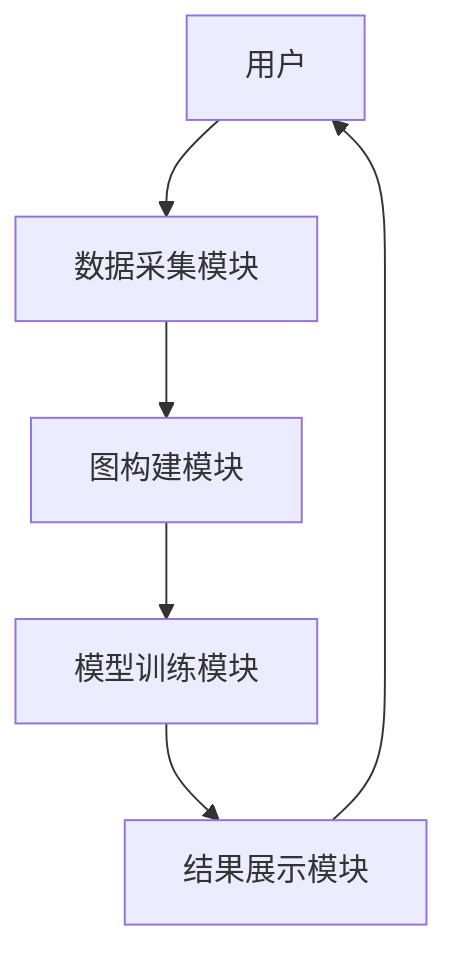

                 

# 企业AI Agent的图卷积网络在社交网络分析中的应用

> 关键词：企业AI Agent，图卷积网络，社交网络分析，节点表示，网络嵌入，深度学习

> 摘要：本文探讨了企业AI Agent在社交网络分析中的应用，重点介绍了图卷积网络（Graph Convolutional Networks, GCN）如何在社交网络分析中发挥作用。通过详细分析GCN的核心原理、算法实现以及在社交网络中的实际应用，本文展示了如何利用AI Agent结合图卷积网络来提升社交网络分析的效率和准确性。本文还通过实际案例分析，详细解读了GCN在社交网络分析中的优势和挑战。

---

## 第一部分: 图卷积网络与AI Agent基础

### 第1章: 图卷积网络与AI Agent概述

#### 1.1 图卷积网络的核心概念

##### 1.1.1 图论基础
图论是研究图结构的数学理论，图由节点（顶点）和边组成，边可以有方向和权重。图的表示形式包括邻接矩阵、邻接列表和边列表等。

图的邻接矩阵表示为一个二维矩阵，其中矩阵的元素$a_{ij}$表示节点$i$和节点$j$之间的边是否存在（或权重）。例如，一个简单的图可以表示为：

$$
A = \begin{bmatrix}
0 & 1 & 0 \\
1 & 0 & 1 \\
0 & 1 & 0
\end{bmatrix}
$$

##### 1.1.2 卷积神经网络原理
卷积神经网络（CNN）是一种深度学习模型，广泛应用于图像识别任务。CNN的核心思想是通过卷积操作提取图像的局部特征，并通过池化操作降低计算复杂度。

##### 1.1.3 图卷积网络的定义与特点
图卷积网络（GCN）是将卷积操作扩展到图结构的一种方法。GCN的核心思想是通过图的邻接矩阵和节点特征矩阵进行卷积操作，从而生成新的节点特征表示。

图卷积网络的特点包括：
1. 能够处理图结构数据。
2. 能够捕捉节点之间的关系。
3. 能够进行节点分类、边预测等任务。

#### 1.2 AI Agent的基本概念

##### 1.2.1 AI Agent的定义
AI Agent（人工智能代理）是一种能够感知环境、做出决策并执行动作的智能体。AI Agent可以通过与用户交互或与其他系统交互来完成特定任务。

##### 1.2.2 AI Agent的核心功能
AI Agent的核心功能包括：
1. 感知环境：通过传感器或接口获取环境信息。
2. 决策与推理：基于获取的信息进行推理和决策。
3. 行动：根据决策执行动作。

##### 1.2.3 AI Agent与传统AI的区别
AI Agent具有自主性、反应性和主动性，能够根据环境动态调整行为，而传统AI通常是在固定环境下执行预定义任务。

#### 1.3 图卷积网络在社交网络分析中的应用价值

##### 1.3.1 社交网络分析的基本问题
社交网络分析的主要任务包括节点分类、边预测、社区发现和网络嵌入。例如，在节点分类任务中，我们需要根据节点的特征和其在图中的位置，对节点进行分类。

##### 1.3.2 图卷积网络的优势
图卷积网络能够有效捕捉图结构中的局部和全局特征，适合处理社交网络中的复杂关系。此外，GCN还具有计算效率高、易于部署等优点。

##### 1.3.3 AI Agent在社交网络分析中的潜力
AI Agent可以结合图卷积网络，实现社交网络的实时分析和动态决策。例如，AI Agent可以通过GCN实时分析用户的社交网络关系，从而提供个性化的推荐服务。

---

### 第2章: 图卷积网络的核心原理

#### 2.1 图的表示与建模

##### 2.1.1 图的邻接矩阵表示
邻接矩阵是图的一种常见表示方法，其中$a_{ij}$表示节点$i$和节点$j$之间的边是否存在（或权重）。例如，一个简单的图可以表示为：

$$
A = \begin{bmatrix}
0 & 1 & 0 \\
1 & 0 & 1 \\
0 & 1 & 0
\end{bmatrix}
$$

##### 2.1.2 图的边属性与节点属性
图的边属性可以表示边的权重或类型，而节点属性可以表示节点的特征或标签。例如，节点$i$的特征可以表示为一个向量$x_i$。

##### 2.1.3 图的同构与异构问题
图的同构是指两个图在结构上完全相同，而图的异构是指两个图在结构上不同。在社交网络分析中，异构图的处理通常需要使用多层图或嵌入方法。

#### 2.2 图卷积网络的数学模型

##### 2.2.1 邻接矩阵的特征分解
邻接矩阵的特征分解是图卷积网络的核心步骤之一。通过特征分解，我们可以将邻接矩阵对角化，从而简化计算。

邻接矩阵$A$的特征分解为：
$$
A = Q \Lambda Q^T
$$
其中$\Lambda$是对角矩阵，包含$A$的特征值，$Q$是特征向量矩阵。

##### 2.2.2 图卷积的传播函数
图卷积的传播函数定义了节点特征的更新规则。例如，GCN的传播函数可以表示为：
$$
h^{(l+1)}_i = \sum_{j} A_{ij} h^{(l)}_j
$$

##### 2.2.3 图卷积网络的数学公式
图卷积网络的数学公式可以表示为：
$$
H^{(l+1)} = A H^{(l)} W^{(l)}
$$
其中$H^{(l)}$是第$l$层的节点特征矩阵，$W^{(l)}$是权重矩阵。

#### 2.3 图卷积网络的变体与优化

##### 2.3.1 GAT: 图注意力网络
图注意力网络（Graph Attention Networks, GAT）是一种基于注意力机制的图卷积网络。GAT通过引入注意力权重，能够更好地捕捉节点之间的关系。

##### 2.3.2 GCN: 图卷积网络
GCN是图卷积网络的一种经典实现，通过逐层传播节点特征，最终生成节点的表示向量。

##### 2.3.3 GraphSAGE: 图聚合网络
GraphSAGE是一种基于聚合机制的图卷积网络，通过聚合邻居节点的特征来生成节点的表示。

#### 2.4 本章小结

---

## 第二部分: 基于图卷积网络的AI Agent系统设计

### 第3章: AI Agent的体系结构与功能

#### 3.1 AI Agent的基本体系结构

##### 3.1.1 感知层
感知层负责获取环境信息，例如通过传感器或API接口获取社交网络数据。

##### 3.1.2 知识层
知识层负责存储和管理知识，例如社交网络的图结构和节点特征。

##### 3.1.3 行为层
行为层负责根据感知到的信息和知识层的推理结果，做出决策并执行动作。

#### 3.2 AI Agent的核心功能模块

##### 3.2.1 感知模块
感知模块负责获取社交网络数据，例如用户的社交关系、行为数据等。

##### 3.2.2 知识表示模块
知识表示模块负责将社交网络数据转化为图结构，并通过图卷积网络生成节点表示。

##### 3.2.3 决策模块
决策模块负责根据节点表示和推理结果，做出推荐或预测。

#### 3.3 AI Agent的交互机制

##### 3.3.1 用户意图识别
通过自然语言处理技术，识别用户的意图，例如用户的搜索关键词、点击行为等。

##### 3.3.2 自然语言处理
通过NLP技术，理解用户的需求并生成相应的回复。

##### 3.3.3 动作执行
根据用户的意图和推理结果，执行相应的动作，例如推荐商品、提供信息等。

#### 3.4 本章小结

### 第4章: 图卷积网络在社交网络分析中的算法实现

#### 4.1 图卷积网络的训练流程

##### 4.1.1 数据预处理
数据预处理包括数据清洗、特征提取和图构建等步骤。例如，我们需要将社交网络数据转换为邻接矩阵和节点特征矩阵。

##### 4.1.2 模型训练
模型训练包括前向传播和反向传播两个阶段。前向传播计算损失函数，反向传播更新权重。

##### 4.1.3 模型评估
模型评估包括准确率、召回率和F1值等指标。例如，我们可以使用交叉验证评估模型的性能。

#### 4.2 图卷积网络的代码实现

##### 4.2.1 环境安装与配置
我们需要安装PyTorch、NetworkX等库，并配置GPU加速。

##### 4.2.2 数据加载与处理
数据加载与处理包括读取数据、构建图结构和生成节点特征矩阵。

##### 4.2.3 模型定义与训练
模型定义包括定义GCN的层、损失函数和优化器。模型训练包括前向传播和反向传播。

#### 4.3 图卷积网络的优化与调参

##### 4.3.1 参数选择
参数选择包括学习率、批次大小和模型深度等。

##### 4.3.2 模型优化
模型优化包括使用早停法、调整学习率和使用正则化等。

##### 4.3.3 超参数调优
超参数调优可以通过网格搜索或随机搜索等方法进行。

#### 4.4 本章小结

### 第5章: 基于图卷积网络的AI Agent系统设计

#### 5.1 系统总体架构

##### 5.1.1 系统功能模块划分
系统功能模块包括数据采集、图构建、模型训练和结果展示等。

##### 5.1.2 系统交互流程
系统交互流程包括用户输入、数据处理、模型推理和结果展示。

##### 5.1.3 系统架构图
系统架构图如下：

#### 5.2 系统功能设计

##### 5.2.1 用户行为分析模块
用户行为分析模块负责分析用户的社交网络行为，例如用户的点击行为、浏览行为等。

##### 5.2.2 社交网络建模模块
社交网络建模模块负责将用户的社交网络数据转化为图结构，并通过图卷积网络生成节点表示。

##### 5.2.3 AI Agent决策模块
AI Agent决策模块负责根据节点表示和推理结果，做出推荐或预测。

#### 5.3 系统接口设计

##### 5.3.1 数据接口
数据接口负责与外部数据源交互，例如社交网络API接口。

##### 5.3.2 用户接口
用户接口负责与用户交互，例如Web界面或命令行界面。

##### 5.3.3 API接口
API接口负责与其他系统交互，例如第三方服务或数据库。

#### 5.4 系统实现与测试

##### 5.4.1 系统实现
系统实现包括数据采集、图构建、模型训练和结果展示等模块的实现。

##### 5.4.2 系统测试
系统测试包括单元测试、集成测试和性能测试等。

##### 5.4.3 系统优化
系统优化包括算法优化、代码优化和资源优化等。

#### 5.5 本章小结

---

## 第三部分: 总结与扩展

### 第6章: 总结与扩展

#### 6.1 最佳实践 tips
1. 在实际应用中，建议使用预训练的图卷积网络模型，以提高计算效率。
2. 在数据处理阶段，需要注意数据的隐私和安全问题。
3. 在模型部署阶段，建议使用云平台或边缘计算技术，以提高系统的可扩展性。

#### 6.2 小结
本文详细介绍了图卷积网络在社交网络分析中的应用，并探讨了AI Agent的体系结构和功能。通过实际案例分析，展示了图卷积网络在社交网络分析中的优势和挑战。

#### 6.3 注意事项
在实际应用中，需要注意数据的质量、模型的可解释性和系统的安全性等问题。

#### 6.4 拓展阅读
1. 学习更多关于图卷积网络的论文和书籍。
2. 探索AI Agent在其他领域的应用，例如智能客服、智能推荐等。
3. 关注深度学习和图神经网络的最新研究进展。

---

作者：AI天才研究院/AI Genius Institute & 禅与计算机程序设计艺术 /Zen And The Art of Computer Programming

