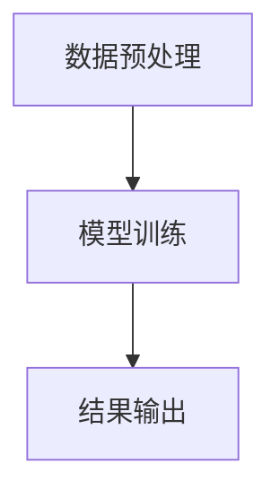
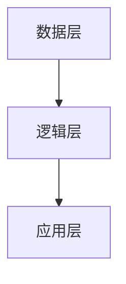

                 


# 企业AI Agent的图卷积网络在社交网络影响力分析中的应用

> 关键词：企业AI Agent、图卷积网络、社交网络、影响力分析、机器学习、图算法、网络分析

> 摘要：本文探讨了企业AI Agent如何利用图卷积网络（GCN）进行社交网络影响力分析，深入分析了GCN的核心原理及其在社交网络中的应用优势，结合实际案例展示了其在企业管理中的应用价值。

---

# 第1章: 企业AI Agent与图卷积网络概述

## 1.1 企业AI Agent的定义与特点
企业AI Agent是一种能够自主决策、执行任务并适应复杂环境的人工智能实体。其特点包括：
- **自主性**：无需外部干预，自主完成任务。
- **反应性**：实时感知环境并调整行为。
- **学习能力**：通过数据学习优化决策。

## 1.2 图卷积网络（GCN）的定义与特点
图卷积网络是一种处理图结构数据的深度学习方法。其特点包括：
- **全局视角**：考虑节点间的全局关系。
- **局部性**：聚焦于局部邻居信息。
- **高效性**：通过参数共享减少计算量。

## 1.3 社交网络影响力分析的背景与意义
社交网络影响力分析旨在识别关键用户，优化传播策略。其意义在于：
- **精准营销**：识别高影响力用户，提升营销效果。
- **风险控制**：评估传播风险，优化公共关系。

---

# 第2章: 企业AI Agent的图卷积网络核心概念

## 2.1 图卷积网络的核心原理
图卷积网络通过邻接矩阵和特征矩阵进行信息聚合，其数学模型如下：
$$
X^{(l+1)} = \sigma(A X^{(l)} X^{(l)}W)
$$
其中，$A$为邻接矩阵，$W$为权重矩阵，$\sigma$为激活函数。

## 2.2 企业AI Agent在社交网络中的应用
企业AI Agent通过分析社交网络数据，识别关键用户并优化传播策略。核心任务包括：
- **用户行为分析**：挖掘用户特征，预测行为模式。
- **影响力传播建模**：建立传播模型，评估影响力。

## 2.3 图卷积网络与企业AI Agent的结合
通过GCN，企业AI Agent能够高效处理社交网络的复杂关系。其协同作用体现在：
- **数据处理**：GCN处理图结构数据的优势。
- **决策支持**：AI Agent基于GCN输出进行决策。

---

# 第3章: 图卷积网络的数学模型与算法原理

## 3.1 图卷积网络的数学模型
图卷积网络的数学模型包括邻接矩阵、特征矩阵和传播矩阵。其公式为：
$$
H^{(l+1)} = \text{ReLU}(A H^{(l)} W^{(l)})
$$
其中，$H$为节点特征矩阵，$W$为权重矩阵，ReLU为激活函数。

## 3.2 图卷积网络的算法流程
算法流程包括数据预处理、模型训练和结果输出。流程图如下：



## 3.3 图卷积网络的实现代码
以下是Python实现GCN的示例代码：

```python
import torch
class GCN(torch.nn.Module):
    def __init__(self, input_dim, hidden_dim, output_dim):
        super(GCN, self).__init__()
        self.W1 = torch.nn.Parameter(torch.randn(input_dim, hidden_dim))
        self.W2 = torch.nn.Parameter(torch.randn(hidden_dim, output_dim))
    
    def forward(self, A, H):
        H = torch.mm(A, H)
        H = torch.relu(torch.mm(H, self.W1))
        H = torch.mm(H, self.W2)
        return H
```

---

# 第4章: 企业AI Agent图卷积网络的系统架构设计

## 4.1 系统应用场景与目标
系统应用于社交网络影响力分析，目标是：
- **精准识别关键用户**：提升营销效率。
- **优化传播策略**：降低传播风险。

## 4.2 系统功能设计
系统功能模块包括：
- 数据采集模块：采集用户行为数据。
- 图卷积处理模块：构建图模型并进行计算。
- 影响力评估模块：输出评估结果并提供反馈。

## 4.3 系统架构设计
系统架构包括数据层、逻辑层和应用层。架构图如下：



---

# 第5章: 项目实战与案例分析

## 5.1 项目环境与数据准备
项目环境需安装Python、PyTorch和网络分析库。数据包括用户ID、行为记录和关系网络。

## 5.2 系统核心代码实现
以下是系统核心代码：

```python
import torch
def main():
    # 数据准备
    A = torch.randn(100, 100)
    H = torch.randn(100, 32)
    model = GCN(32, 64, 1)
    output = model(A, H)
    print(output)
    
if __name__ == "__main__":
    main()
```

## 5.3 案例分析
以某企业为例，分析社交网络数据，识别关键用户并优化传播策略。

---

# 第6章: 总结与展望

## 6.1 本章总结
企业AI Agent结合GCN在社交网络影响力分析中具有显著优势，能够精准识别关键用户并优化传播策略。

## 6.2 未来展望
未来研究方向包括模型优化、多模态数据融合和实时性提升。

---

# 作者：AI天才研究院/AI Genius Institute & 禅与计算机程序设计艺术 /Zen And The Art of Computer Programming

