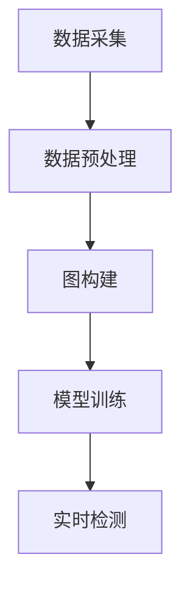
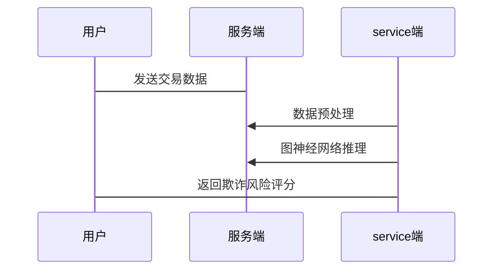

                 


# 企业AI Agent的图神经网络在欺诈检测中的应用

> **关键词**: 图神经网络，AI Agent，欺诈检测，实体关系图，算法流程

> **摘要**: 本文详细探讨了企业AI Agent结合图神经网络在欺诈检测中的应用。通过分析图神经网络的优势、AI Agent的核心功能以及它们在欺诈检测中的协同作用，本文提出了基于实体关系图的智能化解决方案。文章从背景介绍、核心概念、算法原理、系统设计到项目实战，全面解析了这一技术的应用细节。

---

## 第一部分: 背景介绍

### 第1章: 问题背景

#### 1.1 企业欺诈检测的挑战
在企业运营中，欺诈行为日益复杂化和智能化，传统的基于规则的检测方法已难以应对。欺诈者通过复杂的关联关系进行操作，传统的单点分析难以捕捉这些复杂关系。因此，如何利用先进的人工智能技术，尤其是结合图神经网络和AI Agent，成为了企业欺诈检测的重要研究方向。

#### 1.2 图神经网络的优势
图神经网络（Graph Neural Network, GNN）能够有效处理图结构数据，通过聚合节点及其邻居的信息，捕捉数据中的复杂关系。这使得GNN在欺诈检测中具有独特的优势，尤其是在处理复杂的实体关系时表现优异。

#### 1.3 AI Agent在欺诈检测中的作用
AI Agent是一种智能体，能够自主决策并执行任务。在欺诈检测中，AI Agent可以实时监控交易行为，利用图神经网络分析数据关联性，并根据分析结果动态调整检测策略。

---

## 第二部分: 核心概念与联系

### 第2章: 图神经网络原理

#### 2.1 图数据模型
图数据由节点（实体）和边（关系）组成。在欺诈检测中，节点可以是用户、交易、地理位置等，边可以是交易关系、地理位置关系等。

#### 2.2 图神经网络的核心原理
图神经网络通过聚合节点及其邻居的信息，生成节点的嵌入表示。常用的图神经网络模型包括图卷积网络（GCN）和图注意力网络（GAT）。

#### 2.3 AI Agent的基本原理
AI Agent通过感知环境、分析信息并执行动作来实现目标。在欺诈检测中，AI Agent可以实时监控交易数据，并利用图神经网络进行风险评估。

#### 2.4 实体关系图
实体关系图是欺诈检测的核心数据模型。通过构建实体关系图，可以清晰地展示用户、交易、地理位置等实体之间的关联关系。

---

## 第三部分: 算法原理讲解

### 第3章: 图神经网络算法

#### 3.1 图卷积操作
图卷积操作通过聚合节点及其邻居的信息，生成节点的嵌入表示。公式如下：
$$
h_v^{(l+1)} = \sigma\left(\sum_{u \in \mathcal{N}(v)} \frac{1}{| \mathcal{N}(v) |} W h_u^{(l)}\right)
$$
其中，$\mathcal{N}(v)$ 表示节点 $v$ 的邻居节点集合，$W$ 是权重矩阵，$\sigma$ 是激活函数。

#### 3.2 图注意力机制
图注意力机制通过计算节点之间的注意力权重，聚焦重要的邻居信息。公式如下：
$$
\alpha_{uv} = \frac{\exp(\text{sim}(h_u, h_v))}{\sum_{u' \in \mathcal{N}(v)} \exp(\text{sim}(h_u', h_v))}
$$
其中，$\text{sim}(h_u, h_v)$ 表示节点 $u$ 和 $v$ 的相似度。

#### 3.3 AI Agent的决策机制
AI Agent通过分析图神经网络生成的风险评分，决定是否拦截交易。决策机制可以基于阈值判断或概率模型。

---

## 第四部分: 系统分析与架构设计

### 第4章: 系统架构设计

#### 4.1 系统功能设计
系统功能包括数据采集、图构建、模型训练和实时检测。通过构建领域模型，可以明确各功能模块之间的关系。

#### 4.2 系统架构图
使用Mermaid图展示系统架构：


#### 4.3 接口设计
系统提供API接口，支持实时查询和批量处理。通过RESTful API，用户可以方便地调用欺诈检测服务。

#### 4.4 交互流程
使用Mermaid序列图展示交互流程：


---

## 第五部分: 项目实战

### 第5章: 项目实现

#### 5.1 环境安装
安装必要的库：
```bash
pip install tensorflow==2.5.0
pip install networkx==2.6
```

#### 5.2 核心代码实现
图神经网络模型实现：
```python
import tensorflow as tf
from tensorflow.keras import layers

class GraphConvolution(layers.Layer):
    def __init__(self, input_dim, output_dim):
        super(GraphConvolution, self).__init__()
        self.weight = tf.keras.Sequential([
            layers.Dense(output_dim, use_bias=False)
        ])
    
    def call(self, inputs):
        features, adj = inputs
        output = tf.matmul(features, adj)
        output = tf.matmul(output, self.weight.kernel)
        return tf.nn.relu(output)
```

#### 5.3 案例分析
通过一个简单案例，展示如何使用图神经网络和AI Agent进行欺诈检测。例如，检测一笔交易是否为欺诈交易，可以通过分析交易相关的实体关系图来判断。

---

## 第六部分: 总结与展望

### 第6章: 总结
本文详细探讨了企业AI Agent结合图神经网络在欺诈检测中的应用。通过分析图神经网络的优势、AI Agent的核心功能以及它们在欺诈检测中的协同作用，本文提出了基于实体关系图的智能化解决方案。

### 6.2 展望
未来的研究方向包括更高效的图神经网络算法、更智能的AI Agent决策机制以及更广泛的应用场景。例如，结合强化学习进一步优化欺诈检测的准确性和实时性。

---

## 结语

企业AI Agent的图神经网络在欺诈检测中的应用具有广阔的应用前景。通过结合图神经网络和AI Agent，企业可以更高效、更准确地检测欺诈行为，保护自身利益。

---

**作者：AI天才研究院（AI Genius Institute） & 禅与计算机程序设计艺术（Zen And The Art of Computer Programming）**

