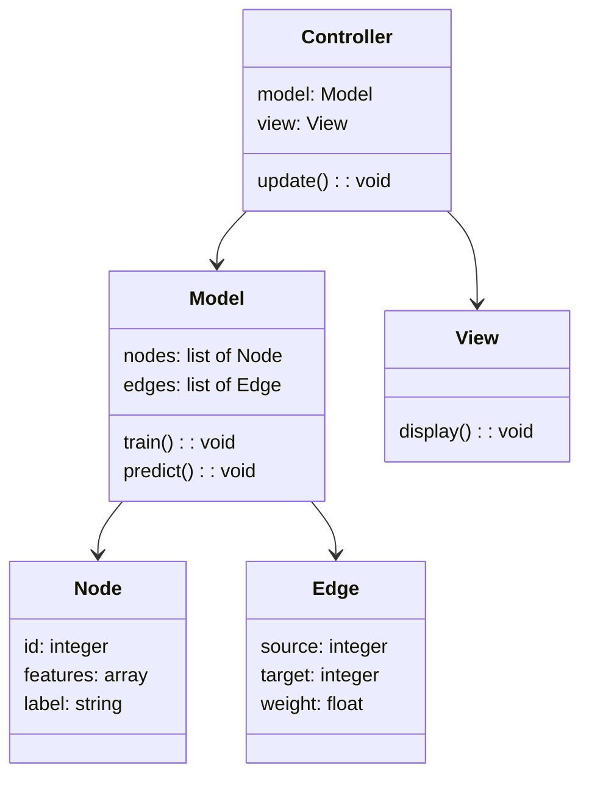
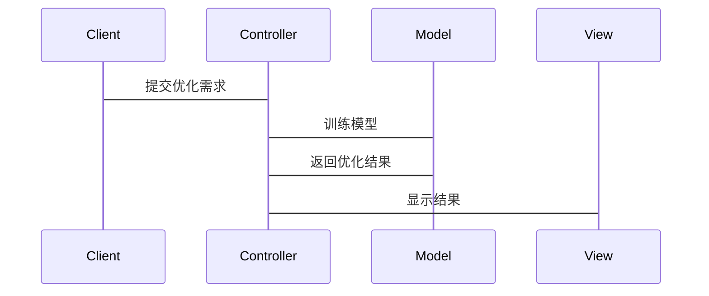

                 


# 企业AI Agent的图神经网络在组织结构优化中的应用

> 关键词：AI Agent，图神经网络，组织结构优化，企业架构，算法实现

> 摘要：本文探讨了企业AI Agent如何利用图神经网络技术优化组织结构。通过分析图神经网络的核心原理、算法实现以及在企业组织优化中的具体应用，展示了该技术在提升企业效率和决策能力方面的巨大潜力。

---

## 第一部分: 企业AI Agent的图神经网络基础

### 第1章: AI Agent与图神经网络概述

#### 1.1 AI Agent的基本概念

- **1.1.1 AI Agent的定义与特点**
  - AI Agent是一种智能体，能够感知环境、自主决策并执行任务。
  - 具备自主性、反应性、目标导向性和学习能力。
  
- **1.1.2 AI Agent的核心功能与应用场景**
  - 核心功能：信息处理、决策优化、任务执行。
  - 应用场景：企业流程自动化、供应链管理、客户服务、数据分析等。

- **1.1.3 企业组织结构优化中的AI Agent作用**
  - 通过AI Agent分析组织结构中的瓶颈和低效点，提出优化建议。
  - 支持动态调整组织架构，提升协作效率。

#### 1.2 图神经网络的基本原理

- **1.2.1 图论基础与图数据结构**
  - 图由节点（顶点）和边组成，边可以有方向和权重。
  - 常见的图表示方法：邻接矩阵和邻接表。

- **1.2.2 神经网络的基本概念**
  - 神经网络由层组成，包括输入层、隐藏层和输出层。
  - 网络通过权重和激活函数进行信息处理和决策。

- **1.2.3 图神经网络的独特优势**
  - 能够处理非结构化数据，捕捉复杂关系。
  - 适用于处理社交网络、知识图谱等图结构数据。

#### 1.3 企业组织结构优化的背景与挑战

- **1.3.1 企业组织结构的传统模式**
  - 层级分明，信息传递效率低。
  - 部门间协作困难，资源浪费。

- **1.3.2 数字化转型中的组织优化需求**
  - 提升组织灵活性和响应速度。
  - 实现跨部门高效协作。

- **1.3.3 当前组织优化的主要挑战**
  - 数据孤岛问题严重。
  - 传统优化方法难以应对动态变化。

#### 1.4 图神经网络在组织优化中的应用前景

- **1.4.1 图神经网络的优势**
  - 高效处理复杂关系，发现潜在联系。
  - 支持实时动态调整，适应快速变化。

- **1.4.2 企业组织优化的潜在应用场景**
  - 优化部门间协作流程。
  - 提升团队间信息共享效率。
  - 支持决策层的战略规划。

- **1.4.3 图神经网络在组织优化中的独特价值**
  - 通过图结构建模，清晰展示组织关系。
  - 利用算法自动识别优化点，提供科学依据。

#### 1.5 本章小结

本章介绍了AI Agent和图神经网络的基本概念，分析了企业组织优化的背景和挑战，并探讨了图神经网络在这一领域的应用前景。通过这些内容，读者可以理解图神经网络在优化企业组织结构中的潜力。

---

## 第2章: 图神经网络的核心概念与原理

### 2.1 图数据的表示与建模

#### 2.1.1 图的节点与边

- **节点**：代表组织中的个体或部门。
- **边**：代表节点之间的关系或连接。

#### 2.1.2 图的邻接矩阵与邻接表

- **邻接矩阵**：一个二维数组，表示节点之间是否存在边。
- **邻接表**：一种更高效的数据结构，用于存储每个节点的相邻节点。

#### 2.1.3 图的权重与属性

- **权重**：表示边的重要程度或强度。
- **属性**：节点或边的附加信息，如部门类型或关系强度。

### 2.2 图神经网络的基本原理

#### 2.2.1 图卷积操作的定义

- 图卷积操作将节点的特征信息传播到其相邻节点。
- 通过聚合邻居的信息来更新节点的表示。

#### 2.2.2 图池化操作的原理

- 图池化通过合并低层信息来降低图的复杂度。
- 常见的池化方法包括平均池化和最大池化。

#### 2.2.3 图神经网络的传播机制

- 信息从输入层传播到隐藏层，最终到达输出层。
- 通过多层传播，节点表示逐渐变得丰富。

### 2.3 图神经网络的关键算法

#### 2.3.1 GCN（Graph Convolutional Network）

- GCN通过聚合邻居节点的特征来更新当前节点的特征。
- 数学表达式：
  $$y = \theta^T A x$$
  其中，$A$ 是邻接矩阵，$\theta$ 是参数，$x$ 是输入特征。

#### 2.3.2 GAT（Graph Attention Network）

- GAT通过注意力机制动态调整边的权重。
- 数学表达式：
  $$\alpha_{ij} = \text{softmax}(e^{f(x_i, x_j)})$$
  其中，$\alpha_{ij}$ 是注意力权重，$f$ 是计算相似性的函数。

#### 2.3.3 GNN（Graph Neural Network）的通用框架

- GNN的通用框架包括编码层、传播层和解码层。
- 编码层将节点特征映射到隐空间。
- 传播层通过消息传递机制更新节点表示。
- 解码层将隐表示转换为输出。

### 2.4 图神经网络的训练与推理

#### 2.4.1 图数据的预处理

- 数据清洗：去除噪声和冗余信息。
- 数据归一化：将特征值标准化。

#### 2.4.2 图神经网络的训练流程

1. 初始化网络参数。
2. 前向传播计算预测值。
3. 计算损失函数。
4. 反向传播更新参数。

#### 2.4.3 图神经网络的推理过程

1. 加载预训练模型。
2. 对输入数据进行前向传播。
3. 输出结果。

### 2.5 本章小结

本章详细介绍了图数据的表示方法和图神经网络的基本原理，包括GCN、GAT和GNN等关键算法。通过这些内容，读者可以理解图神经网络的核心机制和实现方法。

---

## 第3章: 图神经网络在企业组织优化中的应用

### 3.1 企业组织结构的图表示

#### 3.1.1 企业组织结构的图模型构建

- 将企业组织结构表示为图，节点代表部门或人员，边代表关系。
- 示例：部门A与部门B有协作关系，边权重为0.8。

#### 3.1.2 组织结构中的节点与边

- **节点**：部门、团队、人员。
- **边**：协作关系、汇报关系、资源分配关系。

#### 3.1.3 组织结构图的权重与属性

- **权重**：边权重表示关系强度，权重越大表示关系越紧密。
- **属性**：部门类型、人员角色。

### 3.2 图神经网络在组织优化中的具体应用

#### 3.2.1 基于图神经网络的组织关系分析

- 通过图神经网络分析部门之间的协作效率。
- 示例：部门A与部门B协作频繁，但效率低下，网络会自动识别并提出优化建议。

#### 3.2.2 图神经网络在组织流程优化中的应用

- 优化跨部门流程，减少冗余步骤。
- 示例：订单处理流程中，部门A与部门B之间存在瓶颈，网络会自动识别并优化流程。

#### 3.2.3 图神经网络在组织决策支持中的作用

- 支持高层决策，提供数据支持。
- 示例：通过分析历史数据，网络可以预测未来的人力资源需求。

### 3.3 图神经网络在组织优化中的优势

#### 3.3.1 非线性关系的捕捉能力

- 图神经网络能够捕捉复杂的非线性关系，提供更精准的优化建议。

#### 3.3.2 多层级关系的建模能力

- 通过多层次建模，网络能够全面分析组织结构中的各种关系。

#### 3.3.3 高效的计算与推理能力

- 图神经网络能够快速处理大规模数据，提供实时优化建议。

### 3.4 本章小结

本章探讨了图神经网络在企业组织优化中的具体应用，包括组织关系分析、流程优化和决策支持。通过这些内容，读者可以理解图神经网络在实际应用中的价值。

---

## 第4章: 图神经网络算法的数学模型与公式

### 4.1 图神经网络的基本数学模型

#### 4.1.1 图的邻接矩阵表示

- 邻接矩阵$A$是一个$n \times n$的矩阵，表示$n$个节点之间的关系。
- $A_{ij}=1$表示节点$i$和节点$j$之间有边，否则为0。

#### 4.1.2 图的特征向量表示

- 特征向量$x$是一个$d \times 1$的向量，表示节点的特征。
- $d$是特征的维度。

#### 4.1.3 图的传播规则

- 传播规则定义了信息如何从一个节点传播到另一个节点。
- 例如，$y_i = \sum_{j} A_{ij}x_j$。

### 4.2 图卷积操作的数学公式

#### 4.2.1 GCN的数学表达式

- GCN的数学表达式为：
  $$y = \theta^T A x$$
  其中，$\theta$是参数，$A$是邻接矩阵，$x$是输入特征。

#### 4.2.2 GAT的数学表达式

- GAT的注意力机制计算公式为：
  $$\alpha_{ij} = \text{softmax}(e^{f(x_i, x_j)})$$
  其中，$f$是计算相似性的函数。

#### 4.2.3 GNN的通用框架

- GNN的通用框架包括编码层、传播层和解码层。
- 传播层的数学表达式为：
  $$h_i^{(l+1)} = \sum_{j} A_{ij} \sigma(h_j^{(l)})$$
  其中，$\sigma$是激活函数。

### 4.3 本章小结

本章详细介绍了图神经网络的数学模型和公式，包括GCN、GAT和GNN的数学表达式。通过这些内容，读者可以理解图神经网络的实现原理。

---

## 第5章: 系统分析与架构设计

### 5.1 问题场景介绍

- 企业组织结构优化需要一个智能系统来分析和优化组织关系。
- 该系统需要处理大规模数据，并提供实时优化建议。

### 5.2 项目介绍

- 项目目标：构建一个基于图神经网络的企业组织优化系统。
- 项目范围：包括数据采集、模型训练和结果展示。

### 5.3 系统功能设计

#### 5.3.1 领域模型（Mermaid 类图）



#### 5.3.2 系统架构设计（Mermaid 架构图）


### 5.4 系统接口设计

- **输入接口**：接收组织结构数据和优化需求。
- **输出接口**：提供优化建议和结果展示。

### 5.5 系统交互设计（Mermaid 序列图）



### 5.6 本章小结

本章通过系统分析和架构设计，展示了如何将图神经网络应用于企业组织优化。通过类图、架构图和序列图，读者可以理解系统的整体结构和交互流程。

---

## 第6章: 项目实战

### 6.1 环境安装

- **Python**：安装Python 3.8或更高版本。
- **深度学习框架**：安装TensorFlow或PyTorch。
- **图神经网络库**：安装PyG（PyTorch Geometric）。

### 6.2 系统核心实现源代码

#### 6.2.1 数据预处理代码

```python
import torch
from torch_geometric.data import Data

# 节点特征
x = torch.randn(4, 3)  # 4个节点，3个特征
# 邻接矩阵
edge_index = torch.tensor([[0, 1, 2, 3], [1, 2, 3, 0]], dtype=torch.long)
# 边权重
edge_weight = torch.ones(edge_index.size(1))
data = Data(x=x, edge_index=edge_index, edge_weight=edge_weight)
```

#### 6.2.2 图神经网络模型代码

```python
import torch.nn as nn
from torch_geometric.nn import GCNConv

class GNNModel(nn.Module):
    def __init__(self, in_channels, hidden_channels, out_channels):
        super(GNNModel, self).__init__()
        self.conv1 = GCNConv(in_channels, hidden_channels)
        self.conv2 = GCNConv(hidden_channels, out_channels)
    
    def forward(self, x, edge_index):
        x = self.conv1(x, edge_index)
        x = torch.relu(x)
        x = self.conv2(x, edge_index)
        return x
```

#### 6.2.3 训练代码

```python
model = GNNModel(3, 16, 1)
optimizer = torch.optim.Adam(model.parameters(), lr=0.01)
criterion = nn.MSELoss()

for epoch in range(100):
    model.train()
    out = model(data.x, data.edge_index)
    loss = criterion(out, data.y)
    loss.backward()
    optimizer.step()
```

### 6.3 代码应用解读与分析

- **数据预处理**：将企业组织结构数据转换为图数据格式。
- **模型训练**：使用图神经网络模型训练数据，得到优化结果。
- **结果展示**：将优化结果展示给用户，提供优化建议。

### 6.4 实际案例分析

- **案例背景**：某企业部门协作效率低下，希望通过图神经网络优化组织结构。
- **数据输入**：部门间协作关系和效率数据。
- **模型训练**：训练模型识别低效部门和协作瓶颈。
- **结果展示**：模型识别出部门A与部门B协作效率低下，建议调整协作流程。

### 6.5 项目小结

本章通过实际案例展示了如何将图神经网络应用于企业组织优化。通过代码实现和案例分析，读者可以理解图神经网络的实际应用价值。

---

## 第7章: 最佳实践与注意事项

### 7.1 最佳实践

- **数据质量**：确保数据准确性和完整性。
- **模型调优**：通过实验选择合适的模型参数。
- **结果验证**：通过实际验证模型的优化效果。

### 7.2 小结

通过本章的内容，读者可以了解在实际应用中如何优化图神经网络模型，并避免一些常见问题。

### 7.3 注意事项

- **数据隐私**：确保数据的安全性和隐私性。
- **模型解释性**：提高模型的可解释性，方便用户理解和信任。

### 7.4 拓展阅读

- 推荐阅读相关领域的书籍和论文，深入理解图神经网络的最新进展。

---

## 作者：AI天才研究院/AI Genius Institute & 禅与计算机程序设计艺术 /Zen And The Art of Computer Programming

---

通过以上思考，我可以系统地撰写一篇结构清晰、内容详实的技术博客文章，涵盖企业AI Agent的图神经网络在组织结构优化中的应用的各个方面。

