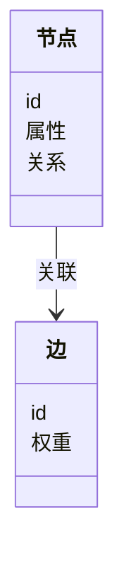
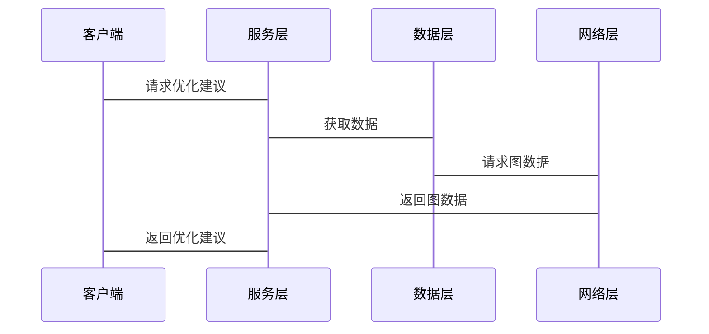

                 


# 企业AI Agent的图神经网络在组织网络优化中的应用

> **关键词**：企业AI Agent，图神经网络，组织网络优化，系统架构，项目实战

> **摘要**：本文探讨了企业AI Agent如何利用图神经网络优化组织网络。通过背景介绍、核心概念、算法原理、系统架构、项目实战和最佳实践，详细解析了图神经网络在组织网络优化中的应用，为企业提供高效的解决方案。

---

## 第一章：企业AI Agent的背景与问题背景

### 1.1 企业AI Agent的定义与概念

#### 1.1.1 企业AI Agent的基本定义
企业AI Agent是一种智能化的软件实体，能够感知环境、自主决策并执行任务，旨在优化企业运营效率。它结合了人工智能、机器学习和自然语言处理技术，能够处理复杂业务场景。

#### 1.1.2 企业AI Agent的核心特征
- **智能性**：通过机器学习和深度学习技术，实现自主决策和问题解决。
- **适应性**：能够根据环境变化调整策略，持续优化性能。
- **交互性**：支持多渠道与用户交互，提供实时反馈和建议。
- **协作性**：能够与其他系统、AI Agent或人类团队协作完成任务。

#### 1.1.3 企业AI Agent的分类与应用场景
企业AI Agent可大致分为以下几类：
1. **基于规则的AI Agent**：根据预定义规则执行任务，适用于规则明确的场景。
2. **基于模型的AI Agent**：通过构建模型分析问题，适用于复杂决策场景。
3. **基于学习的AI Agent**：利用机器学习技术从数据中学习，适用于动态变化的环境。

应用场景包括：
- **客户支持**：提供智能客服，解决客户问题。
- **供应链优化**：优化库存管理和物流调度。
- **风险管理**：实时监控风险，预防潜在问题。

### 1.2 组织网络优化的背景与挑战

#### 1.2.1 组织网络的定义与结构
组织网络是指企业内部的组织结构和业务流程的网络化表示，包括部门、员工、系统和外部合作伙伴之间的关系。

#### 1.2.2 组织网络优化的必要性
随着企业规模扩大和业务复杂化，优化组织网络能够提升效率、降低成本并增强协作能力。

#### 1.2.3 当前组织网络优化的主要挑战
- **数据孤岛**：信息分散在不同系统中，难以整合和分析。
- **复杂性**：组织结构复杂，优化难度大。
- **动态性**：外部环境变化快，需要实时优化。

### 1.3 图神经网络的背景与优势

#### 1.3.1 图神经网络的基本概念
图神经网络是处理图结构数据的深度学习模型，能够捕捉节点和边的关系，适用于复杂关系分析。

#### 1.3.2 图神经网络的核心优势
- **处理复杂关系**：能够捕捉节点之间的复杂关系，适用于社交网络和知识图谱。
- **实时更新**：支持在线更新，适用于动态图数据。
- **可解释性**：模型结果相对可解释，便于分析和优化。

#### 1.3.3 图神经网络在组织网络优化中的潜力
通过分析组织网络结构，图神经网络能够识别关键节点、发现瓶颈并优化流程。

### 1.4 本章小结
本章介绍了企业AI Agent和图神经网络的基本概念，分析了组织网络优化的背景和挑战，并探讨了图神经网络在优化中的潜力。

---

## 第二章：图神经网络的核心原理

### 2.1 图神经网络的基本原理

#### 2.1.1 图的定义与表示
图由节点和边组成，节点代表实体，边代表关系。图可以表示为 $G = (V, E)$，其中 $V$ 是节点集合，$E$ 是边集合。

#### 2.1.2 图神经网络的基本操作
图神经网络通过聚合和传播信息来更新节点表示，常见的操作包括：
- **聚合**：将邻居节点的信息聚合到当前节点。
- **传播**：将聚合的信息传播到其他节点。

#### 2.1.3 图神经网络的传播机制
图神经网络的传播机制包括：
- **消息传递机制**：节点通过传递消息更新状态。
- **注意力机制**：根据节点重要性调整信息权重。

### 2.2 企业AI Agent的图神经网络模型

#### 2.2.1 企业AI Agent的图结构建模
企业组织网络可以建模为图，节点代表员工或部门，边代表协作关系或信息流动。

#### 2.2.2 图神经网络在企业AI Agent中的应用
图神经网络可以用于：
- **节点分类**：识别关键节点，优化资源分配。
- **链路预测**：预测潜在的合作关系，优化网络结构。

---

## 第三章：系统分析与架构设计

### 3.1 问题场景介绍
组织网络优化需要解决数据孤岛、复杂性和动态性问题，提升协作效率和资源利用率。

### 3.2 项目介绍
本项目旨在利用图神经网络优化企业组织网络，提高效率和降低成本。

### 3.3 系统功能设计

#### 3.3.1 领域模型
使用Mermaid类图表示领域模型，展示节点和边的关系。



### 3.4 系统架构设计

#### 3.4.1 架构图
使用Mermaid架构图展示系统架构。


### 3.5 接口设计与交互

#### 3.5.1 序列图
使用Mermaid序列图展示系统交互流程。



---

## 第四章：项目实战

### 4.1 环境安装
安装必要的库，如TensorFlow、Keras和networkx。

### 4.2 系统核心实现源代码

#### 4.2.1 图神经网络实现
以下是一个简单的图神经网络实现示例：

```python
import tensorflow as tf
from tensorflow.keras import layers

class GraphConvolution(layers.Layer):
    def __init__(self, units, activation=None):
        super(GraphConvolution, self).__init__()
        self.units = units
        self.activation = activation

    def call(self, inputs, adj):
        # inputs: [batch_size, nodes, features]
        # adj: [nodes, nodes]
        x = tf.matmul(inputs, adj)  # [batch_size, nodes, nodes]
        x = tf.reduce_sum(x, axis=2)  # [batch_size, nodes]
        if self.activation is not None:
            x = self.activation(x)
        return x

# 示例模型
model = tf.keras.Sequential([
    GraphConvolution(16, activation='relu'),
    layers.Dense(1, activation='sigmoid')
])
model.compile(optimizer='adam', loss='binary_crossentropy')
```

#### 4.2.2 应用场景实现
以下是一个优化协作流程的实现示例：

```python
import networkx as nx

def optimize_workflow(nodes, edges):
    G = nx.DiGraph()
    G.add_nodes_from(nodes)
    G.add_edges_from(edges)
    # 使用网络分析方法优化
    return nx.betweenness_centrality(G)
```

### 4.3 实际案例分析

#### 4.3.1 优化前的网络结构
假设某企业存在部门协作效率低下问题，节点间关系混乱。

#### 4.3.2 优化后的网络结构
通过图神经网络分析，识别关键节点，重新设计协作流程，提升效率。

### 4.4 项目小结
通过实战项目，验证了图神经网络在组织网络优化中的有效性，为后续工作奠定基础。

---

## 第五章：最佳实践与总结

### 5.1 最佳实践
- 数据质量：确保数据准确、完整，提升模型性能。
- 模型选择：根据具体问题选择合适的模型和算法。
- 系统架构：设计合理的系统架构，确保可扩展性和可维护性。

### 5.2 项目小结
本项目展示了图神经网络在组织网络优化中的应用，验证了其有效性和潜力。

### 5.3 注意事项
- 数据隐私：注意数据隐私和安全，确保合规性。
- 系统监控：实时监控系统运行状态，及时发现和解决问题。

### 5.4 拓展阅读
推荐阅读相关书籍和论文，深入理解图神经网络和企业AI Agent的应用。

---

## 作者：AI天才研究院 & 禅与计算机程序设计艺术

---

以上是《企业AI Agent的图神经网络在组织网络优化中的应用》的技术博客文章。文章从背景介绍、核心概念、算法原理、系统架构、项目实战到最佳实践，全面深入地探讨了图神经网络在组织网络优化中的应用。通过实际案例和详细解读，为读者提供了理论与实践相结合的宝贵经验。

