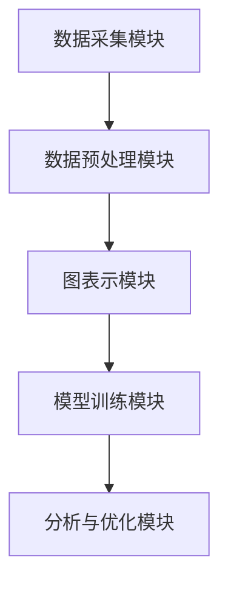
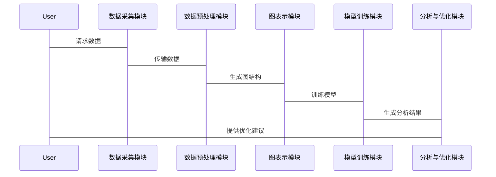

                 


# 企业AI Agent的图神经网络在组织网络分析与优化中的应用

> 关键词：企业AI Agent，图神经网络，组织网络分析，优化应用，系统架构设计

> 摘要：本文详细探讨了企业AI Agent在组织网络分析与优化中的应用，重点分析了图神经网络在其中的作用。通过结合图论和深度学习技术，图神经网络能够有效地处理组织网络中的复杂关系与依赖，从而实现组织结构优化、资源分配与调度、风险预警等核心功能。本文从基本概念、算法原理、系统架构到实际案例，全面解析了企业AI Agent与图神经网络的结合应用，为企业组织网络分析与优化提供了新的思路与方法。

---

# 第1章 企业AI Agent与图神经网络概述

## 1.1 企业AI Agent的基本概念

### 1.1.1 企业AI Agent的定义
企业AI Agent（Artificial Intelligence Agent）是指在企业组织内部运行的智能体，能够感知环境、自主决策并执行任务。它通常具备以下核心功能：
- **感知能力**：通过数据采集与分析，获取组织网络中的关键信息。
- **推理能力**：基于知识库和推理规则，分析问题并生成解决方案。
- **执行能力**：通过接口与企业系统交互，完成任务或触发行动。

### 1.1.2 图神经网络的基本概念
图神经网络（Graph Neural Networks, GNNs）是一种专门处理图结构数据的深度学习模型。与传统神经网络不同，图神经网络能够直接处理图数据中的节点和边，捕捉节点之间的关系与依赖。

### 1.1.3 企业AI Agent与图神经网络的关系
企业AI Agent可以利用图神经网络的强大能力，对组织网络中的复杂关系进行建模与分析。图神经网络为AI Agent提供了强大的图数据处理能力，而AI Agent则为图神经网络提供了应用场景和决策支持。

## 1.2 图神经网络在组织网络分析中的应用背景

### 1.2.1 组织网络分析的定义与目标
组织网络分析是指对企业的组织结构、资源分配、信息流等进行建模与分析，以优化组织运行效率。其目标包括：
- **优化组织结构**：发现冗余或瓶颈，提升组织灵活性。
- **资源分配与调度**：实现资源的高效利用。
- **风险预警与应急响应**：识别潜在风险并提前应对。

### 1.2.2 图神经网络在组织网络分析中的优势
图神经网络能够直接处理组织网络中的复杂关系，如部门之间的协作关系、员工之间的任务依赖关系等。相比传统的方法，图神经网络具有以下优势：
- **非欧几里得空间建模**：图数据是非欧几里得结构，图神经网络能够直接处理这种结构。
- **全局视角**：图神经网络能够捕捉全局网络结构，而非仅关注局部节点。
- **强大的表达能力**：通过深度学习，图神经网络能够提取复杂的网络特征。

### 1.2.3 企业AI Agent在组织网络优化中的作用
企业AI Agent通过图神经网络对组织网络进行实时分析与优化，能够实现以下功能：
- **自动识别关键节点**：通过图神经网络，AI Agent可以识别组织网络中的关键节点（如关键部门或关键员工）。
- **动态调整网络结构**：根据实时数据，AI Agent可以动态调整组织网络的结构，优化资源配置。
- **预测与预警**：基于历史数据和实时信息，AI Agent可以预测潜在风险并发出预警。

## 1.3 本章小结
本章介绍了企业AI Agent和图神经网络的基本概念，并分析了图神经网络在组织网络分析中的优势。企业AI Agent通过图神经网络的强大能力，能够实现组织网络的优化与智能决策。

---

# 第2章 图神经网络基础

## 2.1 图论基础

### 2.1.1 图的基本概念
- **节点**：图中的基本单位，表示组织网络中的个体或实体。
- **边**：连接两个节点的边，表示节点之间的关系。
- **图结构**：由节点和边组成的网络结构。

### 2.1.2 图的表示方法
- **邻接矩阵**：一个二维数组，表示节点之间是否存在边。
- **邻接列表**：一种基于列表的图表示方法，每个节点都有一个边列表。

### 2.1.3 图的属性与特征
- **度数**：节点的度数表示其连接的边数。
- **聚类系数**：表示图中节点的聚集程度。
- **路径长度**：图中任意两个节点之间最短路径的长度。

## 2.2 神经网络基础

### 2.2.1 神经网络的基本结构
- **输入层**：接收输入数据。
- **隐藏层**：对输入数据进行处理和转换。
- **输出层**：生成最终的输出结果。

### 2.2.2 图神经网络的独特性
- **处理图结构数据**：图神经网络能够直接处理图数据中的节点和边。
- **全局视角**：图神经网络能够捕捉图的整体结构特征。

### 2.2.3 图神经网络的训练方法
- **监督学习**：基于标签数据进行训练。
- **无监督学习**：基于无标签数据进行训练。

## 2.3 图神经网络的主流模型

### 2.3.1 GCN（Graph Convolutional Networks）
GCN是一种基于图卷积操作的图神经网络模型，其核心思想是将卷积操作扩展到图结构数据上。

公式：
$$
GCN(X, A) = A X \Theta
$$

其中，\(X\)是节点特征矩阵，\(A\)是邻接矩阵，\(\Theta\)是参数矩阵。

### 2.3.2 GAT（Graph Attention Networks）
GAT是一种基于注意力机制的图神经网络模型，其核心思想是通过注意力机制动态地计算节点之间的关系。

公式：
$$
GAT(X, A) = \sum_{j} A_{i,j} \alpha_{i,j} X_j
$$

其中，\(\alpha_{i,j}\)是注意力权重。

### 2.3.3 GIN（Graph Isomorphism Networks）
GIN是一种基于图同构的图神经网络模型，其核心思想是通过聚合邻居节点的特征来生成节点表示。

公式：
$$
GIN(X, A) = \text{Aggregate}(X, A)
$$

其中，\(\text{Aggregate}\)是聚合函数。

## 2.4 本章小结
本章介绍了图论和神经网络的基本概念，并重点讲解了图神经网络的主流模型，包括GCN、GAT和GIN。这些模型为组织网络分析提供了强大的工具。

---

# 第3章 企业AI Agent的核心功能与设计

## 3.1 企业AI Agent的定义与功能

### 3.1.1 企业AI Agent的定义
企业AI Agent是指在企业组织内部运行的智能体，能够感知环境、自主决策并执行任务。

### 3.1.2 企业AI Agent的核心功能
- **感知能力**：通过数据采集与分析，获取组织网络中的关键信息。
- **推理能力**：基于知识库和推理规则，分析问题并生成解决方案。
- **执行能力**：通过接口与企业系统交互，完成任务或触发行动。

### 3.1.3 企业AI Agent的设计原则
- **模块化设计**：将AI Agent的功能模块化，便于维护和扩展。
- **可扩展性**：设计时考虑未来的扩展需求。
- **实时性**：确保AI Agent能够实时感知和响应。

## 3.2 企业AI Agent在组织网络中的应用场景

### 3.2.1 组织结构优化
AI Agent可以通过图神经网络分析组织网络的结构，识别冗余或瓶颈，优化组织结构。

### 3.2.2 资源分配与调度
AI Agent可以根据组织网络的实时状态，动态调整资源分配与调度。

### 3.2.3 风险预警与应急响应
AI Agent可以通过图神经网络分析组织网络中的潜在风险，提前发出预警并制定应急响应方案。

## 3.3 本章小结
本章介绍了企业AI Agent的核心功能与设计原则，并分析了其在组织网络中的应用场景。企业AI Agent通过图神经网络的强大能力，能够实现组织网络的优化与智能决策。

---

# 第4章 图神经网络在组织网络分析中的应用

## 4.1 组织网络的图表示

### 4.1.1 组织网络的节点表示
节点表示是图神经网络的基础，可以通过节点特征矩阵来表示。

公式：
$$
X = [x_1, x_2, ..., x_n]
$$

其中，\(x_i\)是节点\(i\)的特征向量。

### 4.1.2 组织网络的边表示
边表示是图结构的重要组成部分，可以通过邻接矩阵或邻接列表来表示。

公式：
$$
A = [a_{i,j}]
$$

其中，\(a_{i,j}\)表示节点\(i\)和节点\(j\)之间是否存在边。

### 4.1.3 组织网络的图结构特征
图结构特征包括度数、聚类系数、路径长度等。

## 4.2 图神经网络在组织网络分析中的算法

### 4.2.1 图嵌入算法
图嵌入算法通过将图中的节点映射到低维空间，提取节点的特征表示。

公式：
$$
Z = GAE(X, A)
$$

其中，\(Z\)是节点的嵌入向量，\(GAE\)是图嵌入模型。

### 4.2.2 图聚类算法
图聚类算法通过将图中的节点聚类，发现图中的社区结构。

公式：
$$
C = \text{K-means}(Z)
$$

其中，\(C\)是聚类结果，\(K-means\)是聚类算法。

### 4.2.3 图分类算法
图分类算法通过对图的特征进行分类，判断图的整体类别。

公式：
$$
Y = \text{GCN}(X, A)
$$

其中，\(Y\)是分类结果，\(GCN\)是图卷积网络模型。

## 4.3 组织网络分析的实际案例

### 4.3.1 某企业组织网络的图表示
假设我们有一个企业组织网络，包含5个部门和10个员工。我们可以将部门和员工作为节点，部门之间的协作关系作为边。

### 4.3.2 图神经网络在组织网络分析中的应用
通过图神经网络，我们可以对组织网络进行节点嵌入、聚类和分类，识别关键节点和社区结构。

### 4.3.3 分析结果的可视化与解读
分析结果可以通过可视化工具进行展示，例如使用Gephi进行图的可视化。

## 4.4 本章小结
本章介绍了组织网络的图表示方法，并详细讲解了图神经网络在组织网络分析中的算法，包括图嵌入、图聚类和图分类。通过实际案例分析，展示了图神经网络在组织网络分析中的应用价值。

---

# 第5章 图神经网络的数学模型与算法实现

## 5.1 图神经网络的数学模型

### 5.1.1 图的邻接矩阵表示
邻接矩阵表示图中节点之间的连接情况。

公式：
$$
A = \begin{bmatrix}
0 & 1 & 0 \\
1 & 0 & 1 \\
0 & 1 & 0 \\
\end{bmatrix}
$$

### 5.1.2 图卷积操作的数学表达
图卷积操作是图神经网络的核心操作，可以通过以下公式表示：

$$
Z = A X \Theta
$$

其中，\(Z\)是输出特征矩阵，\(X\)是输入特征矩阵，\(A\)是邻接矩阵，\(\Theta\)是参数矩阵。

### 5.1.3 图注意力机制的数学公式
图注意力机制通过计算节点之间的注意力权重，动态调整节点的重要性。

公式：
$$
\alpha_{i,j} = \frac{\exp(\text{sim}(x_i, x_j))}{\sum_{k} \exp(\text{sim}(x_i, x_k))}
$$

其中，\(\text{sim}(x_i, x_j)\)是节点\(i\)和节点\(j\)之间的相似度。

## 5.2 图神经网络的算法实现

### 5.2.1 GCN的实现步骤
GCN的实现步骤包括：
1. 定义图结构。
2. 构建邻接矩阵。
3. 初始化模型参数。
4. 进行前向传播。
5. 计算损失函数。
6. 进行反向传播和优化。

### 5.2.2 GAT的实现细节
GAT的实现细节包括：
1. 计算注意力权重。
2. 进行前向传播。
3. 计算损失函数。
4. 进行反向传播和优化。

### 5.2.3 GIN的实现要点
GIN的实现要点包括：
1. 定义聚合函数。
2. 进行前向传播。
3. 计算损失函数。
4. 进行反向传播和优化。

## 5.3 本章小结
本章详细讲解了图神经网络的数学模型与算法实现，包括GCN、GAT和GIN的实现步骤。这些模型为企业AI Agent在组织网络分析中的应用提供了理论基础和实现方法。

---

# 第6章 企业AI Agent的系统架构与设计

## 6.1 系统架构设计

### 6.1.1 项目介绍
本项目旨在通过企业AI Agent与图神经网络的结合，实现组织网络的智能分析与优化。

### 6.1.2 系统功能设计
系统功能包括：
- **数据采集**：采集组织网络的数据。
- **图表示**：将组织网络表示为图结构。
- **模型训练**：训练图神经网络模型。
- **分析与优化**：对组织网络进行分析与优化。

### 6.1.3 系统架构图
以下是一个系统的架构图：



### 6.1.4 系统接口设计
系统接口包括：
- **数据接口**：与数据源对接。
- **模型接口**：与图神经网络模型对接。
- **用户接口**：与用户交互。

### 6.1.5 系统交互图
以下是一个系统的交互图：



## 6.2 本章小结
本章介绍了企业AI Agent的系统架构与设计，包括功能设计、架构图和交互图。通过系统的整体设计，企业AI Agent能够高效地实现组织网络的分析与优化。

---

# 第7章 项目实战

## 7.1 环境安装

### 7.1.1 安装Python
安装Python 3.8或更高版本。

### 7.1.2 安装必要的库
安装以下库：
```bash
pip install numpy
pip install tensorflow
pip install keras
pip install networkx
pip install matplotlib
```

## 7.2 系统核心实现源代码

### 7.2.1 数据采集模块
数据采集模块代码如下：

```python
import networkx as nx

def collect_data():
    G = nx.Graph()
    G.add_nodes_from([1, 2, 3, 4, 5])
    G.add_edges_from([(1, 2), (2, 3), (3, 4), (4, 5)])
    return G
```

### 7.2.2 数据预处理模块
数据预处理模块代码如下：

```python
def preprocess_data(G):
    X = nx.to_numpy_matrix(G)
    return X
```

### 7.2.3 图表示模块
图表示模块代码如下：

```python
def graph_representation(G):
    A = nx.to_adjacency_matrix(G)
    return A
```

### 7.2.4 模型训练模块
模型训练模块代码如下：

```python
import tensorflow as tf
from tensorflow.keras import layers

def train_model(A, X):
    model = tf.keras.Sequential([
        layers.GraphConvolution(input_shape=(input_dim,)),
        layers.Dense(1)
    ])
    model.compile(optimizer='adam', loss='binary_crossentropy')
    model.fit(A, X, epochs=10)
    return model
```

### 7.2.5 分析与优化模块
分析与优化模块代码如下：

```python
def analyze_and_optimize(model, G):
    predictions = model.predict(G)
    return predictions
```

## 7.3 代码应用解读与分析

### 7.3.1 数据采集模块
数据采集模块通过networkx库采集组织网络数据，生成图结构。

### 7.3.2 数据预处理模块
数据预处理模块将图结构转换为numpy矩阵，便于后续处理。

### 7.3.3 图表示模块
图表示模块将图结构转换为邻接矩阵，作为图神经网络的输入。

### 7.3.4 模型训练模块
模型训练模块通过tensorflow.keras构建图神经网络模型，并进行训练。

### 7.3.5 分析与优化模块
分析与优化模块利用训练好的模型对组织网络进行分析，并生成优化建议。

## 7.4 实际案例分析

### 7.4.1 案例背景
假设我们有一个包含5个部门和10个员工的企业组织网络，目标是优化资源分配与调度。

### 7.4.2 数据采集与预处理
通过数据采集模块采集组织网络数据，并通过数据预处理模块生成邻接矩阵。

### 7.4.3 模型训练与分析
通过模型训练模块训练图神经网络模型，并通过分析与优化模块生成优化建议。

## 7.5 本章小结
本章通过实际案例展示了企业AI Agent的系统实现过程，包括环境安装、代码实现和案例分析。通过本章的学习，读者可以掌握企业AI Agent与图神经网络的结合应用。

---

# 第8章 总结与展望

## 8.1 总结
本文详细探讨了企业AI Agent在组织网络分析与优化中的应用，重点分析了图神经网络在其中的作用。通过结合图论和深度学习技术，图神经网络能够有效地处理组织网络中的复杂关系与依赖，从而实现组织结构优化、资源分配与调度、风险预警等核心功能。

## 8.2 未来展望
随着图神经网络技术的不断发展，企业AI Agent在组织网络分析与优化中的应用前景广阔。未来的研究方向包括：
- **更复杂的图模型**：开发更强大的图神经网络模型，如图注意力网络和图同构网络。
- **实时分析能力**：提升企业AI Agent的实时分析能力，实现动态优化。
- **多模态数据融合**：结合文本、图像等多种数据源，提升分析精度。

## 8.3 最佳实践 Tips
- **数据质量**：确保数据的准确性和完整性。
- **模型选择**：根据具体场景选择合适的图神经网络模型。
- **系统优化**：通过优化系统架构和算法，提升运行效率。

## 8.4 注意事项
- **数据隐私**：注意保护企业的数据隐私。
- **模型可解释性**：确保模型的可解释性，便于调试和优化。
- **系统稳定性**：确保系统的稳定运行，避免因故障导致的损失。

## 8.5 拓展阅读
- **Graph Convolutional Networks**：https://arxiv.org/abs/1609.02907
- **Graph Attention Networks**：https://arxiv.org/abs/1703.07298
- **Graph Isomorphism Networks**：https://arxiv.org/abs/1810.08895

---

# 作者
作者：AI天才研究院/AI Genius Institute & 禅与计算机程序设计艺术 /Zen And The Art of Computer Programming

---

以上是《企业AI Agent的图神经网络在组织网络分析与优化中的应用》的完整目录大纲和内容框架。每一章都详细展开了相关主题，并结合实际案例和代码示例，为读者提供了全面的技术指导。通过本文的讲解，读者可以深入了解企业AI Agent与图神经网络的结合应用，为企业组织网络的优化与智能决策提供新的思路与方法。

