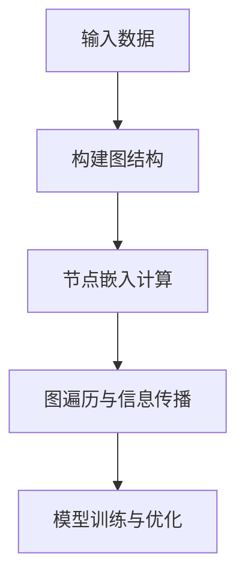
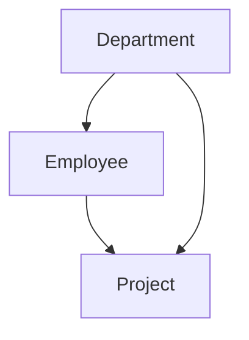
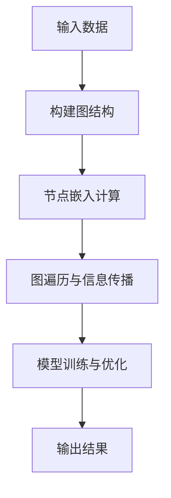
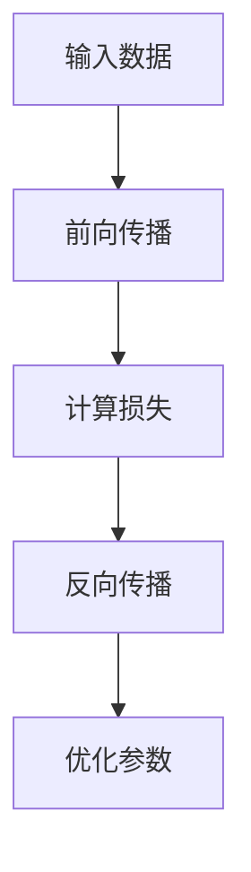
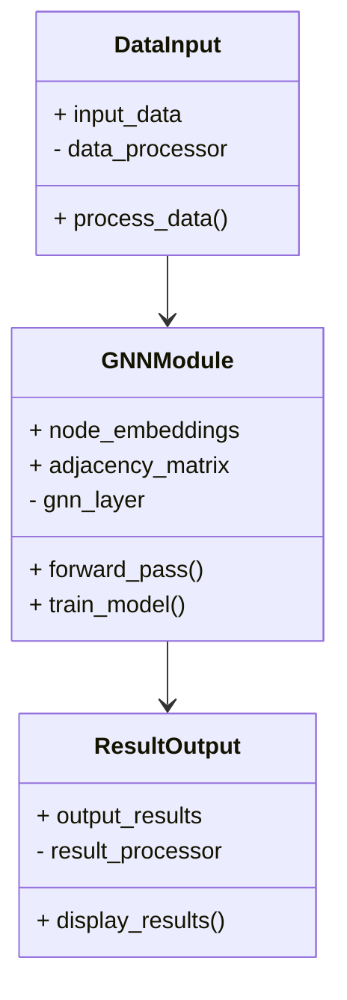
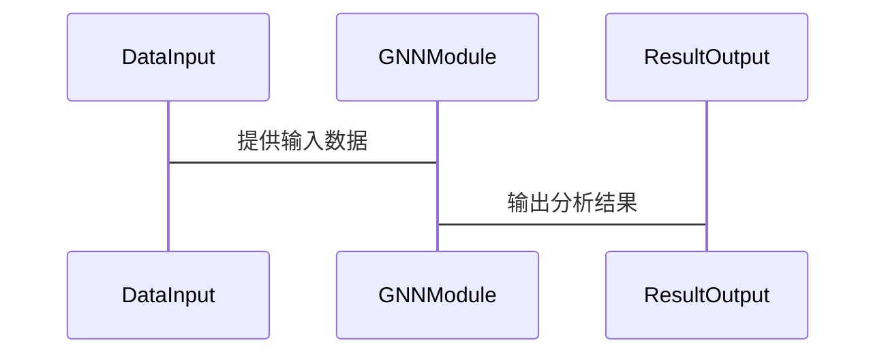

                 


# 企业AI Agent的图神经网络应用：复杂关系分析

> 关键词：企业AI Agent，图神经网络，复杂关系分析，图结构，算法实现

> 摘要：随着企业规模的不断扩大，复杂关系分析在企业管理中的重要性日益凸显。传统的数据分析方法难以应对复杂的多维关系网络。图神经网络作为一种新兴的技术，以其在处理复杂图结构数据方面的独特优势，成为企业AI Agent领域的重要工具。本文将从理论到实践，详细探讨企业AI Agent如何利用图神经网络进行复杂关系分析，揭示其在企业中的应用场景和实际价值。

---

## 第一部分: 企业AI Agent与图神经网络的背景介绍

### 第1章: AI Agent与图神经网络概述

#### 1.1 AI Agent的基本概念
AI Agent（人工智能代理）是一种能够感知环境、自主决策并执行任务的智能实体。它能够通过传感器获取信息，利用推理能力分析问题，并通过执行器采取行动。AI Agent的核心功能包括感知、推理、规划和执行。

- **感知**：AI Agent通过传感器或接口获取外部环境的数据，例如企业系统中的日志数据、用户行为数据等。
- **推理**：AI Agent利用逻辑推理或机器学习模型对获取的数据进行分析，识别模式和关系。
- **规划**：AI Agent根据推理结果制定行动计划，优化资源分配。
- **执行**：AI Agent通过执行器或API调用实现预定的目标，例如发送通知、调整系统配置等。

AI Agent的应用场景非常广泛，包括企业自动化、智能推荐、网络安全监控等领域。与传统AI相比，AI Agent的最大特点是其自主性和适应性，能够在动态环境中自主决策并解决问题。

#### 1.2 图神经网络的基本概念
图神经网络（Graph Neural Networks，GNN）是一种专门用于处理图结构数据的深度学习模型。图结构数据由节点（Nodes）和边（Edges）组成，能够有效地表示复杂的关联关系。与传统的神经网络相比，图神经网络具有以下特点：

- **节点表示**：每个节点都有独特的表示向量，能够反映其在图中的位置和角色。
- **边权重**：边的权重反映了节点之间的关系强度或相似性。
- **全局视角**：图神经网络能够捕捉图中节点之间的局部和全局关系，提供更全面的分析能力。

图神经网络在社交网络分析、推荐系统、分子结构分析等领域得到了广泛应用。在企业AI Agent的应用中，图神经网络特别适合处理复杂的关系网络，例如企业组织结构、供应链网络、客户关系管理等。

#### 1.3 企业复杂关系分析的背景与挑战
随着企业规模的扩大，传统的线性数据分析方法难以应对复杂的多维关系网络。企业中的许多问题，例如供应链优化、客户行为分析、内部流程优化等，都需要处理复杂的关联关系。图神经网络以其强大的图结构处理能力，成为解决这些问题的理想工具。

然而，企业在应用图神经网络时也面临一些挑战：

- **数据复杂性**：企业数据通常涉及多个维度，数据稀疏性或噪声可能影响模型的准确性。
- **计算资源**：图神经网络的训练和推理需要大量的计算资源，尤其是在处理大规模图数据时。
- **模型解释性**：复杂的模型往往缺乏可解释性，影响企业在实际应用中的信任度。

通过结合AI Agent的自主决策能力，图神经网络可以更好地适应企业的动态需求，提供实时的复杂关系分析能力。

---

## 第二部分: 核心概念与联系

### 第2章: 图神经网络的核心原理

#### 2.1 图神经网络的模型结构
图神经网络的模型结构通常包括以下几个部分：

1. **节点表示（Node Representation）**：每个节点通过一个向量表示其特征和在图中的位置。
2. **边权重（Edge Weight）**：边的权重反映了节点之间的关系强度。
3. **图传播（Graph Propagation）**：通过消息传递机制（Message Passing），将节点的信息传播到其邻居节点。

图神经网络的模型结构可以用以下公式表示：

$$
h_v^{(l+1)} = \sigma\left(\sum_{u \in N(v)} W^{(l)} h_u^{(l)} + b^{(l)}\right)
$$

其中，$h_v^{(l)}$ 表示节点 $v$ 在第 $l$ 层的表示向量，$N(v)$ 表示节点 $v$ 的邻居节点集合，$W^{(l)}$ 是第 $l$ 层的权重矩阵，$b^{(l)}$ 是偏置项，$\sigma$ 是激活函数。

#### 2.2 图神经网络的算法流程
图神经网络的算法流程可以分为以下几个步骤：

1. **数据输入与图构建**：读取输入数据并构建图结构，包括节点和边的信息。
2. **节点嵌入计算**：通过消息传递机制计算每个节点的嵌入向量。
3. **图遍历与信息传播**：通过图遍历算法（如BFS、DFS）将信息传播到整个图中。
4. **模型训练与优化**：利用标签数据训练模型，并通过反向传播优化模型参数。

图神经网络的算法流程可以用以下流程图表示：



#### 2.3 图神经网络的ER实体关系图
以下是一个简单的ER实体关系图，展示了企业中的部门、员工和项目之间的关系：



#### 2.4 图神经网络的算法流程图
以下是一个图神经网络的算法流程图：



---

## 第三部分: 算法原理

### 第3章: 图神经网络的数学模型

#### 3.1 图结构的表示
图结构可以表示为一个三元组 $(V, E, W)$，其中：
- $V$ 是节点集合。
- $E$ 是边集合。
- $W$ 是边权重的集合，表示节点之间的关系强度。

#### 3.2 节点表示的数学模型
节点表示的数学模型可以通过以下公式表示：

$$
h_v^{(l)} = \sigma\left(\sum_{u \in N(v)} W^{(l)} h_u^{(l-1)} + b^{(l)}\right)
$$

其中，$N(v)$ 表示节点 $v$ 的邻居节点集合，$h_v^{(l)}$ 是节点 $v$ 在第 $l$ 层的表示向量。

#### 3.3 图神经网络的训练过程
图神经网络的训练过程包括以下几个步骤：
1. **前向传播**：将输入数据通过图神经网络的层进行前向传播，计算节点的表示向量。
2. **损失计算**：根据标签数据计算损失函数值。
3. **反向传播**：通过梯度下降优化模型参数。

图神经网络的训练过程可以用以下流程图表示：



#### 3.4 图神经网络的实现代码
以下是一个简单的图神经网络实现代码示例：

```python
import torch
import torch.nn as nn
import torch.nn.functional as F

class GNNLayer(nn.Module):
    def __init__(self, in_channels, out_channels):
        super(GNNLayer, self).__init__()
        self.W = nn.Parameter(torch.randn(in_channels, out_channels))
        self.b = nn.Parameter(torch.randn(out_channels))

    def forward(self, node_embeddings, adjacency_matrix):
        # 计算邻居节点的嵌入和
        neighbor_embeddings = torch.matmul(adjacency_matrix, node_embeddings)
        # 计算当前层的嵌入
        new_embeddings = F.relu(torch.matmul(neighbor_embeddings, self.W) + self.b)
        return new_embeddings

class GraphNeuralNetwork(nn.Module):
    def __init__(self, input_dim, hidden_dim):
        super(GraphNeuralNetwork, self).__init__()
        self.gnn_layer = GNNLayer(input_dim, hidden_dim)
        self.output_layer = nn.Linear(hidden_dim, 1)

    def forward(self, node_embeddings, adjacency_matrix):
        hidden_embeddings = self.gnn_layer(node_embeddings, adjacency_matrix)
        output = self.output_layer(hidden_embeddings)
        return output

# 示例使用
input_dim = 10
hidden_dim = 5
model = GraphNeuralNetwork(input_dim, hidden_dim)
```

---

## 第四部分: 系统分析与架构设计

### 第4章: 企业复杂关系分析的系统架构

#### 4.1 项目背景与目标
本项目的目标是利用图神经网络对企业中的复杂关系进行分析，例如客户关系管理、供应链优化等。项目背景包括以下几个方面：
1. 企业的复杂关系网络需要高效处理。
2. 传统的数据分析方法难以应对复杂的多维关系。
3. 图神经网络在处理复杂关系网络方面的优势。

#### 4.2 系统功能设计
系统的功能设计包括以下几个模块：
1. **数据输入模块**：读取企业数据并构建图结构。
2. **图神经网络模块**：实现图神经网络的前向传播和训练。
3. **结果输出模块**：将分析结果输出到企业系统中。

#### 4.3 系统架构设计
系统的架构设计可以用以下类图表示：



#### 4.4 系统接口设计
系统的接口设计包括以下几个部分：
1. **数据输入接口**：提供API用于读取企业数据。
2. **模型训练接口**：提供API用于训练图神经网络模型。
3. **结果输出接口**：提供API用于输出分析结果。

#### 4.5 系统交互流程
系统的交互流程可以用以下序列图表示：



---

## 第五部分: 项目实战

### 第5章: 图神经网络在企业中的应用

#### 5.1 环境安装
为了运行图神经网络模型，需要安装以下环境：
1. Python 3.6及以上版本。
2. PyTorch 1.0及以上版本。
3. Mermaid图生成工具。

#### 5.2 核心代码实现
以下是一个完整的图神经网络实现代码示例：

```python
import torch
import torch.nn as nn
import torch.nn.functional as F

class GNNLayer(nn.Module):
    def __init__(self, in_channels, out_channels):
        super(GNNLayer, self).__init__()
        self.W = nn.Parameter(torch.randn(in_channels, out_channels))
        self.b = nn.Parameter(torch.randn(out_channels))

    def forward(self, node_embeddings, adjacency_matrix):
        # 计算邻居节点的嵌入和
        neighbor_embeddings = torch.matmul(adjacency_matrix, node_embeddings)
        # 计算当前层的嵌入
        new_embeddings = F.relu(torch.matmul(neighbor_embeddings, self.W) + self.b)
        return new_embeddings

class GraphNeuralNetwork(nn.Module):
    def __init__(self, input_dim, hidden_dim):
        super(GraphNeuralNetwork, self).__init__()
        self.gnn_layer = GNNLayer(input_dim, hidden_dim)
        self.output_layer = nn.Linear(hidden_dim, 1)

    def forward(self, node_embeddings, adjacency_matrix):
        hidden_embeddings = self.gnn_layer(node_embeddings, adjacency_matrix)
        output = self.output_layer(hidden_embeddings)
        return output

# 示例使用
input_dim = 10
hidden_dim = 5
model = GraphNeuralNetwork(input_dim, hidden_dim)

# 训练模型
criterion = nn.MSELoss()
optimizer = torch.optim.Adam(model.parameters(), lr=0.01)

# 假设输入数据为 node_embeddings 和 adjacency_matrix
# 训练过程略
```

#### 5.3 实际案例分析
以下是一个实际案例分析，展示了图神经网络在客户关系管理中的应用：

1. **数据输入**：读取客户数据并构建客户-产品关系图。
2. **模型训练**：训练图神经网络模型，识别高价值客户。
3. **结果输出**：输出高价值客户的列表，供企业进行精准营销。

#### 5.4 项目小结
通过本项目，我们展示了图神经网络在企业复杂关系分析中的应用。项目的成功实施依赖于以下几个关键因素：
1. 数据的准确性和完整性。
2. 模型的训练和优化。
3. 系统的可扩展性和可维护性。

---

## 第六部分: 最佳实践与小结

### 第6章: 最佳实践

#### 6.1 模型训练的优化技巧
1. **数据预处理**：对数据进行清洗和标准化，减少噪声对模型的影响。
2. **超参数调优**：通过网格搜索或随机搜索优化模型的超参数。
3. **模型解释性**：通过可视化工具（如节点重要性排序）提高模型的可解释性。

#### 6.2 系统部署与维护
1. **模型部署**：将训练好的模型部署到企业系统中，提供实时的复杂关系分析能力。
2. **系统维护**：定期更新模型参数，确保模型的准确性和鲁棒性。

#### 6.3 安全与隐私保护
1. **数据隐私保护**：确保企业数据的安全性和隐私性。
2. **模型安全防护**：防止模型被恶意攻击或篡改。

---

## 小结

通过本文的探讨，我们深入分析了企业AI Agent在复杂关系分析中的应用，揭示了图神经网络在处理复杂图结构数据方面的独特优势。从理论到实践，我们详细讲解了图神经网络的核心原理、算法实现和系统架构设计，并通过实际案例展示了图神经网络在企业中的应用价值。未来，随着图神经网络技术的不断发展，企业AI Agent将为企业复杂关系分析提供更强大的技术支持。

---

## 作者

作者：AI天才研究院/AI Genius Institute & 禅与计算机程序设计艺术 /Zen And The Art of Computer Programming

