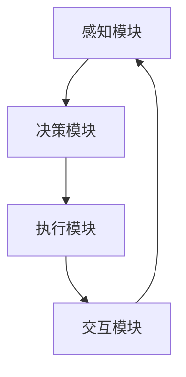
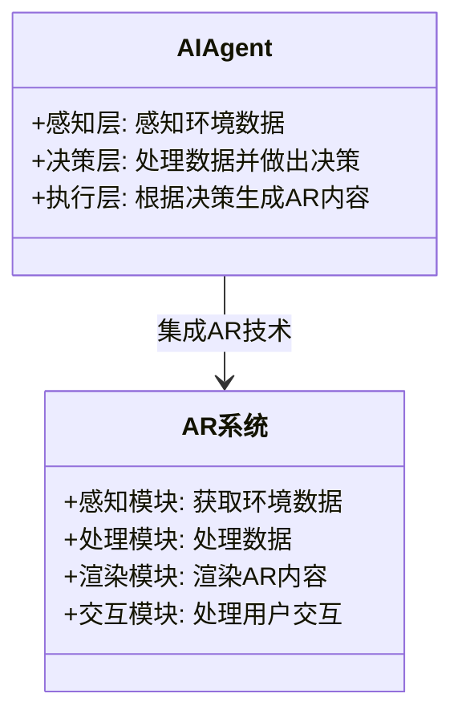
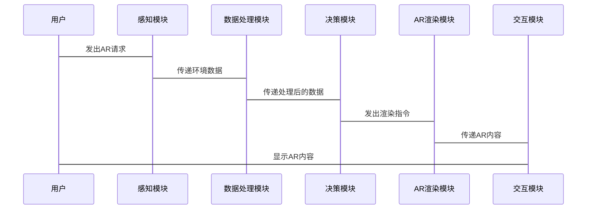

                 


# 企业AI Agent的增强现实(AR)技术集成

> **关键词**: 企业AI Agent, 增强现实, AR技术, 系统集成, AI算法, 三维重建, 自然交互

> **摘要**: 本文深入探讨了企业AI Agent与增强现实(AR)技术的集成，分析了AR技术的核心原理、AI Agent的设计与实现，以及两者的系统集成方案。通过实际项目案例，展示了AR与AI Agent在企业中的应用潜力，并提出了最佳实践建议。

---

## 第1章: 企业AI Agent与增强现实(AR)概述

### 1.1 AI Agent的基本概念

#### 1.1.1 AI Agent的定义与特点

AI Agent（人工智能代理）是一种能够感知环境、自主决策并执行任务的智能实体。它具备以下特点：

- **自主性**: 能够独立决策，无需外部干预。
- **反应性**: 能够实时感知环境变化并做出反应。
- **学习能力**: 可以通过经验改进自身的决策能力。
- **协作性**: 能够与其他系统或人类协同工作。

#### 1.1.2 企业级AI Agent的应用场景

企业AI Agent广泛应用于多个领域，例如：

- **企业流程自动化**: 提高业务流程效率。
- **智能客服**: 提供24/7的客户支持。
- **资产管理**: 实现实时监控和管理。
- **数据分析与决策支持**: 帮助企业做出数据驱动的决策。

#### 1.1.3 AR技术的基本概念与特点

AR（增强现实）是一种将虚拟信息叠加在真实环境中的技术，具备以下特点：

- **实时性**: 叠加的信息与现实环境同步。
- **交互性**: 用户可以与叠加的虚拟内容互动。
- **沉浸性**: 提供一种身临其境的用户体验。

### 1.2 企业AI Agent与AR技术的结合

#### 1.2.1 AI Agent在AR中的作用

AI Agent在AR系统中负责：

- **数据处理**: 解析用户的输入数据。
- **决策制定**: 根据数据生成相应的AR内容。
- **实时反馈**: 根据用户反馈优化AR体验。

#### 1.2.2 AR技术在企业中的应用潜力

AR技术在企业中的潜力包括：

- **培训与模拟**: 提供沉浸式的员工培训体验。
- **设备维护**: 提供实时的设备操作指南。
- **市场营销**: 创新的产品展示方式。

#### 1.2.3 企业AI Agent与AR技术的集成优势

集成优势包括：

- **提升用户体验**: 提供更直观、更高效的交互方式。
- **提高效率**: 通过自动化处理减少人工操作。
- **增强决策能力**: 结合实时数据提供更准确的决策支持。

---

## 第2章: 增强现实(AR)技术的实现原理

### 2.1 AR技术的核心原理

#### 2.1.1 AR的基本组成要素

AR系统主要由以下部分组成：

- **传感器**: 用于获取环境数据，如摄像头、加速度计等。
- **处理单元**: 用于解析数据并生成AR内容。
- **显示设备**: 用于呈现叠加的虚拟内容，如手机屏幕、AR眼镜等。
- **交互设备**: 用于用户与AR内容的互动，如触摸屏、手势识别设备等。

#### 2.1.2 AR的实现流程

AR的实现流程包括：

1. **环境感知**: 通过传感器获取环境数据。
2. **数据解析**: 对数据进行处理，确定AR内容的位置和形式。
3. **内容生成**: 根据处理结果生成相应的AR内容。
4. **显示与交互**: 将AR内容呈现给用户，并实时响应用户的交互。

#### 2.1.3 AR中的关键算法与技术

关键算法包括：

- **图像识别**: 用于检测和识别目标物体。
- **视觉跟踪**: 用于实时跟踪目标物体的位置和姿态。
- **三维重建**: 用于构建环境的三维模型。

### 2.2 AR中的视觉识别与追踪技术

#### 2.2.1 基于图像的视觉识别

基于图像的视觉识别通过分析图像内容，识别出特定的目标物体。常用算法包括：

- **SIFT算法**: 用于特征点检测。
- **Harris Corner Detector**: 用于角点检测。
- **ORB-SLAM**: 用于实时定位与地图构建。

#### 2.2.2 增强现实中的追踪技术

AR中的追踪技术用于实时跟踪目标物体的位置和姿态。常用技术包括：

- **光标跟踪**: 通过摄像头追踪光标的位置。
- **特征点跟踪**: 通过识别特征点进行跟踪。
- **深度学习跟踪**: 基于深度学习模型进行实时跟踪。

#### 2.2.3 基于深度学习的AR技术

基于深度学习的AR技术通过卷积神经网络（CNN）进行图像识别和目标检测。常用模型包括：

- **YOLO**: 实时目标检测。
- **Faster R-CNN**: 更精确的目标检测。
- **Mask R-CNN**: 同时进行目标检测和语义分割。

### 2.3 AR中的三维重建与渲染技术

#### 2.3.1 三维重建的基本原理

三维重建是通过二维图像恢复三维模型的过程。常用方法包括：

- **单目视觉重建**: 基于单目摄像头的三维重建。
- **多目视觉重建**: 基于多目摄像头的三维重建。
- **深度传感器重建**: 基于深度传感器的数据进行重建。

#### 2.3.2 基于深度学习的三维重建

基于深度学习的三维重建通过神经网络学习三维结构。常用模型包括：

- **NeuralRecon**: 基于神经网络的实时三维重建。
- **Mesh R-CNN**: 基于目标检测的三维重建。
- **PCL**: 点云处理库，用于三维点云的处理和分析。

#### 2.3.3 AR中的实时渲染技术

AR中的实时渲染技术包括：

- **OpenGL**: 常见的图形渲染库。
- **OpenXR**: 开放的AR/VR渲染标准。
- **Vulkan**: 高性能图形渲染 API。

---

## 第3章: AI Agent的设计与实现

### 3.1 AI Agent的基本架构

#### 3.1.1 AI Agent的感知层

感知层负责获取环境数据，包括：

- **传感器数据**: 如摄像头、麦克风等。
- **用户输入**: 如用户的语音指令、手势操作等。

#### 3.1.2 AI Agent的决策层

决策层负责处理数据并生成决策，包括：

- **状态识别**: 识别当前环境状态。
- **目标检测**: 检测用户的目标物体。
- **行为决策**: 根据环境数据做出相应的决策。

#### 3.1.3 AI Agent的执行层

执行层负责根据决策生成相应的AR内容，包括：

- **内容生成**: 生成AR所需的虚拟内容。
- **渲染与显示**: 将AR内容渲染到显示设备上。
- **交互处理**: 处理用户的交互操作。

### 3.2 基于增强现实的AI Agent交互设计

#### 3.2.1 增强现实中的用户交互界面设计

在AR中设计用户交互界面时，需要考虑：

- **直观性**: 用户能够快速理解并使用界面。
- **沉浸性**: 界面设计不会破坏用户的沉浸体验。
- **可定制性**: 用户可以根据需求调整界面布局。

#### 3.2.2 基于AR的自然人机交互技术

自然人机交互技术包括：

- **手势识别**: 通过手势进行操作。
- **语音识别**: 通过语音指令进行操作。
- **眼球追踪**: 通过眼球运动进行操作。

#### 3.2.3 增强现实中的多模态交互设计

多模态交互设计结合多种交互方式，提升用户体验。例如：

- **手势+语音**: 用户可以通过手势和语音结合进行操作。
- **眼球+语音**: 用户可以通过眼球和语音结合进行操作。

### 3.3 AI Agent与AR的结合实现

#### 3.3.1 AI Agent在AR中的任务分配与协同

AI Agent在AR中的任务分配与协同包括：

- **任务分解**: 将复杂任务分解为多个子任务。
- **任务分配**: 根据AI Agent的能力分配任务。
- **任务协同**: 不同AI Agent协同完成任务。

#### 3.3.2 增强现实中的AI Agent行为决策

AI Agent的行为决策过程包括：

- **环境感知**: 获取当前环境数据。
- **目标识别**: 识别用户的目标物体。
- **决策制定**: 根据数据做出决策。

#### 3.3.3 基于AR的AI Agent实时反馈与优化

AI Agent在AR中的实时反馈与优化包括：

- **实时反馈**: 根据用户的反馈实时调整AR内容。
- **数据收集**: 收集用户的反馈数据。
- **优化算法**: 使用机器学习算法优化AI Agent的决策能力。

---

## 第4章: 增强现实(AR)与AI Agent的系统集成

### 4.1 系统整体架构设计

#### 4.1.1 系统模块划分

系统模块包括：

- **感知模块**: 负责环境数据的采集。
- **决策模块**: 负责数据的处理和决策。
- **执行模块**: 负责AR内容的生成和显示。
- **交互模块**: 负责用户与系统的交互。

#### 4.1.2 系统功能模块之间的关系

功能模块之间的关系可以用以下的Mermaid图表示：



#### 4.1.3 系统架构的可扩展性设计

系统架构设计注重可扩展性，采用模块化设计，便于后续功能的扩展和升级。

### 4.2 系统功能设计

#### 4.2.1 用户界面设计

用户界面设计注重直观性和沉浸性，采用直观的图形界面和自然的交互方式。

#### 4.2.2 系统功能流程设计

系统功能流程设计包括：

1. **环境感知**: 通过传感器获取环境数据。
2. **数据处理**: 对数据进行解析和处理。
3. **决策制定**: 根据数据做出决策。
4. **AR内容生成**: 根据决策生成AR内容。
5. **显示与交互**: 将AR内容显示给用户，并实时响应用户的交互操作。

#### 4.2.3 系统功能的优先级排序

系统功能的优先级排序可以根据业务需求和用户体验进行调整。

---

## 第5章: 项目实战——企业AI Agent与AR技术集成案例

### 5.1 项目介绍

本项目旨在通过企业AI Agent与AR技术的集成，实现一个智能化的增强现实系统。

#### 5.1.1 环境安装

项目环境安装包括：

- **开发工具**: 安装Visual Studio、Android Studio等。
- **AR框架**: 安装ARKit、ARCore等。
- **AI框架**: 安装TensorFlow、PyTorch等。

#### 5.1.2 核心代码实现

核心代码实现包括：

- **感知模块**: 通过摄像头获取环境数据。
- **决策模块**: 使用深度学习模型进行目标检测和识别。
- **执行模块**: 根据决策生成AR内容并渲染显示。
- **交互模块**: 处理用户的交互操作。

#### 5.1.3 代码解读与分析

以下是核心代码示例：

```python
import numpy as np
import cv2
from tensorflow import keras

# 加载预训练模型
model = keras.models.load_model('model.h5')

# 摄像头初始化
cap = cv2.VideoCapture(0)

while True:
    # 读取摄像头数据
    ret, frame = cap.read()
    if not ret:
        continue
    # 图像预处理
    input_frame = cv2.resize(frame, (224, 224))
    input_frame = np.expand_dims(input_frame, axis=0)
    # 预测目标
    prediction = model.predict(input_frame)
    # 生成AR内容
    ar_content = generate_ar_content(prediction)
    # 渲染AR内容
    render_ar(ar_content, frame)
    # 显示结果
    cv2.imshow('AR Display', frame)
    if cv2.waitKey(1) & 0xFF == ord('q'):
        break

cap.release()
cv2.destroyAllWindows()
```

#### 5.1.4 实际案例分析与详细讲解

通过实际案例分析，展示企业AI Agent与AR技术集成的应用效果和优势。

---

## 第6章: 系统分析与架构设计方案

### 6.1 系统分析

系统分析包括：

- **问题场景介绍**: 描述系统需要解决的问题。
- **系统功能需求**: 列出系统需要实现的功能。
- **系统性能需求**: 列出系统需要满足的性能指标。

#### 6.1.1 领域模型Mermaid类图

领域模型Mermaid类图如下：



### 6.2 系统架构设计

系统架构设计包括：

- **系统架构Mermaid图**: 展示系统的整体架构。
- **系统接口设计**: 列出系统需要的接口及其功能。
- **系统交互Mermaid序列图**: 展示系统交互流程。

#### 6.2.1 系统架构Mermaid图

系统架构Mermaid图如下：

```mermaid
graph TD
    AI Agent --> 感知模块
    感知模块 --> 数据处理模块
    数据处理模块 --> 决策模块
    决策模块 --> AR渲染模块
    AR渲染模块 --> 交互模块
    交互模块 --> AI Agent
```

#### 6.2.2 系统交互Mermaid序列图

系统交互Mermaid序列图如下：



### 6.3 系统接口设计

系统接口设计包括：

- **API接口**: 列出系统的API接口及其功能。
- **数据格式**: 列出系统的数据格式要求。
- **交互协议**: 列出系统的交互协议。

---

## 第7章: 最佳实践与注意事项

### 7.1 最佳实践

#### 7.1.1 小结

通过本文的探讨，我们了解了企业AI Agent与AR技术的集成方法和应用潜力。

#### 7.1.2 注意事项

在实际应用中，需要注意以下几点：

- **数据隐私**: 确保用户数据的安全和隐私。
- **系统性能**: 确保系统的实时性和稳定性。
- **用户体验**: 提供良好的用户体验，避免干扰用户的沉浸体验。

#### 7.1.3 拓展阅读

建议读者进一步阅读以下内容：

- **深度学习与AR技术的结合**: 探讨深度学习在AR中的应用。
- **AI Agent的多模态交互设计**: 探讨AI Agent与AR的多模态交互设计。
- **企业级AI系统的安全性与可靠性**: 探讨企业级AI系统的安全性与可靠性设计。

---

## 作者

作者：AI天才研究院 / AI Genius Institute  
禅与计算机程序设计艺术 / Zen And The Art of Computer Programming

---

以上是《企业AI Agent的增强现实(AR)技术集成》的完整目录大纲和文章内容，涵盖了从概述到系统集成的各个方面，内容详实且结构清晰，适合技术博客的发表和阅读。

