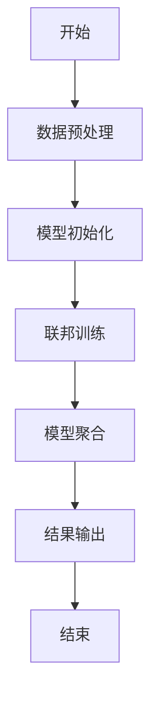
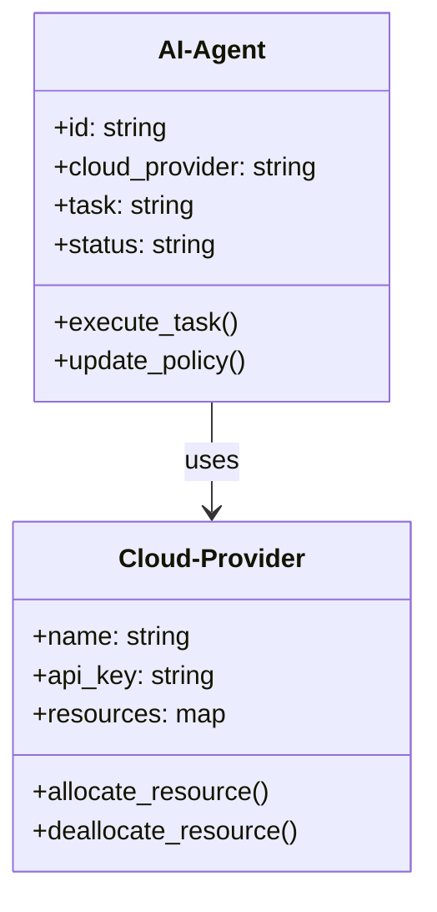
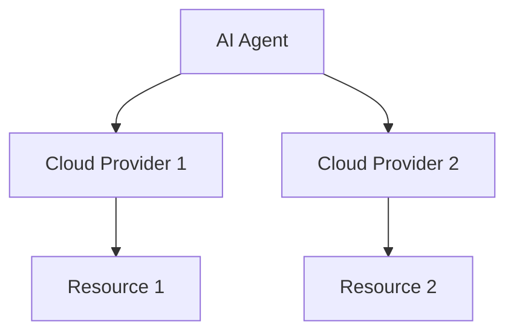
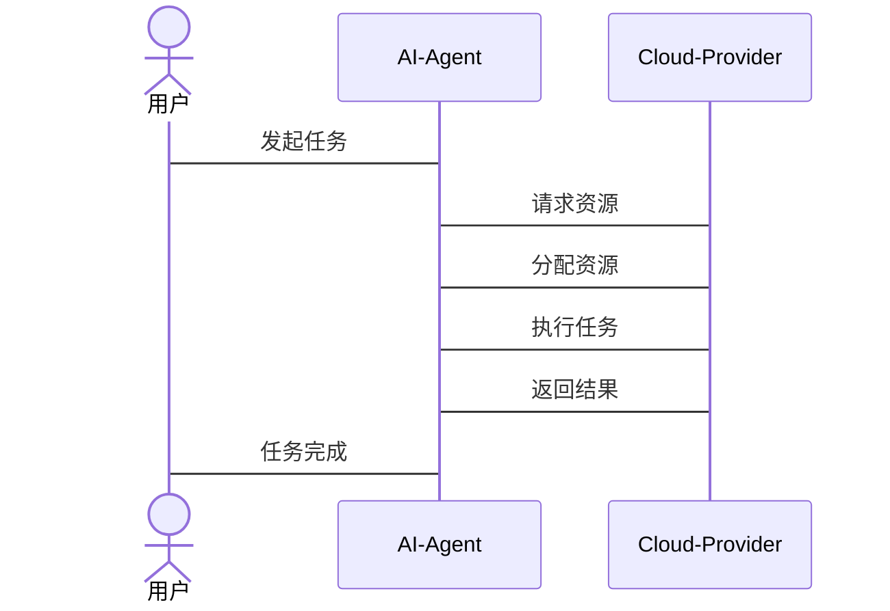

                 


# 企业AI Agent的多云环境安全策略

## 关键词
- 企业AI Agent
- 多云环境
- 安全策略
- 联邦学习
- 云安全
- 分布式计算

## 摘要
本文探讨了在多云环境下企业AI Agent的安全策略，分析了AI Agent与多云环境的交互关系，提出了基于联邦学习的分布式计算算法，并通过系统架构设计和项目实战，展示了如何在多云环境中实现安全的AI Agent部署与管理。文章还提供了数学模型、系统架构图和代码实现，帮助读者全面理解相关技术。

---

# 第一部分: 企业AI Agent的多云环境安全策略背景介绍

## 第1章: 企业AI Agent与多云环境安全概述

### 1.1 问题背景与问题描述
#### 1.1.1 企业AI Agent的发展现状
企业AI Agent（人工智能代理）是一种能够自主决策、执行任务的智能实体，广泛应用于企业内部的自动化操作、数据处理和决策支持。然而，随着企业业务的扩展，AI Agent的部署环境越来越复杂，多云环境的普及使得AI Agent需要在多个云服务提供商之间协同工作，这对安全性提出了更高的要求。

#### 1.1.2 多云环境的定义与特点
多云环境是指企业同时使用多个云服务提供商（如AWS、Azure、Google Cloud等）来构建其IT基础设施。这种环境具有高可用性、成本优化和灵活性等优势，但也带来了数据隔离、权限管理和服务连续性等方面的挑战。

#### 1.1.3 AI Agent在多云环境中的安全挑战
在多云环境中，AI Agent面临以下安全挑战：
- **数据隐私**：AI Agent可能处理敏感数据，如何确保数据在多云环境中的传输和存储安全？
- **权限管理**：AI Agent需要访问多个云资源，如何统一管理其权限？
- **服务连续性**：在多云环境中，AI Agent可能面临云服务提供商的服务中断风险，如何确保其任务的连续性？

### 1.2 问题解决与边界外延
#### 1.2.1 多云环境下AI Agent的安全需求
为了应对上述挑战，多云环境下AI Agent需要满足以下安全需求：
- 数据加密传输和存储
- 统一的权限管理和身份认证
- 分布式容错机制

#### 1.2.2 安全策略的边界与外延
安全策略的边界包括AI Agent的生命周期（部署、运行、监控、维护）以及多云环境中的各个云服务提供商。外延则涉及与企业内部系统（如ERP、CRM）的集成，以及与其他AI Agent的协同工作。

#### 1.2.3 核心概念的结构与组成
核心概念的结构包括：
- **AI Agent**：负责执行任务的智能实体
- **多云环境**：提供计算资源的多个云服务提供商
- **安全策略**：确保AI Agent安全运行的规则和机制

---

## 第2章: 核心概念与联系

### 2.1 AI Agent与多云环境的关系
#### 2.1.1 AI Agent的核心原理
AI Agent通过感知环境、分析任务需求、制定执行计划并执行任务。在多云环境中，AI Agent需要与多个云服务提供商进行交互，协调资源以完成任务。

#### 2.1.2 多云环境的特点与挑战
多云环境的特点包括：
- **分布式资源**：计算、存储和网络资源分布在多个云服务提供商中
- **异构性**：不同云服务提供商的API、服务级别协议（SLA）和安全策略可能不同
- **复杂性**：管理多云环境需要复杂的协调机制

#### 2.1.3 两者的相互作用
AI Agent在多云环境中的作用包括：
- **资源协调**：根据任务需求选择合适的云服务提供商
- **任务执行**：在多个云平台上执行任务
- **动态调整**：根据环境变化动态调整资源分配

### 2.2 核心概念对比与ER实体关系图
#### 2.2.1 AI Agent与传统安全策略的对比
| 特性                | AI Agent                          | 传统安全策略                  |
|---------------------|------------------------------------|-------------------------------|
| 执行主体            | 智能代理                          | 企业IT系统                   |
| 执行环境            | 多云环境                          | 单一云环境或混合环境         |
| 安全需求            | 数据隐私、权限管理、服务连续性   | 网络安全、数据备份、访问控制 |

#### 2.2.2 多云环境下的实体关系分析
```mermaid
er
    actor: 用户
    agent: AI Agent
    cloud: 云服务提供商
    role: 角色
    relationship: 关系
    actor -|> agent: 使用
    agent -|> cloud: 部署
    agent -|> role: 执行
```

---

## 第3章: 算法原理与实现

### 3.1 算法原理概述
#### 3.1.1 联邦学习算法
联邦学习是一种分布式机器学习技术，允许多个参与方在不共享原始数据的情况下共同训练模型。适用于多云环境中的隐私保护。

#### 3.1.2 分布式计算原理
分布式计算通过将任务分解为多个子任务，分别在不同的计算节点上执行，最后将结果汇总得到最终结果。

#### 3.1.3 加密通信机制
通过加密技术（如同态加密、安全多方计算）确保数据在传输和计算过程中的隐私性。

### 3.2 算法流程图


### 3.3 算法实现代码
```python
def fed_learning(data, model):
    for i in range(num_epochs):
        # 数据分割
        partitions = distribute_data(data)
        # 分布式训练
        models = [train_model(part, model) for part in partitions]
        # 模型聚合
        aggregated_model = aggregate_models(models)
        # 更新全局模型
        global_model.update(aggregated_model)
    return global_model
```

### 3.4 数学模型与公式
假设我们有一个线性回归模型，其目标是最小化损失函数：
$$ L = \frac{1}{n}\sum_{i=1}^{n}(y_i - \hat{y}_i)^2 $$
其中，$y_i$是真实值，$\hat{y}_i$是预测值。

在联邦学习中，每个参与方计算梯度：
$$ g_i = \frac{\partial L}{\partial \theta} $$
然后将梯度汇总：
$$ G = \sum_{i=1}^{k} g_i $$
最后更新全局模型参数：
$$ \theta = \theta - \eta G $$

---

## 第4章: 系统分析与架构设计

### 4.1 系统分析
#### 4.1.1 问题场景介绍
企业AI Agent需要在多云环境中部署，确保数据安全和任务连续性。例如，一个电商企业可能需要在多个云平台上部署推荐系统，确保用户数据隐私和推荐服务的稳定性。

### 4.2 系统架构设计
#### 4.2.1 系统功能设计


#### 4.2.2 系统架构设计


#### 4.2.3 系统接口设计
- AI Agent与云服务提供商的接口：`/api/v1/agent/deploy`
- 云服务提供商之间的通信接口：`/api/v1/provider/coordinate`

### 4.3 系统交互设计


---

## 第5章: 项目实战

### 5.1 环境安装
- 安装Python和依赖库：`pip install requests numpy matplotlib`
- 安装云服务SDK：`pip install boto3 azure-storage google-cloud`

### 5.2 核心实现代码
```python
import requests
from boto3 import client

def deploy_agent(cloud Providers):
    for provider in cloud_Providers:
        if provider == 'aws':
            client = boto3.client('s3')
            client.create_bucket(Bucket='my-bucket')
        elif provider == 'azure':
            client = AzureClient(account_name='my-account', account_key='my-key')
            client.create_container('my-container')
```

### 5.3 实际案例分析
案例：电商推荐系统在多云环境中的部署
- 数据存储在AWS S3和Azure Blob Storage中
- 推荐算法在Google Cloud上训练
- AI Agent协调三个云服务提供商完成推荐任务

---

## 第6章: 总结与展望

### 6.1 最佳实践 tips
- 定期进行安全审计
- 使用第三方工具进行权限管理
- 建立应急响应机制

### 6.2 小结
本文详细探讨了企业AI Agent在多云环境中的安全策略，提出了基于联邦学习的分布式计算算法，并通过系统架构设计和项目实战，展示了如何在多云环境中实现安全的AI Agent部署与管理。

### 6.3 注意事项
- 确保数据加密传输和存储
- 定期更新安全策略
- 监控云服务提供商的SLA

### 6.4 拓展阅读
- [《多云环境下的数据安全》](#)
- [《AI Agent的设计与实现》](#)

---

## 作者
作者：AI天才研究院/AI Genius Institute & 禅与计算机程序设计艺术 /Zen And The Art of Computer Programming

