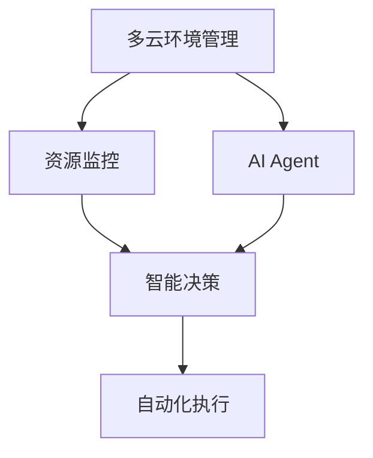
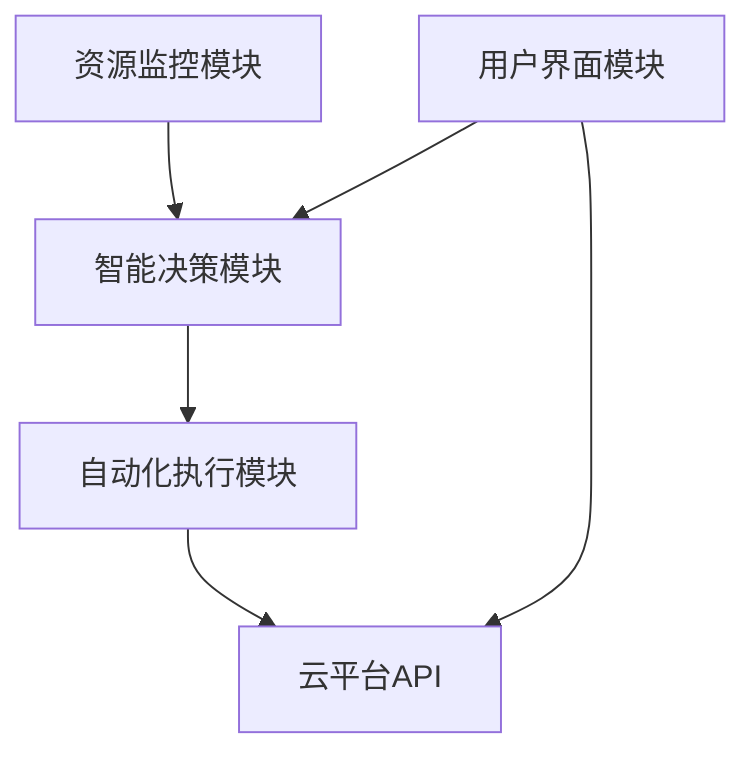
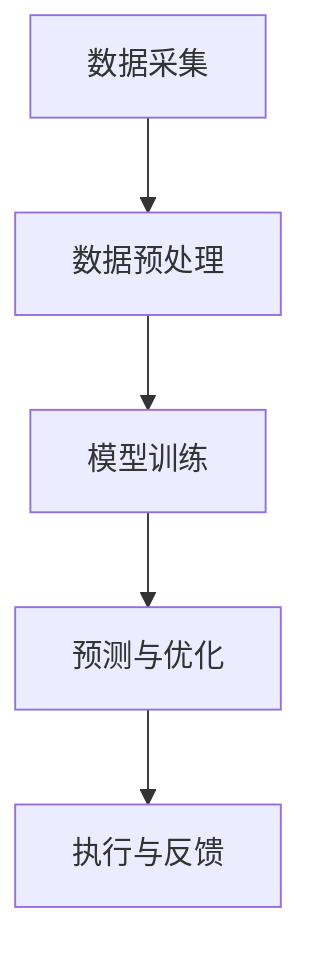
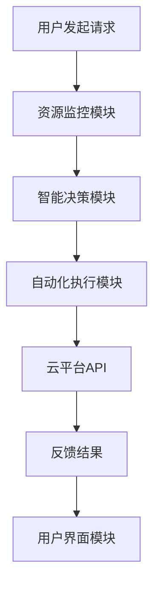

                 


# 企业AI Agent的多云环境管理策略

## 关键词：
企业AI Agent, 多云环境, 管理策略, 算法原理, 系统架构

## 摘要：
本文将深入探讨企业AI Agent在多云环境下的管理策略，从背景介绍、核心概念、算法原理、系统架构设计到项目实战，全面解析多云环境管理的关键技术与实际应用。通过结合理论与实践，本文旨在为企业提供一套高效、可靠的AI Agent多云环境管理方案。

---

# 第一部分: 企业AI Agent的多云环境管理背景与概念

# 第1章: 多云环境与AI Agent概述

## 1.1 多云环境的定义与特点
### 1.1.1 多云环境的定义
多云环境指的是企业同时使用多个云服务提供商（如AWS、Azure、Google Cloud等）构建其 IT 基础设施和应用程序的环境。这种模式允许企业在不同的云平台上部署资源，以优化成本、性能和可用性。

### 1.1.2 多云环境的核心特点
- **灵活性**：企业可以根据业务需求选择不同的云服务。
- **高可用性**：通过多云部署，企业可以避免单点故障。
- **成本优化**：利用不同云服务提供商的价格优势，降低整体成本。
- **创新加速**：多云环境为企业提供了更多选择，加速技术创新。

### 1.1.3 多云环境与单云环境的区别
| 特性            | 单云环境                  | 多云环境                  |
|-----------------|--------------------------|--------------------------|
| 服务提供商      | 单一云服务提供商          | 多个云服务提供商          |
| 可用性          | 取决于单一云提供商的可用性  | 高可用性，通过多个云提供商实现 |
| 成本优化        | 可能存在较高的单点成本    | 更灵活的成本优化          |
| 创新性          | 受限于单一云提供商的限制   | 更高的创新灵活性          |

## 1.2 AI Agent的定义与特点
### 1.2.1 AI Agent的定义
AI Agent（人工智能代理）是一种能够感知环境、自主决策并执行任务的智能实体。它可以基于数据和上下文做出决策，执行复杂任务。

### 1.2.2 AI Agent的核心特点
- **自主性**：AI Agent能够自主决策和行动。
- **反应性**：能够实时感知环境并做出反应。
- **学习能力**：通过机器学习算法不断优化自身行为。
- **可扩展性**：能够处理不同类型和规模的任务。

### 1.2.3 AI Agent与传统自动化工具的区别
| 特性            | 传统自动化工具             | AI Agent                 |
|-----------------|---------------------------|---------------------------|
| 决策能力        | 预定义规则，无法自主决策   | 基于数据和模型自主决策    |
| 学习能力        | 无法学习                   | 可以通过机器学习不断优化  |
| 复杂任务处理    | 适用于简单、固定的流程     | 适用于复杂、动态的任务    |

## 1.3 多云环境管理的背景与挑战
### 1.3.1 多云环境管理的背景
随着企业业务的扩展，单云环境已无法满足企业对灵活性、高可用性和成本优化的需求，多云环境成为趋势。

### 1.3.2 多云环境管理的主要挑战
- **资源分散**：多云环境下资源分散在多个云平台，增加了管理复杂性。
- **异构性**：不同云平台的API和资源模型不同，增加了集成难度。
- **安全性**：多云环境中的数据和资源分布广泛，增加了安全风险。
- **成本控制**：如何在多个云平台上优化成本是关键挑战。

### 1.3.3 企业采用AI Agent管理多云环境的意义
- **提高效率**：AI Agent可以自动化处理多云环境中的复杂任务。
- **降低成本**：通过智能决策优化资源分配，降低运营成本。
- **提升灵活性**：AI Agent能够快速适应多云环境的变化。

## 1.4 本章小结
本章介绍了多云环境和AI Agent的基本概念，分析了多云环境管理的背景与挑战，并探讨了企业采用AI Agent管理多云环境的意义。

---

# 第二部分: 多云环境管理的核心概念与联系

# 第2章: 多云环境管理的核心概念

## 2.1 多云环境管理的原理
### 2.1.1 多云环境管理的原理概述
多云环境管理是指通过统一的策略和工具，对分布在多个云平台上的资源进行监控、优化和协调。

### 2.1.2 多云环境管理的关键流程
1. **资源监控**：实时监控各云平台的资源使用情况。
2. **负载均衡**：根据资源使用情况动态分配任务。
3. **成本优化**：基于历史数据和预测模型优化资源分配。
4. **故障恢复**：在发生故障时自动切换到备用云平台。

### 2.1.3 多云环境管理的核心要素
- **资源监控**：实时采集各云平台的资源使用数据。
- **智能决策**：基于数据和模型做出优化决策。
- **自动化执行**：通过API调用实现资源的动态分配。

## 2.2 AI Agent在多云环境管理中的作用
### 2.2.1 AI Agent在多云环境管理中的核心功能
1. **资源监控**：实时监控各云平台的资源使用情况。
2. **智能决策**：基于历史数据和机器学习模型优化资源分配。
3. **自动化执行**：通过API调用实现资源的动态分配。

### 2.2.2 AI Agent如何提升多云环境管理效率
- **自动化**：AI Agent能够自动处理资源监控、负载均衡等任务。
- **智能优化**：基于机器学习模型，AI Agent可以预测资源需求并优化分配。
- **高可用性**：AI Agent能够快速响应故障并实现自动切换。

### 2.2.3 多云环境管理中的关键概念关系图（Mermaid图）


## 2.3 多云环境管理的核心概念对比
| 特性            | 资源监控          | 智能决策          | 自动化执行          |
|-----------------|------------------|------------------|------------------|
| 功能            | 监控资源使用情况  | 基于数据做出决策  | 执行优化操作      |
| 实现方式        | 采集数据          | 机器学习模型      | API调用            |
| 依赖            | 数据采集工具      | 历史数据和模型     | 各云平台的API      |

---

# 第3章: 多云环境管理的系统架构设计

## 3.1 系统架构设计概述
### 3.1.1 系统架构设计的目标
- 实现对多云环境的统一管理。
- 提供智能化的资源监控和优化功能。
- 支持AI Agent的自主决策和执行。

### 3.1.2 系统架构设计的关键原则
1. **模块化设计**：各功能模块独立且易于扩展。
2. **高可用性**：系统具备容错和自动恢复能力。
3. **可扩展性**：能够支持更多云平台的接入。

## 3.2 多云环境管理系统的功能设计
### 3.2.1 系统功能模块划分
1. **资源监控模块**：实时监控各云平台的资源使用情况。
2. **智能决策模块**：基于数据和模型做出优化决策。
3. **自动化执行模块**：通过API调用实现资源的动态分配。
4. **用户界面模块**：提供友好的操作界面，供用户查看和管理资源。

### 3.2.2 系统功能模块的交互流程
1. 资源监控模块采集各云平台的资源使用数据。
2. 智能决策模块基于历史数据和机器学习模型做出优化决策。
3. 自动化执行模块根据决策结果调用各云平台的API实现资源分配。
4. 用户界面模块展示资源使用情况和优化结果。

### 3.2.3 系统功能模块的实现方式
- **资源监控模块**：使用各云平台的API接口采集资源使用数据。
- **智能决策模块**：基于机器学习模型预测资源需求并做出决策。
- **自动化执行模块**：通过调用各云平台的API实现资源分配。

## 3.3 系统架构设计的Mermaid图


## 3.4 系统接口设计
### 3.4.1 系统接口的定义与规范
- **接口名称**：资源监控接口。
- **接口功能**：采集各云平台的资源使用数据。
- **接口类型**：RESTful API。
- **请求方式**：GET。

### 3.4.2 系统接口的交互流程
1. 用户通过用户界面模块发起资源监控请求。
2. 资源监控模块通过调用各云平台的API采集资源使用数据。
3. 资源监控模块将数据传递给智能决策模块。
4. 智能决策模块基于数据做出优化决策。
5. 自动化执行模块根据决策结果调用各云平台的API实现资源分配。

### 3.4.3 系统接口的设计原则
- **简洁性**：接口设计简洁明了，易于理解和使用。
- **安全性**：接口必须具备身份验证和权限控制功能。
- **可扩展性**：接口设计应具备良好的扩展性，支持未来更多的云平台接入。

---

# 第三部分: 多云环境管理的算法原理与数学模型

# 第4章: 多云环境管理的算法原理

## 4.1 算法原理概述
### 4.1.1 算法原理的核心思想
多云环境管理的算法原理基于机器学习模型，通过分析历史数据和实时数据，预测资源需求并优化资源分配。

### 4.1.2 算法原理的关键步骤
1. **数据采集**：采集各云平台的资源使用数据。
2. **数据预处理**：清洗数据并提取特征。
3. **模型训练**：基于历史数据训练机器学习模型。
4. **预测与优化**：基于模型预测资源需求并优化资源分配。
5. **执行与反馈**：根据优化结果执行资源分配，并收集反馈数据。

### 4.1.3 算法原理的应用场景
- **资源分配优化**：基于模型预测资源需求，优化资源分配。
- **故障恢复**：在发生故障时，快速切换到备用云平台。
- **成本优化**：通过智能决策降低运营成本。

## 4.2 多云环境管理的数学模型
### 4.2.1 数学模型的定义与特点
多云环境管理的数学模型是一种基于机器学习的模型，用于预测资源需求并优化资源分配。

### 4.2.2 数学模型的构建过程
1. **数据采集**：采集各云平台的资源使用数据。
2. **特征提取**：从数据中提取有用的特征。
3. **模型训练**：基于历史数据训练机器学习模型。
4. **模型验证**：验证模型的准确性和可靠性。
5. **模型优化**：通过调整参数和优化算法提高模型性能。

### 4.2.3 数学模型的验证与优化
- **验证**：通过测试数据验证模型的准确性。
- **优化**：通过调整模型参数和算法优化模型性能。

## 4.3 算法原理的Mermaid流程图


---

# 第5章: 多云环境管理的数学模型与公式

## 5.1 数学模型的构建与实现
### 5.1.1 数据采集与预处理
```python
# 采集数据
import requests
data = requests.get('https://api.example.com/metrics').json()

# 数据预处理
from sklearn.preprocessing import StandardScaler
scaler = StandardScaler()
X_scaled = scaler.fit_transform(data)
```

### 5.1.2 模型训练与优化
```python
# 训练模型
from sklearn.linear_model import LinearRegression
model = LinearRegression()
model.fit(X_scaled, y)

# 模型优化
from sklearn.model_selection import GridSearchCV
param_grid = {'alpha': [0.1, 1.0, 10.0]}
grid_search = GridSearchCV(LinearRegression(), param_grid)
grid_search.fit(X_scaled, y)
best_model = grid_search.best_estimator_
```

### 5.1.3 预测与优化
```python
# 预测资源需求
y_pred = best_model.predict(X_scaled)

# 优化资源分配
from scipy.optimize import minimize
def objective_function(x):
    return sum((x - y_pred)**2)

result = minimize(objective_function, x0=[0], bounds=[(0, 1)])
optimal_resources = result.x
```

## 5.2 数学模型的公式与应用
### 5.2.1 线性回归模型
$$ y = \beta_0 + \beta_1x + \epsilon $$

### 5.2.2 最小二乘法
$$ \hat{\beta} = \arg\min_{\beta} \sum_{i=1}^{n} (y_i - \beta_0 - \beta_1x_i)^2 $$

### 5.2.3 优化模型
$$ \text{minimize} \quad f(x) = \sum_{i=1}^{n} (x_i - y_i)^2 $$

---

# 第四部分: 多云环境管理的系统实现与项目实战

# 第6章: 多云环境管理的系统实现

## 6.1 项目实战：环境安装与配置
### 6.1.1 环境安装
```bash
pip install requests scikit-learn mermaid4jupyter jupyterlab
```

### 6.1.2 环境配置
```python
import requests
import pandas as pd
from sklearn.linear_model import LinearRegression
from sklearn.preprocessing import StandardScaler
```

## 6.2 核心代码实现
### 6.2.1 数据采集与预处理
```python
# 采集数据
response = requests.get('https://api.example.com/metrics')
data = response.json()

# 数据预处理
df = pd.DataFrame(data)
X = df[['CPU_usage', 'Memory_usage', 'Network_traffic']]
scaler = StandardScaler()
X_scaled = scaler.fit_transform(X)
```

### 6.2.2 模型训练与优化
```python
# 训练模型
model = LinearRegression()
model.fit(X_scaled, df['Demand'])

# 模型优化
param_grid = {'alpha': [0.1, 1.0, 10.0]}
grid_search = GridSearchCV(LinearRegression(), param_grid)
grid_search.fit(X_scaled, df['Demand'])
best_model = grid_search.best_estimator_
```

### 6.2.3 预测与优化
```python
# 预测资源需求
y_pred = best_model.predict(X_scaled)

# 优化资源分配
from scipy.optimize import minimize
def objective_function(x):
    return sum((x - y_pred)**2)

result = minimize(objective_function, x0=[0], bounds=[(0, 1)])
optimal_resources = result.x
```

## 6.3 系统交互设计与实现
### 6.3.1 系统交互流程


### 6.3.2 系统交互的实现
```python
# 用户发起请求
user_request = input("请输入资源需求预测：")
print("预测结果：", best_model.predict(X_scaled))
```

---

# 第五部分: 多云环境管理的最佳实践与总结

# 第7章: 多云环境管理的最佳实践

## 7.1 小结
企业AI Agent在多云环境管理中的应用，不仅提高了管理效率，还降低了运营成本。通过智能化的资源监控和优化，企业能够更好地应对多云环境的复杂性和挑战。

## 7.2 注意事项
- **数据隐私**：确保数据采集和处理过程中的隐私保护。
- **系统安全性**：加强系统安全防护，防止数据泄露和攻击。
- **模型可解释性**：确保模型的可解释性，便于调试和优化。

## 7.3 拓展阅读
- 《云原生应用开发》
- 《机器学习实战》
- 《多云环境下的系统架构设计》

---

# 作者：AI天才研究院/AI Genius Institute & 禅与计算机程序设计艺术 /Zen And The Art of Computer Programming
---

以上是《企业AI Agent的多云环境管理策略》的技术博客文章的详细目录和内容结构。文章从背景介绍、核心概念、算法原理、系统架构设计到项目实战和最佳实践，全面解析了企业AI Agent在多云环境管理中的应用策略，为企业提供了一套高效、可靠的管理方案。

