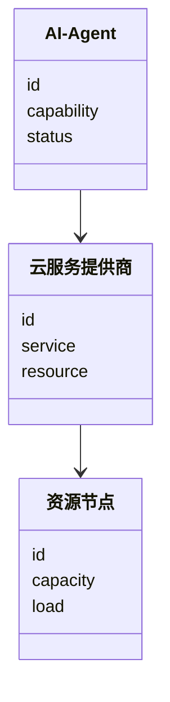
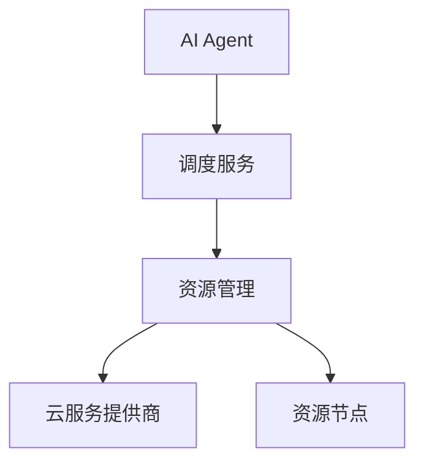

                 


# 企业AI Agent的多云部署策略

## 关键词：
企业AI Agent、多云部署、云资源管理、负载均衡、分布式计算

## 摘要：
随着企业数字化转型的深入，AI Agent在多云环境下的部署需求日益增长。本文将深入探讨企业AI Agent的多云部署策略，涵盖其核心概念、算法原理、系统架构及实战案例，为企业在多云环境中高效部署AI Agent提供详细指导。

---

## 正文

### 第1章：企业AI Agent多云部署的背景与基础

#### 1.1 AI Agent的基本概念
- **AI Agent的定义**：AI Agent是一种能够感知环境、自主决策并执行任务的智能实体。
- **AI Agent的特点**：具备自主性、反应性、目标导向和学习能力。
- **AI Agent的应用场景**：智能客服、推荐系统、自动化运维等。

#### 1.2 多云部署的背景与优势
- **多云部署的背景**：企业为了数据安全和业务连续性，采用多家云服务提供商。
- **多云部署的优势**：高可用性、成本优化、灵活性强。
- **多云部署的挑战**：资源协调、管理复杂、安全风险。

#### 1.3 企业AI Agent多云部署的需求
- **需求背景**：企业需要AI Agent在多云环境中灵活部署，确保服务不中断。
- **核心问题**：如何实现AI Agent在多云环境下的资源分配与负载均衡。
- **解决方案**：采用分布式架构和智能调度算法。

---

### 第2章：AI Agent与多云部署的核心概念

#### 2.1 AI Agent的多云部署架构
- **分布式架构**：AI Agent在多云环境中分布部署，实现负载均衡。
- **多云部署模式**：包括混合云、多公有云等模式。

#### 2.2 多云环境中的资源分配与管理
- **资源分配的基本原理**：根据负载情况动态分配计算资源。
- **负载均衡算法**：轮询、随机、加权等算法的应用。

#### 2.3 AI Agent与多云部署的实体关系
- **ER图分析**：AI Agent、云服务提供商、资源节点三者的关系。
- **交互流程**：AI Agent感知环境，调度资源，执行任务。

```mermaid
er
actor AI Agent {
  id
  capability
}
actor 云服务提供商 {
  id
  service
}
actor 资源节点 {
  id
  capacity
}
```

---

### 第3章：企业AI Agent多云部署的算法原理

#### 3.1 分布式计算与负载均衡算法
- **分布式计算原理**：任务分解与分布式执行。
- **负载均衡算法**：实现资源高效利用。

#### 3.2 资源调度算法的设计
- **动态调度算法**：根据实时负载调整资源分配。
- **数学模型**：负载均衡的目标是最小化延迟，公式如下：

$$ \text{负载均衡目标} = \argmin_{x} \sum_{i=1}^{n} (t_i - x_i)^2 $$

其中，\( t_i \) 是任务负载，\( x_i \) 是分配给资源 \( i \) 的负载。

#### 3.3 负载均衡算法的实现
- **代码示例**：

```python
def load_balance(tasks, resources):
    # 轮询算法
    resource_index = 0
    for task in tasks:
        resource_index = resource_index % len(resources)
        resources[resource_index].assign_task(task)
        resource_index += 1
    return resources
```

---

### 第4章：企业AI Agent多云部署的系统架构

#### 4.1 系统功能设计
- **核心功能**：任务调度、资源管理、监控反馈。

#### 4.2 领域模型类图


#### 4.3 系统架构设计
- **分层架构**：数据层、逻辑层、应用层。
- **架构图**：



---

### 第5章：企业AI Agent多云部署的项目实战

#### 5.1 环境安装
- **工具安装**：Python、Docker、Kubernetes。
- **依赖库安装**：numpy、pandas、scikit-learn。

#### 5.2 系统核心实现
- **AI Agent核心代码**：

```python
class AIAGENT:
    def __init__(self):
        self.resources = []
        self.load_balancer = LoadBalancer()

    def deploy(self, tasks):
        for task in tasks:
            selected_resource = self.load_balancer.select_resource(self.resources)
            selected_resource.execute_task(task)
```

#### 5.3 实际案例分析
- **案例背景**：电商系统AI推荐。
- **案例分析**：利用多云部署优化推荐算法性能。

---

### 第6章：企业AI Agent多云部署的最佳实践

#### 6.1 小结
- 理解AI Agent的多云部署架构，掌握资源调度算法。
- 注意资源分配的动态调整和安全性。

#### 6.2 注意事项
- 避免单点故障，确保数据一致性。
- 定期优化调度策略，提升性能。

#### 6.3 拓展阅读
- 推荐书籍：《分布式系统：概念与设计》。
- 推荐技术博客：深入探讨多云环境下的资源管理。

---

## 作者：AI天才研究院 & 禅与计算机程序设计艺术

