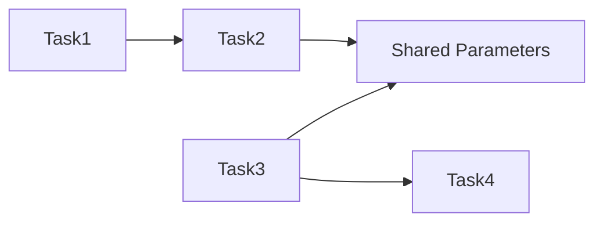

                 


# 《企业AI Agent的多任务学习架构：提升效率与通用性》

## 关键词：企业AI Agent，多任务学习，人工智能，系统架构，效率提升

## 摘要：企业AI Agent的多任务学习架构旨在通过同时处理多个相关任务来提升效率和通用性。本文详细探讨了多任务学习的核心概念、算法原理、系统架构设计以及实际项目案例，帮助读者理解如何在企业中有效应用AI Agent技术。

---

## 第1章: AI Agent与多任务学习的背景

### 1.1 AI Agent的基本概念

#### 1.1.1 AI Agent的定义
AI Agent（人工智能代理）是指能够感知环境并采取行动以实现目标的智能实体。它通过传感器获取信息，利用计算模型做出决策，并通过执行器与环境交互。

#### 1.1.2 AI Agent的核心特征
- **自主性**：能够在没有外部干预的情况下运作。
- **反应性**：能实时感知环境变化并做出响应。
- **目标导向**：所有行动都以实现特定目标为导向。

#### 1.1.3 企业级AI Agent的应用场景
企业AI Agent广泛应用于客服支持、供应链管理、风险管理等领域。例如，在客服系统中，AI Agent可以同时处理多个客户的请求，提供个性化的解决方案。

### 1.2 多任务学习的背景与重要性

#### 1.2.1 多任务学习的定义
多任务学习（Multi-Task Learning, MTL）是指同时学习多个任务，利用任务间的共享知识来提升整体性能。

#### 1.2.2 多任务学习的优势
- **数据效率**：通过共享特征，减少对每个任务单独数据的需求。
- **模型泛化能力**：跨任务学习增强模型的通用性。
- **计算效率**：任务间共享计算资源，降低训练成本。

#### 1.2.3 企业AI Agent中多任务学习的应用价值
在企业环境中，AI Agent需要处理多个相关任务，如数据分析、决策优化和用户交互。多任务学习能显著提升其效率和准确性。

### 1.3 企业AI Agent的多任务学习挑战

#### 1.3.1 任务间依赖关系的复杂性
任务之间的依赖关系可能复杂，影响模型的训练和推理。

#### 1.3.2 模型权重共享的优化问题
如何有效地共享权重，避免干扰不同任务的性能，是一个关键挑战。

#### 1.3.3 任务性能均衡的难点
平衡各任务的性能，确保没有某个任务被忽视，是实现高效多任务学习的关键。

### 1.4 本章小结
本章介绍了AI Agent和多任务学习的基本概念，并探讨了在企业环境中的应用价值及面临的挑战。

---

## 第2章: 多任务学习的核心概念与联系

### 2.1 多任务学习的原理

#### 2.1.1 任务共享机制
任务共享机制是多任务学习的核心，通过共享参数，使模型能够同时处理多个任务。

#### 2.1.2 参数共享策略
参数共享策略包括全局共享、分层共享和任务特定参数。全局共享是最常用的策略，但可能存在梯度干扰问题。

#### 2.1.3 任务间关系的建模方法
任务间关系建模包括直接关联和间接关联。直接关联任务间共享参数，间接关联则通过中间层共享信息。

### 2.2 核心概念对比表

| 对比维度       | 任务独立性       | 模型共享       | 任务权重分配   |
|----------------|------------------|----------------|----------------|
| 特征           | 独立建模         | 共享参数       | 可调节权重     |
| 优点           | 精度高           | 计算效率高      | 任务均衡       |
| 缺点           | 数据需求高       | 可能引入干扰    | 调节复杂       |

### 2.3 ER实体关系图



### 2.4 本章小结
本章详细分析了多任务学习的核心概念，包括共享机制、参数策略和任务关系建模，并通过对比表和ER图展示了任务间的联系。

---

## 第3章: 多任务学习算法的原理与实现

### 3.1 基础算法原理

#### 3.1.1 多任务学习的基本模型
多任务学习模型通常包括输入层、共享层和任务特定层。共享层是各任务之间共享的部分，任务特定层是每个任务独有的部分。

#### 3.1.2 损失函数设计
多任务学习的损失函数通常是一个加权和，每个任务的损失函数被加权求和。权重可以手动设定或自动调整。

#### 3.1.3 模型训练策略
模型训练策略包括任务交替训练和联合训练。交替训练是指逐个任务训练，而联合训练则是同时优化所有任务。

### 3.2 常见算法的优缺点

#### 3.2.1 基于MTL的算法
MTL（Multi-Task Learning）是最常见的多任务学习算法，通过共享参数来同时优化多个任务。

#### 3.2.2 基于MCD的算法
MCD（Multi-Task Decision Forests）通过决策森林处理多个任务，适用于非线性数据。

#### 3.2.3 基于HAT的算法
HAT（Heterogeneous Attention Networks）通过注意力机制处理异构任务，适用于多模态数据。

### 3.3 多任务学习的数学模型

#### 3.3.1 参数共享模型
$$ L = \lambda_1 L_1 + \lambda_2 L_2 + \cdots + \lambda_n L_n $$
其中，$\lambda_i$是任务i的权重，$L_i$是任务i的损失函数。

#### 3.3.2 注意力机制模型
$$ \alpha_i = \frac{\exp(\theta_i)}{\sum_j \exp(\theta_j)} $$
其中，$\alpha_i$是任务i的注意力权重，$\theta_i$是任务i的参数。

### 3.4 本章小结
本章分析了多任务学习的常见算法及其优缺点，并通过数学公式展示了模型的设计思路。

---

## 第4章: 企业AI Agent的系统架构设计

### 4.1 系统架构概述

#### 4.1.1 分层架构设计
企业AI Agent的系统架构通常分为感知层、决策层和执行层。

#### 4.1.2 模块化设计
模块化设计包括数据采集模块、任务处理模块和结果反馈模块。

### 4.2 核心功能模块

#### 4.2.1 数据采集模块
数据采集模块负责从企业系统中获取多源数据，如日志、传感器数据等。

#### 4.2.2 任务处理模块
任务处理模块负责解析任务需求，调用多任务学习模型进行处理。

#### 4.2.3 结果反馈模块
结果反馈模块将处理结果返回给用户或系统，并记录日志。

### 4.3 系统交互流程

#### 4.3.1 用户请求
用户向AI Agent发送请求，系统将其分配到任务处理模块。

#### 4.3.2 多任务学习处理
任务处理模块调用多任务学习模型，同时处理多个相关任务。

#### 4.3.3 结果反馈
处理完成后，结果反馈模块将结果返回给用户，并记录日志。

### 4.4 本章小结
本章详细描述了企业AI Agent的系统架构设计，包括分层架构、模块化设计和核心功能模块。

---

## 第5章: 项目实战——构建企业AI Agent多任务学习系统

### 5.1 项目背景与目标

#### 5.1.1 项目背景
本项目旨在构建一个能够处理多个任务的企业AI Agent系统，提升企业的效率和通用性。

#### 5.1.2 项目目标
- 实现多任务学习模型。
- 集成到企业系统中，提升效率。

### 5.2 环境与工具安装

#### 5.2.1 安装Python
```bash
python --version
pip install --upgrade pip
```

#### 5.2.2 安装TensorFlow和Keras
```bash
pip install tensorflow.keras
```

### 5.3 系统核心实现

#### 5.3.1 数据预处理
```python
import pandas as pd
data = pd.read_csv('data.csv')
```

#### 5.3.2 模型构建
```python
from tensorflow.keras import layers
model = tf.keras.Sequential()
model.add(layers.Dense(64, activation='relu'))
model.add(layers.Dense(1, activation='sigmoid'))
```

#### 5.3.3 模型训练
```python
model.compile(optimizer='adam', loss='binary_crossentropy')
model.fit(X_train, y_train, epochs=10)
```

### 5.4 实际案例分析

#### 5.4.1 案例背景
以电商推荐系统为例，构建一个多任务学习模型，同时处理用户推荐和产品推荐任务。

#### 5.4.2 案例实现
```python
import numpy as np
X = np.random.rand(100, 10)
y1 = np.random.randint(2, size=100)
y2 = np.random.randint(2, size=100)
model.fit([X, X], [y1, y2], epochs=10)
```

### 5.5 项目小结
本章通过实际案例展示了如何构建企业AI Agent的多任务学习系统，从环境安装到代码实现，再到案例分析，全面指导读者完成项目。

---

## 第6章: 最佳实践与小结

### 6.1 最佳实践

#### 6.1.1 数据预处理的重要性
数据预处理是确保模型性能的关键步骤，需仔细清洗和特征工程。

#### 6.1.2 模型调优技巧
通过网格搜索和交叉验证优化模型参数，提升性能。

### 6.2 小结

#### 6.2.1 重要性
多任务学习在企业AI Agent中的应用提升了效率和通用性。

#### 6.2.2 未来展望
未来，随着AI技术的发展，企业AI Agent的多任务学习将更加智能化和高效化。

### 6.3 注意事项

#### 6.3.1 模型选择
选择合适的多任务学习算法，根据任务特性和数据规模决定。

#### 6.3.2 资源分配
合理分配计算资源，避免单任务占用过多资源影响整体性能。

### 6.4 拓展阅读
推荐阅读相关领域的最新论文和书籍，如《Deep Learning》和《Multi-Task Learning》。

---

## 作者：AI天才研究院/AI Genius Institute & 禅与计算机程序设计艺术 /Zen And The Art of Computer Programming

---

这篇文章系统地介绍了企业AI Agent的多任务学习架构，从理论到实践，为读者提供了全面的指导。希望对您在企业AI Agent的开发和应用中有所帮助。

