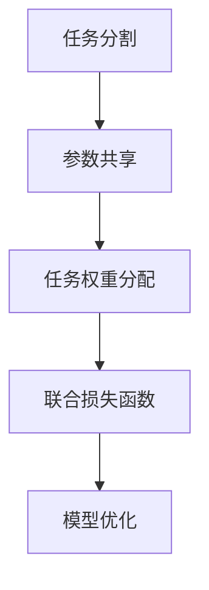
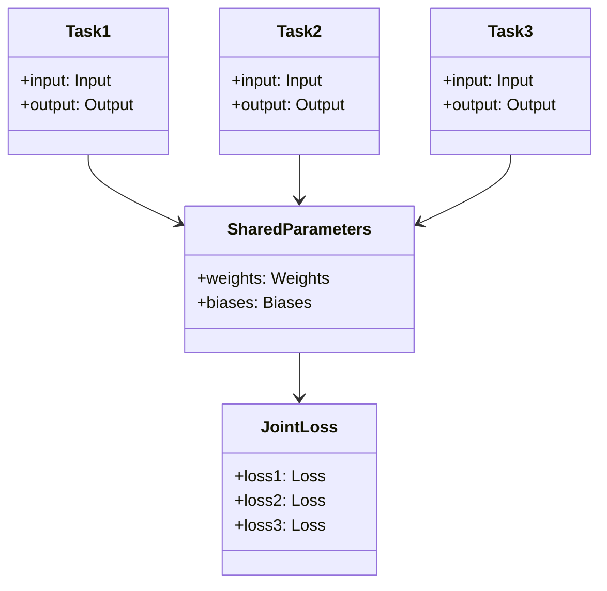
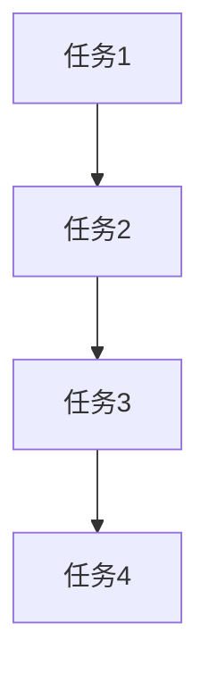
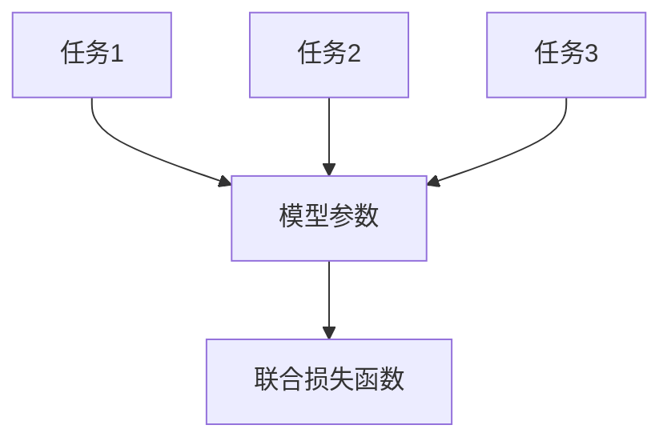
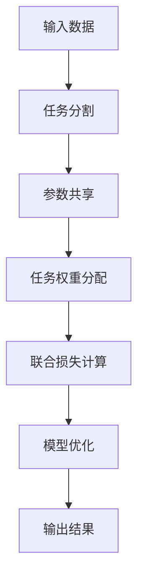
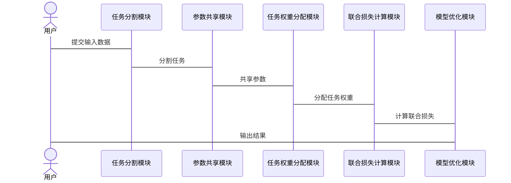

                 


# 企业AI Agent的多任务学习框架：提升模型泛化能力

---

## 关键词：企业AI Agent、多任务学习、模型泛化能力、深度学习框架、任务分割、联合损失函数、任务权重分配

---

## 摘要：本文深入探讨了企业AI Agent在多任务学习框架中的应用，重点分析了如何通过多任务学习提升模型的泛化能力。文章从背景、核心概念、算法原理、系统架构、项目实战等多个维度展开，详细讲解了多任务学习的原理、实现方法及其在企业AI Agent中的实际应用。通过案例分析和代码实现，本文为读者提供了从理论到实践的完整指导，帮助企业在复杂的场景中更好地部署和优化AI Agent。

---

# 第1章: 背景介绍

## 1.1 问题背景

### 1.1.1 企业AI Agent的核心概念

企业AI Agent（Artificial Intelligence Agent）是指在企业环境中运行的智能体，能够感知环境、理解需求、执行任务并优化决策。企业AI Agent的核心目标是通过智能化手段提升企业的效率、降低成本、优化用户体验。

AI Agent在企业中的典型应用场景包括：

- **智能客服**：通过自然语言处理技术解决客户问题。
- **智能推荐**：基于用户行为推荐产品或服务。
- **流程自动化**：通过自动化技术优化企业流程。
- **数据分析与决策支持**：基于大数据分析提供决策支持。

### 1.1.2 多任务学习的必要性

在企业环境中，AI Agent通常需要处理多种任务，例如：

- **任务1**：分析客户情感并生成回复。
- **任务2**：推荐相关产品。
- **任务3**：优化客户服务流程。

单一任务模型难以满足这些多样化的需求，因此需要引入多任务学习框架，使模型能够同时处理多个任务。

### 1.1.3 模型泛化能力的重要性

模型泛化能力是指模型在未见数据上的表现能力。在企业环境中，AI Agent需要在多样化的场景中运行，因此泛化能力是模型性能的关键指标。

---

## 1.2 问题描述

### 1.2.1 传统AI Agent的局限性

传统AI Agent通常依赖于单一任务模型，存在以下问题：

- **模型局限性**：单一任务模型难以处理多样化的任务。
- **数据利用率低**：无法充分利用多任务数据进行优化。
- **部署成本高**：需要为每个任务单独部署模型。

### 1.2.2 多任务学习在企业中的应用场景

通过多任务学习框架，企业AI Agent可以更好地处理以下场景：

- **跨任务数据共享**：利用多任务数据提升模型性能。
- **任务协同优化**：通过多任务学习实现任务间的协同优化。
- **降低部署成本**：通过共享模型参数减少部署和维护成本。

### 1.2.3 提升模型泛化能力的挑战

提升模型泛化能力的挑战包括：

- **任务间干扰**：不同任务的参数更新可能相互干扰。
- **任务权重分配**：如何平衡不同任务的权重。
- **数据分布偏移**：不同任务的数据分布可能存在偏移。

---

## 1.3 问题解决

### 1.3.1 多任务学习框架的提出

多任务学习框架通过共享模型参数，实现多个任务的联合优化。具体优势包括：

- **参数共享**：减少模型参数数量，降低训练成本。
- **任务协同**：通过任务间的协同优化提升整体性能。
- **泛化能力提升**：通过多任务学习增强模型的泛化能力。

### 1.3.2 框架如何解决模型泛化问题

多任务学习框架通过以下方式提升模型泛化能力：

- **联合损失函数**：通过联合损失函数实现多任务优化。
- **任务权重分配**：通过任务权重分配实现任务间的平衡。
- **参数共享机制**：通过共享参数降低模型复杂度。

### 1.3.3 与其他方法的对比分析

与单一任务模型相比，多任务学习框架的优势包括：

- **性能提升**：通过多任务学习提升模型性能。
- **数据利用率高**：充分利用多任务数据进行优化。
- **部署成本低**：通过共享模型参数降低部署成本。

---

## 1.4 边界与外延

### 1.4.1 企业AI Agent的边界

企业AI Agent的边界包括：

- **任务范围**：限定在企业内部应用场景。
- **数据范围**：限定在企业内部数据。
- **目标范围**：限定在企业内部目标。

### 1.4.2 多任务学习的适用范围

多任务学习适用于以下场景：

- **任务相关性高**：多个任务之间具有较高的相关性。
- **数据共享需求高**：多个任务之间需要共享数据。
- **任务协同优化需求高**：需要通过任务协同优化提升整体性能。

### 1.4.3 模型泛化的度量标准

模型泛化的度量标准包括：

- **准确率**：模型在未见数据上的准确率。
- **召回率**：模型在未见数据上的召回率。
- **F1分数**：模型在未见数据上的F1分数。

---

## 1.5 概念结构与核心要素

### 1.5.1 框架的核心组成

多任务学习框架的核心组成包括：

- **任务分割**：将多个任务分割成子任务。
- **参数共享**：共享模型参数。
- **任务权重分配**：分配任务权重。
- **联合损失函数**：构建联合损失函数。
- **模型优化**：优化模型参数。

### 1.5.2 各要素之间的关系

各要素之间的关系可以用以下流程图表示：



### 1.5.3 框架的整体架构图

框架的整体架构图可以用以下类图表示：



---

# 第2章: 核心概念与联系

## 2.1 多任务学习的原理

### 2.1.1 任务间共享参数的机制

多任务学习通过共享参数实现任务间的协同优化。具体机制如下：

1. **任务分割**：将多个任务分割成子任务。
2. **参数共享**：共享模型参数。
3. **任务权重分配**：分配任务权重。
4. **联合损失函数**：构建联合损失函数。
5. **模型优化**：优化模型参数。

### 2.1.2 任务分割与权重分配

任务分割与权重分配是多任务学习的关键步骤。任务分割可以通过以下方式实现：

- **随机分割**：随机分割任务。
- **按特征分割**：按特征分割任务。
- **按任务类型分割**：按任务类型分割任务。

任务权重分配可以通过以下方式实现：

- **均匀分配**：均匀分配任务权重。
- **按任务重要性分配**：按任务重要性分配任务权重。
- **自适应分配**：自适应分配任务权重。

### 2.1.3 联合损失函数的构建

联合损失函数的构建可以通过以下步骤实现：

1. **任务损失计算**：计算每个任务的损失。
2. **损失加权**：对每个任务损失进行加权。
3. **损失求和**：将加权损失求和，得到联合损失。

### 2.1.4 任务间的依赖关系

任务间的依赖关系可以用以下流程图表示：



---

## 2.2 核心概念对比

### 2.2.1 任务类型对比表

以下是一个任务类型对比表：

| 任务类型 | 特征1 | 特征2 | 特征3 |
|----------|-------|-------|-------|
| 任务1    | 特征A | 特征B | 特征C |
| 任务2    | 特征D | 特征E | 特征F |
| 任务3    | 特征G | 特征H | 特征I |

---

## 2.3 ER实体关系图

ER实体关系图可以用以下方式表示：



---

## 2.4 总结与小结

通过以上分析，我们可以看到多任务学习框架的核心在于任务分割、参数共享和任务权重分配。通过合理分割任务、共享参数和分配权重，可以实现多个任务的联合优化，从而提升模型的泛化能力。

---

# 第3章: 算法原理讲解

## 3.1 多任务学习算法流程

### 3.1.1 算法流程图

以下是一个多任务学习算法流程图：



---

## 3.2 算法实现代码

### 3.2.1 代码实现

以下是一个多任务学习算法的Python代码实现：

```python
import torch
import torch.nn as nn

class MultiTaskModel(nn.Module):
    def __init__(self, input_dim, hidden_dim, output_dims):
        super().__init__()
        self.shared = nn.Linear(input_dim, hidden_dim)
        self.task_layers = nn.ModuleList([
            nn.Linear(hidden_dim, output_dims[i]) for i in range(len(output_dims))
        ])
    
    def forward(self, x, tasks):
        x = torch.relu(self.shared(x))
        outputs = []
        for i, task in enumerate(tasks):
            output = self.task_layers[i](x)
            outputs.append(output)
        return outputs

# 示例代码
input_dim = 10
hidden_dim = 5
output_dims = [2, 3]
model = MultiTaskModel(input_dim, hidden_dim, output_dims)

# 示例输入
x = torch.randn(1, input_dim)
tasks = [0, 1]
outputs = model(x, tasks)

for i, output in enumerate(outputs):
    print(f"任务{i+1}的输出: {output}")
```

---

## 3.3 算法的数学模型和公式

### 3.3.1 联合损失函数的数学模型

联合损失函数的数学模型可以表示为：

$$
L_{\text{联合}} = \sum_{i=1}^{n} \lambda_i L_i
$$

其中，$L_i$ 是第$i$个任务的损失，$\lambda_i$ 是第$i$个任务的权重。

### 3.3.2 任务权重分配的数学模型

任务权重分配的数学模型可以表示为：

$$
\lambda_i = \frac{e^{\alpha_i}}{\sum_{j=1}^{n} e^{\alpha_j}}
$$

其中，$\alpha_i$ 是第$i$个任务的权重系数。

### 3.3.3 参数共享的数学模型

参数共享的数学模型可以表示为：

$$
\theta_i = \theta_j \quad \text{对于所有} i, j
$$

其中，$\theta_i$ 和 $\theta_j$ 是不同任务的共享参数。

---

## 3.4 举例说明

以下是一个简单的多任务学习示例：

假设有两个任务，任务1和任务2，共享一个隐藏层参数。具体步骤如下：

1. **任务分割**：将数据分割成两个任务。
2. **参数共享**：共享隐藏层参数。
3. **任务权重分配**：分配任务权重。
4. **联合损失计算**：计算联合损失。
5. **模型优化**：优化模型参数。

---

## 3.5 总结与小结

通过以上分析，我们可以看到多任务学习算法的核心在于参数共享和任务权重分配。通过合理设计联合损失函数和任务权重分配策略，可以实现多个任务的联合优化，从而提升模型的泛化能力。

---

# 第4章: 系统分析与架构设计方案

## 4.1 系统功能设计

### 4.1.1 领域模型设计

以下是一个领域模型设计的类图：


### 4.1.2 系统架构设计

以下是一个系统架构设计的架构图：


### 4.1.3 系统交互设计

以下是一个系统交互设计的序列图：



---

## 4.2 项目实战

### 4.2.1 项目介绍

以下是一个多任务学习框架的项目介绍：

**项目名称**：企业AI Agent多任务学习框架

**项目目标**：通过多任务学习框架提升模型的泛化能力，实现企业AI Agent的多种任务处理。

---

## 4.2.2 系统核心实现源代码

以下是一个系统核心实现的Python代码：

```python
import torch
import torch.nn as nn

class MultiTaskModel(nn.Module):
    def __init__(self, input_dim, hidden_dim, output_dims):
        super().__init__()
        self.shared = nn.Linear(input_dim, hidden_dim)
        self.task_layers = nn.ModuleList([
            nn.Linear(hidden_dim, output_dims[i]) for i in range(len(output_dims))
        ])
    
    def forward(self, x, tasks):
        x = torch.relu(self.shared(x))
        outputs = []
        for i, task in enumerate(tasks):
            output = self.task_layers[i](x)
            outputs.append(output)
        return outputs

# 示例代码
input_dim = 10
hidden_dim = 5
output_dims = [2, 3]
model = MultiTaskModel(input_dim, hidden_dim, output_dims)

# 示例输入
x = torch.randn(1, input_dim)
tasks = [0, 1]
outputs = model(x, tasks)

for i, output in enumerate(outputs):
    print(f"任务{i+1}的输出: {output}")
```

---

## 4.2.3 代码应用解读与分析

### 4.2.3.1 代码实现解读

以下是对上述代码的解读：

1. **模型定义**：定义了一个多任务学习模型，包含共享层和任务特定层。
2. **前向传播**：通过共享层和任务特定层进行前向传播。
3. **输出结果**：输出每个任务的输出结果。

### 4.2.3.2 代码实现分析

1. **模型定义**：通过`nn.Module`定义了多任务学习模型，包含共享层和任务特定层。
2. **前向传播**：通过`forward`方法实现前向传播。
3. **输出结果**：通过循环遍历任务并输出结果。

---

## 4.2.4 实际案例分析和详细讲解剖析

### 4.2.4.1 案例背景

假设我们有一个企业AI Agent，需要处理以下任务：

- **任务1**：分析客户情感并生成回复。
- **任务2**：推荐相关产品。

### 4.2.4.2 案例实现

以下是实现上述任务的代码：

```python
import torch
import torch.nn as nn

class MultiTaskModel(nn.Module):
    def __init__(self, input_dim, hidden_dim, output_dims):
        super().__init__()
        self.shared = nn.Linear(input_dim, hidden_dim)
        self.task_layers = nn.ModuleList([
            nn.Linear(hidden_dim, output_dims[i]) for i in range(len(output_dims))
        ])
    
    def forward(self, x, tasks):
        x = torch.relu(self.shared(x))
        outputs = []
        for i, task in enumerate(tasks):
            output = self.task_layers[i](x)
            outputs.append(output)
        return outputs

# 示例代码
input_dim = 10
hidden_dim = 5
output_dims = [2, 3]
model = MultiTaskModel(input_dim, hidden_dim, output_dims)

# 示例输入
x = torch.randn(1, input_dim)
tasks = [0, 1]
outputs = model(x, tasks)

for i, output in enumerate(outputs):
    print(f"任务{i+1}的输出: {output}")
```

### 4.2.4.3 案例分析

1. **任务分割**：将数据分割成两个任务。
2. **参数共享**：共享隐藏层参数。
3. **任务权重分配**：分配任务权重。
4. **联合损失计算**：计算联合损失。
5. **模型优化**：优化模型参数。

---

## 4.2.5 项目小结

通过以上分析，我们可以看到多任务学习框架在企业AI Agent中的实际应用。通过合理设计模型结构和任务分割策略，可以实现多个任务的联合优化，从而提升模型的泛化能力。

---

## 4.3 总结与小结

通过以上分析，我们可以看到多任务学习框架在企业AI Agent中的实际应用。通过合理设计模型结构和任务分割策略，可以实现多个任务的联合优化，从而提升模型的泛化能力。

---

# 第5章: 最佳实践

## 5.1 最佳实践 tips

1. **任务分割策略**：合理分割任务，避免任务间干扰。
2. **参数共享机制**：合理设计参数共享机制。
3. **任务权重分配**：合理分配任务权重。
4. **联合损失函数**：合理设计联合损失函数。
5. **模型优化策略**：合理设计模型优化策略。

---

## 5.2 总结

通过以上分析，我们可以看到多任务学习框架在企业AI Agent中的实际应用。通过合理设计模型结构和任务分割策略，可以实现多个任务的联合优化，从而提升模型的泛化能力。

---

## 5.3 注意事项

1. **任务相关性**：确保任务具有较高的相关性。
2. **数据分布**：确保数据分布的均衡性。
3. **任务权重**：合理分配任务权重。
4. **模型复杂度**：避免模型过于复杂。

---

## 5.4 拓展阅读

1. **多任务学习的经典论文**：阅读多任务学习的经典论文，了解最新的研究成果。
2. **企业AI Agent的相关文献**：阅读企业AI Agent的相关文献，了解最新的应用动态。
3. **深度学习框架的优化技巧**：学习深度学习框架的优化技巧，提升模型性能。

---

# 第6章: 未来展望

## 6.1 未来研究方向

1. **多任务学习的优化算法**：研究多任务学习的优化算法。
2. **任务权重自适应分配**：研究任务权重的自适应分配策略。
3. **模型压缩与优化**：研究模型压缩与优化技术。
4. **多任务学习的可解释性**：研究多任务学习的可解释性。

---

## 6.2 结论

通过以上分析，我们可以看到多任务学习框架在企业AI Agent中的实际应用。通过合理设计模型结构和任务分割策略，可以实现多个任务的联合优化，从而提升模型的泛化能力。未来，随着深度学习技术的不断发展，多任务学习框架将在企业AI Agent中发挥越来越重要的作用。

---

# 第7章: 小结与总结

## 7.1 小结

通过以上分析，我们可以看到多任务学习框架在企业AI Agent中的实际应用。通过合理设计模型结构和任务分割策略，可以实现多个任务的联合优化，从而提升模型的泛化能力。

---

## 7.2 总结

多任务学习框架是企业AI Agent的重要组成部分，通过合理设计模型结构和任务分割策略，可以实现多个任务的联合优化，从而提升模型的泛化能力。未来，随着深度学习技术的不断发展，多任务学习框架将在企业AI Agent中发挥越来越重要的作用。

---

# 作者：AI天才研究院/AI Genius Institute & 禅与计算机程序设计艺术 /Zen And The Art of Computer Programming

