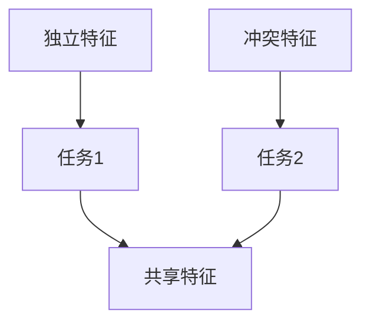
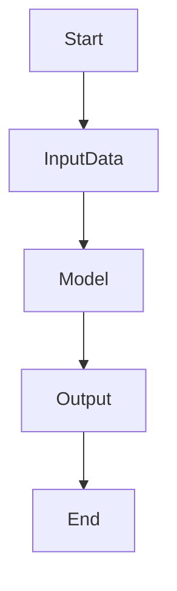
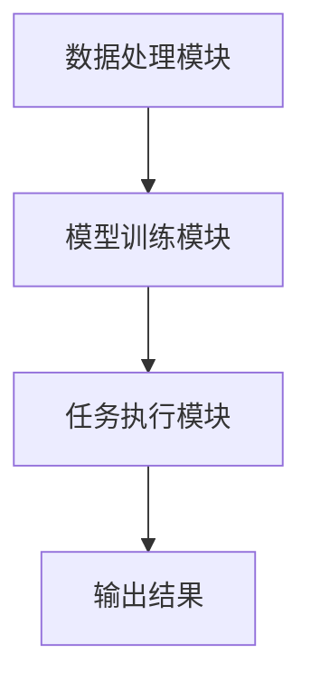
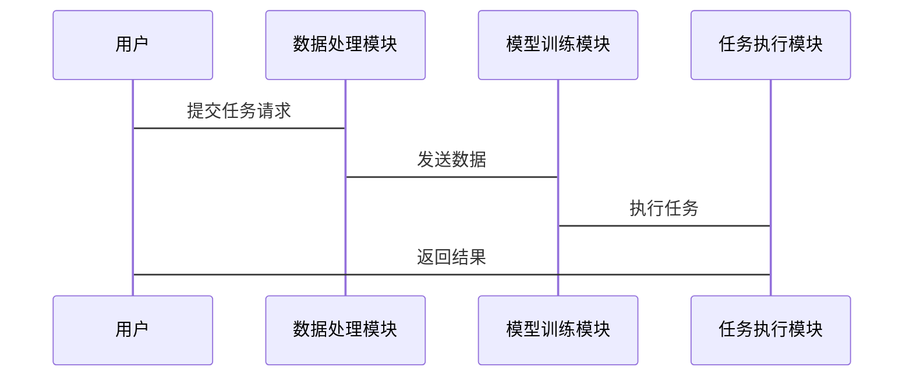

                 


# 企业AI Agent的多任务学习框架：提升模型通用性与效率

## 关键词：企业AI Agent，多任务学习，模型通用性，效率提升，系统架构，算法原理

## 摘要：  
本文详细探讨了企业AI Agent的多任务学习框架，分析了其在提升模型通用性和效率方面的优势。通过系统化的理论阐述和实际案例分析，深入解读了多任务学习的核心概念、算法原理、系统架构以及项目实战。本文旨在为企业AI Agent的开发与应用提供有价值的参考和指导，帮助读者更好地理解和应用多任务学习框架。

---

## 第1章：企业AI Agent与多任务学习框架背景

### 1.1 问题背景与挑战  
企业AI Agent是一种能够执行多种任务、适应复杂业务场景的智能系统。然而，传统单任务学习模型难以应对企业环境中多变的需求和复杂场景，导致模型效率低下、泛化能力不足。  

#### 1.1.1 企业AI Agent的核心需求  
- 多任务处理能力：AI Agent需要同时执行多个相关任务，如数据分析、决策优化、用户交互等。  
- 高效性：模型需要在短时间内完成多种任务，对计算效率要求较高。  
- 通用性：模型应具备跨任务的泛化能力，减少对特定任务的过度依赖。  

#### 1.1.2 多任务学习在企业场景中的必要性  
- 降低模型切换成本：多任务学习框架可以在一个模型中同时处理多种任务，避免频繁切换模型带来的效率损失。  
- 提升模型泛化能力：通过共享任务特征，模型可以更好地理解任务间的关联性，提高对新任务的适应能力。  
- 提高计算效率：多任务学习框架可以通过并行计算优化模型训练过程，显著提高计算效率。  

#### 1.1.3 当前企业AI Agent的痛点与不足  
- 传统单任务模型难以应对复杂场景。  
- 模型训练时间长，计算资源消耗大。  
- 缺乏高效的多任务学习框架支持。  

---

### 1.2 多任务学习框架的定义与特点  
多任务学习框架是一种通过共享多个任务的特征和参数，提升模型泛化能力和效率的结构化框架。  

#### 1.2.1 多任务学习的基本概念  
- 多任务学习（Multi-Task Learning，MTL）：通过共享多个任务的特征和参数，提升模型的泛化能力。  
- 任务相关性：任务之间的关系可以是共享特征、独立特征或冲突特征。  

#### 1.2.2 企业AI Agent中的多任务学习框架  
- 任务类型：数据分析、决策优化、用户交互等。  
- 框架特点：  
  - 高效性：通过并行计算和参数共享，显著提升计算效率。  
  - 通用性：模型具备跨任务的泛化能力，适应复杂业务场景。  

#### 1.2.3 本章小结  
- 本章介绍了企业AI Agent的核心需求和多任务学习框架的必要性，明确了多任务学习框架在企业场景中的应用价值。

---

## 第2章：多任务学习框架的核心概念与联系  

### 2.1 核心概念原理  
多任务学习框架通过共享任务特征和参数，实现任务间的协同优化。  

#### 2.1.1 多任务学习的基本原理  
- 损失函数：多任务学习通过优化多个任务的损失函数，实现模型参数的联合优化。  
- 参数共享：任务间的共享参数可以是权重、偏置或其他模型参数。  

#### 2.1.2 企业AI Agent中的任务类型  
- 数据分析任务：如分类、回归、聚类等。  
- 决策优化任务：如路径规划、资源分配等。  
- 用户交互任务：如对话生成、情感分析等。  

#### 2.1.3 多任务学习框架的分类  
- 基于共享网络结构的MTL：通过共享部分网络层实现任务间参数共享。  
- 基于任务分解的MTL：将多任务分解为多个子任务，分别优化。  

---

### 2.2 任务间关系的特征对比  
任务间的特征关系可以分为共享特征、独立特征和冲突特征。  

#### 2.2.1 任务间共享特征的对比分析  
- 共享特征：任务间的特征可以共享，如图像分类任务中共享特征提取层。  
- 对比分析：共享特征可以显著降低模型的参数数量，提升模型的泛化能力。  

#### 2.2.2 任务间独立特征的对比分析  
- 独立特征：任务间的特征独立，如文本分类任务中的不同特征词。  
- 对比分析：独立特征需要分别建模，可能导致模型参数过多。  

#### 2.2.3 任务间冲突特征的对比分析  
- 冲突特征：任务间的特征存在冲突，如情感分析任务中正面和负面情感的特征可能存在冲突。  
- 对比分析：冲突特征需要通过特殊设计的模型结构来处理。  

---

### 2.3 ER实体关系图架构  
通过ER图可以清晰地展示任务间的特征关系。  



---

### 2.4 本章小结  
- 本章详细讲解了多任务学习的核心概念和任务间的特征关系，为后续章节的算法设计奠定了基础。

---

## 第3章：多任务学习框架的算法原理  

### 3.1 算法原理概述  
多任务学习框架通过优化多个任务的损失函数，实现模型参数的联合优化。  

#### 3.1.1 多任务学习的基本算法  
- 联合优化算法：通过优化多个任务的损失函数，实现模型参数的联合优化。  
- 交替优化算法：分别优化每个任务的参数，逐步逼近最优解。  

#### 3.1.2 企业AI Agent中的算法选择  
- 算法选择：根据任务类型和特征关系选择合适的多任务学习算法。  
- 算法优化：通过参数共享和特征提取优化模型性能。  

---

### 3.2 算法流程图  
多任务学习的算法流程如下：  



---

### 3.3 算法实现代码  
以下是一个多任务学习框架的简单实现代码：  

```python
def multi_task_model():
    model = Sequential()
    model.add(Dense(64, activation='relu', input_shape=(input_dim,)))
    model.add(Dense(32, activation='relu'))
    model.add(Dense(num_tasks, activation='sigmoid'))
    return model
```

---

### 3.4 数学模型与公式  
多任务学习的损失函数可以表示为：  

$$L = \sum_{i=1}^{n} \sum_{t=1}^{T} \lambda_{t} L_{t}(y_{i}, \hat{y}_{i})$$  

其中，$\lambda_{t}$ 是任务$t$的损失权重。  

---

### 3.5 本章小结  
- 本章详细讲解了多任务学习的算法原理和实现方法，为后续章节的系统设计奠定了基础。

---

## 第4章：系统分析与架构设计方案  

### 4.1 问题场景介绍  
企业AI Agent的多任务学习框架需要满足高效性和通用性的双重需求。  

#### 4.1.1 企业AI Agent的应用场景  
- 数据分析：如销售预测、客户画像等。  
- 决策优化：如资源分配、路径规划等。  
- 用户交互：如智能客服、个性化推荐等。  

---

### 4.2 系统功能设计  
#### 4.2.1 系统功能模块  
- 数据处理模块：负责数据的预处理和特征提取。  
- 模型训练模块：负责多任务学习框架的训练和优化。  
- 任务执行模块：负责模型的多任务执行和结果输出。  

#### 4.2.2 系统架构设计  


---

### 4.3 系统接口设计  
- 数据接口：提供数据输入和输出的接口。  
- 模型接口：提供模型训练和预测的接口。  

---

### 4.4 系统交互设计  


---

### 4.5 本章小结  
- 本章详细讲解了企业AI Agent的系统架构和接口设计，为后续章节的项目实战奠定了基础。

---

## 第5章：项目实战与案例分析  

### 5.1 环境安装  
- 安装Python和相关库：如TensorFlow、Keras、Scikit-learn等。  

```bash
pip install tensorflow keras scikit-learn
```

---

### 5.2 系统核心实现  
以下是多任务学习框架的核心代码实现：  

```python
from tensorflow import keras
import numpy as np

def multi_task_model(input_shape, num_tasks):
    inputs = keras.Input(shape=input_shape)
    x = keras.layers.Dense(64, activation='relu')(inputs)
    x = keras.layers.Dense(32, activation='relu')(x)
    outputs = []
    for _ in range(num_tasks):
        output = keras.layers.Dense(1, activation='sigmoid')(x)
        outputs.append(output)
    model = keras.Model(inputs=inputs, outputs=outputs)
    return model

model = multi_task_model((input_dim,), num_tasks=3)
model.compile(optimizer='adam', loss={'output_0': 'binary_crossentropy', 'output_1': 'binary_crossentropy', 'output_2': 'binary_crossentropy'})
model.fit(x_train, y_train, epochs=10, batch_size=32)
```

---

### 5.3 案例分析  
以一个简单的多任务分类问题为例，分析模型的训练过程和结果。  

```python
# 训练数据
x_train = np.random.randn(1000, input_dim)
y_train = np.random.randn(1000, num_tasks)

# 模型训练
history = model.fit(x_train, y_train, epochs=10, batch_size=32)
```

---

### 5.4 本章小结  
- 本章通过实际案例展示了多任务学习框架的实现过程，帮助读者更好地理解和应用相关技术。

---

## 第6章：总结与展望  

### 6.1 最佳实践tips  
- 合理选择任务类型和特征关系，确保模型的高效性和通用性。  
- 优化模型参数和损失函数，提升模型性能。  

### 6.2 小结  
本文详细讲解了企业AI Agent的多任务学习框架，从核心概念到算法实现，再到系统设计和项目实战，为读者提供了全面的指导。

### 6.3 注意事项  
- 模型训练过程中要注意任务间的平衡，避免某任务主导模型行为。  
- 系统设计时要注意任务间的依赖关系，确保系统的高效性和稳定性。  

### 6.4 拓展阅读  
- 多任务学习的最新研究进展。  
- 企业AI Agent的其他相关技术，如强化学习、迁移学习等。  

---

## 作者：AI天才研究院 & 禅与计算机程序设计艺术

