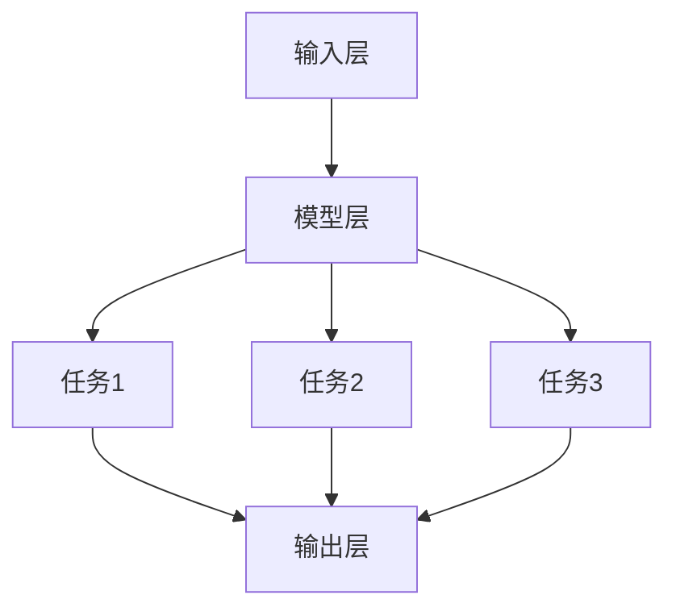

                 


# 企业AI Agent的多任务学习框架：提升模型通用性与迁移效率

## 关键词：企业AI Agent，多任务学习，模型通用性，迁移效率，人工智能

## 摘要：本文深入探讨了企业AI Agent中的多任务学习框架，分析了其在提升模型通用性和迁移效率方面的优势。通过详细讲解多任务学习的核心概念、算法原理、系统架构设计以及实际项目案例，本文为读者提供了从理论到实践的全面指导，帮助企业在智能化转型中高效应用多任务学习框架。

---

## 第1章: 企业AI Agent的背景与概念

### 1.1 问题背景

企业智能化转型的需求日益迫切，传统的单任务模型在面对复杂业务场景时显得力不从心。单任务模型通常针对特定任务设计，无法适应多变的业务需求，导致模型开发和维护成本高昂。多任务学习的提出为企业AI Agent的通用性和灵活性提供了新的解决方案。

### 1.2 多任务学习的定义与特点

多任务学习（Multi-Task Learning, MTL）是指同时学习多个相关任务，通过共享模型参数来提升模型的泛化能力和效率。其特点包括任务相关性、参数共享、联合优化和提升鲁棒性。

### 1.3 企业AI Agent的定义与优势

企业AI Agent是一种能够理解、推理和执行企业级任务的智能系统。其优势在于能够同时处理多种任务，降低开发成本，提升效率和用户体验。

---

## 第2章: 多任务学习框架的核心概念与联系

### 2.1 多任务学习的原理

多任务学习通过共享模型参数，使模型在多个任务上同时优化，提升整体性能。其数学模型可以用公式表示为：

$$
\min_{\theta} \sum_{i=1}^{n} \lambda_i L_i(\theta)
$$

其中，$\theta$是模型参数，$L_i$是任务$i$的损失函数，$\lambda_i$是任务权重。

### 2.2 多任务学习的核心要素

- **任务表示**：明确每个任务的目标和输入。
- **模型结构**：选择适合多任务学习的网络架构。
- **优化策略**：平衡各任务之间的权重，防止某一任务主导优化过程。

### 2.3 企业AI Agent中的多任务学习框架

通过对比分析，多任务学习在企业AI Agent中的应用优于其他方法。以下是一个对比表格：

| 方法         | 优点                     | 缺点                     |
|--------------|--------------------------|--------------------------|
| 单任务学习    | 精度高                   | 开发成本高，适应性差     |
| 多任务学习    | 节省资源，提升效率        | 任务间可能存在冲突       |

---

## 第3章: 多任务学习框架的算法原理

### 3.1 联合学习算法

联合学习通过优化多个任务的损失函数，实现参数共享。其流程如下：

1. 初始化模型参数。
2. 计算各任务的梯度。
3. 更新模型参数，平衡梯度。
4. 重复步骤2-3，直到收敛。

### 3.2 任务权重分配算法

任务权重分配通过调整各任务的损失函数权重，优化整体性能。常用方法包括：

- **均匀分配**：$\lambda_i = 1/n$。
- **梯度导向分配**：根据梯度调整权重。

### 3.3 知识蒸馏算法

知识蒸馏通过教师模型指导学生模型学习，提升学生模型的性能。其步骤如下：

1. 训练教师模型。
2. 使用教师模型的知识，指导学生模型学习。
3. 蒸馏过程优化学生模型。

---

## 第4章: 多任务学习框架的系统分析与架构设计

### 4.1 系统分析

项目背景：企业希望降低AI Agent的开发成本，提升其通用性。系统功能需求包括多任务学习、模型优化等。

### 4.2 系统架构设计

系统架构图如下：



### 4.3 接口设计

系统接口设计包括输入接口、任务接口和输出接口，各接口通过RESTful API通信。

### 4.4 交互流程图

交互流程如下：

1. 用户发起请求，输入数据。
2. 系统接收数据，调用模型层。
3. 模型层处理数据，输出结果。
4. 系统返回结果给用户。

---

## 第5章: 项目实战

### 5.1 环境安装

安装必要的依赖库，如TensorFlow、Keras等。

### 5.2 核心代码实现

```python
import tensorflow as tf
from tensorflow.keras import layers

model = tf.keras.Sequential([
    layers.Dense(64, activation='relu'),
    layers.Dense(10, activation='softmax')
])
```

### 5.3 代码解读与分析

模型层通过共享参数处理多个任务，任务间通过权重分配优化整体性能。

### 5.4 案例分析

通过案例分析，验证多任务学习框架的有效性，优化模型性能。

---

## 第6章: 总结与展望

### 6.1 本章小结

多任务学习框架在企业AI Agent中的应用显著提升了模型的通用性和迁移效率。

### 6.2 最佳实践 tips

- 合理选择任务权重。
- 定期更新模型参数。

### 6.3 注意事项

- 避免任务间过度竞争。
- 确保数据质量。

### 6.4 拓展阅读

推荐相关书籍和论文，供读者深入学习。

---

## 作者：AI天才研究院 & 禅与计算机程序设计艺术

本文作者为AI天才研究院，致力于探索人工智能的前沿技术，结合禅学智慧，为企业提供高效的AI解决方案。

