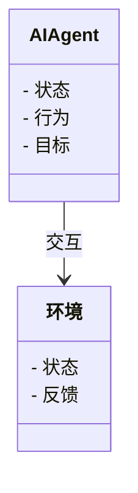
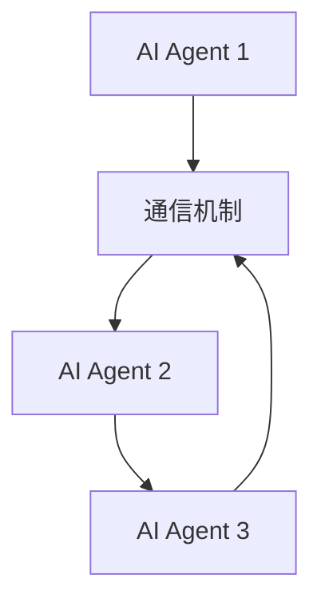
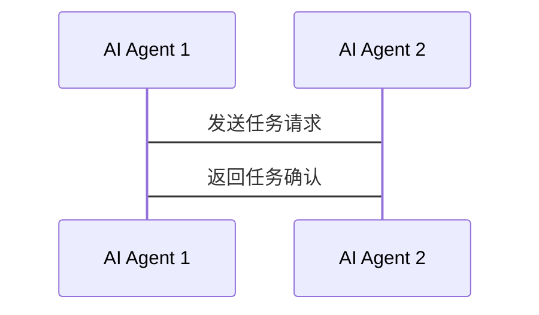

                 


# 企业AI Agent的多智能体系统在团队协作优化中的应用

## 关键词：企业协作、AI Agent、多智能体系统、团队优化、分布式计算、强化学习

## 摘要：本文详细探讨了企业AI Agent的多智能体系统在团队协作优化中的应用。首先，介绍了AI Agent和多智能体系统的基本概念及其在企业协作中的作用。接着，分析了多智能体系统在企业协作优化中的核心原理和算法，包括分布式计算和强化学习的应用。然后，详细讲解了多智能体系统的架构设计，包括功能模块、系统交互和系统架构图。最后，通过项目实战展示了多智能体系统在企业协作优化中的具体应用，并总结了最佳实践和未来发展方向。

---

# 第一部分：企业AI Agent与多智能体系统概述

## 第1章：企业协作优化的背景与挑战

### 1.1 问题背景
- 传统企业协作模式的局限性
  - 信息不对称导致效率低下
  - 单点故障风险高
  - 人工协调成本高
- 现代企业协作优化的需求
  - 提高协作效率
  - 降低协调成本
  - 实现动态适应性

### 1.2 AI Agent与多智能体系统的基本概念
- AI Agent的定义
  - 具有感知环境和自主决策能力的智能体
- 多智能体系统的定义
  - 由多个智能体组成的协作系统
- 多智能体系统与AI Agent的关系
  - 多智能体系统由多个AI Agent组成，AI Agent在系统中协同工作

### 1.3 多智能体系统在企业协作中的作用
- 分布式任务分配
- 协作效率提升
- 复杂问题的分布式解决

## 第2章：多智能体系统的核心概念与联系

### 2.1 多智能体系统的实体关系图
- 实体关系图的定义
  - 描述系统中各实体之间的关系
- 实体关系图的构建步骤
  - 确定系统中的实体
  - 分析实体之间的关系
  - 绘制实体关系图

### 2.2 多智能体系统与AI Agent的关系
- 多智能体系统的组成要素
  - 智能体、环境、通信机制
- AI Agent在多智能体系统中的角色
  - 执行具体任务的智能体
- 多智能体系统与AI Agent的协同机制
  - 通过通信机制实现协作

### 2.3 多智能体系统的属性特征对比
| 属性 | 单智能体系统 | 多智能体系统 |
|------|--------------|--------------|
| 系统规模 | 单一智能体 | 多个智能体 |
| 交互方式 | 无 | 有 |
| 学习能力 | 单一 | 分布式 |

## 第3章：多智能体系统的算法原理

### 3.1 分布式计算与多智能体系统
- 分布式计算的基本原理
  - 计算任务分布在多个节点上
- 分布式计算在多智能体系统中的应用
  - 任务分配与资源优化
- 分布式计算的优缺点
  - 优点：并行处理能力强
  - 缺点：通信开销大

### 3.2 强化学习在多智能体系统中的应用
- 强化学习的基本原理
  - 通过与环境交互获得奖励
- 多智能体系统中强化学习的应用
  - 分布式决策与协作
- 强化学习的数学模型
  - 状态空间、动作空间、奖励函数

### 3.3 多智能体系统的算法流程
```mermaid
graph TD
    A[开始] -> B[初始化智能体]
    B -> C[环境感知]
    C -> D[决策制定]
    D -> E[执行动作]
    E -> F[获得反馈]
    F -> A[循环]
```

## 第4章：多智能体系统的架构设计

### 4.1 问题场景介绍
- 企业协作场景
  - 任务分配、资源协调、协作过程中的冲突与协调

### 4.2 系统功能设计
- 功能模块
  - 任务分配模块、状态监测模块、协作协调模块
- 领域模型


### 4.3 系统架构设计
- 系统架构图


### 4.4 系统交互设计
- 交互序列图


## 第5章：项目实战

### 5.1 环境安装
- 安装Python和相关库
  - pip install numpy matplotlib

### 5.2 核心代码实现
```python
import numpy as np

class AI-Agent:
    def __init__(self, state):
        self.state = state
        self.target = None

    def perceive(self, environment):
        # 环境感知
        pass

    def decide(self):
        # 决策逻辑
        pass

    def act(self):
        # 执行动作
        pass

# 初始化多智能体系统
agents = [AI-Agent(state1), AI-Agent(state2)]
```

### 5.3 案例分析
- 案例：企业任务分配
  - 多智能体系统如何优化任务分配

## 第6章：最佳实践与总结

### 6.1 最佳实践
- 系统设计建议
  - 明确任务目标
  - 合理分配智能体角色
- 代码实现建议
  - 使用模块化设计
  - 注重代码可扩展性

### 6.2 小结
- 多智能体系统在企业协作中的应用前景
  - 提高协作效率
  - 降低成本
  - 实现动态适应性

### 6.3 注意事项
- 系统复杂性
  - 多智能体系统设计复杂
- 数据隐私
  - 确保数据安全

### 6.4 未来展望
- 技术发展
  - 更强的AI算法
- 应用场景扩展
  - 更多领域中的应用

---

# 作者：AI天才研究院/AI Genius Institute & 禅与计算机程序设计艺术 /Zen And The Art of Computer Programming

