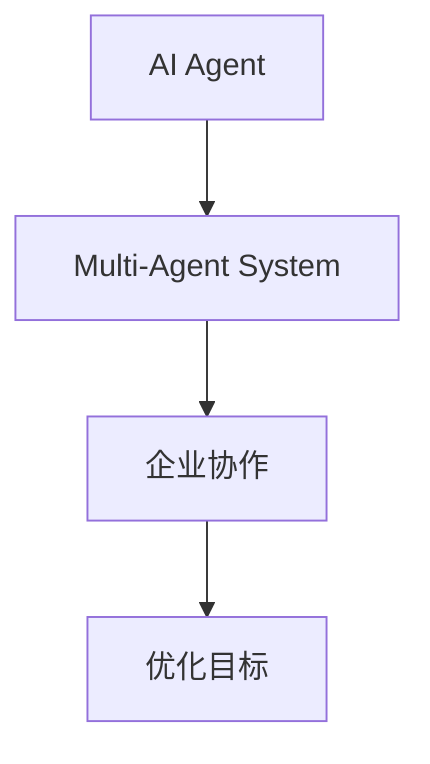

                 

---

# 《企业AI Agent的多智能体系统在跨部门协作优化中的应用》

---

## 关键词：
- 企业AI Agent
- 多智能体系统
- 跨部门协作优化
- 多智能体算法
- 系统架构设计
- 项目实战

---

## 摘要：
企业AI Agent的多智能体系统通过智能体之间的协作优化，实现企业内部跨部门的高效协同。本文将从背景、核心概念、算法原理、系统架构设计、项目实战等多方面深入探讨，结合实际案例分析，为企业在跨部门协作优化中的应用提供理论支持和实践指导。

---

## 正文：

---

### 第一部分: 企业AI Agent与多智能体系统概述

#### 第1章: AI Agent的基本概念

##### 1.1 AI Agent的定义与特点
- **AI Agent的定义**  
  AI Agent（人工智能代理）是指能够感知环境、自主决策并执行任务的智能实体。它可以是一个软件程序、机器人或其他智能系统，具备自主性、反应性、目标导向性和社会性等核心特点。

- **AI Agent的核心特点**  
  - **自主性**：无需外部干预，自主决策和行动。  
  - **反应性**：能够实时感知环境并做出反应。  
  - **目标导向性**：以实现特定目标为导向，优化行动策略。  
  - **社会性**：能够与其他智能体或人类进行交互和协作。

- **AI Agent与传统AI的区别**  
  传统AI（如专家系统）依赖于预定义规则，而AI Agent具备自主性和目标导向性，能够动态适应环境变化。

##### 1.2 多智能体系统的定义与特点
- **多智能体系统的定义**  
  多智能体系统（Multi-Agent System, MAS）是指由多个相互作用的智能体组成的系统，这些智能体通过协作或竞争完成特定任务。

- **多智能体系统的核心特点**  
  - **分布式智能**：智能体之间分布任务和责任，避免单点依赖。  
  - **协作性**：通过通信和协调实现共同目标。  
  - **自主性**：每个智能体具备自主决策能力。  
  - **动态性**：系统能够动态适应环境变化。

- **AI Agent与多智能体系统的联系**  
  AI Agent是多智能体系统的基本单元，而多智能体系统通过协调多个AI Agent的行为，实现复杂的任务。

---

#### 第2章: 多智能体系统在企业中的应用背景

##### 2.1 问题背景
- 企业在跨部门协作中常常面临以下问题：  
  - **信息孤岛**：各部门之间数据不通，协作效率低下。  
  - **资源分配不合理**：资源分配缺乏全局优化，导致浪费或不足。  
  - **决策延迟**：跨部门决策过程复杂，导致响应速度慢。  
  - **协作不确定性**：复杂环境下的协作不确定性增加。

##### 2.2 问题描述
- 跨部门协作优化的目标是通过智能化手段，实现企业内部资源的高效分配和流程优化。多智能体系统能够通过智能体之间的协作，实时感知环境变化，快速做出决策，从而提升企业协作效率。

##### 2.3 问题解决
- 引入多智能体系统，通过智能体之间的通信与协作，实现以下优化：  
  - **动态资源分配**：根据实时需求调整资源分配策略。  
  - **快速决策**：通过智能体协作，缩短决策时间。  
  - **复杂任务分解**：将复杂任务分解为多个子任务，由多个智能体协作完成。

##### 2.4 边界与外延
- **边界**：多智能体系统在企业中的应用边界包括但不限于：供应链管理、生产调度、客户服务等。  
- **外延**：多智能体系统可以与其他技术（如区块链、大数据）结合，进一步扩展应用范围。

##### 2.5 概念结构与核心要素组成
- **概念结构**：通过mermaid图展示AI Agent与多智能体系统的关系。

- **核心要素**：  
  - **智能体**：具备感知、决策、执行能力的个体。  
  - **通信协议**：智能体之间的通信规则。  
  - **协作机制**：智能体协作的方式和策略。  
  - **环境模型**：智能体对环境的感知模型。

---

#### 第3章: 多智能体系统的核心原理

##### 3.1 多智能体系统的分类
- **基于任务的多智能体系统**：智能体之间的协作基于特定任务。  
- **基于角色的多智能体系统**：智能体根据角色分配任务。  
- **基于目标的多智能体系统**：智能体通过共享目标实现协作。

##### 3.2 多智能体系统的关键技术
- **通信与协调**：智能体之间的信息传递与同步。  
- **协作算法**：实现智能体协作的核心算法，如一致性算法、协商算法。  
- **分布式计算**：多智能体系统通常基于分布式计算架构。

##### 3.3 多智能体系统的协作机制
- **协商机制**：智能体之间通过协商确定协作方式。  
- **协调机制**：通过协调中心统一调度智能体行为。  
- **分布式决策机制**：智能体基于局部信息做出决策。

---

#### 第4章: 多智能体系统的数学模型

##### 4.1 多智能体系统的抽象模型
- **状态空间**：系统所有可能的状态集合。  
- **动作空间**：智能体可执行的动作集合。  
- **奖励函数**：智能体行为的评价标准。

##### 4.2 多智能体系统的优化模型
- **目标函数**：最大化或最小化的目标函数。  
- **约束条件**：系统运行的限制条件。

##### 4.3 基于多智能体的优化算法
- **一致性算法**：如拜占庭容错共识算法。  
- **分布式优化算法**：如分布式梯度下降算法。

---

#### 第5章: 多智能体系统在企业中的应用案例

##### 5.1 供应链管理中的多智能体应用
- **案例背景**：供应链中的库存管理、物流调度。  
- **解决方案**：通过多智能体系统实现库存优化和物流调度。  
- **实际效果**：提升供应链效率，降低运营成本。

##### 5.2 跨部门协作中的多智能体应用
- **案例背景**：企业内部跨部门协作效率低。  
- **解决方案**：通过多智能体系统实现跨部门协作优化。  
- **实际效果**：缩短决策时间，提高协作效率。

---

## 总结
企业AI Agent的多智能体系统通过智能体之间的协作优化，实现企业内部跨部门的高效协同。本文从背景、核心概念、算法原理、系统架构设计、项目实战等多方面深入探讨，结合实际案例分析，为企业在跨部门协作优化中的应用提供理论支持和实践指导。

---

## 作者：
作者：AI天才研究院 & 禅与计算机程序设计艺术

