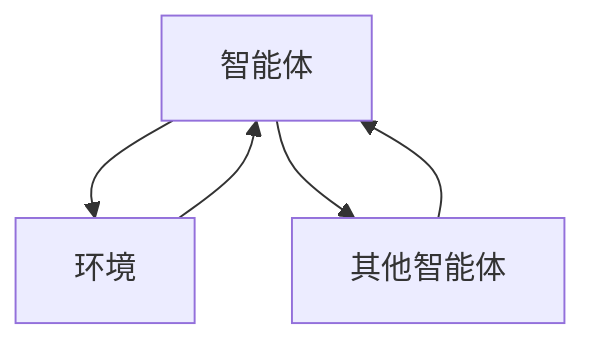
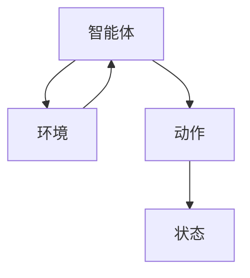
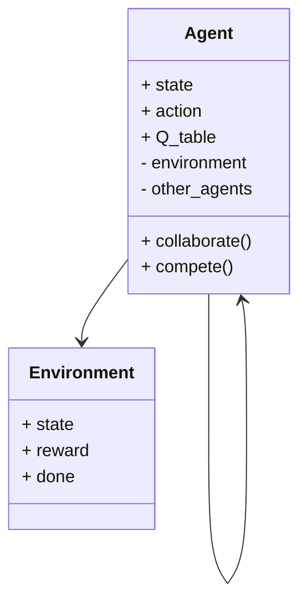
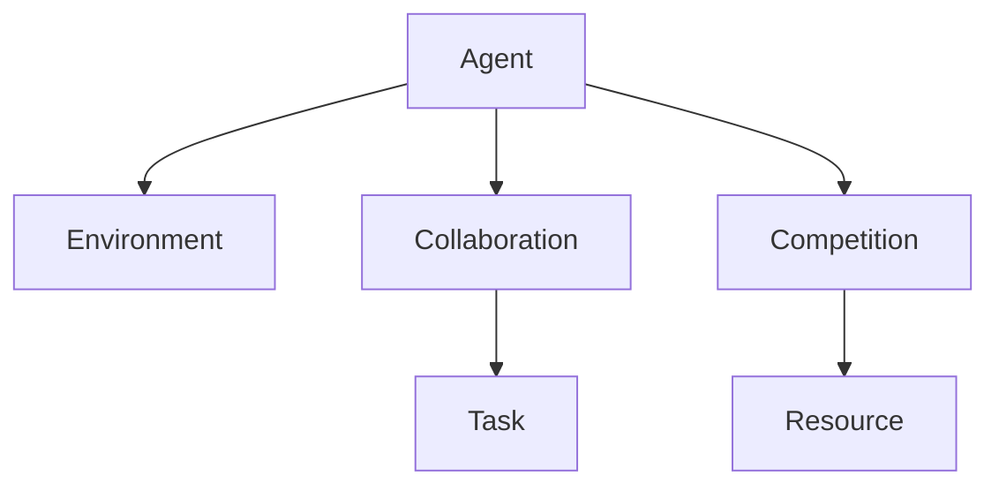
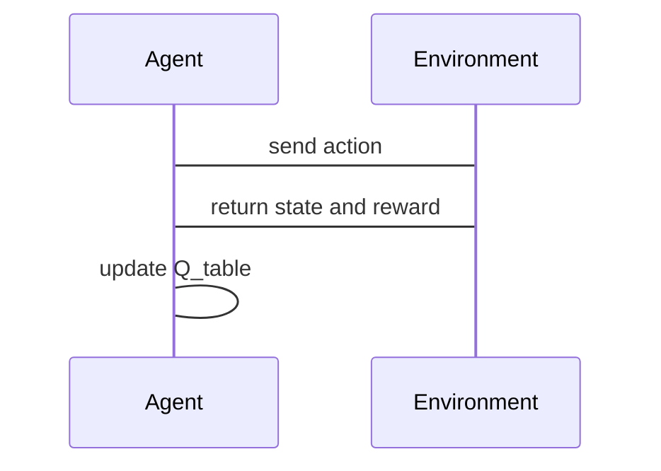

                 


# 企业AI Agent的多智能体系统：协作与竞争策略

---

## 关键词：
企业AI Agent、多智能体系统、协作策略、竞争策略、博弈论、强化学习

---

## 摘要：
随着人工智能技术的快速发展，企业AI Agent在多智能体系统中的应用日益广泛。本文深入探讨了多智能体系统的协作与竞争策略，从理论到实践，详细分析了多智能体系统的定义、特征、协作与竞争机制，以及基于强化学习和博弈论的算法实现。文章还结合实际案例，展示了多智能体系统在企业中的应用场景，并提出了实现中的注意事项和最佳实践。

---

## 第1章: 多智能体系统概述

### 1.1 多智能体系统的基本概念

#### 1.1.1 多智能体系统的定义
多智能体系统（Multi-Agent System，MAS）是由多个智能体（Agent）组成的分布式系统，这些智能体能够通过协作和竞争完成复杂任务。

#### 1.1.2 多智能体系统的特点
| 特性 | 描述 |
|------|------|
| 分布性 | 智能体独立运行，无中心控制节点 |
| 协作性 | 智能体之间可以协作完成共同目标 |
| 竞争性 | 智能体之间可以竞争有限资源 |
| 动态性 | 系统环境动态变化，智能体需实时调整策略 |

#### 1.1.3 企业AI Agent的核心特征
企业AI Agent是具备特定业务逻辑和决策能力的智能体，其核心特征包括：
1. **自主性**：能够自主决策和行动。
2. **反应性**：能够感知环境并实时响应。
3. **协作性**：能够与其他智能体或系统进行协作。
4. **学习能力**：能够通过数据和经验优化自身行为。

#### 1.1.4 多智能体系统的边界与外延
多智能体系统的边界在于智能体的数量和交互方式。外延则包括分布式计算、分布式系统和分布式人工智能。

#### 1.1.5 多智能体系统的概念结构
Mermaid 图：


---

### 1.2 多智能体系统在企业的应用场景

#### 1.2.1 问题背景
企业在资源分配、任务调度、决策优化等方面面临复杂的协作与竞争问题。

#### 1.2.2 问题描述
企业中的多个部门或系统需要协作完成任务，同时可能存在资源分配不均、效率低下等问题。

#### 1.2.3 问题解决
通过多智能体系统的协作与竞争策略，优化企业内部资源分配和任务执行效率。

#### 1.2.4 边界与外延
企业多智能体系统的边界在于企业的组织架构和业务流程，外延则涉及供应链、客户关系等领域。

---

## 第2章: 多智能体系统的协作与竞争策略

### 2.1 协作策略的设计与实现

#### 2.1.1 协作的基本原理
协作是指多个智能体为了共同目标而协同行动的过程。

#### 2.1.2 基于博弈论的协作策略
- **纳什均衡**：所有智能体都采取最优策略，无法通过单方面改变策略而获益。
- **帕累托最优**：协作结果使所有智能体都受益。

#### 2.1.3 基于通信协议的协作策略
智能体通过通信协议进行信息交换，制定协作计划。

#### 2.1.4 协作中的信任与安全问题
- **信任建立**：通过历史行为记录和信誉评估建立信任。
- **安全威胁**：防止恶意智能体破坏协作过程。
- **隐私保护**：确保协作过程中数据的安全性。

---

### 2.2 竞争策略的设计与实现

#### 2.2.1 竞争的基本原理
竞争是指多个智能体为了争夺有限资源而采取的行动。

#### 2.2.2 基于博弈论的竞争策略
- **零和博弈**：竞争结果为一方获益，另一方损失。
- **非零和博弈**：竞争结果为多方共赢或部分损失。

#### 2.2.3 基于资源分配的竞争策略
智能体通过资源分配模型优化自身资源获取。

#### 2.2.4 竞争中的公平与效率问题
- **公平性**：确保所有智能体在竞争中享有平等机会。
- **效率优化**：通过优化竞争规则提高资源利用效率。

---

## 第3章: 多智能体系统的算法实现

### 3.1 基于强化学习的协作与竞争算法

#### 3.1.1 算法原理
强化学习是一种通过试错机制优化智能体行为的算法。

Mermaid 图：


#### 3.1.2 算法实现
以下是基于强化学习的协作与竞争算法实现代码：

```python
import numpy as np

class Agent:
    def __init__(self, state_space, action_space):
        self.state_space = state_space
        self.action_space = action_space
        self.Q = np.zeros((state_space, action_space))
    
    def act(self, state):
        return np.argmax(self.Q[state])
    
    def update(self, state, action, reward, next_state):
        self.Q[state, action] += 0.1 * (reward + np.max(self.Q[next_state]) - self.Q[state, action])

# 初始化环境和智能体
state_space = 5
action_space = 3
agent = Agent(state_space, action_space)

# 训练过程
for _ in range(1000):
    state = np.random.randint(0, state_space)
    action = agent.act(state)
    next_state = np.random.randint(0, state_space)
    reward = np.random.randn()
    agent.update(state, action, reward, next_state)
```

#### 3.1.3 算法的数学模型
协作与竞争的强化学习模型可以表示为：

$$ Q(s, a) = Q(s, a) + \alpha (r + \gamma \max Q(s', a') - Q(s, a)) $$

其中：
- \( Q(s, a) \)：状态 \( s \) 下动作 \( a \) 的价值函数。
- \( \alpha \)：学习率。
- \( r \)：奖励。
- \( \gamma \)：折扣因子。

---

## 第4章: 多智能体系统的系统架构设计

### 4.1 系统功能设计

#### 4.1.1 领域模型
Mermaid 类图：


#### 4.1.2 系统架构设计
Mermaid 架构图：


#### 4.1.3 系统接口设计
- **输入接口**：接收环境状态和智能体信息。
- **输出接口**：输出智能体动作和状态更新。

#### 4.1.4 系统交互序列图
Mermaid 序列图：


---

## 第5章: 多智能体系统的项目实战

### 5.1 项目环境安装

#### 5.1.1 安装依赖
```bash
pip install numpy matplotlib
```

#### 5.1.2 环境配置
```bash
export PYTHONPATH=$PYTHONPATH:.
```

### 5.2 核心代码实现

#### 5.2.1 多智能体协作代码
```python
import numpy as np

class CollaborativeAgent(Agent):
    def __init__(self, state_space, action_space):
        super().__init__(state_space, action_space)
        self.communication = []
    
    def receive_message(self, message):
        self.communication.append(message)
    
    def send_message(self, message):
        self.communication.append(message)

# 初始化协作环境
agents = [CollaborativeAgent(5, 3), CollaborativeAgent(5, 3)]

# 协作过程
for _ in range(100):
    for agent in agents:
        message = "Collaborate"
        agent.send_message(message)
        agent.receive_message(message)
```

#### 5.2.2 多智能体竞争代码
```python
import numpy as np

class CompetitiveAgent(Agent):
    def __init__(self, state_space, action_space):
        super().__init__(state_space, action_space)
        self.rival = None
    
    def compete(self):
        if self.rival:
            action = self.act(self.rival.state)
            self.rival.receive_message(action)

# 初始化竞争环境
agent1 = CompetitiveAgent(5, 3)
agent2 = CompetitiveAgent(5, 3)
agent1.rival = agent2
agent2.rival = agent1

# 竞争过程
for _ in range(100):
    agent1.compete()
    agent2.compete()
```

### 5.3 案例分析与解读

#### 5.3.1 协作案例分析
假设两个智能体需要协作完成任务，通过通信协议传递信息，最终实现协作目标。

#### 5.3.2 竞争案例分析
假设两个智能体竞争有限资源，通过强化学习优化竞争策略，提高资源分配效率。

---

## 第6章: 多智能体系统的最佳实践与注意事项

### 6.1 实现中的注意事项

#### 6.1.1 系统设计
- 确保系统架构的可扩展性和可维护性。
- 处理智能体之间的通信延迟和带宽限制。

#### 6.1.2 算法选择
- 根据具体场景选择合适的协作与竞争算法。
- 定期优化算法以应对环境变化。

#### 6.1.3 数据安全
- 保护智能体之间的通信数据。
- 防范恶意智能体的攻击。

---

## 第7章: 结论与展望

### 7.1 本章小结
本文深入探讨了企业AI Agent的多智能体系统，从协作与竞争策略、算法实现到系统架构设计，为读者提供了全面的知识体系。

### 7.2 注意事项
- 多智能体系统的实现需要综合考虑技术、业务和安全等多个方面。
- 在实际应用中，需根据具体需求调整协作与竞争策略。

### 7.3 拓展阅读
- 推荐阅读《Multi-Agent Systems: Algorithmic, Complexity, and Synthesis》深入理解多智能体系统。
- 关注学术期刊中的最新研究成果。

---

## 作者：AI天才研究院 & 禅与计算机程序设计艺术

---

感谢您的阅读！如需进一步了解企业AI Agent的多智能体系统，欢迎关注AI天才研究院的后续研究。

