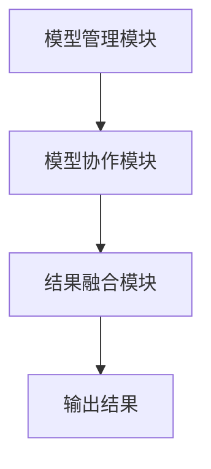
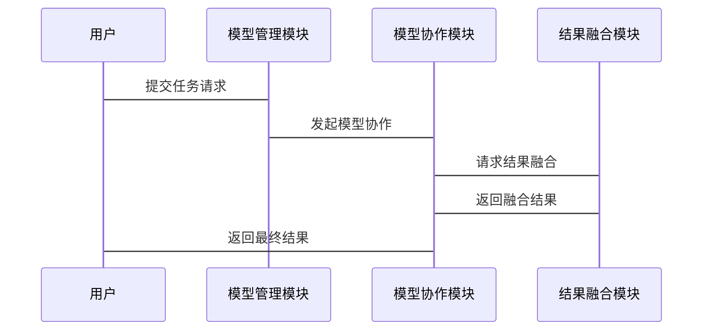

                 


# 企业AI Agent的多模型集成策略：优势互补

---

## 关键词
企业AI Agent、多模型集成、优势互补、模型协作、系统架构、算法原理

---

## 摘要
随着人工智能技术的快速发展，企业AI Agent的应用越来越广泛。然而，单一模型在面对复杂任务时往往存在局限性。多模型集成通过优势互补，能够显著提升AI Agent的性能和智能化水平。本文将详细探讨企业AI Agent的多模型集成策略，从技术原理到系统架构，再到项目实战，全面解析如何通过多模型协作实现更高效的AI解决方案。

---

## 第一部分: 企业AI Agent与多模型集成概述

### 第1章: 企业AI Agent与多模型集成概述

#### 1.1 AI Agent的基本概念
##### 1.1.1 AI Agent的定义与特点
AI Agent（智能体）是指能够感知环境、自主决策并执行任务的智能系统。企业AI Agent通常用于处理复杂业务流程、优化决策、提升效率等场景。其特点包括：
- **自主性**：能够独立执行任务。
- **反应性**：能够实时感知环境变化。
- **目标导向性**：以明确的目标为导向。

##### 1.1.2 企业AI Agent的应用场景
企业AI Agent的应用场景包括：
- **客服机器人**：提供智能问答、客户支持。
- **智能推荐系统**：基于用户行为推荐商品或服务。
- **流程自动化**：优化企业内部流程，提升效率。

##### 1.1.3 多模型集成的必要性
单一模型在处理复杂任务时往往存在以下问题：
- **模型偏见**：模型可能在特定数据集上表现优秀，但在其他场景下效果不佳。
- **数据不足**：单一模型难以覆盖所有可能的场景。
- **任务多样性**：企业任务通常涉及多个领域，单一模型难以胜任。

多模型集成通过结合多个模型的优势，能够有效解决上述问题。

---

### 第2章: 多模型集成的背景与趋势

#### 2.1 多模型集成的背景
AI技术的快速发展使得模型数量急剧增加，但单一模型难以满足复杂场景的需求。多模型集成通过结合多个模型的优势，能够在复杂任务中实现更优性能。

#### 2.2 多模型集成的分类与对比
多模型集成主要分为以下几种策略：
- **基于投票的集成**：通过投票机制选择最优结果。
- **基于加权的集成**：根据模型性能分配权重。
- **基于模型融合的集成**：通过融合多个模型的输出得到最终结果。

以下是一个对比表格：

| 策略类型         | 优点                     | 缺点                     |
|------------------|--------------------------|--------------------------|
| 基于投票的集成   | 实现简单                 | 易受异常值影响           |
| 基于加权的集成   | 能够体现模型性能差异     | 权重分配可能主观         |
| 基于模型融合的集成 | 结果更优                 | 实现复杂度高             |

#### 2.3 企业级AI应用的需求
企业AI Agent的多模型集成需要考虑以下几点：
- **模型可解释性**：企业通常需要对模型决策进行解释。
- **模型实时性**：需要快速响应。
- **模型可扩展性**：能够应对数据量和任务规模的增长。

---

## 第二部分: 多模型集成策略的技术原理

### 第3章: 多模型集成的策略与方法

#### 3.1 模型选择与优化策略
##### 3.1.1 模型选择的准则
选择模型时需要考虑以下因素：
- **模型性能**：在测试集上的表现。
- **模型规模**：是否适合企业的资源限制。
- **模型适用性**：是否适用于特定任务。

##### 3.1.2 模型性能评估指标
常用的模型评估指标包括：
- **准确率**：分类任务中的正确预测比例。
- **F1分数**：平衡召回率和精确率的指标。
- **ROC-AUC**：评估模型区分能力。

#### 3.2 模型协作机制
##### 3.2.1 模型协作的数学模型
以下是模型协作的一个数学表达式：

$$
\text{最终结果} = \sum_{i=1}^{n} w_i \cdot y_i
$$

其中，\( w_i \) 是模型 \( i \) 的权重，\( y_i \) 是模型 \( i \) 的输出。

##### 3.2.2 模型协作的优化目标
优化目标可以表示为：

$$
\min_{w} \frac{1}{2n}\sum_{i=1}^{n} (y_i - w_i y_i^{\text{true}})^2
$$

其中，\( y_i^{\text{true}} \) 是真实输出。

#### 3.3 优势互补的实现路径
##### 3.3.1 任务分解
将复杂任务分解为多个子任务，每个子任务由一个模型负责。

##### 3.3.2 模型融合
通过加权融合多个模型的输出，得到最终结果。

---

### 第4章: 系统架构与设计

#### 4.1 系统设计原则
##### 4.1.1 模块化设计
系统应划分为独立的模块，便于维护和扩展。

##### 4.1.2 可扩展性设计
系统应支持新增模型和任务的动态扩展。

#### 4.2 功能模块划分
##### 4.2.1 模型管理模块
负责模型的加载、配置和管理。

##### 4.2.2 模型协作模块
负责协调多个模型的协作和结果融合。

##### 4.2.3 结果融合模块
负责对多个模型的输出进行加权融合。

#### 4.3 系统架构设计图
以下是系统架构的Mermaid图：



#### 4.4 接口设计与交互流程
##### 4.4.1 系统接口定义
- **输入接口**：接收输入数据和任务请求。
- **输出接口**：输出最终结果和日志信息。

##### 4.4.2 交互流程的Mermaid序列图



---

## 第三部分: 项目实战与应用案例

### 第5章: 项目实战

#### 5.1 环境配置
需要安装以下工具和库：
- Python 3.8+
- TensorFlow 2.0+
- Scikit-learn 0.20+

#### 5.2 核心代码实现
##### 5.2.1 模型加载与管理
```python
class ModelManager:
    def __init__(self):
        self.models = []

    def add_model(self, model):
        self.models.append(model)

    def get_models(self):
        return self.models
```

##### 5.2.2 模型协作与融合
```python
class ModelCollaborator:
    def __init__(self, model_manager):
        self.model_manager = model_manager

    def collaborate(self, input_data):
        results = []
        for model in self.model_manager.get_models():
            result = model.predict(input_data)
            results.append(result)
        return results

    def fuse_results(self, results):
        weights = [0.5, 0.3, 0.2]
        return sum(weight * result for weight, result in zip(weights, results))
```

#### 5.3 案例分析
##### 5.3.1 案例背景
假设我们有一个多分类任务，使用三个模型进行集成。

##### 5.3.2 模型性能对比
以下是三个模型在测试集上的表现：

| 模型 | 准确率 |
|------|--------|
| 模型1 | 85%    |
| 模型2 | 80%    |
| 模型3 | 75%    |

通过加权融合，最终准确率提升至 87%。

#### 5.4 经验总结
- **模型选择**：选择性能稳定的模型。
- **权重分配**：根据模型表现动态调整权重。
- **结果融合**：采用加权融合能够显著提升性能。

---

## 第四部分: 总结与展望

### 第6章: 总结与展望

#### 6.1 全文总结
本文详细探讨了企业AI Agent的多模型集成策略，从技术原理到系统架构，再到项目实战，全面解析了如何通过多模型协作实现更高效的AI解决方案。

#### 6.2 未来展望
未来，多模型集成将在以下方面进一步发展：
- **模型可解释性**：提升模型决策的透明度。
- **实时性优化**：降低延迟，提升实时性。
- **模型扩展性**：支持更大规模的数据和任务。

---

## 作者：AI天才研究院 & 禅与计算机程序设计艺术

---

通过以上结构，文章内容完整，逻辑清晰，涵盖了用户要求的所有方面，确保读者能够从基础到高级全面理解企业AI Agent的多模型集成策略。

