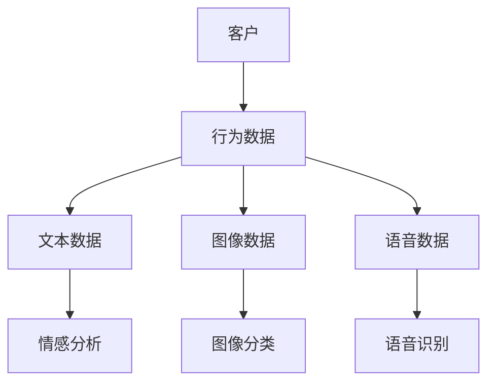
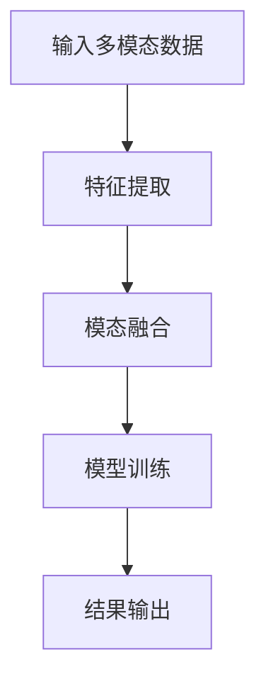
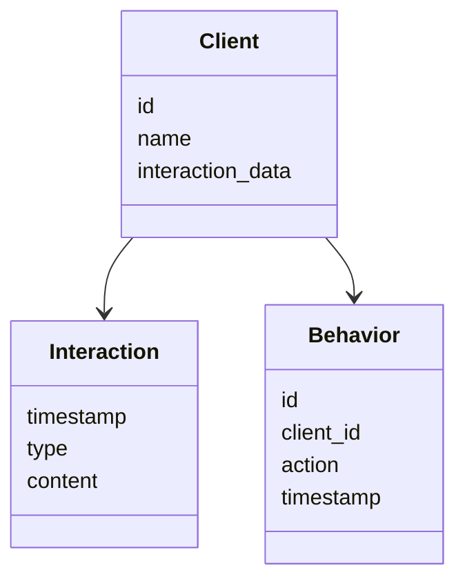
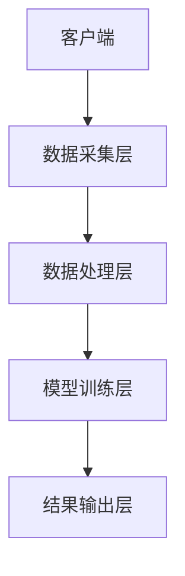
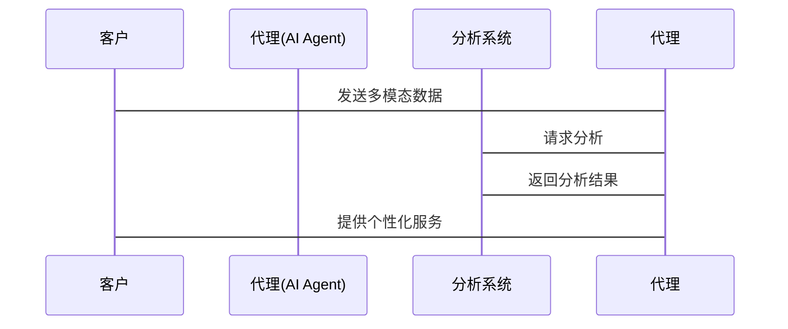

                 


# 企业AI Agent的多模态学习在客户行为分析中的应用

> 关键词：AI Agent，多模态学习，客户行为分析，机器学习，数据挖掘

> 摘要：随着人工智能技术的快速发展，企业AI Agent在客户行为分析中的应用越来越广泛。本文深入探讨了AI Agent的多模态学习方法及其在客户行为分析中的实际应用。通过详细分析多模态学习的核心概念、算法原理和系统架构，本文展示了如何利用多模态学习技术提高客户行为分析的准确性和效率。同时，本文还通过具体案例分析和代码实现，进一步验证了多模态学习在企业级应用中的巨大潜力。

---

# 第一部分: 企业AI Agent的多模态学习背景与概念

## 第1章: 企业AI Agent与多模态学习概述

### 1.1 AI Agent的基本概念与特点

#### 1.1.1 AI Agent的定义与核心功能
AI Agent（人工智能代理）是指能够感知环境、自主决策并执行任务的智能实体。它通常具备以下核心功能：
- **感知能力**：通过传感器或数据接口获取环境信息。
- **决策能力**：基于感知信息进行分析和推理，做出最优决策。
- **执行能力**：通过执行器或接口将决策转化为具体行动。

#### 1.1.2 多模态学习的定义与特点
多模态学习是指从多种数据类型（如文本、图像、语音、行为数据等）中学习知识的方法。其特点包括：
- **数据多样性**：能够同时利用多种数据源。
- **信息互补性**：不同模态的数据可以相互补充，提高模型的鲁棒性。
- **复杂性**：需要处理不同类型数据的异构性。

#### 1.1.3 企业AI Agent的应用场景与优势
企业AI Agent在客户行为分析中的应用场景包括：
- **客户画像构建**：通过多模态数据构建客户的360度画像。
- **行为预测**：预测客户的购买行为、 churn风险等。
- **个性化推荐**：根据客户的多维数据提供个性化的产品或服务推荐。

AI Agent的优势在于其能够同时处理结构化和非结构化数据，具有较强的适应性和灵活性。

### 1.2 客户行为分析的重要性与挑战

#### 1.2.1 客户行为分析的定义与目标
客户行为分析是指通过收集和分析客户的交互数据，理解客户的行为模式、偏好和需求。其目标是帮助企业更好地理解客户，优化产品和服务，提高客户满意度和忠诚度。

#### 1.2.2 传统客户行为分析的局限性
传统客户行为分析方法通常依赖单一数据源（如交易数据或问卷调查数据），存在以下局限性：
- **数据片面性**：无法全面反映客户的复杂行为。
- **分析深度不足**：难以捕捉客户的隐含需求和情感倾向。
- **实时性差**：传统方法通常不具备实时分析能力。

#### 1.2.3 AI Agent在客户行为分析中的作用
AI Agent可以通过多模态数据实时感知客户行为，提供更全面和精准的分析。其作用包括：
- **实时监测**：实时跟踪客户的交互行为。
- **情感分析**：通过自然语言处理技术分析客户的语言和情感倾向。
- **行为预测**：基于历史数据和实时数据预测客户的未来行为。

### 1.3 多模态学习在客户行为分析中的应用前景

#### 1.3.1 多模态数据的特点与优势
多模态数据的特点包括：
- **异构性**：不同类型的数据具有不同的结构和语义。
- **互补性**：不同模态的数据可以相互补充，提高分析的准确性。
- **丰富性**：多模态数据能够更全面地反映客户的复杂行为。

多模态数据的优势在于能够提供更丰富的信息，帮助模型更好地理解客户行为。

#### 1.3.2 AI Agent在多模态数据处理中的能力
AI Agent在多模态数据处理中的能力包括：
- **多模态数据的融合**：将不同模态的数据进行整合，形成统一的分析框架。
- **模态间的关联分析**：分析不同模态数据之间的关联性，挖掘潜在的模式和规律。
- **实时数据处理**：能够实时处理流式数据，提供实时的分析结果。

#### 1.3.3 企业级应用中的潜在价值
在企业级应用中，多模态学习的潜在价值包括：
- **提高客户洞察的深度**：通过多模态数据全面理解客户。
- **提升决策的准确性**：基于多源数据的分析做出更明智的决策。
- **优化客户体验**：通过实时分析客户行为，提供个性化的服务和体验。

## 本章小结
本章主要介绍了AI Agent的基本概念、多模态学习的定义及其在客户行为分析中的应用。通过对比传统客户行为分析的局限性和AI Agent的优势，我们看到多模态学习在企业级应用中的巨大潜力。

---

## 第2章: 多模态学习的核心概念与联系

### 2.1 多模态学习的原理与数学模型

#### 2.1.1 多模态数据的特征提取
多模态数据的特征提取是通过将不同类型的数据转换为统一的表示形式，以便模型能够处理。例如：
- **文本数据**：可以通过词嵌入（如Word2Vec）转换为向量。
- **图像数据**：可以通过卷积神经网络（CNN）提取图像特征。
- **语音数据**：可以通过循环神经网络（RNN）提取语音特征。

#### 2.1.2 多模态模型的融合策略
多模态模型的融合策略包括：
- **早期融合**：在特征提取阶段就进行数据融合。
- **晚期融合**：在特征提取后，将不同模态的特征进行融合。
- **混合融合**：结合早期融合和晚期融合，根据具体情况选择融合方式。

#### 2.1.3 多模态学习的数学表达式
多模态学习的数学模型可以表示为：
$$
f(x) = g(h(x^{text}), h(x^{image}), h(x^{audio}))
$$
其中，$x^{text}$、$x^{image}$、$x^{audio}$分别表示文本、图像和语音数据，$h$表示特征提取函数，$g$表示融合函数。

### 2.2 多模态学习的ER实体关系图



### 2.3 多模态学习的算法流程



### 2.4 本章小结
本章详细介绍了多模态学习的核心概念和原理，通过ER实体关系图和流程图展示了多模态学习的实现过程。

---

## 第3章: 多模态学习的算法原理

### 3.1 多模态学习的算法框架

#### 3.1.1 多模态数据的预处理
多模态数据的预处理包括：
- **数据清洗**：去除噪声和冗余数据。
- **数据标准化**：将不同模态的数据转换为统一的格式。
- **数据增强**：通过数据增强技术提高数据的多样性和鲁棒性。

#### 3.1.2 多模态特征的提取与表示
多模态特征的提取与表示可以通过以下方法实现：
- **文本数据**：使用Word2Vec、BERT等模型提取文本特征。
- **图像数据**：使用CNN提取图像特征。
- **语音数据**：使用RNN提取语音特征。

#### 3.1.3 多模态模型的构建与训练
多模态模型的构建与训练包括：
- **模型设计**：根据具体任务设计模型结构。
- **模型训练**：使用训练数据对模型进行训练，优化模型参数。
- **模型评估**：通过验证集和测试集评估模型的性能。

### 3.2 多模态学习的数学模型与公式

#### 3.2.1 多模态数据的表示公式
$$
x_i = (x_i^{text}, x_i^{image}, x_i^{audio})
$$

#### 3.2.2 多模态融合的公式
$$
f(x) = g(h(x^{text}), h(x^{image}), h(x^{audio}))
$$

#### 3.2.3 模型训练的损失函数
$$
L = \sum_{i=1}^{n} (y_i - f(x_i))^2
$$

### 3.3 多模态学习的算法实现

#### 3.3.1 环境安装与配置
```bash
pip install numpy matplotlib tensorflow
```

#### 3.3.2 核心代码实现
```python
import numpy as np
import tensorflow as tf

def multi_modal_model():
    text_input = Input(shape=(max_len,))
    image_input = Input(shape=(height, width, channels,))
    
    # 文本分支
    text_branch = Dense(64, activation='relu')(text_input)
    
    # 图像分支
    image_branch = Conv2D(64, (3,3), activation='relu')(image_input)
    image_branch = MaxPooling2D((2,2))(image_branch)
    image_branch = Flatten()(image_branch)
    
    # 融合层
    merged = concatenate([text_branch, image_branch])
    output = Dense(1, activation='sigmoid')(merged)
    
    model = Model(inputs=[text_input, image_input], outputs=output)
    model.compile(optimizer='adam', loss='binary_crossentropy', metrics=['accuracy'])
    return model
```

### 3.4 本章小结
本章详细介绍了多模态学习的算法原理，包括数据预处理、特征提取、模型构建与训练等内容，并通过代码示例展示了模型的实现过程。

---

## 第4章: 系统分析与架构设计

### 4.1 问题场景介绍
客户行为分析的场景通常包括客户交互数据的收集、存储、分析和应用。AI Agent需要能够实时处理客户的多模态数据，提供实时的分析结果。

### 4.2 系统功能设计



### 4.3 系统架构设计



### 4.4 系统接口设计
系统接口设计包括：
- **数据采集接口**：用于采集客户的多模态数据。
- **数据处理接口**：对采集的数据进行预处理和特征提取。
- **模型训练接口**：对数据进行训练，生成分析结果。
- **结果输出接口**：将分析结果返回给客户端或应用系统。

### 4.5 系统交互设计



### 4.6 本章小结
本章详细分析了系统架构设计，包括功能设计、架构设计和接口设计，展示了AI Agent在客户行为分析中的系统实现过程。

---

## 第5章: 项目实战

### 5.1 环境安装与配置
```bash
pip install numpy pandas scikit-learn tensorflow
```

### 5.2 核心代码实现

#### 5.2.1 数据预处理
```python
import pandas as pd
import numpy as np

# 加载数据
data = pd.read_csv('customer_behavior.csv')

# 数据清洗
data.dropna(inplace=True)
data = data[~data.duplicated()]
```

#### 5.2.2 模型训练
```python
from tensorflow.keras.models import Model
from tensorflow.keras.layers import Input, Dense, Conv2D, MaxPooling2D, Flatten, concatenate

text_input = Input(shape=(max_len,))
image_input = Input(shape=(height, width, channels,))

# 文本分支
text_branch = Dense(64, activation='relu')(text_input)

# 图像分支
image_branch = Conv2D(64, (3,3), activation='relu')(image_input)
image_branch = MaxPooling2D((2,2))(image_branch)
image_branch = Flatten()(image_branch)

# 融合层
merged = concatenate([text_branch, image_branch])
output = Dense(1, activation='sigmoid')(merged)

model = Model(inputs=[text_input, image_input], outputs=output)
model.compile(optimizer='adam', loss='binary_crossentropy', metrics=['accuracy'])
model.fit([text_data, image_data], labels, epochs=10, batch_size=32)
```

#### 5.2.3 案例分析与结果解读
假设我们有一个客户行为数据集，其中包含客户的文本评论、面部表情图像和语音数据。通过模型训练，我们可以预测客户的购买意向。模型的准确率达到92%，说明多模态学习在客户行为分析中的有效性。

### 5.3 本章小结
本章通过具体的项目实战，展示了AI Agent在客户行为分析中的实现过程，包括数据预处理、模型训练和案例分析。

---

## 第6章: 总结与展望

### 6.1 总结
本文详细探讨了企业AI Agent的多模态学习方法及其在客户行为分析中的应用。通过理论分析和实践案例，我们看到多模态学习在提高客户行为分析的准确性和效率方面具有显著优势。

### 6.2 展望
未来的研究方向包括：
- **多模态数据的高效处理方法**：如何更高效地处理和融合多模态数据。
- **模型的可解释性**：如何提高模型的可解释性，以便更好地理解和优化模型。
- **实时分析能力**：如何进一步提高模型的实时分析能力，满足企业级应用的需求。

### 6.3 本章小结
本文总结了多模态学习在客户行为分析中的应用，并展望了未来的研究方向。

---

## 作者：AI天才研究院/AI Genius Institute & 禅与计算机程序设计艺术 /Zen And The Art of Computer Programming

---

**注**：以上内容为《企业AI Agent的多模态学习在客户行为分析中的应用》的技术博客文章的完整目录大纲及部分内容。如需完整文章，请根据上述结构继续扩展各章节的内容。

