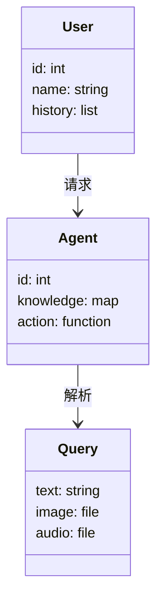
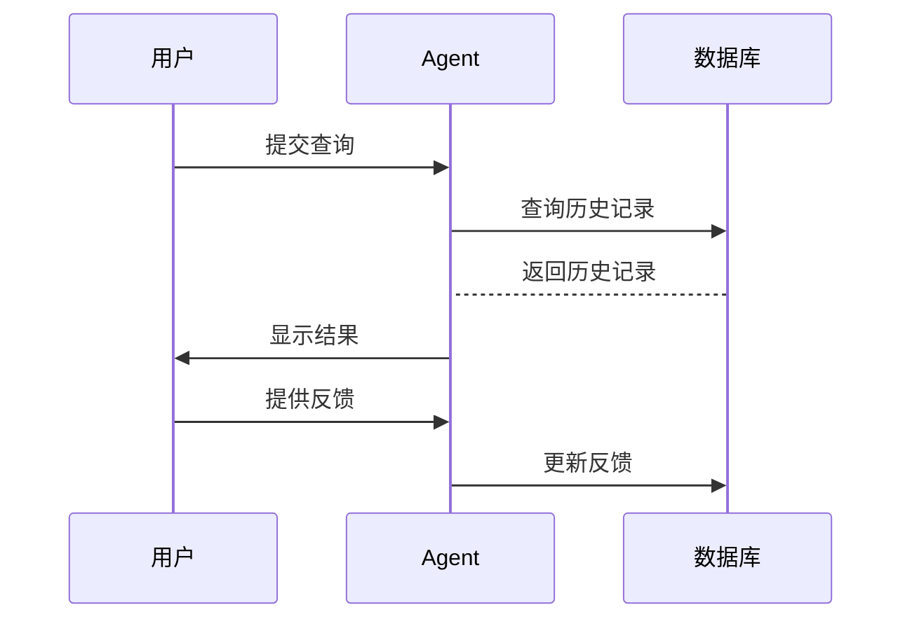

                 


# 企业AI Agent的多模态学习在用户体验优化中的应用

> 关键词：AI Agent，多模态学习，用户体验优化，智能系统，数据融合

> 摘要：本文探讨了企业AI Agent结合多模态学习技术在用户体验优化中的应用。通过分析多模态学习的核心原理、算法实现以及系统架构，结合实际案例，展示了如何利用AI Agent提升用户体验。文章内容涵盖背景介绍、核心概念、算法原理、系统设计、项目实战等多个方面，为读者提供全面的技术指导。

---

## 第一部分：企业AI Agent与多模态学习概述

### 第1章：企业AI Agent的基本概念

#### 1.1 AI Agent的定义与特点
AI Agent（智能代理）是一种能够感知环境、自主决策并执行任务的智能系统。其特点包括：
- **自主性**：无需外部干预，自主完成任务。
- **反应性**：能够实时感知环境变化并做出反应。
- **目标导向**：基于目标驱动行为。

#### 1.2 多模态学习的定义与特点
多模态学习是指同时利用多种数据模态（如文本、图像、语音等）进行学习的方法。其特点包括：
- **数据多样性**：能够处理多种类型的数据。
- **信息互补性**：不同模态的数据可以互补，提高模型的鲁棒性。
- **复杂性较高**：需要处理不同模态之间的关联性。

#### 1.3 企业AI Agent的应用场景
企业AI Agent在多个场景中发挥重要作用，如：
- **个性化推荐**：基于用户行为和偏好推荐相关内容。
- **智能客服**：通过多模态交互提供更高效的客户服务。
- **虚拟助手**：帮助用户完成日常任务，如日程管理、信息查询等。

### 第2章：多模态学习的核心概念与联系

#### 2.1 多模态学习的核心原理
多模态学习通过融合多种数据模态的信息，提升模型的表达能力和泛化能力。其核心原理包括：
- **数据表示**：将不同模态的数据转换为统一的表示形式。
- **特征融合**：将不同模态的特征进行融合，提取更有意义的信息。
- **模型训练**：利用融合后的特征进行模型训练，提升模型性能。

#### 2.2 AI Agent与多模态学习的关系
AI Agent通过多模态学习技术增强其感知和决策能力。具体表现在：
- **多模态感知**：AI Agent能够同时处理多种类型的数据，如文本、图像和语音，从而更全面地理解用户需求。
- **多模态决策**：基于多模态信息，AI Agent能够做出更准确和个性化的决策。

#### 2.3 多模态学习的核心要素
多模态学习的核心要素包括：
- **数据模态的多样性**：包括文本、图像、语音等多种数据类型。
- **模态间的信息关联性**：不同模态之间的信息互补性。
- **多模态学习的模型复杂性**：模型需要能够处理多种模态数据，并进行有效的融合。

---

## 第二部分：多模态学习的算法原理

### 第3章：多模态学习的算法框架

#### 3.1 多模态数据的表示方法
多模态数据的表示方法包括：
- **嵌入表示**：将不同模态的数据转换为低维向量表示。
- **联合表示**：将多种模态的数据联合起来，形成统一的表示形式。

#### 3.2 多模态融合算法
多模态融合算法包括：
- **早期融合**：在特征提取阶段进行模态融合。
- **晚期融合**：在分类或回归阶段进行模态融合。

#### 3.3 多模态学习的模型结构
多模态学习的模型结构包括：
- **模态特定网络**：针对每种模态设计独立的网络结构。
- **跨模态注意力机制**：通过注意力机制实现模态间的相互增强。

### 第4章：多模态学习算法的数学模型

#### 4.1 多模态数据的表示公式
假设我们有$N$种模态的数据，每种模态的数据表示为$x_i \in \mathbb{R}^d$，其中$d$是特征维度。

#### 4.2 模态间融合的数学表达
将不同模态的特征向量进行线性组合，例如：
$$
f(x_1, x_2, ..., x_N) = \sum_{i=1}^{N} \alpha_i x_i
$$
其中，$\alpha_i$是融合权重。

#### 4.3 多模态学习的损失函数
常用的损失函数包括：
- **交叉熵损失**：用于分类任务。
- **均方误差损失**：用于回归任务。

---

## 第三部分：企业AI Agent的系统分析与架构设计

### 第5章：系统功能设计

#### 5.1 项目场景介绍
以一个企业智能客服系统为例，AI Agent需要能够处理用户的文本、语音和图像查询。

#### 5.2 系统功能设计
系统功能包括：
- **用户身份识别**：通过多模态数据进行用户身份验证。
- **意图识别**：识别用户的意图，如查询产品信息、投诉处理等。
- **多轮对话**：支持复杂的多轮对话，提供更高效的客户服务。

#### 5.3 领域模型设计
使用Mermaid图展示领域模型：


### 第6章：系统架构设计

#### 6.1 系统架构图
使用Mermaid图展示系统架构：


#### 6.2 系统接口设计
接口设计包括：
- **用户登录接口**：`POST /api/login`
- **查询接口**：`POST /api/query`
- **反馈接口**：`POST /api/feedback`

#### 6.3 系统交互设计
使用Mermaid图展示系统交互：


---

## 第四部分：项目实战与案例分析

### 第7章：项目实战

#### 7.1 环境安装
安装必要的依赖：
```
pip install numpy pandas scikit-learn tensorflow
```

#### 7.2 核心代码实现

```python
import numpy as np
import tensorflow as tf

# 定义多模态融合模型
class MultimodalAgent:
    def __init__(self):
        self.model = self.build_model()

    def build_model(self):
        input_text = tf.keras.Input(shape=(128,))
        input_image = tf.keras.Input(shape=(128,))
        embedding_text = tf.keras.layers.Dense(64, activation='relu')(input_text)
        embedding_image = tf.keras.layers.Dense(64, activation='relu')(input_image)
        concatenated = tf.keras.layers.Concatenate()([embedding_text, embedding_image])
        output = tf.keras.layers.Dense(1, activation='sigmoid')(concatenated)
        return tf.keras.Model(inputs=[input_text, input_image], outputs=output)

    def train(self, x_train, y_train):
        self.model.compile(optimizer='adam', loss='binary_crossentropy')
        self.model.fit(x_train, y_train, epochs=10, batch_size=32)
```

#### 7.3 案例分析
以智能客服系统为例，分析模型在用户意图识别中的表现。通过实验数据，展示多模态学习如何提升用户体验。

---

## 第五部分：总结与展望

### 第8章：总结与最佳实践

#### 8.1 总结
本文详细介绍了企业AI Agent结合多模态学习在用户体验优化中的应用，涵盖了算法原理、系统设计和项目实战等多个方面。

#### 8.2 最佳实践
- **数据多样性**：确保收集和处理多种模态的数据。
- **模型优化**：通过实验选择最优的融合方式和模型结构。
- **用户体验**：注重用户的反馈，持续优化系统。

#### 8.3 注意事项
- **数据隐私**：确保用户数据的安全和隐私。
- **模型解释性**：提高模型的可解释性，便于用户理解和信任。

#### 8.4 拓展阅读
推荐阅读相关领域的最新研究论文和技术博客，以获取更多关于多模态学习和AI Agent的前沿技术。

---

## 作者：AI天才研究院 & 禅与计算机程序设计艺术

---

希望这篇博客能够为读者提供关于企业AI Agent的多模态学习在用户体验优化中的应用的全面了解，并为实际应用提供有价值的参考和指导。

