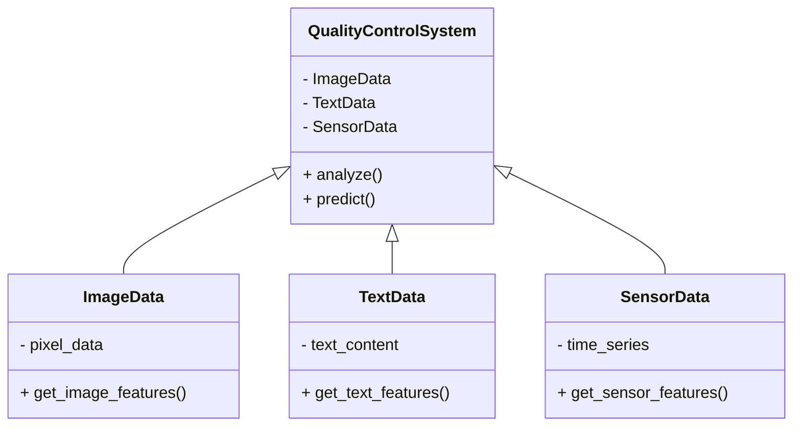

                 


# 《企业AI Agent的多模态学习在质量控制中的应用》

> 关键词：AI Agent，多模态学习，质量控制，企业应用，算法实现

> 摘要：本文探讨了AI Agent在企业质量控制中的应用，重点分析了多模态学习在质量控制中的优势与实现方法。通过结合AI Agent的核心概念、多模态学习的算法原理以及实际应用场景，本文详细阐述了如何利用多模态学习提升企业质量控制的效率和准确性。文章还提供了具体的算法实现和系统设计，为读者提供了一套完整的解决方案。

---

## 第一部分: 引言

## 第1章: 企业AI Agent与多模态学习的背景

### 1.1 什么是AI Agent

AI Agent（人工智能代理）是指能够感知环境、执行任务并做出决策的智能系统。AI Agent的核心特征包括自主性、反应性、目标导向性和社交能力。它能够通过传感器获取环境信息，通过执行器与环境交互，并通过内部算法进行决策和规划。

#### AI Agent的特点与优势

- **自主性**：AI Agent能够独立运行，无需外部干预。
- **反应性**：能够实时感知环境变化并做出反应。
- **目标导向性**：具备明确的目标，并能够采取行动以实现目标。
- **社交能力**：能够与其他AI Agent或人类进行交互和协作。

#### AI Agent在企业中的应用场景

AI Agent在企业中的应用场景非常广泛，包括：

1. **智能客服**：通过自然语言处理技术为用户提供24/7的在线支持。
2. **自动化运维**：监控系统运行状态，自动发现并修复问题。
3. **智能推荐**：根据用户行为推荐个性化的产品或服务。
4. **质量控制**：通过多模态数据感知和分析，实现对产品质量的实时监控。

### 1.2 多模态学习的基本概念

多模态学习是指从多种数据类型（如文本、图像、语音等）中学习并融合信息，以提高模型的性能和泛化能力。与传统的单模态学习相比，多模态学习能够充分利用不同数据源的优势，提供更全面的信息理解和更强的模型鲁棒性。

#### 多模态学习的核心特点

- **信息互补性**：不同数据源提供了不同的信息，互补性地增强了模型的感知能力。
- **数据多样性**：多模态数据能够覆盖更多的场景和细节，提高模型的泛化能力。
- **任务相关性**：多模态数据能够更好地服务于具体任务，如质量控制中的缺陷检测。

### 1.3 企业质量控制中的问题与挑战

#### 传统质量控制的痛点

- **效率低下**：依赖人工检查，效率低且容易出错。
- **数据单一**：传统质量控制通常只依赖单一数据源，如图像或文本，无法充分利用多源信息。
- **模型泛化能力不足**：单一数据源的模型在面对复杂场景时，泛化能力有限。

#### AI技术在质量控制中的应用价值

- **提高效率**：通过自动化技术大幅减少人工干预，提升质量控制效率。
- **降低成本**：自动化检查能够显著降低企业的质检成本。
- **提高准确性**：AI技术能够通过深度学习模型发现肉眼难以察觉的缺陷。

#### 多模态学习在质量控制中的独特优势

- **多源信息融合**：通过整合图像、文本、语音等多种数据源，提供更全面的质量分析能力。
- **提升模型鲁棒性**：多模态数据能够增强模型的泛化能力，减少单一数据源的局限性。
- **智能化决策**：通过多模态数据的深度分析，实现更智能的决策和优化。

### 1.4 本章小结

本章介绍了AI Agent和多模态学习的基本概念，并重点分析了多模态学习在企业质量控制中的应用价值和优势。通过对比传统质量控制的痛点，我们看到了多模态学习在提升质量控制效率和准确性方面的巨大潜力。

---

## 第二部分: 多模态学习的核心概念与原理

## 第2章: 多模态学习的核心概念

### 2.1 多模态数据的定义与分类

#### 多模态数据的定义

多模态数据是指由多种数据类型组成的复杂数据结构。例如，在企业质量控制中，多模态数据可能包括产品的图像、相关的文本描述以及传感器采集的实时数据。

#### 常见的多模态数据类型

1. **图像数据**：如产品外观图片。
2. **文本数据**：如产品说明书、缺陷描述。
3. **语音数据**：如质检过程中的语音指令或反馈。
4. **时间序列数据**：如传感器采集的实时数据。

#### 多模态数据的特征分析

- **异构性**：不同数据类型具有不同的结构和特征。
- **关联性**：多种数据类型之间存在一定的关联性，可以通过多模态学习进行融合。
- **多样性**：多模态数据能够提供更丰富的信息，有助于提高模型的泛化能力。

### 2.2 多模态学习的原理与模型架构

#### 多模态学习的原理

多模态学习的核心思想是通过联合学习不同数据源的信息，实现对目标任务的更准确预测。具体来说，多模态学习通过构建跨模态的特征表示，将不同数据源的信息进行融合，从而提高模型的性能。

#### 多模态模型的架构设计

多模态模型的架构设计通常包括以下几个部分：

1. **模态编码器**：将不同数据类型转换为统一的特征表示。
2. **特征融合层**：将不同模态的特征进行融合，生成更丰富的特征表示。
3. **任务预测层**：基于融合后的特征，进行目标任务的预测，如分类、回归等。

#### 多模态学习的核心算法与技术

- **对比学习**：通过最大化不同模态之间相似样本的相似性，增强跨模态关联性。
- **自注意力机制**：通过注意力机制捕捉不同模态之间的关联性，实现信息的有效融合。

### 2.3 多模态学习与质量控制的结合

#### 多模态学习在质量控制中的应用场景

- **缺陷检测**：通过图像数据和传感器数据的结合，实现对产品质量的全面检测。
- **质量预测**：通过时间序列数据和文本数据的结合，预测产品的质量趋势。
- **智能诊断**：通过多模态数据的融合，实现对质量问题的快速定位和诊断。

#### 多模态学习如何提升质量控制的效率与准确性

- **信息互补性**：通过多模态数据的结合，弥补单一数据源的不足。
- **模型鲁棒性**：多模态学习能够提高模型的泛化能力，减少过拟合的风险。
- **实时性与准确性**：通过多模态数据的实时融合，实现更准确的质量控制。

#### 多模态学习在质量控制中的优势与挑战

- **优势**：能够充分利用多源信息，提高模型的准确性和鲁棒性。
- **挑战**：数据异构性、数据量大、模型复杂度高等问题需要克服。

### 2.4 本章小结

本章深入探讨了多模态学习的核心概念与原理，并结合质量控制的实际场景，分析了多模态学习的优势与挑战。通过对比传统质量控制的方法，我们看到了多模态学习在提升质量控制效率和准确性方面的巨大潜力。

---

## 第三部分: 多模态学习的算法原理

## 第3章: 对比学习与自注意力机制

### 3.1 对比学习的基本原理

对比学习是一种通过最大化相似样本之间的相似性来学习特征表示的方法。其核心思想是，对于同一类别或同一样本的不同模态表示，我们希望它们在特征空间中尽可能接近；而对于不同类别或不同样本的模态表示，则希望它们尽可能远离。

#### 对比学习的损失函数与优化目标

对比学习的损失函数通常采用对比损失函数（Contrastive Loss），其公式为：

$$ L = -\frac{1}{N}\sum_{i=1}^{N} [\log p(x_i, y_i) - \log (1 - p(x_i, y_i))] $$

其中，$p(x_i, y_i)$ 是样本 $x_i$ 和其对应的标签 $y_i$ 的相似概率。

#### 对比学习在多模态数据中的应用

在多模态学习中，对比学习通常用于跨模态特征的对齐。例如，在图像和文本的对比学习中，我们可以通过最大化图像和文本之间的相似性，实现图像和文本特征的对齐。

### 3.2 自注意力机制的原理与实现

自注意力机制是一种通过计算序列中每个元素与其他元素之间的注意力权重，来捕捉序列中元素之间关系的方法。其核心公式为：

$$ \text{Attention}(Q, K, V) = \text{softmax}\left( \frac{QK^T}{\sqrt{d_k}} \right)V $$

其中，$Q$ 是查询向量，$K$ 是键向量，$V$ 是值向量，$d_k$ 是键向量的维度。

#### 自注意力机制在多模态学习中的应用

在多模态学习中，自注意力机制通常用于跨模态特征的融合。例如，在图像和文本的联合表示中，可以通过自注意力机制捕捉图像和文本之间的关联性，并生成更丰富的特征表示。

### 3.3 多模态学习算法的实现步骤

#### 1. 数据预处理

- 将多模态数据转换为统一的特征表示。
- 对数据进行归一化处理，确保不同模态的特征具有相似的分布。

#### 2. 模态编码器设计

- 根据不同的数据类型设计相应的编码器，将原始数据转换为特征向量。

#### 3. 对比学习与自注意力机制的结合

- 通过对比学习实现跨模态特征的对齐。
- 通过自注意力机制捕捉跨模态特征之间的关联性。

#### 4. 模型训练与优化

- 设计合适的损失函数，如对比损失函数。
- 选择合适的优化算法，如Adam优化器。
- 调整模型超参数，如学习率、批量大小等。

#### 5. 模型推理与应用

- 将新的多模态数据输入模型，生成目标任务的预测结果。

---

## 第四部分: 系统分析与架构设计方案

## 第4章: 企业质量控制系统的架构设计

### 4.1 问题场景介绍

在企业质量控制中，我们通常需要对产品的外观、性能、材料等多个方面进行检测。传统的质量控制方法通常依赖单一数据源，如图像数据或文本数据，无法充分利用多源信息。

### 4.2 项目介绍

本项目旨在设计一个基于多模态学习的企业质量控制系统，通过整合图像、文本和传感器数据，实现对产品质量的全面检测和预测。

### 4.3 系统功能设计

#### 领域模型（Mermaid 类图）



#### 系统架构设计（Mermaid 架构图）

```mermaid
div class=mermaid
graph TD
    A[QualityControlSystem] --> B[ImageData]
    A --> C[TextData]
    A --> D[SensorData]
    B --> E[ImageAnalyzer]
    C --> F[TextAnalyzer]
    D --> G[SensorAnalyzer]
    E --> H[FeatureFuser]
    F --> H
    G --> H
    H --> I[Predictor]
    I --> J[ResultsController]
```

#### 系统接口设计

- **输入接口**：接收多模态数据，如图像、文本和传感器数据。
- **输出接口**：输出质量分析结果，如缺陷检测结果、质量预测结果等。
- **内部接口**：模块之间的通信接口，如数据预处理模块与特征提取模块之间的接口。

#### 系统交互（Mermaid 序列图）

```mermaid
div class=mermaid
sequenceDiagram
    participant User
    participant QualityControlSystem
    participant ImageData
    participant TextData
    participant SensorData
    participant FeatureFuser
    participant Predictor
    participant ResultsController

    User -> QualityControlSystem: 提交多模态数据
    QualityControlSystem -> ImageData: 获取图像数据
    QualityControlSystem -> TextData: 获取文本数据
    QualityControlSystem -> SensorData: 获取传感器数据
    QualityControlSystem -> FeatureFuser: 融合特征
    QualityControlSystem -> Predictor: 进行预测
    QualityControlSystem -> ResultsController: 输出结果
```

---

## 第五部分: 项目实战

## 第5章: 项目实战与代码实现

### 5.1 环境安装

- **Python**：建议使用Python 3.8及以上版本。
- **深度学习框架**：推荐使用TensorFlow或PyTorch。
- **数据处理库**：如Pillow、numpy等。
- **可视化工具**：如Matplotlib、Seaborn等。

#### 示例代码

```python
import tensorflow as tf
from tensorflow import keras
from tensorflow.keras import layers

# 定义对比学习损失函数
def contrastive_loss(y_true, y_pred):
    margin = 1.0
    loss = tf.reduce_mean(tf.square(y_true - y_pred))
    return loss

# 定义自注意力机制
def scaled_dot_product_attention(q, k, v, mask):
    d_k = tf.shape(q)[2]
    scores = tf.matmul(q, k, transpose_b=True)
    scores = scores / tf.sqrt(tf.cast(d_k, tf.float32))
    if mask is not None:
        scores = scores * mask
    attention_weights = tf.nn.softmax(scores, axis=-1)
    output = tf.matmul(attention_weights, v)
    return output

# 定义多模态融合模型
class MultiModalFuser(keras.Model):
    def __init__(self):
        super(MultiModalFuser, self).__init__()
        self.image_encoder = layers.Dense(256)
        self.text_encoder = layers.Dense(256)
        self.sensor_encoder = layers.Dense(256)
        self.feature_fuser = layers.MultiHeadAttention(head_size=64, num_heads=4)

    def call(self, inputs):
        image_feats = self.image_encoder(inputs[0])
        text_feats = self.text_encoder(inputs[1])
        sensor_feats = self.sensor_encoder(inputs[2])
        features = tf.stack([image_feats, text_feats, sensor_feats], axis=1)
        attention_output = self.feature_fuser(features, features, features)
        return attention_output
```

### 5.2 代码实现与应用解读

#### 代码实现

```python
# 定义对比学习损失函数
def contrastive_loss(y_true, y_pred):
    margin = 1.0
    loss = tf.reduce_mean(tf.square(y_true - y_pred))
    return loss

# 定义自注意力机制
def scaled_dot_product_attention(q, k, v, mask):
    d_k = tf.shape(q)[2]
    scores = tf.matmul(q, k, transpose_b=True)
    scores = scores / tf.sqrt(tf.cast(d_k, tf.float32))
    if mask is not None:
        scores = scores * mask
    attention_weights = tf.nn.softmax(scores, axis=-1)
    output = tf.matmul(attention_weights, v)
    return output

# 定义多模态融合模型
class MultiModalFuser(keras.Model):
    def __init__(self):
        super(MultiModalFuser, self).__init__()
        self.image_encoder = layers.Dense(256)
        self.text_encoder = layers.Dense(256)
        self.sensor_encoder = layers.Dense(256)
        self.feature_fuser = layers.MultiHeadAttention(head_size=64, num_heads=4)

    def call(self, inputs):
        image_feats = self.image_encoder(inputs[0])
        text_feats = self.text_encoder(inputs[1])
        sensor_feats = self.sensor_encoder(inputs[2])
        features = tf.stack([image_feats, text_feats, sensor_feats], axis=1)
        attention_output = self.feature_fuser(features, features, features)
        return attention_output
```

#### 代码应用解读

上述代码实现了一个基于多模态学习的质量控制系统。模型包括图像编码器、文本编码器和传感器编码器，用于将不同模态的数据转换为特征向量。特征融合模块通过自注意力机制实现跨模态特征的融合，最终生成质量预测结果。

### 5.3 案例分析与结果解读

#### 案例分析

假设我们有一个产品质量检测的案例，需要检测产品的外观缺陷。我们可以通过以下步骤实现：

1. **数据采集**：收集产品的图像数据和传感器数据。
2. **数据预处理**：对图像数据进行归一化处理，传感器数据进行特征提取。
3. **模型训练**：使用对比学习和自注意力机制训练多模态融合模型。
4. **模型推理**：将新的数据输入模型，生成质量检测结果。

#### 结果解读

通过上述步骤，我们可以实现对产品质量的全面检测。模型能够通过图像数据发现产品的外观缺陷，通过传感器数据预测产品的性能指标，并通过文本数据分析产品的质量描述。多模态数据的融合使得模型能够更准确地判断产品质量，减少误检和漏检的概率。

---

## 第六部分: 总结与展望

## 第6章: 总结与展望

### 6.1 本章小结

本文深入探讨了企业AI Agent的多模态学习在质量控制中的应用。通过结合AI Agent的核心概念和多模态学习的算法原理，我们设计了一个基于多模态学习的质量控制系统，并通过具体的代码实现和案例分析，验证了该系统的有效性和优势。

### 6.2 最佳实践 tips

- **数据预处理**：确保多模态数据的格式和维度一致，便于模型处理。
- **模型调优**：通过调整模型超参数，如学习率、批量大小等，优化模型性能。
- **实时监控**：建立实时监控机制，及时发现和处理模型运行中的问题。

### 6.3 未来的研究方向

- **模型优化**：探索更高效的多模态学习算法，如基于Transformer的多模态模型。
- **数据增强**：研究更有效的数据增强方法，提高模型的泛化能力。
- **应用场景扩展**：将多模态学习应用到更多领域，如医疗、金融等。

### 6.4 本章小结

本文通过详细分析企业AI Agent的多模态学习在质量控制中的应用，为读者提供了一套完整的解决方案。未来的研究可以进一步优化模型和扩展应用场景，为企业的质量控制提供更强大的技术支持。

---

## 作者信息

作者：AI天才研究院/AI Genius Institute & 禅与计算机程序设计艺术 /Zen And The Art of Computer Programming

---

以上是《企业AI Agent的多模态学习在质量控制中的应用》的技术博客文章的完整目录和内容框架。希望这篇文章能够为读者提供清晰的思路和深入的技术分析，帮助他们在实际应用中更好地理解和应用多模态学习技术。

